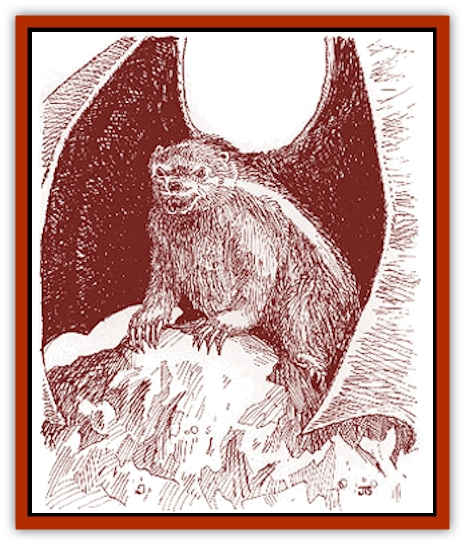

# Tyminid

| Statistic | **Tyminid** |
| --- | --- |
| **Activity Cycle:** | Night |
| **Alignment:** | Neutral (evil) |
| **Armor Class:** | 5 |
| **Climate/Terrain:** | Mountain or forest |
| **Damage/Attack:** | 1d4/1d4/1d4+1 |
| **Diet:** | Carnivore |
| **Frequency:** | Uncommon |
| **Hit Dice:** | 3 |
| **Intelligence:** | Low (5-7) |
| **Magic Resistance:** | Nil |
| **Morale:** | Steady (11-12) |
| **Movement:** | 12, Fl 12 (C) |
| **No. Appearing:** | 1 |
| **No. of Attacks:** | 3 (claw/claw/bite) |
| **Organization:** | Solitary |
| **Size:** | S (2-4' long) |
| **Special Attacks:** | Musk |
| **Special Defenses:** | Nil |
| **THAC0:** | 17 |
| **Treasure:** | Nil |
| **XP Value:** | 420 |

Tyminids are intelligent and very cunning [[Wolverine|wolverine]]-like creatures that live in the remote mountains of the Arm of the Immortals. The tyminid is a heavyset beast with short, thick legs; long, curved claws; and a short, bushy tail. Its head is blunt and rounded, its eyes are set widely apart, and its ears barely peek out over its fur. Its mostly dark brown body fur is composed of long, glossy hairs, but it has a light stripe down each side. A tyminid typically has a wingspan equal to twice its body length.

**Combat:** Tyminids are adept at hunting from both the ground and the air. Because of the thin mountain air and their relatively high body density, Tyminids require either a long running start or a strong updraft in order to get aloft. Once aloft, they are very maneuverable, able to flicker and dodge from point to point. A tyminid can usually fly only 100 to 200 feet above the ground and only for about 30 minutes at a time before having to land and rest for two to three hours. Tyminids cannot carry any weight when flying.

Tyminids do not engage in aerial combat. However, they will tuck their wings and drop on their prey. If the prey was merely flying at a lower altitude, both the tyminid and its prey go crashing into the ground. The prey cushions the tyminid's fall, so the tyminid takes no falling damage, but the prey does. Tyminids receive a +2 bonus on drop attacks. If the attack succeeds, the tyminid also inflicts double damage on its three subsequent attacks.

Tyminids have a 20% chance to sense invisible or hidden creatures within 30 feet, which allows them to successfully hunt the elusive [[Mythuínn_Folk|mythu�nn]].

In melee combat, the tyminid can spray an opponent with a noxious scent. The spray affects anyone within a 20' radius of the tyminid. Victims must make a successful saving throw vs. poison or be blinded for 1d4 hours and lose 25% of their Strength and Dexterity for 1d4 turns, due to nausea. Even if the saving throw is successful, the Strength and Dexterity penalties still apply. The scent cannot be removed from cloth or leather. Such items must be destroyed. Victims must be thoroughly scrubbed to remove the foul stench.

**Habitat/Society:** Tyminids are loners. Once a female becomes pregnant, she runs the male off. (He is happy to go.) The young are born in the spring, usually two or three to a litter. The female stays with her kits until they are weaned (or until she gets annoyed with them), then leaves. The kits adapt quickly or die.

Tyminids are mean, nasty, and can nurse a grudge for years. If bothered by a hunter, for example, they are perfectly capable of destroying all of his traps or tracking him down and attacking him in his sleep.

**Ecology:** Tyminids feed on a variety of plants, birds, and even large mammals, such as reindeer and caribou. Two of their favorite foods are [[Ee'aar|ee'aar]] and mythu�nn folk. While feeding, tyminids will often dismember a carcass and hide the parts in various locations for later consumption. In addition to hunting, tyminids are also scavengers. They are even adept at robbing traps.

The tyminid has thick, frost-resistant fur, so its hide is valuable for making cold-weather garments and can be sold for 10 gold pieces per hide.

---
## Discovery & Documentation

**Source Publication:** Monstrous Compendium Savage Coast Appendix (Online Exclusive) (1995)
**Campaign Setting:** Mystara
**Author(s):** Loren L Coleman, Ted James, Thomas Zuvich, Cindi M. Rice

### Other Creatures Found in This Source Book
   * [[Aranea_Savage_Coast|Aranea (Savage Coast)]]
   * [[Arashaeem|Arashaeem]]
   * [[Batracine|Batracine]]
   * [[Cat_Marine|Cat, Marine]]
   * [[Cinnavixen|Cinnavixen]]
   * [[Clockwork_Swordsman|Clockwork Swordsman]]
   * [[Critter_Temple|Critter, Temple]]
   * [[Cursed_One|Cursed One]]
   * [[Deathmare|Deathmare]]
   * [[Dragon_Savage_Coast_Crimson|Dragon (Savage Coast), Crimson]]
   * [[Dragon_Savage_Coast_Red_Hawk|Dragon (Savage Coast), Red Hawk]]
   * [[Echyan|Echyan]]
   * [[Ee'aar|Ee'aar]]
   * [[Enduk|Enduk]]
   * [[Fachan_Savage_Coast|Fachan (Savage Coast)]]
   * [[Feliquine|Feliquine]]
   * [[Fiend_Narvaezan|Fiend, Narvaezan]]
   * [[Frelôn|Frelôn]]
   * [[Ghriest|Ghriest]]
   * [[Glutton_Sea|Glutton, Sea]]
   * [[Goatman|Goatman]]
   * [[Golem_Naâruk|Golem, Naâruk]]
   * [[Golem_Savage_Coast|Golem (Savage Coast)]]
   * [[Grudgling|Grudgling]]
   * [[Heraldic_Servant_I|Heraldic Servant I]]
   * [[Heraldic_Servant_II|Heraldic Servant II]]
   * [[Heraldic_Servant_III|Heraldic Servant III]]
   * [[Heraldic_Servant_IV|Heraldic Servant IV]]
   * [[Heraldic_Servant_V|Heraldic Servant V]]
   * [[Heraldic_Servant_General_Information|Heraldic Servant, General Information]]
   * [[Hermit_Sea|Hermit, Sea]]
   * [[Jorri|Jorri]]
   * [[Juhrion|Juhrion]]
   * [[Kla'a-tah|Kla'a-tah]]
   * [[Leech_Legacy|Leech, Legacy]]
   * [[Lich_Inheritor|Lich, Inheritor]]
   * [[Lizard_Kin_Savage_Coast|Lizard Kin (Savage Coast)]]
   * [[Lupasus|Lupasus]]
   * [[Lupin|Lupin]]
   * [[Lyra_Bird_Saragón|Lyra Bird, Saragón]]
   * [[Malfera|Malfera]]
   * [[Manscorpion_Nimmurian|Manscorpion, Nimmurian]]
   * [[Mythuínn_Folk|Mythuínn Folk]]
   * [[Neshezu|Neshezu]]
   * [[Nikt'oo|Nikt'oo]]
   * [[Nosferatu|Nosferatu]]
   * [[Omm-wa|Omm-wa]]
   * [[Omshirim|Omshirim]]
   * [[Parasite_Savage_Coast|Parasite (Savage Coast)]]
   * [[Phanaton|Phanaton]]
   * [[Plant_Savage_Coast|Plant (Savage Coast)]]
   * [[Pudding_Vermilion|Pudding, Vermilion]]
   * [[Rakasta|Rakasta]]
   * [[Ray_Forest|Ray, Forest]]
   * [[Shedu_Greater_Savage_Coast|Shedu, Greater (Savage Coast)]]
   * [[Shimmerfish|Shimmerfish]]
   * [[Skinwing|Skinwing]]
   * [[Spawn_of_Nimmur|Spawn of Nimmur]]
   * [[Spider-spy|Spider-spy]]
   * [[Spirit_Heroic|Spirit, Heroic]]
   * [[Spirit_Walleran|Spirit, Walleran]]
   * [[Succulus|Succulus]]
   * [[Swampmare|Swampmare]]
   * [[Symbiont_Shadow|Symbiont, Shadow]]
   * [[Tortle|Tortle]]
   * [[Troll_Legacy|Troll, Legacy]]
   * [[Trosip|Trosip]]
   * [[Utukku|Utukku]]
   * [[Voat|Voat]]
   * [[Voat_Herathian|Voat, Herathian]]
   * [[Vulturehound|Vulturehound]]
   * [[Wallara|Wallara]]
   * [[Wurmling|Wurmling]]
   * [[Wynzet|Wynzet]]
   * [[Yeshom|Yeshom]]
   * [[Zombie_Red|Zombie, Red]]
