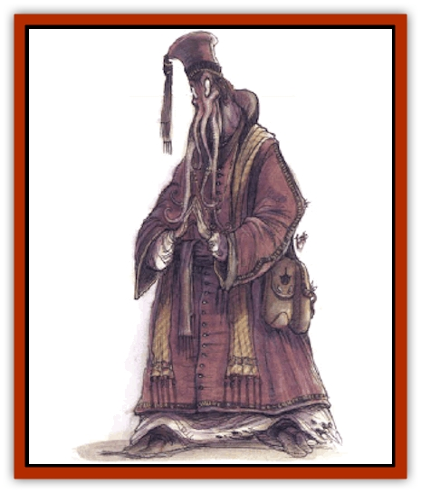

# Ulitharid

| Statistic | **Ulitharid** |
| --- | --- |
| **Activity Cycle:** | Any |
| **Alignment:** | Lawful evil |
| **Armor Class:** | 3 |
| **Climate/Terrain:** | Any subterranean |
| **Damage/Attack:** | Special |
| **Diet:** | Brain tissue |
| **Frequency:** | Very rare |
| **Hit Dice:** | 11+8 |
| **Intelligence:** | Supra-genius (19-20) |
| **Magic Resistance:** | 95% |
| **Morale:** | Champion (15-16) |
| **Movement:** | 12 |
| **No. Appearing:** | 1 |
| **No. of Attacks:** | 6 |
| **Organization:** | Community |
| **Size:** | L (7½' tall) |
| **Special Attacks:** | Spells, mind blast |
| **Special Defenses:** | Spells |
| **THAC0:** | 9 |
| **Treasure:** | S,T,Z (D) |
| **XP Value:** | 11,000 |

Ulitharids, or *Noble Illithid*, are the elite of [[Mind_Flayer|mind flayers]], favored by their god the elder brain and free to exercise their will upon lower [[Mind_Flayer|illithids]] and all other humanoids that fall under their power.

Ulitharids tower over their lesser kin by more than a foot, standing 7½ feet tall. They are colored similarly to other illithids, but they are darker than normal mind flayers. They have six writhing tentacles surrounding their mouths, not four like their common underlings, which are filled with sawlike teeth. Like most mind flayers, ulitharids dress in robes that cover their grotesque bodies from the ground to the neck, and high-crowned headresses are not uncommon.

With their incredible intellect, ulitharids can understand the spoken language of many races, but their mouths are illsuited for speech. Of course, they can communicate freely with any creature through the use of their innate telepathy.

**Combat:** The ulitharid's six faceted tentacles are much stronger than those of normal illithids, so the monster requires only 1d3 rounds to reach a victim's brain, once the tentacles have taken hold of the victim's head. Each tentacle inflicts 1d4 points of damage upon a successful hit (at which point the tentacle has seized the victim's head unless the DM rules otherwise, and only thee tentacles are needed to establish a grip that allows the creature to begin boring into the opponent's head in quest of his brains.

A ulitharid's mind blast is also much than more deadly than its common counterpart. It has the same area of effect as a normal mind blast - a cone 60 feet long, 5 feet wide at its point of origin, and 20 feet wide at its terminus - but those who fail to save vs. spell with a -4 penalty become feebleminded (as per the 5th-level wizard spell).

Ulitharids also have the following spell-like powers which they can employ, one at a time, once per round, as a 10th-level wizard: *astral projection*, *charm person*, *charm monster*, *ESP*, *eyebite*, *forget*, *legend lore*, *levitate*, *plane shift*, *suggestion*, *telekinesis*, *and true seeing*. All saving throws vs. these powers are rolled with -4 penalties. Ulitharids can also heal up to 25 points of personal damage per day. This process requires a full round to occur, during which the ulitharid must pause and concentrate fully upon healing.

**Habitat/Society:** Ulitharids are the noble folk of illithid society. About one in every 25 illithid tadpoles matures into a ulitharid. The ulitharids become caretakers for the community's elder brain, ambassadors to other illithid cities, and leaders of small illithid villages or outposts. A few sages believe that they answer to even more powerful illithids, although none of these beings have ever been seen by surface dwellers.

**Ecology:** Ulitharids live twice as long as normal Illithids, or about 250 years. They also spend twice as much time in the tadpole state. Ulitharids are among the most feared creatures of the subterranean world, and few creatures will challenge them.

---
## Discovery & Documentation

**Source Publication:** Monstrous Compendium, 1994 Annual, Volume 1 (1995)
**Campaign Setting:** Advanced Dungeons & Dragons 2nd Edition
**Author(s):** David Wise

### Other Creatures Found in This Source Book
   * [[Abyss_Ant|Abyss Ant]]
   * [[Achaierai|Achaierai]]
   * [[Afanc|Afanc]]
   * [[Al-Jahar|Al-Jahar]]
   * [[Baelnorn|Baelnorn]]
   * [[Baneguard|Baneguard]]
   * [[Banelar|Banelar]]
   * [[Bird_Talking|Bird, Talking]]
   * [[Blazing_Bones|Blazing Bones]]
   * [[Campestri|Campestri]]
   * [[Caniquine|Caniquine]]
   * [[Cat_Winged|Cat, Winged]]
   * [[Crypt_Servant|Crypt Servant]]
   * [[Death's_Head_Tree|Death's Head Tree]]
   * [[Dog_Saluqi|Dog, Saluqi]]
   * [[Dragon_Electrum|Dragon, Electrum]]
   * [[Dragon_Fang|Dragon, Fang]]
   * [[Dragon_Linnorm_Corpse_Tearer|Dragon, Linnorm, Corpse Tearer]]
   * [[Dragon_Linnorm_Dread|Dragon, Linnorm, Dread]]
   * [[Dragon_Linnorm_Flame|Dragon, Linnorm, Flame]]
   * [[Dragon_Linnorm_Forest|Dragon, Linnorm, Forest]]
   * [[Dragon_Linnorm_Frost|Dragon, Linnorm, Frost]]
   * [[Dragon_Linnorm_Gray|Dragon, Linnorm, Gray]]
   * [[Dragon_Linnorm_Land|Dragon, Linnorm, Land]]
   * [[Dragon_Linnorm_Midgard|Dragon, Linnorm, Midgard]]
   * [[Dragon_Linnorm_Rain|Dragon, Linnorm, Rain]]
   * [[Dragon_Linnorm_Sea|Dragon, Linnorm, Sea]]
   * [[Dragon_Neutral_Jacinth|Dragon, Neutral, Jacinth]]
   * [[Dragon_Neutral_Jade|Dragon, Neutral, Jade]]
   * [[Dragon_Neutral_Pearl|Dragon, Neutral, Pearl]]
   * [[Dread|Dread]]
   * [[Dragon-kin|Dragon-kin]]
   * [[Elemental_Earth_Kin_Chrysmal|Elemental, Earth Kin, Chrysmal]]
   * [[Elemental_Earth_Kin_Earth_Weird|Elemental, Earth Kin, Earth Weird]]
   * [[Elemental_Fire_Kin_Azer|Elemental, Fire Kin, Azer]]
   * [[Elemental_Sandman|Elemental, Sandman]]
   * [[Elemental_Wind_Walker|Elemental, Wind Walker]]
   * [[Elemental_Vermin|Elemental Vermin]]
   * [[Feystag|Feystag]]
   * [[Flame_Skull|Flame Skull]]
   * [[Foulwing|Foulwing]]
   * [[Gambado|Gambado]]
   * [[Garbug|Garbug]]
   * [[Genie_Tasked_Administrator|Genie, Tasked, Administrator]]
   * [[Genie_Tasked_Deceiver|Genie, Tasked, Deceiver]]
   * [[Genie_Tasked_Harim_Servant|Genie, Tasked, Harim Servant]]
   * [[Genie_Tasked_Messenger|Genie, Tasked, Messenger]]
   * [[Genie_Tasked_Miner|Genie, Tasked, Miner]]
   * [[Genie_Tasked_Oathbinder|Genie, Tasked, Oathbinder]]
   * [[Gibbering_Mouther|Gibbering Mouther]]
   * [[Gnasher|Gnasher]]
   * [[Gnasher_Winged|Gnasher, Winged]]
   * [[Golem_Brain|Golem, Brain]]
   * [[Golem_Hammer|Golem, Hammer]]
   * [[Golem_Metagolem|Golem, Metagolem]]
   * [[Golem_Spiderstone|Golem, Spiderstone]]
   * [[Gorynych|Gorynych]]
   * [[Greelox|Greelox]]
   * [[Helmed_Horror|Helmed Horror]]
   * [[Jarbo|Jarbo]]
   * [[Laraken|Laraken]]
   * [[Lich_Psionic|Lich, Psionic]]
   * [[Living_Steel|Living Steel]]
   * [[Lock_Lurker|Lock Lurker]]
   * [[Loxo|Loxo]]
   * [[Lycanthrope_Loup_de_Noir|Lycanthrope, Loup de Noir]]
   * [[Lycanthrope_Werebadger|Lycanthrope, Werebadger]]
   * [[Lycanthrope_Werejaguar|Lycanthrope, Werejaguar]]
   * [[Lythlyx|Lythlyx]]
   * [[Magebane|Magebane]]
   * [[Marrashi|Marrashi]]
   * [[Metalmaster|Metalmaster]]
   * [[Mimic_House_Hunter|Mimic, House Hunter]]
   * [[Naga_Bone|Naga, Bone]]
   * [[Nautilus_Giant|Nautilus, Giant]]
   * [[Nightshade_Toril|Nightshade (Toril)]]
   * [[Nishruu|Nishruu]]
   * [[Noran|Noran]]
   * [[Opinicus|Opinicus]]
   * [[Ormyrr|Ormyrr]]
   * [[Parasite|Parasite]]
   * [[Pasari-Niml|Pasari-Niml]]
   * [[Plant_Vampire_Moss|Plant, Vampire Moss]]
   * [[Pteraman|Pteraman]]
   * [[Rautym|Rautym]]
   * [[Shadeling|Shadeling]]
   * [[Skum|Skum]]
   * [[Snake_Giant_Cobra|Snake, Giant Cobra]]
   * [[Snake_Stone|Snake, Stone]]
   * [[Spectral_Wizard|Spectral Wizard]]
   * [[Spell_Weaver|Spell Weaver]]
   * [[Spider_Brain|Spider, Brain]]
   * [[Suwyze|Suwyze]]
   * [[Tatalla|Tatalla]]
   * [[Tick_Heart|Tick, Heart]]
   * [[Tree_Dark|Tree, Dark]]
   * [[Tree_Singing|Tree, Singing]]
   * [[Tressym|Tressym]]
   * [[Troll_Snow|Troll, Snow]]
   * [[Tuyewera|Tuyewera]]
   * [[Undead_Dwarf|Undead Dwarf]]
   * [[Undead_Lake_Monster|Undead Lake Monster]]
   * [[Whipsting|Whipsting]]
   * [[Windghost|Windghost]]
   * [[Wolf_Dread|Wolf, Dread]]
   * [[Wolf_Stone|Wolf, Stone]]
   * [[Wolf_Vampiric|Wolf, Vampiric]]
   * [[Wraith_Shimmering|Wraith, Shimmering]]
   * [[Xantravar|Xantravar]]
   * [[Xaver|Xaver]]
