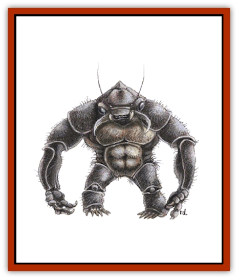

# Umber Hulk

| Statistic | **Umber Hulk** | **Vodyanoi** |
| --- | --- | --- |
| **Activity Cycle:** | Any | Any |
| **Alignment:** | Chaotic evil | Chaotic evil |
| **Armor Class:** | 2 | 2 |
| **Climate/Terrain:** | Subterranean | Freshwater aquatic |
| **Damage/Attack:** | 3-12/3-12/1-10 | 3-12/3-12/1-10 |
| **Diet:** | Carnivore | Carnivore |
| **Frequency:** | Rare | Rare |
| **Hit Dice:** | 8+8 | 8 |
| **Intelligence:** | Average (8-10) | Average (8-10) |
| **Magic Resistance:** | Nil | Nil |
| **Morale:** | Elite (13) | Elite (13) |
| **Movement:** | 6, Br 1-6 | 3, Sw 6 |
| **No. Appearing:** | 1-4 | 1-3 |
| **No. of Attacks:** | 3 | 3 |
| **Organization:** | Solitary | Solitary |
| **Size:** | L (8' tall, 5' wide) | L (8' tall, 5' wide) |
| **Special Attacks:** | See below | Nil |
| **Special Defenses:** | Nil | See below |
| **THAC0:** | 11 | 13 |
| **Treasure:** | G | G |
| **XP Value:** | 4,000 | 2,000 |

Umber hulks are powerful subterranean predators whose ironlike claws allow them to burrow through solid stone in search of prey.

Umber hulks are tremendously strong, standing nearly 8 feet tall and over 5 feet wide. Muscles bulge beneath their thick, scaly hides and their powerful arms and legs all carry great claws. They have no necks to speak of, but the head features a powerful maw with rows of triangular teeth and 8-inch mandibles capable of biting through any hide or bone. Most peculiar of all are the four round eyes, spaced evenly across each umber hulk's forehead. Umber hulks are black, shading to a lighter shade of yellowish gray on the front. Their eyes are mere blackened dots each the size of a small coin. Umber hulks have their own language.

**Combat:** For all of their monstrous features, umber hulks are intelligent opponents. They usually dig to a point adjacent to a main corridor, then wait, peeking through a crack they've made, until likely prey walks by. The umber hulk then springs out upon its startled victim. When using this technique, opponents have a -5 modifier on their surprise rolls. Other tactics involve planned cave-ins and dead-end tunnels where an umber hulk can wait for victims to come to him. Their burrowing rate varies from 10 feet per turn in solid stone to 60 feet per turn in soft earth.

In melee, umber hulks can deliver a vicious bite but, understandably, their main weapon is their great claws. Worse, looking into an umber hulk's eyes causes *confusion*, as per the spell, unless a saving throw versus spell is made. In addition to this special confusion attack the outer eyes of an umber hulk provide the creature with infravision to a distance of 90 feet.

The one saving grace when fighting an umber hulk is their speed. Their gait is slow and ponderous and their balance is poor in wide spaces.

Umber hulks never fight to the death unless cornered (which is rare, since the creature can dig through stone). If hard pressed, an umber hulk won't hesitate to cause a cave-in (25% chance of success per round) and then dig his way to freedom.

**Habitat/Society:** Umber hulks dwell in the depths of the earth. They raid dungeons for food, much the way anteaters raid ant colonies, eating their fill and then moving on to let the "colony" recover.

Umber hulks are usually solitary hunters. Males and females mate, then go their separate ways. One to three young are born about a year later in a special nursery which has been hollowed out by the female. Two years later, once the hulklings are big enough, the female begins taking them with her when hunting. It is during this period that unfortunate victims may stumble across more than one umber hulk at a time.

No umber hulk culture is known, but it is rumored that there may be entire cities of these beings underground with tunnels that radiate out, like threads in a spider's web, toward the nearer dungeons and mountain ranges. If true, this would explain much, for umber hulks seem to disappear or spring up in a region at will and always take great care in hiding their tunnels behind them.

**Ecology:** Umber hulks eat young [[Worm|purple worms]], [[Ankheg|ankhegs]], and similar creatures. Their favorite prey, however, is humankind.

**Vodyanoi**

  These aquatic predators are closely related to the umber hulk. Vodyanoi live in deep bodies of fresh water. They are similar in appearance to umber hulks but have only two eyes and thus lack the ability to confuse opponents. Their skin is green and slimy to the touch, but beneath it is a thick, knobby hide. Their claws are webbed. Vodyanoi prey upon all manner of creatures but prefer human flesh. They can rend the hulls of small vessels and frequently sink or overturn small boats. Once per day a vodyanoi can attempt to summon 1-20 electric [[Eel|eels]] with a 50% chance of success. The existence of a saltwater variety of vodyanoi of twice the size and greater ferocity is rumored but unconfirmed.

---
## Discovery & Documentation

**Source Publication:** MC1 Volume I (w/binder #1) (1991)
**Campaign Setting:** Advanced Dungeons & Dragons 2nd Edition
**Author(s):** Jay Batista, Scott Bennie, Grant Boucher, William W. Connors, Steve Gilbert, Heike Kubasch, James Lowder, David Edward Martin, Bruce Nesmith, Jean Rabe, Rick Swan, John J. Terra, Gary L. Thomas

### Other Creatures Found in This Source Book
   * [[Bat|Bat]]
   * [[Bear|Bear]]
   * [[Behir|Behir]]
   * [[Boar|Boar]]
   * [[Bookworm|Bookworm]]
   * [[Brownie|Brownie]]
   * [[Bugbear|Bugbear]]
   * [[Carrion_Crawler|Carrion Crawler]]
   * [[Cat_Great|Cat, Great]]
   * [[Catoblepas|Catoblepas]]
   * [[Dragon_General_Information|Dragon, General Information]]
   * [[Dragonfish|Dragonfish]]
   * [[Elemental_Air_Kin_Aerial_Servant|Elemental, Air Kin, Aerial Servant]]
   * [[Elemental_Earth_Kin_Sandling|Elemental, Earth Kin, Sandling]]
   * [[Elephant|Elephant]]
   * [[Gnoll|Gnoll]]
   * [[Hobgoblin|Hobgoblin]]
   * [[Homunculus|Homunculus]]
   * [[Hornet_Giant|Hornet, Giant]]
   * [[Horse|Horse]]
   * [[Hyena|Hyena]]
   * [[Jackal|Jackal]]
   * [[Jackalwere|Jackalwere]]
   * [[Korred|Korred]]
   * [[Lich|Lich]]
   * [[Lizard|Lizard]]
   * [[Lizard_Man|Lizard Man]]
   * [[Lycanthrope_General_Information|Lycanthrope, General Information]]
   * [[Lycanthrope_Seawolf|Lycanthrope, Seawolf]]
   * [[Lycanthrope_Werebear|Lycanthrope, Werebear]]
   * [[Lycanthrope_Weretiger|Lycanthrope, Weretiger]]
   * [[Lycanthrope_Werewolf|Lycanthrope, Werewolf]]
   * [[Manticore|Manticore]]
   * [[Medusa|Medusa]]
   * [[Mind_Flayer|Mind Flayer]]
   * [[Minotaur|Minotaur]]
   * [[Mudman|Mudman]]
   * [[Mummy|Mummy]]
   * [[Nixie|Nixie]]
   * [[Nymph|Nymph]]
   * [[Ogre|Ogre]]
   * [[Ooze_Slime_Jelly_I|Ooze/Slime/Jelly I]]
   * [[Ooze_Slime_Jelly_II|Ooze/Slime/Jelly II]]
   * [[Orc|Orc]]
   * [[Owl|Owl]]
   * [[Owlbear_I|Owlbear I]]
   * [[Pegasus|Pegasus]]
   * [[Piercer|Piercer]]
   * [[Pudding_Deadly|Pudding, Deadly]]
   * [[Rakshasa|Rakshasa]]
   * [[Rat|Rat]]
   * [[Ray|Ray]]
   * [[Remorhaz|Remorhaz]]
   * [[Satyr|Satyr]]
   * [[Scorpion|Scorpion]]
   * [[Selkie|Selkie]]
   * [[Shadow|Shadow]]
   * [[Skeleton|Skeleton]]
   * [[Skunk|Skunk]]
   * [[Snake|Snake]]
   * [[Spectre|Spectre]]
   * [[Spider|Spider]]
   * [[Sprite|Sprite]]
   * [[Toad_Giant|Toad, Giant]]
   * [[Treant|Treant]]
   * [[Troll|Troll]]
   * [[Unicorn|Unicorn]]
   * [[Vampire|Vampire]]
   * [[Wight|Wight]]
   * [[Will_O'Wisp|Will O'Wisp]]
   * [[Wolf|Wolf]]
   * [[Wolfwere|Wolfwere]]
   * [[Wraith|Wraith]]
   * [[Wyvern|Wyvern]]
   * [[Yeti|Yeti]]
   * [[Yuan-ti|Yuan-ti]]
   * [[Zombie|Zombie]]
