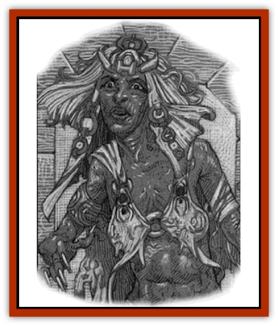

# Umbra

| Statistic | **Umbra** |
| --- | --- |
| **Activity Cycle:** | Night (Any) |
| **Alignment:** | Chaotic evil |
| **Armor Class:** | 5 |
| **Climate/Terrain:** | Ravenloft/Keening |
| **Damage/Attack:** | 1d6/1d6 |
| **Diet:** | None |
| **Frequency:** | Common (Not encountered outside Keening) |
| **Hit Dice:** | 4+4 |
| **Intelligence:** | Low (5-7) |
| **Magic Resistance:** | 20% |
| **Morale:** | Fearless (19-20) |
| **Movement:** | 12 |
| **No. Appearing:** | 2d4 |
| **No. of Attacks:** | 2 |
| **Organization:** | Clan |
| **Size:** | M (6' tall) |
| **Special Attacks:** | Strike shadows, hypnotic stare |
| **Special Defenses:** | Invisibility, spell immunities |
| **THAC0:** | 17 |
| **Treasure:** | Q |
| **XP Value:** | 975 |

The umbra are undead shadow [[Elf|elves]] that dwell in the domain of Keening. Their devotion to Tristessa was so great in life that they continue to serve her long after death.

Umbra are slender, with dark violet skin, silver hair, and bright indigo eyes that burn with a black flame. Their bodies are gaunt, and leathery skin stretches tightly over their clearly visible bones.

**Combat:** In melee, umbra strike twice with their filthy black claws for 1d6 points of damage each. In lieu of that, they may attack an opponent's shadow. This imposes a -2 penalty on the attack roll, but inflicts double damage on the victim.

All umbra can become invisible at will (per the spell). They use this ability to get close to their victims, imposing a -4 penalty to all surprise checks when they materialize. Encountering the umbra in this way for the first time requires a fear check.

Anyone looking into the eyes of an umbra must make a successful saving throw vs. paralysis or stand frozen in terror for 1d4 rounds. The umbra typically combine this power with their invisibility to appear face-to-face with opponents, then repeatedly strike their shadows with a +4 attack bonus while they are immobile.

Umbra are immune to life- or mind-affecting spells, *charm*, *hold*, death magic, and cold- or ice-based attacks. Poisons and diseases also pose no threat to them.

Umbra can see in pure darkness as well as other races see in daylight, though they prefer lit areas where their opponents will cast shadows.

Umbra cannot stand the touch of sunlight, which inflicts 4 points of damage to them for every round of exposure. The sudden appearance of bright light, even if it is not sunlight, blinds them for 1d2 rounds. While blinded, they back away from the source.

Holy water splashed upon them inflicts 2d4 points of damage.

**Habitat/Society:** The umbra move through the tunnels of Mount Lament with indifference, awaiting the commands of Tristessa. They patrol Keening in search of the [[Banshee|banshee's]] baby.

**Ecology:** When Tristessa became the darklord of Keening, she had over five hundred umbra to command. Their numbers have dwindled over the years, however, so that fewer than one hundred umbra dwell in the domain currently.

---
## Discovery & Documentation

**Source Publication:** Servants of Darkness (1998)
**Campaign Setting:** Ravenloft
**Author(s):** Kevin Melka and Steve Miller

### Other Creatures Found in This Source Book
   * [[Vampire_Goblin|Vampire, Goblin]]
