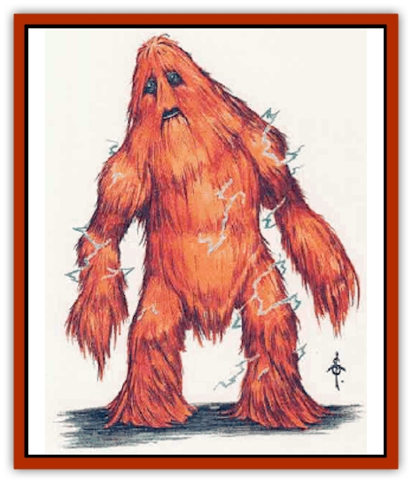

# Umpleby

| Statistic | **Umpleby** |
| --- | --- |
| **Activity Cycle:** | Day |
| **Alignment:** | Neutral |
| **Armor Class:** | 4 |
| **Climate/Terrain:** | Temperate forest |
| **Damage/Attack:** | 1d4 |
| **Diet:** | Herbivore |
| **Frequency:** | Very rare |
| **Hit Dice:** | 6 |
| **Intelligence:** | Low (5-7, but see below) |
| **Magic Resistance:** | Nil |
| **Morale:** | Elite (14) |
| **Movement:** | 9 |
| **No. Appearing:** | 1-3 |
| **No. of Attacks:** | 1 |
| **Organization:** | Solitary |
| **Size:** | L (8' tall) |
| **Special Attacks:** | Electrical shock, nets |
| **Special Defenses:** | Immune to electrical attacks |
| **THAC0:** | 15 |
| **Treasure:** | Special |
| **XP Value:** | 420 |

The umpleby is an eight-foot-tall, 400 pound walking mound of wild, straggly brown hair. Lips and eyes can be discerned on its face, but every other part of its body is covered with fur.

When encountered in its native temperate forest, the umpleby will neither attack nor try to hide, but will just stand stupidly and stare.

The umpleby can speak common in a halting fashion, but will rarely do so; in general it is an uncommunicative creature.

**Combat:** The umpleby wiU defend itself if attacked, but usually will not fight either for or against an adventuring party. When it does attack, it strikes with its hands for 1d4 points of damage.

The umpleby often makes nets out of its own hair and stores them by wrapping them around its waist. It can throw such a net 30 feet. It will use its nets or its special electrical attack only if threatened.

The umpleby stores large quantities of static electricity in its body. Each day, it can deliver a total of 50 hit points of electrical damage simply by touching its opponents. A normal attack roll is required unless the victim is unsuspecting. Metal armor of any type is considered Armor Class 10 with regard to this attack, though appropriate magical and Dexterity bonuses still apply. The umpleby can deliver all 50 points of damage in one strike, or it may regulate the amount of electrical damage it inflicts, usually conducting 1d8+8 points of damage.

When it delivers the 50th hit point of electrical damage, the umpleby immediately goes to sleep, recharging its static electrical charge as shown on the table. The creature is, of course, immune to electrical attacks.

| Sleep | Static Charge Restored |
| --- | --- |
| Less than 1 hour | 4d4 points |
| 1-4 hours | 25 points |
| 4-8 hours | 37 points |
| 8+ hours | 50 points |

**Habitat/Society:** An umpleby usually lives in a cave or hole dug into the earth or into the side of a hill. It is a rather stupid creature, and solitary by nature; the umpleby attention span is too short to be interested in forming a community. Occasionally, a male and a female umpleby will encounter each other in the forest and band together just long enough to bear a young one. They stay together until the "baby" wanders off one day and doesn't come back, then they lose interest in each other and wander off themselves. No more than three umplebys have been seen together at one time.

Umplebys love shiny and sparkling treasure, and can detect large amounts of precious metals and gems (more than 1,000 coins or 50 gems) up to 100 feet away, even through solid rock. These shiny objects are among the few items that will hold an umpleby's attention for any duration. It keeps a huge treasure trove of these items in its lair, but it will never reveal the lair's location, even if threatened with death (though *charm monster* may overcome this reluctance).

On meeting a party of adventurers, an umpleby will often simply shamble along with them, neither helping nor willing to be left behind. It constantly gets in the way and seems incapable of moving in silence.

An offer of food and water will ensure instant and total loyalty to its benefactor, as the umpleby is incessantly hungry and thirsty. This loyalty includes help and possibly advice, and will be broken if the benefactor does not reward the umpleby with a reasonable proportion of any coins or gems discovered as a result of its aid. If insufficiently rewarded, the umpleby will leave; if pursued, it will refuse further cooperation.

**Ecology:** Umplebys are primarily vegetarians, eating berries and fruits from the trees. If befriended by an adventuring party they will eat almost anything that is given to them.

The umpleby's hair is very tough, and 50% more difficult to cut, break, or burn than the cords of a magical *web*. An intact umpleby net can bring as much as 100 gp.

Because of the umpleby's ability to shock, few creatures tangle with them. [[Dragon_Chromatic_Blue|Blue dragons]] regard them as light snacks, and sometimes venture out of their desert homes to enjoy one. Umplebys regard [[Volt|volts]] as particularly horrid pests.

---
## Discovery & Documentation

**Source Publication:** MC14 Fiend Folio Appendix (1992)
**Campaign Setting:** Fiends Folio
**Author(s):** Don Bingle, John Terra, Wes Nicholson, Tim Beach, Steve Hardinger, Kris Hardinger, Rob Nicholls, Greg Swedberg, Al Boyce, Vince Garcia, Norm Ritchie

### Other Creatures Found in This Source Book
   * [[Aballin|Aballin]]
   * [[Achaierai|Achaierai]]
   * [[Adherer|Adherer]]
   * [[Algoid|Algoid]]
   * [[Al-Mi'raj|Al-Mi'raj]]
   * [[Apparition|Apparition]]
   * [[Caterwaul|Caterwaul]]
   * [[Coffer_Corpse|Coffer Corpse]]
   * [[Crabman|Crabman]]
   * [[Dark_Creeper|Dark Creeper]]
   * [[Dark_Stalker|Dark Stalker]]
   * [[Darter|Darter]]
   * [[Denzelian|Denzelian]]
   * [[Dune_Stalker|Dune Stalker]]
   * [[Dwarf_Urdunnir|Dwarf, Urdunnir]]
   * [[Falcon_Fire|Falcon, Fire]]
   * [[Faux_Faerie|Faux Faerie]]
   * [[Flawder|Flawder]]
   * [[Fyrefly|Fyrefly]]
   * [[Gambado|Gambado]]
   * [[Garbug|Garbug]]
   * [[Giant_Fhoimorien|Giant, Fhoimorien]]
   * [[Gibberling|Gibberling]]
   * [[Gorbel|Gorbel]]
   * [[Grimlock|Grimlock]]
   * [[Hellcat|Hellcat]]
   * [[Ice_Lizard|Ice Lizard]]
   * [[Iron_Cobra|Iron Cobra]]
   * [[Khargra|Khargra]]
   * [[Mantari|Mantari]]
   * [[Penanggalan|Penanggalan]]
   * [[Pernicon|Pernicon]]
   * [[Phantom_Stalker|Phantom Stalker]]
   * [[Retriever|Retriever]]
   * [[Ruve|Ruve]]
   * [[Scathe|Scathe]]
   * [[Sheet_Ghoul_Sheet_Phantom|Sheet Ghoul/Sheet Phantom]]
   * [[Shocker|Shocker]]
   * [[Spanner|Spanner]]
   * [[Stwinger|Stwinger]]
   * [[Sussurus|Sussurus]]
   * [[Symbiotic_Jelly|Symbiotic Jelly]]
   * [[Terithran|Terithran]]
   * [[Thunder_Children|Thunder Children]]
   * [[Troll_Ice|Troll, Ice]]
   * [[Tween|Tween]]
   * [[Volt|Volt]]
   * [[Xill|Xill]]
   * [[Xvart|Xvart]]
   * [[Zygraat|Zygraat]]
