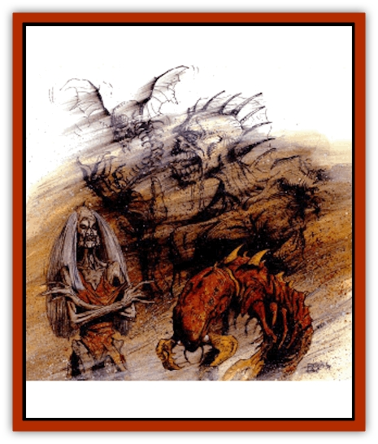

# Undead - Athas - General Information

*If a weakness is rolled twice, the effects are doubled. If rolled three times, the effects are tripled. If rolled four times, the effects are quadrupled, and so on.

**Special Undead Weaknesses**

*Bound to an Area:* The undead are bound to an area and cannot leave. The DM may choose the size of the area; it can be from the size of one room to a few square miles.

*Cannot Cross Running Water:* The undead become terrified of running water and crossing it cause the undead 3-12 (3d4) points of damage per round.

*Cast No Shadow:* The undead have no shadow and are easily recognizable as undead by those knowledgeable of their nature.

*Code of Honor:* The undead are bound to certain rules of behavior. They cannot break their code. The undead can be manipulated and forced into serving those who know their code well.

*Easier to Turn:* The undead are turned as undead 3 Hit Dice (1 HD minimum) less than their own Hit Dice.

*Elemental Susceptibility:* While almost all undead are immune to cold-based attacks and many take only half damage from electrical attacks, undead with this weakness take damage normally from one of these two forms of energy or take double damage from some other form of energy.

*Low Morale:* The undead cannot have a Morale score higher than 10.

*Must Drink Blood:* The undead must drink blood each day in order to sustain themselves. Most prefer the blood of humans and demihumans.

*Must Eat Corpse Flesh:* The undead must consume corpse flesh to sustain their existence. The undead often rob graves for food.

*Must Eat Living Flesh:* The undead must kill and eat living creatures, most likely humans and demihumans.

*Reduced Resistance:* The undead can be hit by weapons one less greater in magical value than they can normally be hit with. This has no affect on those who can already be hit with nonmagical weapons.

*Rotten Stench:* The undead can be smelled a great distance away and will easily be identifiable as undead.

*Sunlight Vulnerability:* The undead are completely nocturnal since direct sunlight causes them 1-6 (1d6) points of damage per round.

*Susceptibility to Iron:* The undead can be hit by iron weapons, even if they can normally be hit only with magical weapons. This has no effect on undead who can be hit with nonmagical weapons.

*Susceptibility to Obsidian:* The undead can be hit by obsidian weapons, even if they can normally be hit only with magical weapons. This has no effect on undead who can be hit with nonmagical weapons.

*Susceptibility to Spells:* The undead are susceptible to all *sleep*, *hold*, and *charm* spells, unlike most other undead.

---
## Discovery & Documentation

**Source Publication:** Dark Sun Appendix II - Terrors Beyond Tyr (1991)
**Campaign Setting:** Dark Sun
**Author(s):** Jim Atkiss, Steve Brown, Timothy B. Brown, Andrew P. Morris, Bruce Nesmith, Wes Nicholson, Bill Slavicsek

### Other Creatures Found in This Source Book
   * [[Aarakocra_Athas|Aarakocra (Athas)]]
   * [[Animal_Domestic_Athas_II|Animal, Domestic (Athas) II]]
   * [[Aviarag|Aviarag]]
   * [[Baazrag|Baazrag]]
   * [[Baazrag_Boneclaw|Baazrag, Boneclaw]]
   * [[Bloodgrass|Bloodgrass]]
   * [[Cactus_Hunting|Cactus, Hunting]]
   * [[Cactus_Rock|Cactus, Rock]]
   * [[Cilops|Cilops]]
   * [[Crodlu|Crodlu]]
   * [[Dagorran|Dagorran]]
   * [[Dhaot|Dhaot]]
   * [[Drake_Lesser_Athas_General_Information|Drake, Lesser (Athas), General Information]]
   * [[Drake_Lesser_Athas_Magma|Drake, Lesser (Athas), Magma]]
   * [[Drake_Lesser_Athas_Rain|Drake, Lesser (Athas), Rain]]
   * [[Drake_Lesser_Athas_Silt|Drake, Lesser (Athas), Silt]]
   * [[Drake_Lesser_Athas_Sun|Drake, Lesser (Athas), Sun]]
   * [[Dray|Dray]]
   * [[Drik|Drik]]
   * [[Dune_Reaper|Dune Reaper]]
   * [[Dwarf_Athas|Dwarf (Athas)]]
   * [[Elemental_Beast_Athas_Air|Elemental Beast (Athas), Air]]
   * [[Elemental_Beast_Athas_Earth|Elemental Beast (Athas), Earth]]
   * [[Elemental_Beast_Athas_Fire|Elemental Beast (Athas), Fire]]
   * [[Elemental_Beast_Athas_Water|Elemental Beast (Athas), Water]]
   * [[Elf_Athas|Elf (Athas)]]
   * [[Fael|Fael]]
   * [[Feylaar|Feylaar]]
   * [[Fordorran|Fordorran]]
   * [[Giant_Half-giant|Giant, Half-giant]]
   * [[Giant_Shadow|Giant, Shadow]]
   * [[Golem_Athas_Magma|Golem (Athas), Magma]]
   * [[Golem_Athas_Salt|Golem (Athas), Salt]]
   * [[Golem_Athas_General_Information|Golem (Athas), General Information]]
   * [[Gorak|Gorak]]
   * [[Halfling_Athas|Halfling (Athas)]]
   * [[Human_Athas|Human (Athas)]]
   * [[Jhakar|Jhakar]]
   * [[Kaisharga|Kaisharga]]
   * [[Kes'trekel|Kes'trekel]]
   * [[Klar|Klar]]
   * [[Krag|Krag]]
   * [[Kragling|Kragling]]
   * [[Lirr|Lirr]]
   * [[Mastyrial|Mastyrial]]
   * [[Meorty|Meorty]]
   * [[Mul|Mul]]
   * [[Nikaal|Nikaal]]
   * [[Paraelemental_Beast_General_Information|Paraelemental Beast, General Information]]
   * [[Paraelemental_Beast_Magma|Paraelemental Beast, Magma]]
   * [[Paraelemental_Beast_Rain|Paraelemental Beast, Rain]]
   * [[Paraelemental_Beast_Silt|Paraelemental Beast, Silt]]
   * [[Paraelemental_Beast_Sun|Paraelemental Beast, Sun]]
   * [[Pakubrazi|Pakubrazi]]
   * [[Psionocus|Psionocus]]
   * [[Psurlon|Psurlon]]
   * [[Raaig|Raaig]]
   * [[Retriever_Obsidian|Retriever, Obsidian]]
   * [[Ruktoi|Ruktoi]]
   * [[Ruvoka_Athas|Ruvoka (Athas)]]
   * [[Sand_Howler|Sand Howler]]
   * [[Scorpion_Athas|Scorpion (Athas)]]
   * [[Seed_Brain|Seed, Brain]]
   * [[Silt_Horror_Black|Silt Horror, Black]]
   * [[Silt_Horror_Magma|Silt Horror, Magma]]
   * [[Silt_Horror_Red|Silt Horror, Red]]
   * [[Silt_Spawn|Silt Spawn]]
   * [[Slig|Slig]]
   * [[Spider_Athas|Spider (Athas)]]
   * [[Spinewyrm|Spinewyrm]]
   * [[Ssurran|Ssurran]]
   * [[Stalking_Horror|Stalking Horror]]
   * [[Tarek|Tarek]]
   * [[Tari|Tari]]
   * [[Thri-kreen|Thri-kreen]]
   * [[T'liz|T'liz]]
   * [[Tohr-kreen_II|Tohr-kreen II]]
   * [[Tohr-kreen_III|Tohr-kreen III]]
   * [[Trin|Trin]]
   * [[Tul'k|Tul'k]]
   * [[Wraith_Athas|Wraith (Athas)]]
   * [[Xerichou|Xerichou]]
   * [[Zombie_Thinking|Zombie, Thinking]]
