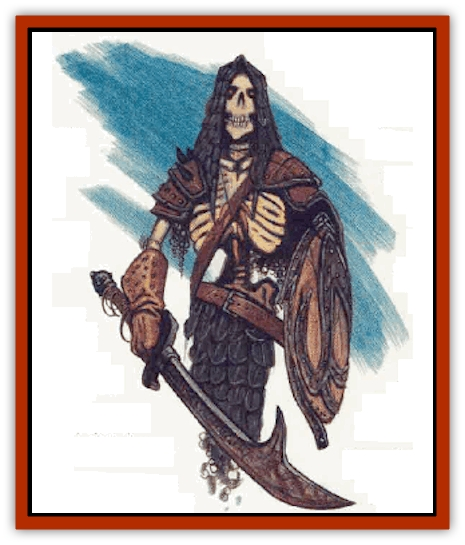

# Undead Dragon Slayer

| Statistic | **Undead Dragon Slayer** |
| --- | --- |
| **Activity Cycle:** | Any |
| **Alignment:** | Varies |
| **Armor Class:** | 0 (-1, -2, or -3 vs. dragons) |
| **Climate/Terrain:** | Any (Io's Blood islands) |
| **Damage/Attack:** | By weapon |
| **Diet:** | None |
| **Frequency:** | Very rare |
| **Hit Dice:** | 9, 10, or 11 (10-sided dice) |
| **Intelligence:** | High to genius (13-18) |
| **Magic Resistance:** | 60% |
| **Morale:** | Fearless (19) |
| **Movement:** | 12 |
| **No. Appearing:** | 1 or 1-4 |
| **No. of Attacks:** | 3/2 |
| **Organization:** | Solitary |
| **Size:** | M (6-7' tall) |
| **Special Attacks:** | See below |
| **Special Defenses:** | See below |
| **THAC0:** | 11, 10, or 9 |
| **Treasure:** | Nil |
| **XP Value:** | 7,000 |

An undead [[Human_Dragonslayer|dragon slayer]] is a horrifying creature returned from death to destroy [[Dragon_General_Information|dragons]]. The undead dragon slayer has a skeletal visage, rotted flesh, and dead, hollow eyes. Most stand between six and seven feet tall, and weigh around 250 pounds in armor. The armor is specially crafted plate mail, with a dragon-scale design and dragon-shaped helm. Now battered and beaten, it glows with supernatural color - inspired by the dragon type the slayer hates most. Undead dragon slayers are of neutral or evil alignment.

With a voice as cold as the dead and as deep as a grave, an undead dragon slayer speaks its native toneue. as well as the languages of dragons.

**Combat:** The undead dragon slayer retains the fighting skills it had in life, and gains more from its undead nature. Undead dragon slayers are immune to the effects of dragon fear, and take either half or no damage if they make a successful saving throw vs. breath weapon. They can't be turned by clerics, but are driven away by the *holy word* spell.

Their special armor provides a base Armor Class 0. Against dragons, this improves to -1, -2, or -3, depending on the Hit Dice of the slayer. The slayer's THAC0 improves from 11 at 9 Hit Dice to 10 at 10 HD and to 9 at 11 HD.

Undead dragon slayers use long swords (80% likely) or two-handed swords (20% likely). This weapon functions as a *sword +2, dragon slayer* in the slayer's hands, and the slayer can attack three times in every two combat rounds. Supernatural strength gives them an attack bonus of +5 against dragons and a damage bonus of +15, +16, or +17, depending on the slayer's Hit Dice (against nondragons, the bonuses are +3 to hit and +6 damage). Undead dragon slayers know five of the following spells: *breath stun*, *breach attack*, *dodge attack*, *double damage*, *great blow*, *weapon throw*, and *wing attack*.

*Breath Stun:* Aimed at the gullet, this attack (at a -4 penalty) disables the breath weapon. Besides the damage, the breath weapon is disabled for 1 round per point of damage inflicted.

*Breach Attack:* The slayer must be facing the dragon's underbelly (neck to abdomen), spend a round without attacking, and make an Intelligence check. This gives the slayer's next attack roll a +6 bonus, +2 if the Intelligence check is failed. Breach attacks can be combined with double damage.

*Dazzle:* Twirling a weapon confuses the dragon and prevents it from casting spells or using innate magical powers by disrupting the its ability to concentrate.

*Dodge Attack:* A combination of evasion and attack in one round, this requires a successful Dexterity check. The slayer receives a 4-point Armor Class bonus, a +2 to saving throws vs. breath weapon, and an attack roll bonus of +2.

*Double Damage:* On a successful attack roll the base damage inflicted by the weapon is doubled; other bonuses for magic, Strength, etc., are added normally. Double damage can be combined with a breach attack if both techniques are known.

*Great Blow:* This attack uses everything a slayer has and can be aimed at any part of the dragon's body. A slayer expends hit points and receives a -4 penalty. If successful, the dragon takes normal damage for the attack plus as many more hit points as the slayer expended.

*Weapon Throw:* The slayer hurls his primary weapon at the dragon. Ranges and attack penalties are: short 15 feet, -2; medium 30 feet, -4; long 45 feet, -6. Damage is determined normally. No other special attack can be used with this one.

*Wing Attack:* Aimed at the wing muscles, this attack (at -3) inflicts normal damage and keeps the dragon from flying for 1 round per point of damage inflicted.

**Habitat/Society:** Most undead dragon slayers are called back from the grave by necromantic magic. Though it retains its own mind and agenda, it must obey the commands of the summoner - at least until its task is complete or it somehow wins its freedom. A small number af dragon slayers actually will themselves back from the dead. These individuals have the utmost faith in their cause, an undying hatred of dragons, and a supernatural strength of will. No matter which type of undead dragon slayer is encountered, all seek to destroy dragons and those who would offer aid to them. An undead dragon slayer might be found in the company of [[Skeleton_Warrior|skeleton warriors]] or [[Dracolich|dracoliches]].

**Ecology:** In the *Council of Wyrms* setting, undead dragon slayers were members of the vast army of human warriors who invaded the Io's Blood isles in ages past. Any slayer of 9th level or greater who died before his holy task was finished can rise as an undead warrior.

While a slayer does not eat, it must slay dragons to replenish the energy that keeps him animated. Killing a dragon provides an undead dragon slayer with enough energy to last one month for every Hit Die the dragon had. If it does not replenish its energy within one week of the moment its last meal fades, it loses strength and must return to the sleep of the dead.

---
## Discovery & Documentation

**Source Publication:** Monstrous Compendium, 1996 Annual, Volume 3 (1995)
**Campaign Setting:** Advanced Dungeons & Dragons 2nd Edition
**Author(s):** Jon Pickens

### Other Creatures Found in This Source Book
   * [[Alaghi|Alaghi]]
   * [[Alhoon|Alhoon]]
   * [[Aranea_Savage_Coast|Aranea (Savage Coast)]]
   * [[Arcane_Head|Arcane Head]]
   * [[Banedead|Banedead]]
   * [[Banelich|Banelich]]
   * [[Bat_Bonebat|Bat, Bonebat]]
   * [[Beetle|Beetle]]
   * [[Belgoi|Belgoi]]
   * [[Bladeling|Bladeling]]
   * [[Braxat|Braxat]]
   * [[Bunyip|Bunyip]]
   * [[Burbur|Burbur]]
   * [[Bvanen|Bvanen]]
   * [[Cat_Great_Snow_Tiger|Cat, Great, Snow Tiger]]
   * [[Chosen_One|Chosen One]]
   * [[Chronovoid|Chronovoid]]
   * [[Cildabrin|Cildabrin]]
   * [[Coffer_Corpse|Coffer Corpse]]
   * [[Disenchanter|Disenchanter]]
   * [[Dog_Temporal|Dog, Temporal]]
   * [[Dragon_Cerilia|Dragon (Cerilia)]]
   * [[Dragon_Ghost|Dragon, Ghost]]
   * [[Dragon_Lesser_Undead|Dragon, Lesser Undead]]
   * [[Dragon_Neutral_Amber|Dragon, Neutral, Amber]]
   * [[Dread_Warrior|Dread Warrior]]
   * [[Dreamweaver|Dreamweaver]]
   * [[Dream_Spawn_Greater_Ennui|Dream Spawn, Greater, Ennui]]
   * [[Dream_Spawn_Lesser_Morph|Dream Spawn, Lesser, Morph]]
   * [[Dwarf_Arctic|Dwarf, Arctic]]
   * [[Dwarf_Urdunnir|Dwarf, Urdunnir]]
   * [[Eel_Giant_Moray|Eel, Giant Moray]]
   * [[Elemental_Fire_Kin_Tome_Guardian|Elemental, Fire Kin, Tome Guardian]]
   * [[Elf_Rockseer|Elf, Rockseer]]
   * [[Ethyk|Ethyk]]
   * [[Faerie_Faerie_Fiddler|Faerie, Faerie Fiddler]]
   * [[Faerie_Petty_Bramble|Faerie, Petty, Bramble]]
   * [[Faerie_Petty_Gorse|Faerie, Petty, Gorse]]
   * [[Faerie_Petty|Faerie, Petty]]
   * [[Firenewt|Firenewt]]
   * [[Formian|Formian]]
   * [[Gargoyle_II|Gargoyle II]]
   * [[Giant_Cerilia|Giant (Cerilia)]]
   * [[Goblin_Cerilia|Goblin (Cerilia)]]
   * [[Golem_Magic|Golem, Magic]]
   * [[Golem_Shaboath|Golem, Shaboath]]
   * [[Hag_Bheur|Hag, Bheur]]
   * [[Hamadryad|Hamadryad]]
   * [[Hound_of_Ill-Omen|Hound of Ill-Omen]]
   * [[Human_Cerilia|Human (Cerilia)]]
   * [[Hybsil|Hybsil]]
   * [[Ibrandlin|Ibrandlin]]
   * [[Imp_Chaos|Imp, Chaos]]
   * [[Ixitxachitl_Ixzan|Ixitxachitl, Ixzan]]
   * [[Jabberwock|Jabberwock]]
   * [[Kyton|Kyton]]
   * [[Kyuss_Son_of|Kyuss, Son of]]
   * [[Lillend|Lillend]]
   * [[Life-Shaped_Creation_Guardian|Life-Shaped Creation, Guardian]]
   * [[Life-Shaped_Creation_Transport|Life-Shaped Creation, Transport]]
   * [[Lycanthrope_Werecrocodile|Lycanthrope, Werecrocodile]]
   * [[Lycanthrope_Werespider|Lycanthrope, Werespider]]
   * [[Magedoom|Magedoom]]
   * [[Manotaur|Manotaur]]
   * [[Mastiff_Shadow|Mastiff, Shadow]]
   * [[Meazel|Meazel]]
   * [[Mist_Scarlet_Dancer|Mist, Scarlet Dancer]]
   * [[Needleman|Needleman]]
   * [[Orc_Neo-Orog|Orc, Neo-Orog]]
   * [[Orc_Ondonti|Orc, Ondonti]]
   * [[Owlbear_II|Owlbear II]]
   * [[Pegataur|Pegataur]]
   * [[Phaerimm|Phaerimm]]
   * [[Reggelid|Reggelid]]
   * [[Render|Render]]
   * [[Saurial|Saurial]]
   * [[Scalamagdrion|Scalamagdrion]]
   * [[Sharn|Sharn]]
   * [[Snake_Messenger|Snake, Messenger]]
   * [[Spirit_Forest_Uthraki|Spirit, Forest, Uthraki]]
   * [[Spirit_Forest_Wood_Man|Spirit, Forest, Wood Man]]
   * [[Spirit_Ice_Orglash|Spirit, Ice, Orglash]]
   * [[Spirit_Rock_Thomil|Spirit, Rock, Thomil]]
   * [[Strider_Giant|Strider, Giant]]
   * [[Tembo|Tembo]]
   * [[Temporal_Glider|Temporal Glider]]
   * [[Temporal_Stalker|Temporal Stalker]]
   * [[Tether_Beast|Tether Beast]]
   * [[Thessalmonster|Thessalmonster]]
   * [[Time_Dimensional|Time Dimensional]]
   * [[Tomb_Tapper|Tomb Tapper]]
   * [[Unicorn_Black_Toril|Unicorn, Black (Toril)]]
   * [[Vaath|Vaath]]
   * [[Vortex_Spider|Vortex Spider]]
   * [[Weredragon|Weredragon]]
   * [[Zhentarim_Spirit|Zhentarim Spirit]]
