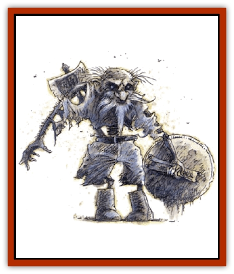

# Undead Dwarf

| Statistic | **Undead Dwarf** |
| --- | --- |
| **Activity Cycle:** | Special |
| **Alignment:** | Neutral |
| **Armor Class:** | 6 |
| **Climate/Terrain:** | Subterranean |
| **Damage/Attack:** | 1d4 |
| **Diet:** | None |
| **Frequency:** | Very rare |
| **Hit Dice:** | 3+12 |
| **Intelligence:** | Average (8-10) |
| **Magic Resistance:** | 25% |
| **Morale:** | Elite (13-14) |
| **Movement:** | 9 |
| **No. Appearing:** | 2d4 |
| **No. of Attacks:** | 1 |
| **Organization:** | Clan |
| **Size:** | M (4-5' tall) |
| **Special Attacks:** | <i>Phase door</i> |
| **Special Defenses:** | +2 weapon to hit |
| **THAC0:** | 17 |
| **Treasure:** | U |
| **XP Value:** | 1,400 |

Undead [[Dwarf|dwarves]] are created by residual essence on the part of dwarves who are concerned, just before they die, that their final resting places will in some way be disturbed. It is this essence that allows the bodies of the dwarves to transform into protectors.

Undead dwarves appear in ceremonial burial armor and are armed with ceremonial weapons, yet their bodies look thin and dessicated, with fragments of bone showing, and stark white, wiry hair. They are corporeal creatures, yet they are faintly transparent.

Undead dwarves speak any languages that they spoke in life.

**Combat:** Undead dwarves do not leave the sanctified place where they were laid to rest. If this location is ever violated or desecrated, the undead dwarves appear from the very stones of their cairns or crypts by means of an innate *phase door* ability, which they use at will. This sudden appearance imposes a -3 penalty upon surprise rolls for those who are the subject of the undead dwarf's wrath. Once they appear, the creatures attack with short, powerful thrusts of their fists, causing 3d4 points of damage and knocking victims backward. In this way, they drive invaders from their sacred burial area. Once all intruders have been driven beyond the boundaries of the sacred area, the undead dwarves dissipate into nothingness with a tired sigh, returning immediately to their places of rest.

Undead dwarves are immune to weapons of less than +2 magical power; and they have a 25% magic resistance. They are completely immune to any sort of mind-control spells such as *charm* and *sleep*. They can never be permanently destroyed. If one is reduced to 0 hit points, it dissipates with a sigh of disgust and its essence returns to its place of rest, where it may immediately reform at full hit points and reappear before a violator 1d4 rounds later.

**Habitat/Society:** Undead dwarves do nothing beyond protecting their graves. When there is no threat to their final resting places, they simply exist within their own crypts or cairns. If approached cautiously and spoken to obsequiously in dwarvish, they may be inclined to hold their attacks and listen to whatever respectful apology or question is put before them. There have even been cases where regular ritual worship services or prayer sessions for the dead have been formed by humble or lesser beings in honor of the deceased. When this happens, the undead dwarves do not attack so long as no part of the tomb area is defiled. They may even appear and listen to the prayers and worship, although they rarely, if ever, speak or involve themselves in the affairs.

**Ecology:** There is no known understanding of how undead dwarves are formed or why they exist except to protect their sacred tombs. It is not known if, once a place of rest has been made safe from intruders, undead dwarves go permanently to their rest. Whenever other dwarves discover a sacred burial area that is guarded by undead dwarves, they typically beg forgiveness for the intrusion and retreat to the exit. It is common for them to then seal up the entrance with good stone and mortar so as to conceal the area completely in the hope that the undead dwarves may go to a final rest, not to be bothered again. It has been documented that some dwarves have gone so far as to collapse entire subterranean systems, permanently sealing crypts guarded by undead dwarves.

---
## Discovery & Documentation

**Source Publication:** Monstrous Compendium, 1994 Annual, Volume 1 (1995)
**Campaign Setting:** Advanced Dungeons & Dragons 2nd Edition
**Author(s):** David Wise

### Other Creatures Found in This Source Book
   * [[Abyss_Ant|Abyss Ant]]
   * [[Achaierai|Achaierai]]
   * [[Afanc|Afanc]]
   * [[Al-Jahar|Al-Jahar]]
   * [[Baelnorn|Baelnorn]]
   * [[Baneguard|Baneguard]]
   * [[Banelar|Banelar]]
   * [[Bird_Talking|Bird, Talking]]
   * [[Blazing_Bones|Blazing Bones]]
   * [[Campestri|Campestri]]
   * [[Caniquine|Caniquine]]
   * [[Cat_Winged|Cat, Winged]]
   * [[Crypt_Servant|Crypt Servant]]
   * [[Death's_Head_Tree|Death's Head Tree]]
   * [[Dog_Saluqi|Dog, Saluqi]]
   * [[Dragon_Electrum|Dragon, Electrum]]
   * [[Dragon_Fang|Dragon, Fang]]
   * [[Dragon_Linnorm_Corpse_Tearer|Dragon, Linnorm, Corpse Tearer]]
   * [[Dragon_Linnorm_Dread|Dragon, Linnorm, Dread]]
   * [[Dragon_Linnorm_Flame|Dragon, Linnorm, Flame]]
   * [[Dragon_Linnorm_Forest|Dragon, Linnorm, Forest]]
   * [[Dragon_Linnorm_Frost|Dragon, Linnorm, Frost]]
   * [[Dragon_Linnorm_Gray|Dragon, Linnorm, Gray]]
   * [[Dragon_Linnorm_Land|Dragon, Linnorm, Land]]
   * [[Dragon_Linnorm_Midgard|Dragon, Linnorm, Midgard]]
   * [[Dragon_Linnorm_Rain|Dragon, Linnorm, Rain]]
   * [[Dragon_Linnorm_Sea|Dragon, Linnorm, Sea]]
   * [[Dragon_Neutral_Jacinth|Dragon, Neutral, Jacinth]]
   * [[Dragon_Neutral_Jade|Dragon, Neutral, Jade]]
   * [[Dragon_Neutral_Pearl|Dragon, Neutral, Pearl]]
   * [[Dread|Dread]]
   * [[Dragon-kin|Dragon-kin]]
   * [[Elemental_Earth_Kin_Chrysmal|Elemental, Earth Kin, Chrysmal]]
   * [[Elemental_Earth_Kin_Earth_Weird|Elemental, Earth Kin, Earth Weird]]
   * [[Elemental_Fire_Kin_Azer|Elemental, Fire Kin, Azer]]
   * [[Elemental_Sandman|Elemental, Sandman]]
   * [[Elemental_Wind_Walker|Elemental, Wind Walker]]
   * [[Elemental_Vermin|Elemental Vermin]]
   * [[Feystag|Feystag]]
   * [[Flame_Skull|Flame Skull]]
   * [[Foulwing|Foulwing]]
   * [[Gambado|Gambado]]
   * [[Garbug|Garbug]]
   * [[Genie_Tasked_Administrator|Genie, Tasked, Administrator]]
   * [[Genie_Tasked_Deceiver|Genie, Tasked, Deceiver]]
   * [[Genie_Tasked_Harim_Servant|Genie, Tasked, Harim Servant]]
   * [[Genie_Tasked_Messenger|Genie, Tasked, Messenger]]
   * [[Genie_Tasked_Miner|Genie, Tasked, Miner]]
   * [[Genie_Tasked_Oathbinder|Genie, Tasked, Oathbinder]]
   * [[Gibbering_Mouther|Gibbering Mouther]]
   * [[Gnasher|Gnasher]]
   * [[Gnasher_Winged|Gnasher, Winged]]
   * [[Golem_Brain|Golem, Brain]]
   * [[Golem_Hammer|Golem, Hammer]]
   * [[Golem_Metagolem|Golem, Metagolem]]
   * [[Golem_Spiderstone|Golem, Spiderstone]]
   * [[Gorynych|Gorynych]]
   * [[Greelox|Greelox]]
   * [[Helmed_Horror|Helmed Horror]]
   * [[Jarbo|Jarbo]]
   * [[Laraken|Laraken]]
   * [[Lich_Psionic|Lich, Psionic]]
   * [[Living_Steel|Living Steel]]
   * [[Lock_Lurker|Lock Lurker]]
   * [[Loxo|Loxo]]
   * [[Lycanthrope_Loup_de_Noir|Lycanthrope, Loup de Noir]]
   * [[Lycanthrope_Werebadger|Lycanthrope, Werebadger]]
   * [[Lycanthrope_Werejaguar|Lycanthrope, Werejaguar]]
   * [[Lythlyx|Lythlyx]]
   * [[Magebane|Magebane]]
   * [[Marrashi|Marrashi]]
   * [[Metalmaster|Metalmaster]]
   * [[Mimic_House_Hunter|Mimic, House Hunter]]
   * [[Naga_Bone|Naga, Bone]]
   * [[Nautilus_Giant|Nautilus, Giant]]
   * [[Nightshade_Toril|Nightshade (Toril)]]
   * [[Nishruu|Nishruu]]
   * [[Noran|Noran]]
   * [[Opinicus|Opinicus]]
   * [[Ormyrr|Ormyrr]]
   * [[Parasite|Parasite]]
   * [[Pasari-Niml|Pasari-Niml]]
   * [[Plant_Vampire_Moss|Plant, Vampire Moss]]
   * [[Pteraman|Pteraman]]
   * [[Rautym|Rautym]]
   * [[Shadeling|Shadeling]]
   * [[Skum|Skum]]
   * [[Snake_Giant_Cobra|Snake, Giant Cobra]]
   * [[Snake_Stone|Snake, Stone]]
   * [[Spectral_Wizard|Spectral Wizard]]
   * [[Spell_Weaver|Spell Weaver]]
   * [[Spider_Brain|Spider, Brain]]
   * [[Suwyze|Suwyze]]
   * [[Tatalla|Tatalla]]
   * [[Tick_Heart|Tick, Heart]]
   * [[Tree_Dark|Tree, Dark]]
   * [[Tree_Singing|Tree, Singing]]
   * [[Tressym|Tressym]]
   * [[Troll_Snow|Troll, Snow]]
   * [[Tuyewera|Tuyewera]]
   * [[Ulitharid|Ulitharid]]
   * [[Undead_Lake_Monster|Undead Lake Monster]]
   * [[Whipsting|Whipsting]]
   * [[Windghost|Windghost]]
   * [[Wolf_Dread|Wolf, Dread]]
   * [[Wolf_Stone|Wolf, Stone]]
   * [[Wolf_Vampiric|Wolf, Vampiric]]
   * [[Wraith_Shimmering|Wraith, Shimmering]]
   * [[Xantravar|Xantravar]]
   * [[Xaver|Xaver]]
