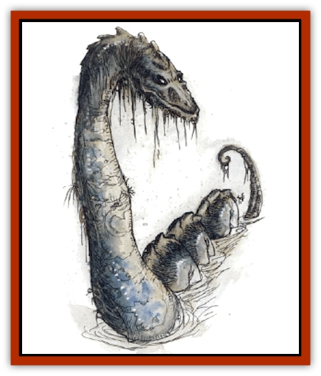

# Undead Lake Monster

| Statistic | **Undead Lake Monster** |
| --- | --- |
| **Activity Cycle:** | Any |
| **Alignment:** | Chaotic evil |
| **Armor Class:** | -3 |
| **Climate/Terrain:** | Deep lakes |
| **Damage/Attack:** | 3d8 |
| **Diet:** | Carnivore |
| **Frequency:** | Very rare |
| **Hit Dice:** | 13 |
| **Intelligence:** | Very (11-12) |
| **Magic Resistance:** | 20% |
| **Morale:** | Champion (15-16) |
| **Movement:** | Sw 12 |
| **No. Appearing:** | 1 |
| **No. of Attacks:** | 1 |
| **Organization:** | Solitary |
| **Size:** | G (100' long) |
| **Special Attacks:** | Breath weapon, entrapment, surprise strike |
| **Special Defenses:** | +1 weapon to hit, fear |
| **THAC0:** | 7 |
| **Treasure:** | B |
| **XP Value:** | 10,000 |

The undead lake monster is a rare sight. It is an ancient, gargantuan, undead water [[Snake|serpent]] with grayish-green skin and a huge mouth lined with needle-sharp teeth. Its scaly hide is reminiscent of the skin of a [[Zombie|zombie]], rotten-smelling and marked with rents and gaps though which pale white bones show. When swimming on the surface, it often appears to be a head followed by a series of rounded humps.

**Combat:** This monster never leaves its lake, but it will attack any creature that comes close to the shore. The creature lures the curious and foolhardy into range by appearing briefly in the center of the lake, then disappearing under water, only to appear moments later within striking range. Despite its undead state, the monster is extremely supple and can twist and curve its long body around, moving quickly through the water. It can coil its body underwater and strike like a snake up to 50' from the shore or up to 60' above the surface.

The monster bites for 3d8 points of damage. On any bite that inflicts 8 or more points of damage, the monster locks its jaws around the victim and pulls him or her down into its underwater lair. To break free, the victim must make a successful Strength check. Otherwise the victim is held underwater, until drowning results, but he or she may continue to attempt to break free each round until that occurs.

This undead creature can exhale a highly toxic cloud of sickly yellow vapor that is 40' long and 20' wide and high, three times per day, producing the same effect as that of the 5th-level wizard spell *cloudkill*. The breath lingers in the air, moving slowly with the breeze and sinking into depressions for four rounds before dissipating.

Should the battle turn against it, the monster can innately invoke the effects of the 4th-level wizard spell *fear* (three times per day). This affects all creatures within 100' who do not make a successful saving throw vs. spell.

Because this is an undead creature, it may be turned as a 10-HD creature. It also share the undead immunities to magic that affect biological functions. Due to this creature's magical nature, a +1 or better weapon is required to hit it as well.

**Habitat/Society:** [[Aggie|Such monsters are considered unique]], yet there are some who speculate that there is more than one "serpent of the depths" in any world. Some claim to have sighted two separate sets of humps breaking the surface of a lake at once. Other sages maintain that the undead lake monster has an unnatural brood of little serpents, and that its attacks upon any who approach its lake are the equivalent of a mother protecting her young, but it is unclear how an undead creature could give birth to young.

The monster's watery lair is said to be filled with the treasures of those it has pulled down to their deaths, but the lake which houses such a creature is always hundreds of feet deep, so it's unlikely that any of that supposed treasure could ever be recovered. Even if items are somehow found, any armor or weapons in the hoard (unless magically protected) are likely to be rusted and useless.

**Ecology:** Because it is undead, the lake monster has no natural life span. If killed, it will not provide any useful products. Its hide is tough enough to use for (leather) armor or a shield, but it has an oppressive stench that will force a character trying to use it to make hourly saving throws vs. poison to avoid nausea (-1 penalty to attack rolls).

---
## Discovery & Documentation

**Source Publication:** Monstrous Compendium, 1994 Annual, Volume 1 (1995)
**Campaign Setting:** Advanced Dungeons & Dragons 2nd Edition
**Author(s):** David Wise

### Other Creatures Found in This Source Book
   * [[Abyss_Ant|Abyss Ant]]
   * [[Achaierai|Achaierai]]
   * [[Afanc|Afanc]]
   * [[Al-Jahar|Al-Jahar]]
   * [[Baelnorn|Baelnorn]]
   * [[Baneguard|Baneguard]]
   * [[Banelar|Banelar]]
   * [[Bird_Talking|Bird, Talking]]
   * [[Blazing_Bones|Blazing Bones]]
   * [[Campestri|Campestri]]
   * [[Caniquine|Caniquine]]
   * [[Cat_Winged|Cat, Winged]]
   * [[Crypt_Servant|Crypt Servant]]
   * [[Death's_Head_Tree|Death's Head Tree]]
   * [[Dog_Saluqi|Dog, Saluqi]]
   * [[Dragon_Electrum|Dragon, Electrum]]
   * [[Dragon_Fang|Dragon, Fang]]
   * [[Dragon_Linnorm_Corpse_Tearer|Dragon, Linnorm, Corpse Tearer]]
   * [[Dragon_Linnorm_Dread|Dragon, Linnorm, Dread]]
   * [[Dragon_Linnorm_Flame|Dragon, Linnorm, Flame]]
   * [[Dragon_Linnorm_Forest|Dragon, Linnorm, Forest]]
   * [[Dragon_Linnorm_Frost|Dragon, Linnorm, Frost]]
   * [[Dragon_Linnorm_Gray|Dragon, Linnorm, Gray]]
   * [[Dragon_Linnorm_Land|Dragon, Linnorm, Land]]
   * [[Dragon_Linnorm_Midgard|Dragon, Linnorm, Midgard]]
   * [[Dragon_Linnorm_Rain|Dragon, Linnorm, Rain]]
   * [[Dragon_Linnorm_Sea|Dragon, Linnorm, Sea]]
   * [[Dragon_Neutral_Jacinth|Dragon, Neutral, Jacinth]]
   * [[Dragon_Neutral_Jade|Dragon, Neutral, Jade]]
   * [[Dragon_Neutral_Pearl|Dragon, Neutral, Pearl]]
   * [[Dread|Dread]]
   * [[Dragon-kin|Dragon-kin]]
   * [[Elemental_Earth_Kin_Chrysmal|Elemental, Earth Kin, Chrysmal]]
   * [[Elemental_Earth_Kin_Earth_Weird|Elemental, Earth Kin, Earth Weird]]
   * [[Elemental_Fire_Kin_Azer|Elemental, Fire Kin, Azer]]
   * [[Elemental_Sandman|Elemental, Sandman]]
   * [[Elemental_Wind_Walker|Elemental, Wind Walker]]
   * [[Elemental_Vermin|Elemental Vermin]]
   * [[Feystag|Feystag]]
   * [[Flame_Skull|Flame Skull]]
   * [[Foulwing|Foulwing]]
   * [[Gambado|Gambado]]
   * [[Garbug|Garbug]]
   * [[Genie_Tasked_Administrator|Genie, Tasked, Administrator]]
   * [[Genie_Tasked_Deceiver|Genie, Tasked, Deceiver]]
   * [[Genie_Tasked_Harim_Servant|Genie, Tasked, Harim Servant]]
   * [[Genie_Tasked_Messenger|Genie, Tasked, Messenger]]
   * [[Genie_Tasked_Miner|Genie, Tasked, Miner]]
   * [[Genie_Tasked_Oathbinder|Genie, Tasked, Oathbinder]]
   * [[Gibbering_Mouther|Gibbering Mouther]]
   * [[Gnasher|Gnasher]]
   * [[Gnasher_Winged|Gnasher, Winged]]
   * [[Golem_Brain|Golem, Brain]]
   * [[Golem_Hammer|Golem, Hammer]]
   * [[Golem_Metagolem|Golem, Metagolem]]
   * [[Golem_Spiderstone|Golem, Spiderstone]]
   * [[Gorynych|Gorynych]]
   * [[Greelox|Greelox]]
   * [[Helmed_Horror|Helmed Horror]]
   * [[Jarbo|Jarbo]]
   * [[Laraken|Laraken]]
   * [[Lich_Psionic|Lich, Psionic]]
   * [[Living_Steel|Living Steel]]
   * [[Lock_Lurker|Lock Lurker]]
   * [[Loxo|Loxo]]
   * [[Lycanthrope_Loup_de_Noir|Lycanthrope, Loup de Noir]]
   * [[Lycanthrope_Werebadger|Lycanthrope, Werebadger]]
   * [[Lycanthrope_Werejaguar|Lycanthrope, Werejaguar]]
   * [[Lythlyx|Lythlyx]]
   * [[Magebane|Magebane]]
   * [[Marrashi|Marrashi]]
   * [[Metalmaster|Metalmaster]]
   * [[Mimic_House_Hunter|Mimic, House Hunter]]
   * [[Naga_Bone|Naga, Bone]]
   * [[Nautilus_Giant|Nautilus, Giant]]
   * [[Nightshade_Toril|Nightshade (Toril)]]
   * [[Nishruu|Nishruu]]
   * [[Noran|Noran]]
   * [[Opinicus|Opinicus]]
   * [[Ormyrr|Ormyrr]]
   * [[Parasite|Parasite]]
   * [[Pasari-Niml|Pasari-Niml]]
   * [[Plant_Vampire_Moss|Plant, Vampire Moss]]
   * [[Pteraman|Pteraman]]
   * [[Rautym|Rautym]]
   * [[Shadeling|Shadeling]]
   * [[Skum|Skum]]
   * [[Snake_Giant_Cobra|Snake, Giant Cobra]]
   * [[Snake_Stone|Snake, Stone]]
   * [[Spectral_Wizard|Spectral Wizard]]
   * [[Spell_Weaver|Spell Weaver]]
   * [[Spider_Brain|Spider, Brain]]
   * [[Suwyze|Suwyze]]
   * [[Tatalla|Tatalla]]
   * [[Tick_Heart|Tick, Heart]]
   * [[Tree_Dark|Tree, Dark]]
   * [[Tree_Singing|Tree, Singing]]
   * [[Tressym|Tressym]]
   * [[Troll_Snow|Troll, Snow]]
   * [[Tuyewera|Tuyewera]]
   * [[Ulitharid|Ulitharid]]
   * [[Undead_Dwarf|Undead Dwarf]]
   * [[Whipsting|Whipsting]]
   * [[Windghost|Windghost]]
   * [[Wolf_Dread|Wolf, Dread]]
   * [[Wolf_Stone|Wolf, Stone]]
   * [[Wolf_Vampiric|Wolf, Vampiric]]
   * [[Wraith_Shimmering|Wraith, Shimmering]]
   * [[Xantravar|Xantravar]]
   * [[Xaver|Xaver]]
