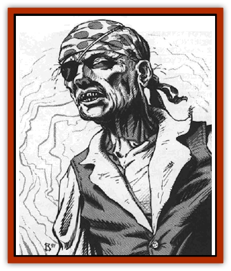

# Undead - Stellar

| Statistic | **Undead, Stellar** |
| --- | --- |
| **Activity Cycle:** | Any |
| **Alignment:** | Neutral evil |
| **Armor Class:** | 3 |
| **Climate/Terrain:** | Wildspace |
| **Damage/Attack:** | 2d4/2d4/3d4 |
| **Diet:** | Carnivore |
| **Frequency:** | Rare |
| **Hit Dice:** | 5 |
| **Intelligence:** | Low (5-7) |
| **Magic Resistance:** | Nil |
| **Morale:** | Steady (12) |
| **Movement:** | 9 |
| **No. Appearing:** | 1-10 |
| **No. of Attacks:** | 3 |
| **Organization:** | None |
| **Size:** | S to M (3-7' tall) |
| **Special Attacks:** | See below |
| **Special Defenses:** | See below |
| **THAC0:** | 16 |
| **Treasure:** | Nil |
| **XP Value:** | 420 |

Stellar undead are the corpses of spelljamming sailors returned to a semblance of life. The corpses are animated by raw energy from the Negative Material Plane. This energy warps the dying sailor's brains, twisting their final thoughts of home, safety, and friends into an unholy desire to walk again among the living, and to be warm again by drinking their blood.

Due to the vacuum of wildspace, most bodies decompose very slowly. When viewed from more than 3' away, stellar undead do not look dead, but much as they did in life. Though their bodies and clothes show the cause of their deaths, they remove weapons stuck in their bodies.

Stellar undead retain some vestiges of intelligence, and can speak one language of those they knew in life. Their voices are a hollow croak, though some confuse this with a thirsty sailor's dry throat. Most of their words are monosyllables such as "help", "yes", "no", "food", or "thanks".

In order to track down warm-blooded bodies, the stellar undead have infravision with 90' range.

**Combat:** Stellar undead attack by clawing their opponents (2d4 damage per hand) and biting them (3d4 damage). If both claw attacks hit one victim in the same round, the bite attack on the same victim, if successful, does double damage.

Once a victim has been hit by all three attacks in one round, the undead changes its tactics. Instead of attacking with its claws, it holds tight to its new meal, automatically doing 2 hp damage on each later round. The undead continues biting, doing double damage if it hits. The victim can break away by making a successful Strength check (allowed once per round).

Like most undead, the stellar undead are immune to all mind-affecting spells such as *sleep*, *charm*, *fear*, and *hold* spells. Due to their close relationship with the Negative Plane, they are turned as liches. A direct hit with holy water causes 2d12 damage; a splash does 1d6 damage.

Though the stellar undead still have the clothes and weapons that they wore in life, they have forgotten how to use them. Some clumsily try to swing a sword or activate a wand, without success.

**Habitat/Society:** Stellar undead have no society or leader. They tend to congregate around areas where it is normal to find bedraggled survivors, such as spelljammer wrecks. Sometimes they are found on barren asteroids, where they appear as castaways of a ship crash.

Their common trick is to cling to fragments of a spelliamming ship and pretend to be stranded sailors. Some act unconscious, while others wave frantically and call out to passing ships. When brought aboard, they try to pass for living sailors as long as possible, though there is a cumulative 5% chance per turn that the undead lose their self-control and attack in force, sinking their teeth into the first warm flesh they can grab.

Beside attempting normal "living person combat", stellar undead sometimes (45%) try non-violent actions from life (eating food, drinking, writing) to keep up the sham of life before their hosts. Otherwise, the undead just go where they are led, mumbling thanks until they cannot take it any more and tear into their rescuers.

The chance of stellar undead successfully imitating the living depends on how long ago the corpses died. At the beginning of the encounters roll percentile dice. The result is both how many days prior to the encounter that the ship crew died, and the chance that any attempt to "act normal" fails. Thus, a roll of 47 means that the stellar undead died and were "created" 47 days before being found. Once aboard, one stellar undead tries to act normal by drinking from a flask; in this example, there is a 47% chance that the attempt to drink fails.

**Ecology:** Stellar undead exist only in the Prime Material Plane. If encountered within five miles of an actual gate to the Negative Material Plane, the stellar undead cannot be turned, and they regenerate 2 hp per round.

The stellar undead can sense the presence of other types of undead in their line of sight.

---
## Discovery & Documentation

**Source Publication:** MC9 Spelljammer Appendix II (1991)
**Campaign Setting:** Planescape
**Author(s):** Scott Davis, Newton Ewell, John Terra

### Other Creatures Found in This Source Book
   * [[Alchemy_Plant|Alchemy Plant]]
   * [[Allura|Allura]]
   * [[Aperusa|Aperusa]]
   * [[Autognome|Autognome]]
   * [[Bionoid|Bionoid]]
   * [[Bloodsac|Bloodsac]]
   * [[Buzzjewel|Buzzjewel]]
   * [[Constellate|Constellate]]
   * [[Contemplator|Contemplator]]
   * [[Dohwar|Dohwar]]
   * [[Dragon_Moon|Dragon, Moon]]
   * [[Dragon_Stellar|Dragon, Stellar]]
   * [[Dragon_Sun|Dragon, Sun]]
   * [[Dreamslayer|Dreamslayer]]
   * [[Dweomerborn|Dweomerborn]]
   * [[Fal|Fal]]
   * [[Feesu|Feesu]]
   * [[Fire_Bat|Fire Bat]]
   * [[Firebird|Firebird]]
   * [[Firelich|Firelich]]
   * [[Flowfiend|Flowfiend]]
   * [[Gadabout|Gadabout]]
   * [[Gammaroid|Gammaroid]]
   * [[Gonn|Gonn]]
   * [[Gossamer|Gossamer]]
   * [[Grav|Grav]]
   * [[Great_Dreamer|Great Dreamer]]
   * [[Greatswan|Greatswan]]
   * [[Grell_Colonial|Grell, Colonial]]
   * [[Gullion|Gullion]]
   * [[Insectare|Insectare]]
   * [[Lhee|Lhee]]
   * [[Mercurial_Slime|Mercurial Slime]]
   * [[Meteorspawn|Meteorspawn]]
   * [[Monitor|Monitor]]
   * [[Owl_Space|Owl, Space]]
   * [[Pristatic|Pristatic]]
   * [[Scro|Scro]]
   * [[Selkie_Star|Selkie, Star]]
   * [[Silatic|Silatic]]
   * [[Skullbird|Skullbird]]
   * [[Sleek|Sleek]]
   * [[Sluk|Sluk]]
   * [[Space_Swine|Space Swine]]
   * [[Sphinx_Astro-|Sphinx, Astro-]]
   * [[Spirit_Warrior|Spirit Warrior]]
   * [[Starfly_Plant|Starfly Plant]]
   * [[Stargazer|Stargazer]]
   * [[Witchlight_Marauder|Witchlight Marauder]]
   * [[Xixchil|Xixchil]]
   * [[Yitsan|Yitsan]]
   * [[Zurchin|Zurchin]]
