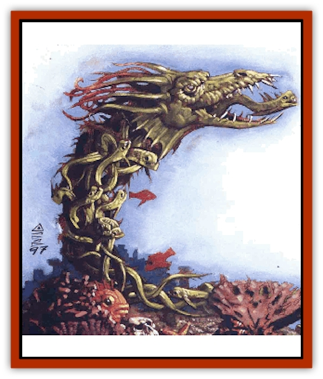

# Ungulosin

| Statistic | **Ungulosin** |
| --- | --- |
| **Activity Cycle:** | Day |
| **Alignment:** | Neutral |
| **Armor Class:** | 6 |
| **Climate/Terrain:** | Elemental Plane of Water |
| **Damage/Attack:** | 1d4+4 |
| **Diet:** | N/A |
| **Frequency:** | Very rare |
| **Hit Dice:** | 5 |
| **Intelligence:** | Semi (2-3) |
| **Magic Resistance:** | Nil |
| **Morale:** | Steady (12) |
| **Movement:** | Sw 18 |
| **No. Appearing:** | 1 |
| **No. of Attacks:** | 1 |
| **Organization:** | Solitary |
| **Size:** | H (15'+ long |
| **Special Attacks:** | Poison |
| **Special Defenses:** | See below |
| **THAC0:** | 15 |
| **Treasure:** | Nil |
| **XP Value:** | 1,400 |

A protective spirit of the water, the ungulosin is a native of the Elemental Plane of Water. It takes its shape from the natural creatures of the sea - that is, it forms a body by controlling a number of [[Fish|fish]], [[Eel|eels]], octopi, or the like and forcing them to act in concert. The "borrowed" creatures can't resist the ungulosin, although it might be better said that they *won't* resist. See, the protective spirit never misuses the beasts it employs, and no harm comes to them unless the spirit is attacked.

The ungulosin always creates a form at least 15 feet long, and it calls only upon sea animals of size T or S. Thus, it never uses creatures like [[Shark|sharks]] or giant versions of normal sea life, and it never summons anything that has greater than animal Intelligence. However, it may borrow hundreds of tiny beasts in order to fashion an appropriate body.

Once the spirit gathers enough creatures to construct a body, it controls their every action. Moving in flawless tandem, the creatures take on the appearance of a single animal. Usually, the form is of an eel or a large predatory fish, but occasionally the spirit builds bodies in other shapes. Many prefer to adopt forms that suggest the shape of the animals used, so that if an ungulosin calls upon squid, they will move together in the shape of a [[Squid_Giant|gigantic squid]].

**Combat:** Regardless of their general form, ungulosin bodies have the same basic statistics and capabilities. All manifest a head with a large mouth filled with dozens of daggerlike teeth. The ungulosin's bite causes 1d4+4 points of damage and transmits a terrible venom. This poison paralyzes victims for 1d4 rounds, after which they begin to spasm and suffer 1d6 points of damage per round until they die. A successful saving throw versus poison means that the victim is not paralyzed and suffers no damage.

It ain't easy to fight an ungulosin. See, the individual sea animals act and strike as a singular being, but they suffer damage as many creatures. No matter how hard a basher tries or what weapon he uses, in physical combat he can hit only one of the beasts that make up the ungulosin. Thus, no matter how much damage he deals, the best he can do is destroy one of the many animals in the ungulosin's form.

As far as the controlling spirit's concerned, a successful melee or missile attack on it either inflicts 1 point of damage or has no effect at all. The DM can resolve this in one of two ways. The first and simplest method is to roll any die - an even result means that the blow caused 1 point of damage to the ungulosin, and an odd result means that it caused none.

The more realistic (and harsher) method is to compare the amount of damage inflicted to the average hit points of the individual sea creatures. If the damage is enough to slay one of the animals, the ungulosin's body suffers 1 point of damage. Otherwise, it's unharmed. For example, if the ungulosin is composed of [[Eel|weed eels]], which have 1-1 Hit Dice (an average of 3 hit points each), a blow inflicting 1 or 2 points of damage - which isn't enough to kill an eel - has no effect. However, a strike that causes 3 or more points of damage - even one that causes 30 points! - still inflicts just 1 point of damage to the ungulosin's form.

Luckily, magic works a good deal better against the guardian of the water. Area-of-effect spells affect the spirit normally, but those that cause individual damage (such as *magic missile* or *Melf's acid arrow*) have the same limitations as other sorts of combat. Ungulosin are immune to *sleep*, *hold*, and *charm*-related spells.

When an ungulosin is slain or banished, the spirit no longer holds the remaining animals together, and they disperse in a chaotic mass.

**Habitat/Society:** This solitary creature fits into none of the established hierarchies of the plane of Water. It serves no power, answer to no prince, and bows to no elemental lord. An ungulosin's motivations are its own, and it wanders the Endless Sea attacking some creatures (often, but not always, non-natives), helping others, changing conditions, and so on. It's similar to a [[Elemental_Fire_Water|water elemental]] in that it's a spirit that clothes itself in a body appropriate to whatever task is at hand, but an ungulosin is much more of a rogue, doing whatever it pleases.

It's extremely rare for an ungulosin to be encountered off of the Elemental Plane of Water, but when it roams that far, it usually does so to protect an isolated stream or lake on this plane or that - often for little or no apparent reason. In doing so, it might interact with local [[Elemental_Water_Kin|nereids]] and other water spirits, sometimes working with them and other times opposing them.

**Ecology:** As a spiritual creature with no real physical body, the ungulosin does not eat, sleep, or procreate. The individual sea animals that compose its form don't need food or rest, either (at least, not while they're under the spirit's control).

The origins of the ungulosin are fascinating - if they're true, of course. It's said that they were once air spirits that were somehow betrayed by a power of the sky. Angry and disappointed, they left the Elemental Plane of Air in a mass exodus and went to Earth, where they dwelled for eons. Eventually, though, they found that they just couldn't adapt to an element so different from their original. Things on Earth, in their opinion, were too slow, too stagnant, too unchanging. The spirits next went to the Elemental Plane of Fire, but their stay there was shorter still - they found the denizens too hostile and too difficult to understand.

Finally, they made their way to the Elemental Plane of Water. There, the ungulosin found an environment pleasingly similar to that of their original home. Like the air, the water constantly moves and changes, yet it's not hostile to life - quite the opposite, really. As elements, both air and water are powerful and nurturing. The spirits found their new home to their liking and have dwelled there for so long that most folks regard them as natives, never realizing the dark or their travels.

---
## Discovery & Documentation

**Source Publication:** Planescape III (1996)
**Campaign Setting:** Planescape
**Author(s):** Monte Cook

### Other Creatures Found in This Source Book
   * [[Animental|Animental]]
   * [[Archomental_Evil|Archomental, Evil]]
   * [[Archomental_Good|Archomental, Good]]
   * [[Belker|Belker]]
   * [[Bzastra|Bzastra]]
   * [[Chososion|Chososion]]
   * [[Darklight|Darklight]]
   * [[Devete|Devete]]
   * [[Devourer_Planescape|Devourer (Planescape)]]
   * [[Dharum_Suhn|Dharum Suhn]]
   * [[Egarus|Egarus]]
   * [[Elemental_Athas_Lesser_Air_Earth|Elemental (Athas), Lesser, Air/Earth]]
   * [[Elemental_Athas_Lesser_Fire_Water|Elemental (Athas), Lesser, Fire/Water]]
   * [[Elemental_Fire_Kin_Salamander_II|Elemental, Fire Kin, Salamander II]]
   * [[Entrope|Entrope]]
   * [[Facet|Facet]]
   * [[Frost_Salamander|Frost Salamander]]
   * [[Fundamental_Air_Earth|Fundamental, Air/Earth]]
   * [[Fundamental_Fire_Water|Fundamental, Fire/Water]]
   * [[Fundamental_All_Elements|Fundamental, All Elements]]
   * [[Garmorm|Garmorm]]
   * [[Homunculus_Elemental|Homunculus, Elemental]]
   * [[Immoth|Immoth]]
   * [[Khargra|Khargra]]
   * [[Klyndes|Klyndes]]
   * [[Magran|Magran]]
   * [[Menglis|Menglis]]
   * [[Nathri|Nathri]]
   * [[Ooze_Sprite|Ooze Sprite]]
   * [[Paraelemental|Paraelemental]]
   * [[Phirblas|Phirblas]]
   * [[Psurlon|Psurlon]]
   * [[Quasielemental_Negative|Quasielemental, Negative]]
   * [[Quasielemental_Positive|Quasielemental, Positive]]
   * [[Rast|Rast]]
   * [[Ravid|Ravid]]
   * [[Ruvoka|Ruvoka]]
   * [[Scile|Scile]]
   * [[Shad|Shad]]
   * [[Shocker|Shocker]]
   * [[Sislan|Sislan]]
   * [[Suisseen|Suisseen]]
   * [[Terithran|Terithran]]
   * [[Thoqqua|Thoqqua]]
   * [[Trilloch|Trilloch]]
   * [[Tsnng|Tsnng]]
   * [[Vacuous|Vacuous]]
   * [[Wavefire|Wavefire]]
   * [[Xag-Ya_Xeg-Yi|Xag-Ya/Xeg-Yi]]
   * [[Xill|Xill]]
