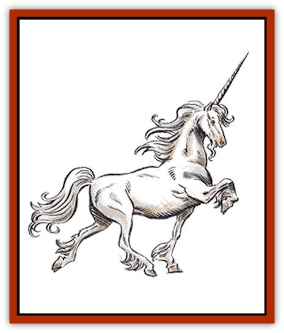

# Unicorn

| Statistic | **Unicorn** |
| --- | --- |
| **Activity Cycle:** | Day |
| **Alignment:** | Chaotic good |
| **Armor Class:** | 2 |
| **Climate/Terrain:** | Temperate sylvan woodlands |
| **Damage/Attack:** | 1-6/1-6/1-12 |
| **Diet:** | Herbivore |
| **Frequency:** | Rare |
| **Hit Dice:** | 4+4 |
| **Intelligence:** | Average (8-10) |
| **Magic Resistance:** | Nil |
| **Morale:** | Elite (14) |
| **Movement:** | 24 |
| **No. Appearing:** | 1-6 |
| **No. of Attacks:** | 3 |
| **Organization:** | Family |
| **Size:** | L |
| **Special Attacks:** | Charge |
| **Special Defenses:** | See below |
| **THAC0:** | 15 |
| **Treasure:** | X |
| **XP Value:** | 650 |

Unicorns dwell only in temperate woodlands, away from human habitation. These fierce but good creatures shun contact with all but sylvan creatures ([[Dryad|dryads]], [[Sprite|pixies]], [[Sprite|sprites]], and the like); however, they will show themselves to defend their woodland home.

Powerful [[Horse|steeds]] with gleaming coats of pure white hair, unicorn eyes are usually deep sea blue or fiery pink. Long, silky white strands of hair hang down from the mane and forelock. A single ivory-colored horn, 2 to 3 feet in length, grows from the center of each unicorn's forehead. Males are distinguished by the white beard beneath the chin; females by their more elegant and slimmer musculature. The hooves of a unicorn are cloven and yellow-ivory in color. Unicorns speak their own language as well as those of other sylvan creatures and [[Elf|elves]].

**Combat:** Unicorns can sense an enemy from 240 yards away. Likewise, unicorns move very silently, so opponents are penalized -6 on their surprise rolls. Unicorns can kick with their front hooves and thrust with the horn each round. Due to the horn's magical nature, it always has a +2 bonus to hit. Unicorns can charge into battle, using the horn like a lance. To make this charge, there must be at least 30 feet of open space between the unicorn and his opponent. Opponents struck by a charging unicorn suffer 3-36 points of damage from impaling. Unicorns may not attack with their front hooves in the round they charge.

Once per day a unicorn can use a *teleport* spell of limited range. This spell will transport the unicorn (and its rider) to any place that the unicorn desires, up to 360 yards away. Unicorns often use this ability as a last resort to avoid death or capture.

In addition, unicorns can never be *charmed* or *held* by magic. They are immune to death spells and make all saving throws against spells as if they were wizards of 11th level. Unicorns are immune to poison.

**Habitat/Society:** Unicorns mate for life and make their home in an open dell of the forest they have chosen to protect. There, in the boles of the trees, unicorns etch a glyph, recognizable to sylvan creatures, indicating that the forest is under unicorn protection. Rangers have a 10% chance per level of determining correctly whether a forest is guarded by unicorns. Once a woodland has a unicorn protector, no other unicorn will enter that forest unless the forest is very large. Each family of unicorns stakes out a territory approximately 400 square miles (20 miles by 20 miles).

Travelers may pass through a unicorn's forest freely and even hunt there, but anyone killing for sport or damaging the forest maliciously will be attacked if the unicorn is nearby (10% chance). The ferocity of this attack is determined by the evil of the trespasser. Truant youths throwing stones at animals, for example, would be driven off with just a few bruises as a reminder, while pillaging [[Orc|orcs]] would be hunted down and slain.

Lone unicorns occasionally allow themselves to be tamed and ridden by a human or elf maiden of pure heart and good alignment. A unicorn that submits once and is treated kindly will act as the maiden's steed for life, even carrying her beyond the realm of his forest if she so desires. Unicorns make exceptionally loyal mounts and will protect their riders even unto death.

**Ecology:** Unicorns are herbivores, living on tender leaves and grasses. Their only enemies are [[Griffon|griffons]] and those creatures who destroy forests, in particular [[Dragon_Chromatic_Red|red dragons]] and orcs.

The life span of unicorns has never been recorded but is known to surpass 1,000 years. They are believed to maintain their youth until death is only weeks away. The secret to this longevity is the strong magical nature of the horn. Unicorn horns are highly sought after, since possession of one is a sovereign remedy against all poisons. Alternately, a single horn can be used, by an alchemist, to manufacture 2-12 *potions of healing*. Unicorn horns sell for 1,500 gold pieces or more on the open market.

---
## Discovery & Documentation

**Source Publication:** MC1 Volume I (w/binder #1) (1991)
**Campaign Setting:** Advanced Dungeons & Dragons 2nd Edition
**Author(s):** Jay Batista, Scott Bennie, Grant Boucher, William W. Connors, Steve Gilbert, Heike Kubasch, James Lowder, David Edward Martin, Bruce Nesmith, Jean Rabe, Rick Swan, John J. Terra, Gary L. Thomas

### Other Creatures Found in This Source Book
   * [[Bat|Bat]]
   * [[Bear|Bear]]
   * [[Behir|Behir]]
   * [[Boar|Boar]]
   * [[Bookworm|Bookworm]]
   * [[Brownie|Brownie]]
   * [[Bugbear|Bugbear]]
   * [[Carrion_Crawler|Carrion Crawler]]
   * [[Cat_Great|Cat, Great]]
   * [[Catoblepas|Catoblepas]]
   * [[Dragon_General_Information|Dragon, General Information]]
   * [[Dragonfish|Dragonfish]]
   * [[Elemental_Air_Kin_Aerial_Servant|Elemental, Air Kin, Aerial Servant]]
   * [[Elemental_Earth_Kin_Sandling|Elemental, Earth Kin, Sandling]]
   * [[Elephant|Elephant]]
   * [[Gnoll|Gnoll]]
   * [[Hobgoblin|Hobgoblin]]
   * [[Homunculus|Homunculus]]
   * [[Hornet_Giant|Hornet, Giant]]
   * [[Horse|Horse]]
   * [[Hyena|Hyena]]
   * [[Jackal|Jackal]]
   * [[Jackalwere|Jackalwere]]
   * [[Korred|Korred]]
   * [[Lich|Lich]]
   * [[Lizard|Lizard]]
   * [[Lizard_Man|Lizard Man]]
   * [[Lycanthrope_General_Information|Lycanthrope, General Information]]
   * [[Lycanthrope_Seawolf|Lycanthrope, Seawolf]]
   * [[Lycanthrope_Werebear|Lycanthrope, Werebear]]
   * [[Lycanthrope_Weretiger|Lycanthrope, Weretiger]]
   * [[Lycanthrope_Werewolf|Lycanthrope, Werewolf]]
   * [[Manticore|Manticore]]
   * [[Medusa|Medusa]]
   * [[Mind_Flayer|Mind Flayer]]
   * [[Minotaur|Minotaur]]
   * [[Mudman|Mudman]]
   * [[Mummy|Mummy]]
   * [[Nixie|Nixie]]
   * [[Nymph|Nymph]]
   * [[Ogre|Ogre]]
   * [[Ooze_Slime_Jelly_I|Ooze/Slime/Jelly I]]
   * [[Ooze_Slime_Jelly_II|Ooze/Slime/Jelly II]]
   * [[Orc|Orc]]
   * [[Owl|Owl]]
   * [[Owlbear_I|Owlbear I]]
   * [[Pegasus|Pegasus]]
   * [[Piercer|Piercer]]
   * [[Pudding_Deadly|Pudding, Deadly]]
   * [[Rakshasa|Rakshasa]]
   * [[Rat|Rat]]
   * [[Ray|Ray]]
   * [[Remorhaz|Remorhaz]]
   * [[Satyr|Satyr]]
   * [[Scorpion|Scorpion]]
   * [[Selkie|Selkie]]
   * [[Shadow|Shadow]]
   * [[Skeleton|Skeleton]]
   * [[Skunk|Skunk]]
   * [[Snake|Snake]]
   * [[Spectre|Spectre]]
   * [[Spider|Spider]]
   * [[Sprite|Sprite]]
   * [[Toad_Giant|Toad, Giant]]
   * [[Treant|Treant]]
   * [[Troll|Troll]]
   * [[Umber_Hulk|Umber Hulk]]
   * [[Vampire|Vampire]]
   * [[Wight|Wight]]
   * [[Will_O'Wisp|Will O'Wisp]]
   * [[Wolf|Wolf]]
   * [[Wolfwere|Wolfwere]]
   * [[Wraith|Wraith]]
   * [[Wyvern|Wyvern]]
   * [[Yeti|Yeti]]
   * [[Yuan-ti|Yuan-ti]]
   * [[Zombie|Zombie]]
