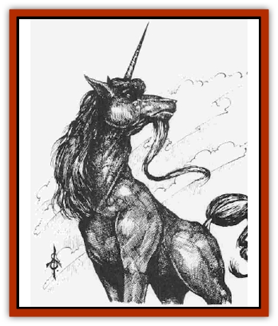

# Unicorn - Black - Toril

| Statistic | **Unicorn, Black (Toril)** |
| --- | --- |
| **Activity Cycle:** | Night |
| **Alignment:** | Chaotic evil |
| **Armor Class:** | 3 |
| **Climate/Terrain:** | Forests, plains |
| **Damage/Attack:** | 1d6/1d6/1d4/1d12 |
| **Diet:** | Carnivore |
| **Frequency:** | Very rare |
| **Hit Dice:** | 4+4 |
| **Intelligence:** | High (13-14) |
| **Magic Resistance:** | Nil |
| **Morale:** | Elite (14) |
| **Movement:** | 24 |
| **No. Appearing:** | 1-4 |
| **No. of Attacks:** | 4 |
| **Organization:** | Solitary |
| **Size:** | L |
| **Special Attacks:** | Charge, <i>cause light wounds</i> |
| **Special Defenses:** | Teleport |
| **THAC0:** | 15 |
| **Treasure:** | Nil |
| **XP Value:** | 975 |

<a href=\/appendix/unicbla2">Black unicorns</a> resemble their [[Unicorn|white relatives]], but they are twisted and evil. They are coal-dark creatures sporting silky black manes and burning red eyes. With their horns long and spiraled, chased with silver, they are quite beautiful. Male black unicorns are bearded. The females are more slender than the males, but retain a heavy musculature.

Highly intelligent, black unicorns can be taught to speak Common, and there are rumors that some evil wizards are trying to teach them spells with purely verbal components.

**Combat:** Although black unicorns do not have the white unicorns' ability to move silently or sense the presence of enemies, they are never surprised and fight in battle with front hooves and horn, biting with sharp-edged teeth. A black unicorn's horn does not have any attack roll bonus. Like white unicorns, black unicorns can charge to the attack. If a black unicorn moves at least 30 feet over open ground, its horn can strike for 3d12 points of piercing damage. The unicorn cannot attack with its front hooves in the round it charges.

Black unicorns can *cause light wounds* three times a day and can instantly *teleport without error* once a day. To cause wounds, the unicorn must touch its opponent, and this may be used in conjunction with a horn attack. The teleport includes only the unicorn itself and not its rider - such riders often find themselves abandoned in the midst of bad combat situations by their chaotic mounts.

**Habitat/Society:** Black unicorns allow themselves to be ridden only by human or [[Elf_Drow|drow]] females of evil alignment. Evilly-aligned females must petition a suitable unicorn; if the female is acceptable, the unicorn will serve. If not, it immediately attacks the supplicant, making the approach somewhat hazardous.

Despite their success and usefulness in combat, black unicorns are fickle and chaotic, mostly concerned with their own safety rather than that of their riders or companions. It is not at all unusual for a black unicorn to flee combat when the tide turns against it, dislodging a rider or teleporting away by itself and leaving others to fend for themselves.

In the *Forgotten Realms* setting, most black unicorns are kept as pets bv Red Wizards of Thay or serve in the Thayan military. A few wild specimens have escaped, however, and some small herds roam Thay and its vicinity. These herds are dominated by their strongest member, male or female. They appear to inflict pain and suffering on those around them for the sheer joy of it. They are especially fond of attacking [[Horse|horses]] and normal unicorns, which they passionately hate.

**Ecology:** These foul creatures were created by the Red Wizards of Thay, who fused the blood of [[Tanar'ri_General_Information|tanar'ri]] and other evil creatures with that of ordinary unicorns, creating a hateful, demented creature that lives for violence and combat. Black unicorns are carnivores especially fond of the flesh of humans, [[Elf|elves]], horses, and ordinary unicorns. Now, many are kept as pets by the Red Wizards, and black unicorns have become a mainstay of the Thayan military. In spite of their unruliness as mounts, they serve in large numbers. Several major units of black unicorns and evil-aligned female riders serve the zulkirs of Thay. For example, the Sisters of Cyric, a prominent regiment sworn to serve the Zulkir Aznar Thrul, consists of evil female priestesses of Cyric mounted on black unicorns.

The horn of a black unicorn is highly prized. Powdered, it can be used to create a potent poison equivalent to a Type N contact poison (onset time 1 round, Death/25; *DMG* Table 51). If the horn is fixed to a lance and wielded in a charge, a mounted warrior inflicts the black unicorn charge damage (3d12 points of damage).

---
## Discovery & Documentation

**Source Publication:** Monstrous Compendium, 1996 Annual, Volume 3 (1995)
**Campaign Setting:** Advanced Dungeons & Dragons 2nd Edition
**Author(s):** Jon Pickens

### Other Creatures Found in This Source Book
   * [[Alaghi|Alaghi]]
   * [[Alhoon|Alhoon]]
   * [[Aranea_Savage_Coast|Aranea (Savage Coast)]]
   * [[Arcane_Head|Arcane Head]]
   * [[Banedead|Banedead]]
   * [[Banelich|Banelich]]
   * [[Bat_Bonebat|Bat, Bonebat]]
   * [[Beetle|Beetle]]
   * [[Belgoi|Belgoi]]
   * [[Bladeling|Bladeling]]
   * [[Braxat|Braxat]]
   * [[Bunyip|Bunyip]]
   * [[Burbur|Burbur]]
   * [[Bvanen|Bvanen]]
   * [[Cat_Great_Snow_Tiger|Cat, Great, Snow Tiger]]
   * [[Chosen_One|Chosen One]]
   * [[Chronovoid|Chronovoid]]
   * [[Cildabrin|Cildabrin]]
   * [[Coffer_Corpse|Coffer Corpse]]
   * [[Disenchanter|Disenchanter]]
   * [[Dog_Temporal|Dog, Temporal]]
   * [[Dragon_Cerilia|Dragon (Cerilia)]]
   * [[Dragon_Ghost|Dragon, Ghost]]
   * [[Dragon_Lesser_Undead|Dragon, Lesser Undead]]
   * [[Dragon_Neutral_Amber|Dragon, Neutral, Amber]]
   * [[Dread_Warrior|Dread Warrior]]
   * [[Dreamweaver|Dreamweaver]]
   * [[Dream_Spawn_Greater_Ennui|Dream Spawn, Greater, Ennui]]
   * [[Dream_Spawn_Lesser_Morph|Dream Spawn, Lesser, Morph]]
   * [[Dwarf_Arctic|Dwarf, Arctic]]
   * [[Dwarf_Urdunnir|Dwarf, Urdunnir]]
   * [[Eel_Giant_Moray|Eel, Giant Moray]]
   * [[Elemental_Fire_Kin_Tome_Guardian|Elemental, Fire Kin, Tome Guardian]]
   * [[Elf_Rockseer|Elf, Rockseer]]
   * [[Ethyk|Ethyk]]
   * [[Faerie_Faerie_Fiddler|Faerie, Faerie Fiddler]]
   * [[Faerie_Petty_Bramble|Faerie, Petty, Bramble]]
   * [[Faerie_Petty_Gorse|Faerie, Petty, Gorse]]
   * [[Faerie_Petty|Faerie, Petty]]
   * [[Firenewt|Firenewt]]
   * [[Formian|Formian]]
   * [[Gargoyle_II|Gargoyle II]]
   * [[Giant_Cerilia|Giant (Cerilia)]]
   * [[Goblin_Cerilia|Goblin (Cerilia)]]
   * [[Golem_Magic|Golem, Magic]]
   * [[Golem_Shaboath|Golem, Shaboath]]
   * [[Hag_Bheur|Hag, Bheur]]
   * [[Hamadryad|Hamadryad]]
   * [[Hound_of_Ill-Omen|Hound of Ill-Omen]]
   * [[Human_Cerilia|Human (Cerilia)]]
   * [[Hybsil|Hybsil]]
   * [[Ibrandlin|Ibrandlin]]
   * [[Imp_Chaos|Imp, Chaos]]
   * [[Ixitxachitl_Ixzan|Ixitxachitl, Ixzan]]
   * [[Jabberwock|Jabberwock]]
   * [[Kyton|Kyton]]
   * [[Kyuss_Son_of|Kyuss, Son of]]
   * [[Lillend|Lillend]]
   * [[Life-Shaped_Creation_Guardian|Life-Shaped Creation, Guardian]]
   * [[Life-Shaped_Creation_Transport|Life-Shaped Creation, Transport]]
   * [[Lycanthrope_Werecrocodile|Lycanthrope, Werecrocodile]]
   * [[Lycanthrope_Werespider|Lycanthrope, Werespider]]
   * [[Magedoom|Magedoom]]
   * [[Manotaur|Manotaur]]
   * [[Mastiff_Shadow|Mastiff, Shadow]]
   * [[Meazel|Meazel]]
   * [[Mist_Scarlet_Dancer|Mist, Scarlet Dancer]]
   * [[Needleman|Needleman]]
   * [[Orc_Neo-Orog|Orc, Neo-Orog]]
   * [[Orc_Ondonti|Orc, Ondonti]]
   * [[Owlbear_II|Owlbear II]]
   * [[Pegataur|Pegataur]]
   * [[Phaerimm|Phaerimm]]
   * [[Reggelid|Reggelid]]
   * [[Render|Render]]
   * [[Saurial|Saurial]]
   * [[Scalamagdrion|Scalamagdrion]]
   * [[Sharn|Sharn]]
   * [[Snake_Messenger|Snake, Messenger]]
   * [[Spirit_Forest_Uthraki|Spirit, Forest, Uthraki]]
   * [[Spirit_Forest_Wood_Man|Spirit, Forest, Wood Man]]
   * [[Spirit_Ice_Orglash|Spirit, Ice, Orglash]]
   * [[Spirit_Rock_Thomil|Spirit, Rock, Thomil]]
   * [[Strider_Giant|Strider, Giant]]
   * [[Tembo|Tembo]]
   * [[Temporal_Glider|Temporal Glider]]
   * [[Temporal_Stalker|Temporal Stalker]]
   * [[Tether_Beast|Tether Beast]]
   * [[Thessalmonster|Thessalmonster]]
   * [[Time_Dimensional|Time Dimensional]]
   * [[Tomb_Tapper|Tomb Tapper]]
   * [[Undead_Dragon_Slayer|Undead Dragon Slayer]]
   * [[Vaath|Vaath]]
   * [[Vortex_Spider|Vortex Spider]]
   * [[Weredragon|Weredragon]]
   * [[Zhentarim_Spirit|Zhentarim Spirit]]
