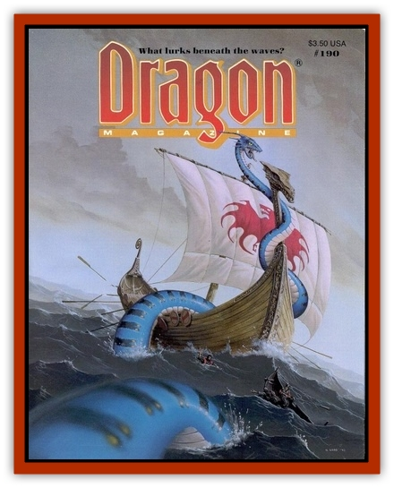

# Unicorn - Pinto

| Statistic | **Unicorn, Pinto** |
| --- | --- |
| **Activity Cycle:** | Day |
| **Alignment:** | Neutral good |
| **Armor Class:** | 2 |
| **Climate/Terrain:** | Temperate/Grasslands |
| **Damage/Attack:** | 1-6/1-6/1-12 |
| **Diet:** | Herbivore |
| **Frequency:** | Rare |
| **Hit Dice:** | 4+4 |
| **Intelligence:** | Average (8-10) |
| **Magic Resistance:** | 20% |
| **Morale:** | Elite (13-14) |
| **Movement:** | 24 |
| **No. Appearing:** | 2-5 |
| **No. of Attacks:** | 3 |
| **Organization:** | Family |
| **Size:** | L |
| **Special Attacks:** | See below |
| **Special Defenses:** | See below |
| **THAC0:** | 17 |
| **Treasure:** | X |
| **XP Value:** | 2,000 |

Pinto unicorns are [[Unicorn|unicorns]] with patches of differently colored hair distributed randomly upon their hides. They usually have doe-brown eyes, but some have green and some have yellow.

**Combat:** Pinto unicorns (sometimes called "chromacorns") are each able to project a *prismatic spray* from the horns up to five times per day. This spell is cast as an 11th-level wizard. Pintos are also able to cast an *advanced illusion* three times per day, also at the 11th level of ability; such illusions are usually used to reveal hunters or humanoids by showing what appears to be the pinto unicorn grazing nearby - a ruse to draw missile and spell fire.

**Habitat/Society:** Pinto unicorns live on grasslands in temperate climates. They mate for life and are thus encountered in pairs or families. Pintos do not mark out territories but rather share large expanses of grasslands with other pinto families.
They continually wander these grazing lands so that no one area becomes over grazed. Pintos may be ridden by those of either sex who posses a pure heart.

**Ecology:** Pintos are much like sylvan unicorns, fighting with monsters that ravage their lands. A pinto's horn can be used to create *potions of rainbow hues*.

---
## Discovery & Documentation

**Source Publication:** Dragon190 (1993)
**Campaign Setting:** Dragon Magazine
**Author(s):** Gregory W. Detwiler, Michael John Wybo II, Alan Pollack, Ruth Thompson

### Other Creatures Found in This Source Book
   * [[Unicorn_Alicorn|Unicorn, Alicorn]]
   * [[Unicorn_Bay|Unicorn, Bay]]
   * [[Unicorn_Black|Unicorn, Black]]
   * [[Unicorn_Brown|Unicorn, Brown]]
   * [[Unicorn_Cunnequine|Unicorn, Cunnequine]]
   * [[Unicorn_Faerie|Unicorn, Faerie]]
   * [[Unicorn_Gray|Unicorn, Gray]]
   * [[Unicorn_Palomino|Unicorn, Palomino]]
   * [[Unicorn_Sea|Unicorn, Sea]]
   * [[Unicorn_Unisus|Unicorn, Unisus]]
   * [[Unicorn_Zebracorn|Unicorn, Zebracorn]]
