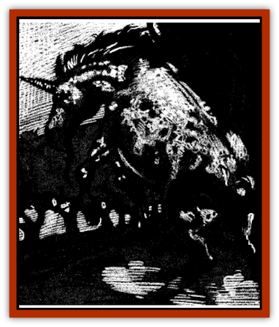

# Unicorn - Shadow

| Statistic | **Unicorn, Shadow** |
| --- | --- |
| **Activity Cycle:** | Night |
| **Alignment:** | Neutral evil |
| **Armor Class:** | 2 |
| **Climate/Terrain:** | Ravenloft forests |
| **Damage/Attack:** | 1-8/1-8/1-12 or 3-36 (3d12) |
| **Diet:** | Omnivore |
| **Frequency:** | Rare |
| **Hit Dice:** | 6 |
| **Intelligence:** | Very (11-12) |
| **Magic Resistance:** | Nil |
| **Morale:** | Champion (15-16) |
| **Movement:** | 24 |
| **No. Appearing:** | 1 |
| **No. of Attacks:** | 3 or 1 |
| **Organization:** | Solitary |
| **Size:** | L (6' tall at shoulder) |
| **Special Attacks:** | Charge, flaming horn, cause fear, surprise |
| **Special Defenses:** | Immune to poison, <i>charm</i>, <i>hold</i>, and <i>death</i> spells, +1 or better weapon needed to hit, <i>blink</i> |
| **THAC0:** | 15 |
| **Treasure:** | D |
| **XP Value:** | 2,000 |

The shadow unicorn is a terrifying creature of pure evil that roams the wilds of Darkon and Falkovnia, intent only on glorying in the fear and pain of those it encounters.

The shadow unicorn is a blurred copy of its cousin, the normal [[Unicorn|unicorn]]. The coat of such a steed is always some form of dappled gray. The depth of color varies from the deepest coal to the palest steel, while the mane and tail are always very long, silky, and utterly black. Its eyes are a smoldering, malevolent red and its ebon horn, which is 2 to 3 feet in length, is sometimes illuminated by a corona of crimson flames. The cloven hooves of the shadow unicorn are the color of scorched earth and are always sharpened in order to add to the pain their blows inflict. Mares and stallions are distinguishable in that the stallion has a tangled black beard that the mare lacks.

Shadow unicorns speak their own language as well as those of [[Nightmare|nightmares]], and several creatures from the outer planes.

**Combat:** Shadow unicorns have no one preferred way of approaching combat. In general these intelligent, dark steeds will attempt to attack in whichever way will cause their foes the most heart-rending fear, pain, and horror.

These evil unicorns can magically hide within the shadows and are capable of moving with absolute silence when they desire. When within the shadows and moving silently the monsters are almost undetectable, requiring a *detect invisible* spell or like ability to discern. Even when not hidden within the shadows, the dark unicorns can move so quietly their opponents receive a -6 penalty to their surprise rolls,

Sometimes, however, a shadow unicorn will choose to let its hooves make noise. This is a favored tactic when the unicorn wishes to sow terror among those who see it as the hooves will make a thunderous pounding when the creature gallops along. Anyone hearing the hammering of the shadow unicorn's unsilenced hooves or the shrieking wail of its terrible whinny must make a saving throw vs. spell (with a -2 penalty for the whinny) or be overcome by *fear* (as per the wizard spell). In addition, every time a character fails this saving throw there is a 5% chance that his hair will immediately turn permanently white as a result of the sheer horror of the experience.

In combat, the shadow unicorn attacks with its sharpened front hooves, which do 1d8 points of damage each, and its ebon horn, which does 1d12 points of damage. Due to the horn's magical nature, the shadow unicorn always receives a +2 bonus when attacking with it. Three times per day the evil unicorn can cause its horn to emit an eerie red flame which lasts for 8 rounds. While the horn is aflame, victims of its attack take an additional 2d4 points of damage per hit.

A shadow unicorn can also lower its horn and charge at an enemy if it has at least 20 feet of open space between itself and its target. Opponents struck by a charging shadow unicorn take 3d12 points of damage. A shadow unicorn cannot attack with its hooves in the same round it charges

A shadow unicorn is also capable of using a short range teleportation ability known as a *blink* (as per the wizard spell) three times per day. However, the unicorn can only use this power when it is engulfed in shadows. More than one victim has been frightened nigh unto death by the sound of a galloping shadow unicorn pounding closer and closer behind him only to have the actual beast rear up in front of the terror-stricken traveler seconds later with its horn blazing, eyes glowing, and piercing shriek ripping through the night air. This is truly one of the most frightening sights in all of Ravenloft and an event that few live to relate to others.

Shadow unicorns are immune to all forms of poison, *charm*, or *hold* spells, and death magic, and all of their saving throws are made as if they were 9th level wizards.

**Habitat/Society:** It is said the first shadow unicorns were the result of a foul mating between a unicorn drawn into the mists of Ravenloft and the nightmare who first corrupted him.

As the [[Human_Vistana|Vistani]] tell the tale, the nightmare first appeared to the unicorn, Addar, in his dreams. Appealing to his vanity and great sense of self-importance. the nightmare claimed that there was a vast wood desperately in need of protection. Further, she said that all the denizens of that forest would be appropriately thankful and respectful of the unicorn lord were he to become their guardian - and master. Wooed by the nightmare's dark promises and his own hubris, Addar agreed to make his way to the misty forest where the nightmare waited.

Out of this dark alliance were born twin foals, the first shadow unicorns. It is here the tales diverge. Some say the twins slew their father, while others insist that Addar is still trapped in his darkly wooded domain, demanding worship from all who pass through his dead forest. Still others claim that the birth of the twins shattered the spell the unicorn had fallen under, and that he wanders his domain to this day driven mad by grief and self-loathing. Only the Land itself knows the truth of the matter.

What is known is that there are now shadow unicorns living in the wilder regions of both Darkon and Falkovnia. Extremely territorial, no two shadow unicorns will work together, instead fighting tenaciously to guard their own lands. The only exception to this is during the spring mating season. After a gestation period of fourteen months, such a union always results in twins.

In approximately 5% of these births, one member of the twins is actually a unicorn. Such throwbacks have the same initial coloration as young shadow unicorns, but both their abilities and temperaments match those of [[Unicorn|true unicorns]]. Such animals will grow up to become the mortal enemies of shadow unicorns if they survive. Fortunately for these unicorns, their mothers are incapable of distinguishing the youthful unicorns' true nature until the creature's near adolescence. At this point the unicorn's coat grows in far too white for even the palest of shadow unicorns and, more importantly, the unicorn is incapable of causing its horn to flame. Most such unicorns flee their homes by this time, venturing out into the world to do what small measure of good they can for the forest and its denizens.

The woodlands dominated by a shadow unicorn tend to be even gloomier than most of the forests found in the domains of Ravenloft. This is in part due to the constant hush of the forest, caused by the fear that smaller denizens feel for the master of the woods.

There is, however, a more direct reason for this preternatural melancholy. A shadow unicorn can carve a special *glyph of gloom* with its ebon horn.

Such a *glyph* serves two purposes. The first is to warn other shadow unicorns of the dark steed's claim to the forest in question. If the glyph is carved into a living tree while the horn is flaming, the second purpose is also served, as the glyph causes a magical gloom to descend on everything within 100 yards of the glyph. This gloom causes the light in the area affected to never rise above the level of twilight. A *light* spell can temporarily reverse this effect, while a *continual light* spell will provide a continuing oasis of light - at least until the shadow unicorn happens upon the area and removes or destroys the focus of the spell.

Any tree that has such a *glyph of gloom* placed on it will wither and die within a year, mute evidence of the shadow unicorn's twisted presence and power. Once the tree has died, a new glyph must be placed on another tree in order to keep the gloom in that section of the forest. Thus, a single shadow unicorn can easily destroy many of the trees within its domain over the course of its lifetime (which can be up to 1,000 years in length).

Travelers who pass through a shadow unicorn's forest are well advised to do so as swiftly as possible, since shadow unicorns delight in terrifying such intruders. Once the shadowy [[Horse|steed]] has noticed the travelers, it may or may not kill them outright. Why such a creature allows some to survive while it brings other unfortunates to their untimely ends is unknown. Certain peoples, in particular the Vistani, swear that speaking loudly of the shadow unicorn as a powerful lord, making obeisances to the forest, and leaving jewelry and other trinkets hanging from the branches of glyph-marked trees will gain safe passage, at least on most occasions. The Vistani even have several songs that are sung only while travelling through the woodlands claimed by a shadow unicorn, all of which show honor and reverence to the dark steeds.

The actual lair of a shadow unicorn is most often formed from tangled limbs and hanging vines, sheltering an area of ground strewn with mosses and various pieces of jewelry. Such lairs are always found at the heart of a dark steed's territory.

**Ecology:** Shadow unicorns are a blight upon the already cursed lands of Darkon and Falkovnia. Whole forests have slowly withered and eventually been destroyed under a shadow unicorn's vile ministrations, while much of the wildlife abandons the area in terror. In addition, over half the animals that do reside within a shadow unicorn's woods do not reproduce, thus cutting population levels drastically. All in all, these vile creatures are abominations, foul mockeries of their virtuous cousins, and the cancerous heirs of their ancestors' twisted desires.

Shadow unicorns are omnivores, although they particularly enjoy feeding upon [[Treant|treants]] and other sentient plants. The [[Treant_Evil|evil treants]] found in the land of the mists loathe shadow unicorns and are rarely found in the same forests with them. Occasionally, a grove of such creatures will come to an uneasy understanding with a particular shadow unicorn, but such an alliance rarely lasts.

If the shadow unicorn's horn is powdered it can be used by an alchemist in the creation of 2-12 (2d6) applications of *oil of fiery burning*.

---
## Discovery & Documentation

**Source Publication:** Ravenloft Appendix III (1991)
**Campaign Setting:** Ravenloft
**Author(s):** Kirk Botulla

### Other Creatures Found in This Source Book
   * [[Akikage|Akikage]]
   * [[Animator_Common|Animator, Common]]
   * [[Animator_Greater|Animator, Greater]]
   * [[Animator_Minor|Animator, Minor]]
   * [[Animator_General_Information|Animator, General Information]]
   * [[Bakhna_Rakhna|Bakhna Rakhna]]
   * [[Baobhan_Sith|Baobhan Sith]]
   * [[Beetle_Scarab|Beetle, Scarab]]
   * [[Boneless|Boneless]]
   * [[Boowray|Boowray]]
   * [[Bruja|Bruja]]
   * [[Carrionette|Carrionette]]
   * [[Carrion_Stalker|Carrion Stalker]]
   * [[Cat_Midnight|Cat, Midnight]]
   * [[Cat_Skeletal|Cat, Skeletal]]
   * [[Cloaker_Resplendent|Cloaker, Resplendent]]
   * [[Cloaker_Shadow|Cloaker, Shadow]]
   * [[Cloaker_Undead|Cloaker, Undead]]
   * [[Corpse_Candle|Corpse Candle]]
   * [[Death's_Head_Tree|Death's Head Tree]]
   * [[Doppelganger_Ravenloft|Doppelganger (Ravenloft)]]
   * [[Familiar_Pseudo-|Familiar, Pseudo-]]
   * [[Familiar_Undead|Familiar, Undead]]
   * [[Feathered_Serpent|Feathered Serpent]]
   * [[Fenhound|Fenhound]]
   * [[Figurine_Ceramic|Figurine, Ceramic]]
   * [[Figurine_Crystal|Figurine, Crystal]]
   * [[Figurine_Ivory|Figurine, Ivory]]
   * [[Figurine_Obsidian|Figurine, Obsidian]]
   * [[Figurine_Porcelain|Figurine, Porcelain]]
   * [[Figurine_General_Information|Figurine, General Information]]
   * [[Fleas_of_Madness|Fleas of Madness]]
   * [[Furies|Furies]]
   * [[Geist|Geist]]
   * [[Ghost_Animal|Ghost, Animal]]
   * [[Golem_Flesh_Ravenloft|Golem, Flesh (Ravenloft)]]
   * [[Golem_Mist_Ravenloft|Golem, Mist (Ravenloft)]]
   * [[Golem_Wax_Ravenloft|Golem, Wax (Ravenloft)]]
   * [[Gremishka|Gremishka]]
   * [[Hag_Spectral|Hag, Spectral]]
   * [[Head_Hunter|Head Hunter]]
   * [[Hearth_Fiend|Hearth Fiend]]
   * [[Hebi-No-Onna|Hebi-No-Onna]]
   * [[Hound_Phantom|Hound, Phantom]]
   * [[Hound_Skeletal|Hound, Skeletal]]
   * [[Imp_Wishing|Imp, Wishing]]
   * [[Ivy_Crawling|Ivy, Crawling]]
   * [[Jack_Frost|Jack Frost]]
   * [[Jolly_Roger|Jolly Roger]]
   * [[Kizoku|Kizoku]]
   * [[Lashweed|Lashweed]]
   * [[Leech_Magical|Leech, Magical]]
   * [[Leech_Psionic|Leech, Psionic]]
   * [[Lich_Defiler|Lich, Defiler]]
   * [[Lich_Drow|Lich, Drow]]
   * [[Lich_Elemental|Lich, Elemental]]
   * [[Lich_Psionic|Lich, Psionic]]
   * [[Living_Tattoo|Living Tattoo]]
   * [[Lycanthrope_Loup-garou|Lycanthrope, Loup-garou]]
   * [[Lycanthrope_Werejackal|Lycanthrope, Werejackal]]
   * [[Lycanthrope_Werejaguar_Ravenloft|Lycanthrope, Werejaguar (Ravenloft)]]
   * [[Lycanthrope_Wereleopard|Lycanthrope, Wereleopard]]
   * [[Lycanthrope_Wereray|Lycanthrope, Wereray]]
   * [[Mist_Ferryman|Mist Ferryman]]
   * [[Moor_Man|Moor Man]]
   * [[Obedient|Obedient]]
   * [[Odem|Odem]]
   * [[Paka|Paka]]
   * [[Plant_Blood_Rose|Plant, Blood Rose]]
   * [[Plant_Fearweed|Plant, Fearweed]]
   * [[Radiant_Spirit|Radiant Spirit]]
   * [[Recluse|Recluse]]
   * [[Remnant_Aquatic|Remnant, Aquatic]]
   * [[Rushlight|Rushlight]]
   * [[Sea_Spawn_Master|Sea Spawn, Master]]
   * [[Sea_Spawn_Minion|Sea Spawn, Minion]]
   * [[Shadow_Asp|Shadow Asp]]
   * [[Shattered_Brethren|Shattered Brethren]]
   * [[Skeleton_Archer|Skeleton, Archer]]
   * [[Skeleton_Insectoid|Skeleton, Insectoid]]
   * [[Skin_Thief|Skin Thief]]
   * [[Spirit_Psionic|Spirit, Psionic]]
   * [[Strahd_Skeleton|Strahd Skeleton]]
   * [[Strahd_Zombie|Strahd Zombie]]
   * [[Vampire_Drow|Vampire, Drow]]
   * [[Vampire_Nosferatu|Vampire, Nosferatu]]
   * [[Vampire_Oriental|Vampire, Oriental]]
   * [[Virus_General_Information|Virus, General Information]]
   * [[Virus_I|Virus I]]
   * [[Virus_II|Virus II]]
   * [[Virus_III|Virus III]]
   * [[Vorlog|Vorlog]]
   * [[Will_O'Dawn|Will O'Dawn]]
   * [[Will_O'Deep|Will O'Deep]]
   * [[Will_O'Mist|Will O'Mist]]
   * [[Will_O'Sea|Will O'Sea]]
   * [[Zombie_Cannibal|Zombie, Cannibal]]
   * [[Zombie_Desert|Zombie, Desert]]
   * [[Zombie_Wolf|Zombie Wolf]]
   * [[Zombie_Fog|Zombie Fog]]
