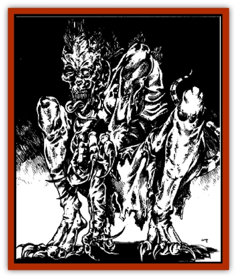

# Ur-Histachii

| Statistic | **Ur-Histachii** |
| --- | --- |
| **Activity Cycle:** | Night |
| **Alignment:** | Chaotic evil |
| **Armor Class:** | 6 |
| **Climate/Terrain:** | Tropical jungles or subterranean areas beneath tropical regions |
| **Damage/Attack:** | 1d4/1d4/1d3 |
| **Diet:** | None |
| **Frequency:** | Very rare |
| **Hit Dice:** | 4+2 |
| **Intelligence:** | Semi- (2-4) |
| **Magic Resistance:** | Nil |
| **Morale:** | Fearless (19-20) |
| **Movement:** | 9 |
| **No. Appearing:** | 2d8 |
| **No. of Attacks:** | 3 |
| **Organization:** | Band |
| **Size:** | M (5-6 feet tall) |
| **Special Attacks:** | Berserker rage |
| **Special Defenses:** | Immune to hold, charm, sleep, and cold-based spells, death magic, and poison |
| **THAC0:** | 17 |
| **Treasure:** | Nil |
| **XP Value:** | 420 |

The necromancers of the Cult of the Dragon's cell in and under the Vilhon Reach's city of Hlondeth have created this undead perversion. Ur-histachii are made from histachii, which are [[Yuan-ti|yuan-ti]]-created abominations formed from unfortunate humans who are forced to drink a specially brewed elixir.

Like its living counterparts, an ur-histachii is hairless, and its skin is a mottled gray to gray-black in color, often with patches of green or yellow mold growing from old, open wounds. A small reptilian head-fin starts atop the undead creature's skull and grows down its back as a spinal ridge that ends at the tip of the ur-histachii's vestigial tail. An ur-histachii's undead eyes are empty sockets filled by blackness, and a scabrous reptilian tongue flicks out between its broken teeth in an instinctual effort to taste the air it no longer breathes. Ur-histachii emit a faint scent of rust and acid, along with that of musty decay.

Ur-histachii do not speak, per se, vocalizing only grunts and broken hisses, but understand the commands of their creators and other yuan-ti so long as they are spoken in common or the yuan-ti tongue.

**Combat:** Ur-histachii attack any nonreptile that enters their sensory range. They can see, hear, smell, taste, and touch just as well as a living histachii despite their apparent lack of visual organs. They also have 90-foot infravision. All but mindless, ur-histachii simply charge any such creatures that come within range, attacking with their filthy claws and teeth. Cult necromancers have somehow given the ur-histachii the ability to enter berserk rages up to three times in a 24-hour day. To induce an ur-histachii to become berserk requires a nonreptile to inflict some direct damage upon it. (For instance, a mage casting a *magic missile* would not trigger a berserk rage, though the ur-histachii would react to the attack. If that same mage stabbed an ur-histachii with his dagger, the ur-histachii would enter a berserk rage - provided it had not done so already three times that day.) The berserk rage of an ur-histachii grants it +2 bonuses to attack and damage rolls plus a +2 bonus to AC for 3d4 rounds.

Like most undead, ur-histachii are immune to *sleep*, *charm*, and *hold* spells, death magic, poisons, and cold-based spells. Holy water does 2d4 points of damage to an ur-histachii. Ur-histachii are turned as shadows.

**Habitat/Society:** The ur-histachii are known to exist only within the Cult of the Dragon's cell beneath the city of Hlondeth, where the Cult necromancers and their yuan-ti associates use these undead creatures to guard important caches, secret meetings, and - since they require neither food nor air - sealed crypts and subterranean mausoleums. A few ur-histachii also have been teleported on occasion to the homes or courts of Cult enemies where the enemies. guards are sure to incite a berserk rage from the ur-histachii. Thus far, these teleported ur-histachii have served as undead assassins or as diversions for other Cult activities involving that particular foe.

To make one or more ur-histachii requires at least one to three days, during which time the histachii to be transformed are slain in a hideous ritual, the necromancers performing the procedure perform other obscene rituals and incantations, and several expensive unguents and decoctions are poured over the corpses. No more than eight ur-histachii can be made at once due to the stress of the procedure on the lead necromancer performing the transformation.

The accelerated rage ability of ur-histachii appears to burn the undead bodies of ur-histachii out quickly. Few ur-histachii exist for more than one year, and to date, none have existed more than five years past their transformation into ur-histachii.

**Ecology:** Ur-histachii need eat nothing to exist, though residual impulses of their previous life as carnivores sometimes result in their idly chewing on carrion or catching and chewing rats, worms, other vermin, and yuan-ti leftovers, if such are left within their reach or enter their sensory range. Ur-histachii are different from many of the nonsentient undead in that they often grunt and hiss to themselves, "remembering" to be quiet, like most undead creatures, only when specifically instructed (or reminded) to do so by their creators or other yuan-ti. Yuan-ti find their presence and their lack of restraint annoying, like a persistent itch, and so rarely place them where they need often interact with them. Ur-histachii never guard yuan-ti brood chambers; apparently, their masters fear they will "forget" and eat the broodlings.

---
## Discovery & Documentation

**Source Publication:** FOR11 Cult of the Dragon (1990)
**Campaign Setting:** Advanced Dungeons & Dragons 2nd Edition
**Author(s):** Dale Donovan

### Other Creatures Found in This Source Book
   * [[Dracimera|Dracimera]]
   * [[Dracohydra|Dracohydra]]
   * [[Dracolich|Dracolich]]
   * [[Dragon_Ghost|Dragon, Ghost]]
   * [[Dragon_Lesser_Undead|Dragon, Lesser Undead]]
   * [[Dragon-kin|Dragon-kin]]
   * [[Mantidrake|Mantidrake]]
   * [[Wyvern_Drake|Wyvern Drake]]
