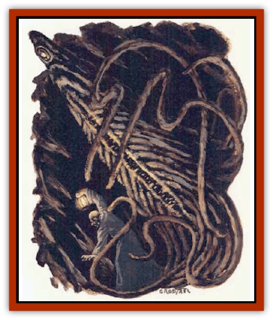

# Urophion

| Statistic | **Urophion** |
| --- | --- |
| **Activity Cycle:** | Any |
| **Alignment:** | Lawful evil |
| **Armor Class:** | 0 |
| **Climate/Terrain:** | Subterranean |
| **Damage/Attack:** | 3-6 |
| **Diet:** | Brains |
| **Frequency:** | Rare |
| **Hit Dice:** | 12 |
| **Intelligence:** | Genius (17-18) |
| **Magic Resistance:** | 45% |
| **Morale:** | Fearless (20) |
| **Movement:** | 3 |
| **No. Appearing:** | 1-3 |
| **No. of Attacks:** | 6 |
| **Organization:** | Solitary |
| **Size:** | L (9' tall) |
| **Special Attacks:** | Tendrils, psionics |
| **Special Defenses:** | Ignore lightning, ½ damage from cold, -4 penalty to saves vs. fire |
| **THAC0:** | 9 |
| **Treasure:** | Nil |
| **XP Value:** | 9,000 |

**Psionics Summary**

| Level | Dis/Sci/Dev | Attack/Defense | Score | PSPs |
| --- | --- | --- | --- | --- |
| 9 | 3/2/8 | EW,II,MB/All | = Int | 1d100+100 |

**Psychokinesis -** *Sciences:* nil; *Devotions:* control body, levitation.

**Psychometabolism -** *Sciences:* nil; *Devotion:* body equilibrium.

**Telepathy -** *Science:* domination; *Devotions:* awe, ESP, post-hypnotic suggestion, suggestion, taste link.

From a distance, a urophion resembles a rocky outcropping 9' tall and 3' in diameter at its base, narrowing to 1' in diameter at its apex. Upon closer examination, an individual can see that the corded ridges of water-sculpted rock girding the outcropping are actually thick tentaclelike tendrils tightly clinging to the purplish-gray pillar.

When roused, the creature opens a single milky eye near its top and displays a horrible, circular maw that resembles a [[Lamprey|lamprey's]] mouth. In seconds, six extensive tendrils loose their camouflaged grip with thrashing fury; each of these tendrils is located equidistantly about the circular mouth.

Because a urophion actively adjusts its body temperature to that of its surroundings, it is almost undetectable by standard infravision. Adventurers with infravision still suffer the standard -4 attack roll modifier when battling this creature in darkness.

**Combat:** A urophion's body is malleable, and it has strong tendrils that allow it to stand upright. In this way, the creature can stand upright to resemble a stalagmite, lie prone to resemble a boulder, or even hang from the ceiling to resemble a stalactite. Thus, a urophion's opponents suffer a -2 penalty to surprise.

A urophion's initial attack is a psionic *mind blast* affecting a cone-shaped area 5' wide at its origin, 60' long, and 20' wide at its extreme end. If the creature succeeds with its psionic attack, it mobilizes all six of its tendrils (which can reach up to 50'), drawing out the stunned victim's brain and killing him in one round.

A urophion can also use its tendrils to melee at a distance, while its body remains shrouded in darkness. Each successful tendril attack inflicts 1d4+2 hit points of damage as it grasps the target; victims can remove a tendril with a successful bend bars/lift gates roll. When at least one tendril holds a victim, each succeeding tendril attack roll accrues a cumulative +1 bonus (to a maximum of +5 for the last attack). Once the urophion attaches four tendrils to the victim, it sufficiently immubilizes the target and draws out his brain in the next round. The creature immediately brings the dripping brain to its mouth and eats the morsel while the remaining tendrils continue to melee with the victim's companions.

Each urophion tendril is AC 0 and can withstand up to 6 hit points of damage from a single strike with an edged weapon. Note that damage from attacks directed solely at its tentacles affect only the urophion's total hit points.

A urophion's body and tentacles are quite tough. Both of these areas are immune to electrical attacks and suffer only half damage from cold-based attacks. Uriphions do, however, suffer a -4 penalty to their saving throws vs. fire. Finally, urophions possess infravision akin to [[Mind_Flayer|illithids]].

A urophion always possesses other psionic powers, although they have not developed them to the degree of their illithid cousins.

**Habitat/Society:** An illithid creation (see "Ecology" below), the urophion possesses psionic abilities akin to the mind flayer, but its uncouth appearance and immobile form consign it to a second-class position. Thus, most urophions find themselves working as mere guards for most of their lives, protecting outlying regions under illithid control.

**Ecology:** Illithids sometimes attempt tadpole implantation in nonhumanoids to mate flayer-kin with enhanced and novel abilities. A urophion is the result of such a hybrid between an illithid and subterranean [[Roper|roper]].

---
## Discovery & Documentation

**Source Publication:** The Illithiad (1998)
**Campaign Setting:** Advanced Dungeons & Dragons 2nd Edition
**Author(s):** Bruce R Cordel

### Other Creatures Found in This Source Book
   * [[Bulette_Gohlbrorn|Bulette, Gohlbrorn]]
   * [[Elder_Brain|Elder Brain]]
   * [[Neothelid|Neothelid]]
