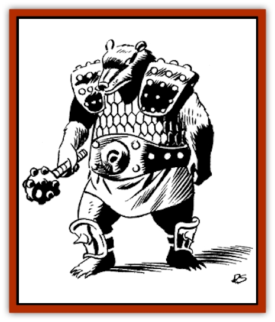

# Ursoi

| Statistic | **Ursoi** |
| --- | --- |
| **Activity Cycle:** | Day |
| **Alignment:** | Lawful neutral |
| **Armor Class:** | 6 |
| **Climate/Terrain:** | Temperate to Arctic/Subterranean |
| **Damage/Attack:** | 2-16/1-6/1-6, or by weapon type |
| **Diet:** | Omnivore |
| **Frequency:** | Uncommon |
| **Hit Dice:** | 5 |
| **Intelligence:** | Low (5-7) |
| **Magic Resistance:** | Nil |
| **Morale:** | Champion (16) |
| **Movement:** | 9 |
| **No. Appearing:** | 1-8 |
| **No. of Attacks:** | 3 (1 with weapon) |
| **Organization:** | Tribal |
| **Size:** | L (9' tall) |
| **Special Attacks:** | Hug |
| **Special Defenses:** | Nil |
| **THAC0:** | 15 |
| **Treasure:** | 20% chance Q per creature |
| **XP Value:** | 775 |

Ursoi are a race of [[Bear|bears]] that have evolved into an intelligent, social species. They live and work together in a tribe, use tools and sometimes weapons, and hunt cooperatively for food.

The typical ursoi looks a great deal like a bear - up to nine feet tall when standing on its rear legs, with thick shaggy fur and four paws. The front paws have longer, better articulated "fingers" than the typical bear, to better use tools and weapons. Ursoi also wear jewelry, leather belts, and even, on special occasions, ceremonial clothing.

**Combat:** While an ursoi can use weapons, there are few weapons more effective than this creature's own fangs and claws. It attacks three times per turn, but it cannot split its attacks against multiple opponents.

If both claw attacks hit an opponent in a turn, on the next turn the ursoi may (50% chance) opt for a hug attack. This requires another attack roll, and it is the only attack the ursoi can make that turn. If it succeeds, the victim suffers 2d4 points of crushing damage each successive turn. In addition, the ursoi can bite a hugged victim with a +4 bonus to the attack roll. An ursoi will not release a hugged victim until the ursoi has fewer than 10 hit points left, or the victim dies. A hugged creature may not attack or throw spells. An ursoi can hug only those creatures smaller than itself.

The ursoi are fearless fighters and do not back down from a challenge. However, they are also smart enough to flee when things start going badly for them. Though their morale is high, they do not fight to the death against impossible odds.

**Habitat/Society:** Ursoi are known to live only in the remote caves on the outer edges of Chorane beneath the south pole of Krynn, but there is no reason they could not live on the surface. They would prefer colder climates, however, staying in arctic or temperate forest regions. They have developed a tribal society, with a chieftain, a tribal shaman (some sages who have studied the ursoi say that the shamans will soon develop spellcasting ability), and several sub-chieftains. Their primary occupation is hunting - while ursoi are omnivorous, they greatly prefer fresh meat to leaves and berries.

**Ecology:** Ursoi are intelligent and have a highly-developed sense of personal honor. Under the right circumstances, a person could persuade an ursoi to serve as a bodyguard, sentry, or other sort of fighter. One example might be if a person were to save an ursoi's life and demand a payment on the "debt of honor". The period of service would have to be for a short, specified time (no more than a year), and the ursoi would have to be treated with honor and respect (no suicide missions). Communicating with the ursoi would have to be done magically, as no non-ursoi has ever learned their language, and ursoi cannot form human speech sounds and cannot speak common. (Intellectually, ursoi have the capability to understand common when it is spoken to them, but there is no proof to date that any have learned it.)

---
## Discovery & Documentation

**Source Publication:** DLR1 Otherlands (1992)
**Campaign Setting:** Dragonlance
**Author(s):** Haring, Bennie, and Terra

### Other Creatures Found in This Source Book
   * [[Bolandi|Bolandi]]
   * [[Dragon_Brine|Dragon, Brine]]
   * [[Funno|Funno]]
   * [[Ogre_Mischta|Ogre, Mischta]]
   * [[Ogre_Nzunta|Ogre, Nzunta]]
   * [[Razhak|Razhak]]
   * [[Spirit_Wisdom|Spirit, Wisdom]]
