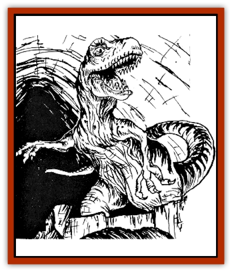
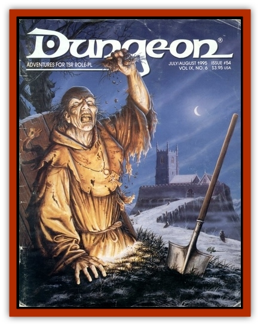

# Utahraptor

| Statistic | **Utahraptor** |
| --- | --- |
| **Activity Cycle:** | Any |
| **Alignment:** | Neutral |
| **Armor Class:** | 5 |
| **Climate/Terrain:** | Any tropical |
| **Damage/Attack:** | 1-6/1-6/2-8/2-8/1-10 |
| **Diet:** | Carnivore |
| **Frequency:** | Rare |
| **Hit Dice:** | 7+3 |
| **Intelligence:** | Animal (1) |
| **Magic Resistance:** | Nil |
| **Morale:** | Fearless (19) |
| **Movement:** | 19 |
| **No. Appearing:** | 5-20 adults |
| **No. of Attacks:** | 5 |
| **Organization:** | Pack |
| **Size:** | L (20' long) |
| **Special Attacks:** | Jump, grasping claws |
| **Special Defenses:** | Coloration |
| **THAC0:** | 13 |
| **Treasure:** | Nil |
| **XP Value:** | 975 |

The utahraptor is a carnivorous dinosaur related to the [[Dinosaur_I|deinonychus]], only it is much larger. The utahraptor is 20' long, stands 15' high, and weighs around 1,500 lbs. It stands upright on two stout legs, with its tail held stiffly out behind for balance, and has powerful "arms" with 10" claws. The raptor also has a 12"-long curved sickle claw on each foot; a horrible weapon used for gutting large prey. Their brown and green coloration blends with trees and forests.

**Combat:** Utahraptors attack with their arms first, clawing at the target in hopes of getting a firm grasp. If both claw attacks succeed, the next two attacks (the sickle-clawed feet) are at +2 to attack rolls. The final attack is with the creature's powerful jaws. One weakness of the raptor is that its multiple attacks can be used only against a single target. Utahraptors are quick and agile and can leap at prey out of ambush; the leap is considered a charge, giving the raptor a +2 to attack rolls the first round.

The raptor's coloring allows them to hide well in foliage. If hiding in ambush, the raptors are 75% likely to be unseen (effectively invisible) and can be located only by magic. They are able to leap 15' high from a standing start; at least 40' if running. They can leap 25' high and 50' forward and can drop down 25' without damage.

Utahraptors are intelligent for dinosaurs, but still rather stupid. This makes them utterly fearless. They do not check morale unless all adults in the pack are slain (the morale rating is for young and hatchling raptors). Utahraptors are genetically driven to attack creatures much larger than themselves and are immune to magical fear.

**Habitat/Society:** Utahraptors live in packs, much like [[Cat_Great|lions]]. However, the leader is the largest female, not a male. The raptors are cooperative animals, coordinating hunts to set up cunning ambushes. Each pack has a clearly defined territory, which may expand as more food is needed when the pack increases in number. The raptors prefer dense forests and brush habitat. A pack is roughly divided between males and females. There are also plenty of young, not fully grown (equal to deinonychus). The pack includes a number of these young equal to 150% of the adults. There are also several hatchlings, equal in number to 200% of the adults; these have 1-4 hp and a damage  of 1/1/1-2/1-2/1-4. Adult raptors become enraged if their young or eggs are threatened, and they gain +1 to attack and damage rolls when fighting these intruders.

**Ecology:** Utahraptors are pure carnivores. They attack prey of any size and do not hesitate to tackle creatures much larger than themselves. They are on top of the food chain and have no enemies save for other utahraptor packs.

**Historical Note:** Utahraptor is a recently discovered species, found and named in 1992. The remains were found, obviously, in eastern Utah, and the name of utahraptor is not official yet, however fitting.

---
## Discovery & Documentation

**Source Publication:** Dungeon #54 (1995)
**Campaign Setting:** Dungeon Magazine
**Author(s):**
