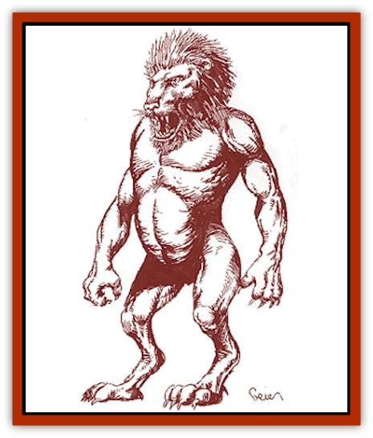

# Utukku

| Statistic | **Utukku** |
| --- | --- |
| **Activity Cycle:** | Any |
| **Alignment:** | Chaotic evil |
| **Armor Class:** | -2 |
| **Climate/Terrain:** | Any |
| **Damage/Attack:** | 4d4/4d4/3d4 |
| **Diet:** | Carnivore |
| **Frequency:** | Common on Carceri, very rare elsewhere |
| **Hit Dice:** | 10+5 |
| **Intelligence:** | Exceptional (15-16) |
| **Magic Resistance:** | 50% |
| **Morale:** | Champion (15-16) |
| **Movement:** | 15 |
| **No. Appearing:** | 1 |
| **No. of Attacks:** | 3 (claw/claw/bite) |
| **Organization:** | Solitary |
| **Size:** | L (11-14' tall) |
| **Special Attacks:** | Spell use |
| **Special Defenses:** | Hit only by +1 or better magical weapons, spell immunities, saving throw bonus |
| **THAC0:** | 9 |
| **Treasure:** | F,R,X |
| **XP Value:** | 16,000 |

Utukku usually inhabit the planes of Carceri, but on rare occasions they will come to the Prime Material Plane, inhabiting caverns or pits in desolate regions. On the Savage Coast, they are most often found in the deserts around the Horn and the Land of the Shifting Dunes, near Trident Bay.

Utukku are roughly humanoid in shape, standing about 12 feet high. An utukku has the head of a [[Cat_Great|lion]], with long quills in place of a mane, and a scaled humanoid body. It also has huge, white claws on its hands and feet. These creatures are mostly dark red in color, but their faces are a golden-red. An utukku's eyes are bright yellow with catlike blue pupils.

Utukku have their own language, which resembles low growls and is composed of very few words; meaning is conveyed by tone and inflection. They also have their own written language - a harsh and angular script, which bears some resemblance to the [[Enduk|enduk]] writing style.

**Combat:** Utukku use their hands to slash at opponents in battle. Utukku can also use the following powers at will: *detect invisibility*, *read languages*, *know alignment*, and *detect magic*. They can use the following abilities three times per day: *teleport without error* (carrying up to 1500 pounds), *cause fear* (as per *wand of fear*), *create darkness* (30-foot radius), and *lightning bolt* (12d6 points of damage). Once per day, utukku may use a *symbol of discord* and *control weather* as an 18th-level mage. Once per week, an utukku may *cause disease* (by touch) and *polymorph self* into a human or humanoid form for a full day. All utukku have infravision to 120 feet and have a limited form of telepathy, which allows them to communicate with intelligent creatures.

The harsh and deadly nature of the utukku's home environment has forced them to develop resistance to certain magical attack forms. From lightning, fire, or poisonous gas attacks, they take half damage if they fail a saving throw and one-quarter damage if they succeed. They also gain a +4 bonus on saving throws vs. poison. Utukku are immune to any sort of mental probing, such as *ESP* and telepathy.

**Habitat/Society:** Once per century, each utukku can *plane shift* itself into the Prime Material Plane from Carceri; it can remain on the Prime Material Plane for one year, after which it automatically shifts back to its home plane, taking up to 4,000 pounds of material with it. Because of its relatively short stay on the Prime Material Plane, its lairs are hastily made, and its defenses will not be very complex.

On the Prime Material Plane, utukku use their powers to spread misery and evil through nearby humanoid communities. They do not attempt to gain followers or lead humanoids, preferring to work alone. They attack other creatures from the Outer Planes on sight, regardless of alignment or plane of origin, unless they are outnumbered.

**Ecology:** Unlike some extraplanar creatures, utukku are mortal, but they have a life span of several thousand years.

Rumors claim that the utukku are the minions or servants of a long-forgotten Immortal that was either destroyed or imprisoned by the enduk patron Immortal. The enmity between this shadowy Immortal patron and Idu would certainly explain the utukku's fierce hatred for the enduks.

---
## Discovery & Documentation

**Source Publication:** Monstrous Compendium Savage Coast Appendix (Online Exclusive) (1995)
**Campaign Setting:** Mystara
**Author(s):** Loren L Coleman, Ted James, Thomas Zuvich, Cindi M. Rice

### Other Creatures Found in This Source Book
   * [[Aranea_Savage_Coast|Aranea (Savage Coast)]]
   * [[Arashaeem|Arashaeem]]
   * [[Batracine|Batracine]]
   * [[Cat_Marine|Cat, Marine]]
   * [[Cinnavixen|Cinnavixen]]
   * [[Clockwork_Swordsman|Clockwork Swordsman]]
   * [[Critter_Temple|Critter, Temple]]
   * [[Cursed_One|Cursed One]]
   * [[Deathmare|Deathmare]]
   * [[Dragon_Savage_Coast_Crimson|Dragon (Savage Coast), Crimson]]
   * [[Dragon_Savage_Coast_Red_Hawk|Dragon (Savage Coast), Red Hawk]]
   * [[Echyan|Echyan]]
   * [[Ee'aar|Ee'aar]]
   * [[Enduk|Enduk]]
   * [[Fachan_Savage_Coast|Fachan (Savage Coast)]]
   * [[Feliquine|Feliquine]]
   * [[Fiend_Narvaezan|Fiend, Narvaezan]]
   * [[Frelôn|Frelôn]]
   * [[Ghriest|Ghriest]]
   * [[Glutton_Sea|Glutton, Sea]]
   * [[Goatman|Goatman]]
   * [[Golem_Naâruk|Golem, Naâruk]]
   * [[Golem_Savage_Coast|Golem (Savage Coast)]]
   * [[Grudgling|Grudgling]]
   * [[Heraldic_Servant_I|Heraldic Servant I]]
   * [[Heraldic_Servant_II|Heraldic Servant II]]
   * [[Heraldic_Servant_III|Heraldic Servant III]]
   * [[Heraldic_Servant_IV|Heraldic Servant IV]]
   * [[Heraldic_Servant_V|Heraldic Servant V]]
   * [[Heraldic_Servant_General_Information|Heraldic Servant, General Information]]
   * [[Hermit_Sea|Hermit, Sea]]
   * [[Jorri|Jorri]]
   * [[Juhrion|Juhrion]]
   * [[Kla'a-tah|Kla'a-tah]]
   * [[Leech_Legacy|Leech, Legacy]]
   * [[Lich_Inheritor|Lich, Inheritor]]
   * [[Lizard_Kin_Savage_Coast|Lizard Kin (Savage Coast)]]
   * [[Lupasus|Lupasus]]
   * [[Lupin|Lupin]]
   * [[Lyra_Bird_Saragón|Lyra Bird, Saragón]]
   * [[Malfera|Malfera]]
   * [[Manscorpion_Nimmurian|Manscorpion, Nimmurian]]
   * [[Mythuínn_Folk|Mythuínn Folk]]
   * [[Neshezu|Neshezu]]
   * [[Nikt'oo|Nikt'oo]]
   * [[Nosferatu|Nosferatu]]
   * [[Omm-wa|Omm-wa]]
   * [[Omshirim|Omshirim]]
   * [[Parasite_Savage_Coast|Parasite (Savage Coast)]]
   * [[Phanaton|Phanaton]]
   * [[Plant_Savage_Coast|Plant (Savage Coast)]]
   * [[Pudding_Vermilion|Pudding, Vermilion]]
   * [[Rakasta|Rakasta]]
   * [[Ray_Forest|Ray, Forest]]
   * [[Shedu_Greater_Savage_Coast|Shedu, Greater (Savage Coast)]]
   * [[Shimmerfish|Shimmerfish]]
   * [[Skinwing|Skinwing]]
   * [[Spawn_of_Nimmur|Spawn of Nimmur]]
   * [[Spider-spy|Spider-spy]]
   * [[Spirit_Heroic|Spirit, Heroic]]
   * [[Spirit_Walleran|Spirit, Walleran]]
   * [[Succulus|Succulus]]
   * [[Swampmare|Swampmare]]
   * [[Symbiont_Shadow|Symbiont, Shadow]]
   * [[Tortle|Tortle]]
   * [[Troll_Legacy|Troll, Legacy]]
   * [[Trosip|Trosip]]
   * [[Tyminid|Tyminid]]
   * [[Voat|Voat]]
   * [[Voat_Herathian|Voat, Herathian]]
   * [[Vulturehound|Vulturehound]]
   * [[Wallara|Wallara]]
   * [[Wurmling|Wurmling]]
   * [[Wynzet|Wynzet]]
   * [[Yeshom|Yeshom]]
   * [[Zombie_Red|Zombie, Red]]
