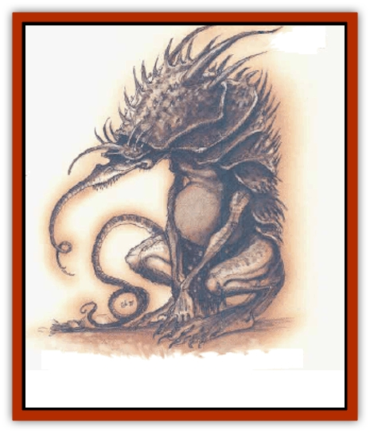

# Vaath

| Statistic | **Vaath** |
| --- | --- |
| **Activity Cycle:** | Night |
| **Alignment:** | Neutral evil |
| **Armor Class:** | 3 |
| **Climate/Terrain:** | Carceri |
| **Damage/Attack:** | 1d8/1d4 |
| **Diet:** | Carnivore |
| **Frequency:** | Common |
| **Hit Dice:** | 4+2 |
| **Intelligence:** | Average (8-10) |
| **Magic Resistance:** | Nil |
| **Morale:** | Steady (11-12) |
| **Movement:** | 15 |
| **No. Appearing:** | 1 (24 in Carceri) |
| **No. of Attacks:** | 2 |
| **Organization:** | Pack |
| **Size:** | L (8' long) |
| **Special Attacks:** | Poison, burrowing tentacle |
| **Special Defenses:** | Nil |
| **THAC0:** | 17 |
| **Treasure:** | Nil (A) |
| **XP Value:** | 975 |

The evil vaaths are known throughout the planes as relentless, vicious killers. These bloodthirsty, intelligent terrors like to inflict pain and misery as well as kill.

A horrible amalgamation of insect and reptile, the vaath's long body is coved with dark scales, while its head is protected by a hard black carapace. Long white teeth drip venomous saliva as they protrude from its oversized, lipless mouth. The snout is whiplike, the narrow-slitted eyes peek out from under its chitinous headshell. A small, almost tonguelike tentacle lurks in a cavity just behind the beast's mouth. The body is sleek and muscular, able to make quick dashes or keep up an enduring, tireless pace.

Vaaths use a limited series of hisses, growls, and barks to communicate. It is a crude language, impossible to understand or speak without magical aid.

**Combat:** The bite of the vaath inflicts 1d8 points of damage; further, its venom kills anyone bitten who fails a saving throw vs. poison (onset time 1d4+1 rounds). If the vaath has time to play with its prey rather than killing it quickly, it restrains itself from using the poisonous bite. Instead, it protrudes the writhing appendage from below its mouth.

This tentacle, capped by a sphincterlike mouth, shoots out, stretching as far as 10 feet. The tiny mouth bites foes, inflicting 1d4 points of damage. A victim struck by this attack must make a Strength check to pull away, or the vicious mouth tears into the hapless victim with terrifying speed, pulling the extended tentacle behind it. This attack automatically inflicts 1d4 points of damage per round. After 1d4+2 rounds, the burrowing mouth reaches the base of the victim's skull, severing the skull from the spine. A victim who is still alive at this point can no longer move from the neck down. Death comes 1d6+4 rounds later, but the vaath takes full advantage of this time to torment the dying victim. While the vaath's victim can no longer feel anything, the evil fiend takes delight in tearing the body apart as the victim watches, helpless.

During the burrowing, only the death of the vaath will save the victim from having his spine snapped. After the severing, only timely magical healing can save the victim's life. Additional magical healing is required to restore mobility.

This mode of attack is so ghastly and horrible that anyone wihlessing it must make a Wisdom check or be stunned for 1d3 rounds in utter horror. Any victim of the burrowing and subsequent paralyzation who is rescued before death must make a saving throw vs. death magic pr lose one point of wisdom as his sanity is shaken to its core.

*Note:* For monsters without Strength or Wisdom ability scores, substitute a saving throw vs. paralysis with a +2 bonus; a roll of 1 fails regardless of adjusdments. The *DM Option: High Level Campaigns* book has an optional method for generating suitable monster scores.

**Habitat/Society:** Vaaths live in the jungles of Cathrys, the fourth layer of Carceri, terrorizing the layer's few inhabitants. Their evil is pure and wholly detestable. These creatures cannot be reasoned with, nor do they show mercy. Even the most powerful of [[Gehreleth|gehreleths]] move through vaath-infested areas with caution. While even some of the lesser fiends of the Lower Planes could certainly defeat a vaath in battle, the threat of what the creature enjoys doing to its victims inspires fear and loathing in all who know of its existence.

Vaah roam in packs, but keep individual lairs - tiny, cleared spaces beneath the thick, dark jungle growth. They often collect as trophies the belongings of intelligent creatures they have killed. Vaaths sometimes refrain from eating small portions of their victims, such as a hand, a head, or an eye, and save these as trophies too.

The acting pack leader is always a female vaath, for the females are usually the more intelligent (and insidious rather than savage) of the species. Most of the time, however, no leadership is required. The vaath pack's course of action is clear: Hound the prey until it falls, and torture it until it dies.

Vaaths greatly desire to be summoned, and don't mind being subjugated by others, as long as they are taken to a greater selection of victims. They happily work for powerful fiends as guards, torturers, or even pets, as long as they are well fed and allowed to partake of their evil pleasures.

**Ecology:** Vaaths are found almost exclusively on the layer of Carceri known as Cathrys, and appear on the Prime Material Plane only as the result of an arcane magical ritual. For many years, it was believed that vaaths actually fed upon the fear and suffering of others. The idea that the monster acted out of a basic need, something akin to hunger, somehow softened the repulsion of its deeds. This optimistic theory was dispelled a few years ago - the horrific vaath simply&hellip; are

---
## Discovery & Documentation

**Source Publication:** Monstrous Compendium, 1996 Annual, Volume 3 (1995)
**Campaign Setting:** Advanced Dungeons & Dragons 2nd Edition
**Author(s):** Jon Pickens

### Other Creatures Found in This Source Book
   * [[Alaghi|Alaghi]]
   * [[Alhoon|Alhoon]]
   * [[Aranea_Savage_Coast|Aranea (Savage Coast)]]
   * [[Arcane_Head|Arcane Head]]
   * [[Banedead|Banedead]]
   * [[Banelich|Banelich]]
   * [[Bat_Bonebat|Bat, Bonebat]]
   * [[Beetle|Beetle]]
   * [[Belgoi|Belgoi]]
   * [[Bladeling|Bladeling]]
   * [[Braxat|Braxat]]
   * [[Bunyip|Bunyip]]
   * [[Burbur|Burbur]]
   * [[Bvanen|Bvanen]]
   * [[Cat_Great_Snow_Tiger|Cat, Great, Snow Tiger]]
   * [[Chosen_One|Chosen One]]
   * [[Chronovoid|Chronovoid]]
   * [[Cildabrin|Cildabrin]]
   * [[Coffer_Corpse|Coffer Corpse]]
   * [[Disenchanter|Disenchanter]]
   * [[Dog_Temporal|Dog, Temporal]]
   * [[Dragon_Cerilia|Dragon (Cerilia)]]
   * [[Dragon_Ghost|Dragon, Ghost]]
   * [[Dragon_Lesser_Undead|Dragon, Lesser Undead]]
   * [[Dragon_Neutral_Amber|Dragon, Neutral, Amber]]
   * [[Dread_Warrior|Dread Warrior]]
   * [[Dreamweaver|Dreamweaver]]
   * [[Dream_Spawn_Greater_Ennui|Dream Spawn, Greater, Ennui]]
   * [[Dream_Spawn_Lesser_Morph|Dream Spawn, Lesser, Morph]]
   * [[Dwarf_Arctic|Dwarf, Arctic]]
   * [[Dwarf_Urdunnir|Dwarf, Urdunnir]]
   * [[Eel_Giant_Moray|Eel, Giant Moray]]
   * [[Elemental_Fire_Kin_Tome_Guardian|Elemental, Fire Kin, Tome Guardian]]
   * [[Elf_Rockseer|Elf, Rockseer]]
   * [[Ethyk|Ethyk]]
   * [[Faerie_Faerie_Fiddler|Faerie, Faerie Fiddler]]
   * [[Faerie_Petty_Bramble|Faerie, Petty, Bramble]]
   * [[Faerie_Petty_Gorse|Faerie, Petty, Gorse]]
   * [[Faerie_Petty|Faerie, Petty]]
   * [[Firenewt|Firenewt]]
   * [[Formian|Formian]]
   * [[Gargoyle_II|Gargoyle II]]
   * [[Giant_Cerilia|Giant (Cerilia)]]
   * [[Goblin_Cerilia|Goblin (Cerilia)]]
   * [[Golem_Magic|Golem, Magic]]
   * [[Golem_Shaboath|Golem, Shaboath]]
   * [[Hag_Bheur|Hag, Bheur]]
   * [[Hamadryad|Hamadryad]]
   * [[Hound_of_Ill-Omen|Hound of Ill-Omen]]
   * [[Human_Cerilia|Human (Cerilia)]]
   * [[Hybsil|Hybsil]]
   * [[Ibrandlin|Ibrandlin]]
   * [[Imp_Chaos|Imp, Chaos]]
   * [[Ixitxachitl_Ixzan|Ixitxachitl, Ixzan]]
   * [[Jabberwock|Jabberwock]]
   * [[Kyton|Kyton]]
   * [[Kyuss_Son_of|Kyuss, Son of]]
   * [[Lillend|Lillend]]
   * [[Life-Shaped_Creation_Guardian|Life-Shaped Creation, Guardian]]
   * [[Life-Shaped_Creation_Transport|Life-Shaped Creation, Transport]]
   * [[Lycanthrope_Werecrocodile|Lycanthrope, Werecrocodile]]
   * [[Lycanthrope_Werespider|Lycanthrope, Werespider]]
   * [[Magedoom|Magedoom]]
   * [[Manotaur|Manotaur]]
   * [[Mastiff_Shadow|Mastiff, Shadow]]
   * [[Meazel|Meazel]]
   * [[Mist_Scarlet_Dancer|Mist, Scarlet Dancer]]
   * [[Needleman|Needleman]]
   * [[Orc_Neo-Orog|Orc, Neo-Orog]]
   * [[Orc_Ondonti|Orc, Ondonti]]
   * [[Owlbear_II|Owlbear II]]
   * [[Pegataur|Pegataur]]
   * [[Phaerimm|Phaerimm]]
   * [[Reggelid|Reggelid]]
   * [[Render|Render]]
   * [[Saurial|Saurial]]
   * [[Scalamagdrion|Scalamagdrion]]
   * [[Sharn|Sharn]]
   * [[Snake_Messenger|Snake, Messenger]]
   * [[Spirit_Forest_Uthraki|Spirit, Forest, Uthraki]]
   * [[Spirit_Forest_Wood_Man|Spirit, Forest, Wood Man]]
   * [[Spirit_Ice_Orglash|Spirit, Ice, Orglash]]
   * [[Spirit_Rock_Thomil|Spirit, Rock, Thomil]]
   * [[Strider_Giant|Strider, Giant]]
   * [[Tembo|Tembo]]
   * [[Temporal_Glider|Temporal Glider]]
   * [[Temporal_Stalker|Temporal Stalker]]
   * [[Tether_Beast|Tether Beast]]
   * [[Thessalmonster|Thessalmonster]]
   * [[Time_Dimensional|Time Dimensional]]
   * [[Tomb_Tapper|Tomb Tapper]]
   * [[Undead_Dragon_Slayer|Undead Dragon Slayer]]
   * [[Unicorn_Black_Toril|Unicorn, Black (Toril)]]
   * [[Vortex_Spider|Vortex Spider]]
   * [[Weredragon|Weredragon]]
   * [[Zhentarim_Spirit|Zhentarim Spirit]]
