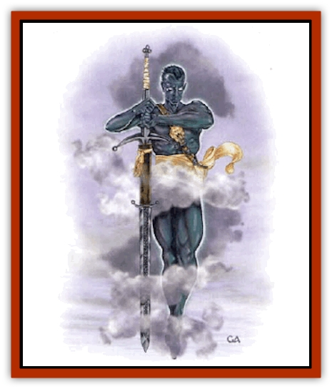

# Vaati

| Statistic | **Vaati** |
| --- | --- |
| **Activity Cycle:** | Any |
| **Alignment:** | Lawful neutral |
| **Armor Class:** | 5 (per caste and level) |
| **Climate/Terrain:** | Any |
| **Damage/Attack:** | By weapon + Strength bonus |
| **Diet:** | Omnivore |
| **Frequency:** | Very rare |
| **Hit Dice:** | 4 (per caste and level) |
| **Intelligence:** | Exceptional to Genius (15-18) |
| **Magic Resistance:** | Nil |
| **Morale:** | Elite to Fearless (13-20) |
| **Movement:** | 12, Fl 12 (A) |
| **No. Appearing:** | 1d4 |
| **No. of Attacks:** | 1 (per caste and level) |
| **Organization:** | Collective or Solitary |
| **Size:** | M (7' tall) |
| **Special Attacks:** | See below |
| **Special Defenses:** | See below |
| **THAC0:** | 17 (per caste and level) |
| **Treasure:** | A (A,W) |
| **XP Value:** | 2,000 + 1,000 per level beyond 4th |

The Vaati (VAH tee), or Wind Dukes, are a race of immortals dedicated to Law. Vaati look like statuesque humans. They are tall, muscular, and androgynous. As a rule, they wear no clothing but usually wear belts or harnesses to carry weapons and equipment. Vaati have smooth, ebony skin, brilliantly white eyes that sparkle with inner light, and velvety black hair (which usually is kept closely shaved).

Vaati speak their own language, which is very rhythmic and melodic. It contains many complex whistling sounds. A group of vaati talking produce something that sounds more like chanting or wind whispering through the trees than conversation. Vaati adventurers also speak common. When surprised or exited, however, a vaati tends to let out a whistle rather than use an exclamation peculiar to its adopted language.

Aeons ago, the vaati ruled a vast empire spread over several worlds on the Prime Material Plane, with footholds throughout the planes. When war between Law and Chaos erupted, the vaati were nearly annihilated. They survived only by creating the *Rod of Seven Parts* and using it to end the war.

**Combat:** Vaati are peaceful and prefer to negotiate rather than fight. If pressed into action, or faced with chaotic foes, they display considerable strength and ingenuity in combat.

All vaati have the following spell-like powers usable at will: *control temperature 10' radius*, *dust devil*, *gust of wind*, and *feather fall*. They can fly at a speed of 12 (some vaati fly even faster), although strong head winds reduce their movement by half. They can use their *gust of wind* ability to double their flying movement for one round. Their spell-like powers function at 4th level or at their character level, whichever is higher.

Vaati are immune to all forms of aging and are resistant to attacks based on the element of air. No air elemental creature will attack a vaati or even approach within five feet unless the vaati attacks first. Even then, vaati receive a +2 bonus to all saving throws, armor class, and ability checks involving air-based attacks of any kind, and any damage suffered is reduced by -2 per die (minimum of one point per die).

Vaati have infravision with a 90-foot range and can see though fog, dust, and similar air-based impediments to vision.

If they cannot avoid a fight, vaati usually try to gain a height advantage over their foes. They bombard the enemy with spells and missiles; they also use their *feather fall* ability to foil incoming missile attacks.

More powerful vaati have additional class and spell-like abilities based on their castes, as detailed below. The level ranges given are only typical values, and higher or lower level vaati are possible.

A vaati's flesh is resistant to blows and provides an excellent armor class. More powerful vaati have even better armor classes. If a vaati wears armor, he receives either the armor class bestowed by the armor or his own armor class, whichever is better. *Bracers of defense* and other protective items that bestow a fixed armor class work the same way. An unarmored vaati wearing a *ring of protection* or a similar item receives the full benefit of the item.

Vaati have a base morale of 13, which improves by one for each level beyond 4th for a maximum of 20 at 11th level.

**Habitat/Society:** Most of the remaining vaati live in the Vale of Aaqa, a secluded valley ringed with protective mountains. The valley is completely sealed to all means of transit except flight. Teleportation is ineffective, though there are several gates to the Astral plane. The valley's exact location is a well-kept secret.

The Vale of Aaqa is a well-regulated paradise with a constant temperature of 72 degrees, manicured fiends and gardens, and stately pavilions surrounded by exquisite rock gardens. In the entire valley, there is not single blade of grass or leaf out of place. The valley could easily support 10 times more vaati than currently reside there, and most of the pavilions stand empty. Even this last stronghold of the race was depopulated during the war against Chaos.

Vaati society is divided into seven castes. The exact criteria the vaati use to assign castes is unclear to outsiders. All vaati are born into the *wergadeam* (worker) caste. Sometime after adolescence, a young vaati either joins another caste or remains a wergadeam. In times of need, some members of the wergadeam join other castes where they can be more useful. The other six castes are the *houdeam* (civil and military leaders, guards, and soldiers), the *haikjadeam* (teachers, investigators, and lorekeepers), the *trygrideam* (farmers, animal keepers, and judges), the *kheirdeam* (physicians and counselors), the *vindeam* (philosophers, guardians, and advisors), and the *bledrudeam* (also philosophers, guardians, and advisors). There is an another, unofficial, caste as well. The *wendeam* are wanderers that keep watch over the *Rod of Seven Parts* and the [[The_Queen_of_Chaos|Queen of Chaos]]. The wendeam are independent beings and essentially outcasts.

The wergadeam never leave the Vale of Aaqa. The other castes, except for the wendeam, tend to remain in the valley unless sent away to handle some matter of vital interest to the race. The wendeam wander the Prime Material Plane and almost never set foot in the Vale of Aaqa.

The vaati employ no badges or markings to indicate caste. To a vaati, another vaati's caste is immediately and innately obvious.

To most observers, even the most open-minded, vaati seem stuffy and overconcerned with formal rules. They are excruciatingly regular in their personal habits and they have rules governing everything. They are quick to criticize any lapse in etiquette. Very lawful creatures usually are impressed by their behavior, but others find it tiresome.

**Ecology:** Though fairly large and powerful, vaati eat very little. They seem to exist primarily on air. The Valley of Aaqa, however, produces a wide variety of foods, and the vaati can offer the occasional visitor a sumptuous repast.

Although they can be slain or laid low by disease, vaati are immortal. Most vaati are at least 3,000 years old, and many are much older than that. Vaati birth rates are very low; there are no more than one or two vaati children born in a century. The race will probably never recover from the losses it suffered during the war against Chaos.

**Wergadeam**

Most vaati belong to this caste. They have Strength scores of 17, giving them a +1 bonus to attack and damage. They are typically armed with staves and knives. If prepared for war, they carry long swords and long bows. They have no special powers beyond those common to all vaati.

**Houdeam**

The houdeam conduct the vaati's civil and military affairs. They are primarily charged with guarding the Vale of Aaqa and keeping a wary eye on visitors to the valley. During the war against Chaos, the houdeam formed an elite corps many thousands strong. These were the Captains of Law mentioned in the history of the *Rod of Seven Parts*.

Houdeam are fighters of 5th-14th level (1d10+4). They have Strength scores of 18/77, giving them a +2 attack bonus and a +4 bonus to damage. Their base armor class is 3, and it impproves by 2 for every three levels the houdeam has gained beyond 4th. A houdeam is usually armed with a two-handed sword, a long bow, and several daggers. The sword and bow have a +1 enchantment when used by a vaati, and the enchantment improves by one for every three levels the houdeam gains beyond 4th, to a maximum of +4. In the hands of a non-vaati, the weapons not only lose their enchantment, but also corrode, falling to pieces in 2d6 months. All houdeam are two-handed sword specialists. Even if unarmed, houdeam can make open hand attacks at the standard rate for their fighter levels. These can be resolved as pummeling attacks or as lethal attacks that inflict 1d4+4 points of damage. When making a lethal open hand attack, a houdeam is considered armed (see Chapter 9 of the *PHB*). If the martial arts and weapon mastery rules from the *Player's Option: Combat and Tactics* book are in play, houdeam are considered specialists in martial arts style C and masters with the two-handed sword. They have one step of mastery for every three levels they have gained beyond 4th.

Houdeam have the spell-like powers common to all vaati, and can make their two-handed swords dance (as *swords of dancing*) three times a day. A houdeam typically makes open hand attacks while his sword dances.

**Haikjadeam**

The haikjadeam serve as record keepers, police, and teachers. During the war against Chaos, the Captains of Law included companies of haikjadeam for use against undead troops. The haikjadeam were also responsible for security and kept a lookout for spies.

Haikjadeam are paladins of 4th-13th level (1d10+3). They have Strength scores of 18/97, giving them a +2 attack bonus and a +5 bonus to damage. Halkjadeam's paladin abilities are skewed toward Law and Chaos, rather than Good and Evil. For example, they have the ability to detect Chaos and their aura of protection is effective against chaotic creatures. They can command or turn undead, deciding what action they deem most lawful under the circumstances. Generally, they only command lawful undead. Haikjadeam of 9th level and higher can cast spells from the combat, healing, charm, divination and law (from the *Tome of Magic*) spheres.

Haikjadeam have a base armor class of 3, which improves by 1 for every two levels the haikjadeam has gained beyond 3rd. Haikjadeam are armed just as the houdeam are, though they do not have weapon mastery, open hand attacks, or the ability to make their swords dance.

In addition to the spell-like abilities available to all vaati, haikjadeam can *reveal truth* and *calm air* three times a day. *Reveal truth* functions as a *dispel magic* spell, but is effective only against illusions and other forms of magical deception. The spell can destroy illusion magic of all kinds, force *polymorphed* or *shape changed* creatures back into their true forms, reveal invisible beings, and so on. If cast directly on a creature, the target must attempt a saving throw vs. spells or be forced to speak only the complete truth for 2d4 rounds. The target can refuse to speak, but evasions of the truth are not possible.

*Calm air* quiets all forms of wind in a 30-foot radius around the haikjadeam. All winds, magical or natural, are reduced to gentle breezes. Creatures from the elemental plane of air cannot enter the radius - the circle of calm collapses if deliberately forced against a creature that normally would be hedged out, just as a *protection from evil* spell does. All sound-based attacks are negated within the radius. The effect lasts three rounds per level of the haikjadeam.

**Trygrideam**

The trygrideam are charged with tending all the plants and animals in the Vale of Aaqa. It is they, and teams of wergadeam working under their direction, who maintain the valley's park-like appearance. The trygrideam also mediate any disputes that might arise between vaati and pass judgment on visitors who break vaati law.

Trygrideam secretely keep contact with the wendeam. They are keenly interested in the *Rod of Seven Parts* and the Queen of Chaos, and they stand ready to intervene to keep the *Rod* out of the Queen's hands if necessary.

Trygrideam are druids of 4th-13th level (1d10+3). They have Strength scores of 16, giving them a +1 bonus to damage. Trygrideam have full druid abilities and can cast spells from the sphere of Law in addition to the spheres normally allowed to druids. Trygrideam have a base armor class of 3, which improves by 1 for every two levels the trygrideam has gained beyond 3rd. They carry druidical weapons, but favor staves.

Despite their lawful alignment, trygrideam follow the druidical ethos as explained in the *Player's Handbook*. They differ from other druids in that when they view nature, they see proof of a universal order, not a cyclical reality. To them, order is the natural state of the universe and Chaos upsets that order, bringing destruction.

In addition to their druidical abilities and the spell-like abilities common to all vaati, tryprideam can use the following powers three times a day: *solid fog*, *cloudkill*, and *calm air* (see above). Once per hour, a Trygrideam can summon a *vortex blade*. A vortex blade is similar to the magical weapon created by the 2nd level priest spell *flame blade* except that it is a blast of high-pressure air that inflicts 1d4+6 points of damage. It has no effect on air elemental creatures, and inflicts double damage (2d4+12) on earth-based creatures.

Once a day, a trygrideam of 8th level or higher can summon one to seven powerful whirlwinds. Each whirlwind is seven feet tall and three feet wide at the top. They fly at a speed of 21 (MC A), have a THAC0 of 10, 30 hit points, and their creator's armor class. They attack once a round for 4d4 points of damage. The creator can direct the whirlwinds at any distance as long as he keeps them in sight. Controlling the whirlwinds requires minimal concentration. Damage to the creator does not dispel the whirlwinds, but the creator can take no action other than movement while controlling them. If the creator is killed or loses consciousness, the whirlwinds dissipate. A whirlwind can freely attack gaseous creatures; it can also disperse magical clouds. Magical clouds with instantaneous durations, such as [[Dragon_Chromatic_Green|green dragon]] breath, are unaffected. Permanent clouds are dispersed only as long as the whirlwind remains in their areas of effect. If skimming along the ground in an area covered with fine dirt, sand, dust, ash, or the like, a whirlwind picks up the loose material, creating an opaque cloud with a 15-foot radius. Creatures caught in the cloud are blinded while they remain inside and for one round after they leave.

**Kheirdeam**

The kheirdeam are the vaati's physicians and spiritual counselors. They tend other vaati the way the trygrideam tend the animals and plants in the Vale of Aaqa. During the war against Chaos, the kheirdeam formed a medical corps that cared for the wounded and acted as reserve troops.

Kheirdeam are clerics of 5th-14th level (1d10+4). They have Strength scores of 16, giving them a +1 bonus to damage. Kheirdeam can cast spells from the sphere of Law and all spells in the elemental sphere that involve air (*air walk*, *cloud of purification*, *conjure air elemental/dismiss air elemental*, and *wind walk*) in addition to the spheres normally allowed to clerics. Kheirdeam have a base armor class of 3, which improves by 1 for every two levels the trygrideam has gained beyond 3rd. They carry clerical weapons, but favor staves.

In addition to their clerical abilities and the spell-like abilities common to all vaati, kheirdeam can *reveal truth* and *calm air* three times a day as the haikjadeam do. They can command or turn undead, depending on what action they deem most lawful under the circumstances.

**Vindeam and Bledrudeam**

These two castes are the vaati's wizards. When not busy casting spells, they function as scholars, philosophers, and advisors. In the war against Chaos they served as support troops and magical artillery. Today, they stand ready to defend the Vale of Aaqa. They also conduct most of the vaati's business outside the valley, serving as ambassadors and troubleshooters.

Vindeam and bledrudeam are wizards of 4th-13th level (1d10+3). They have Strength scores of 15.

Vindeam specialize in spells involving the element air or gas. If the optional elemental schools from the *Tome of Magic* are in play, vindeam have all the benefits and restrictions of air elemental specialists.

Bledrudeam are abjuration specialists, as described in the *Player's Handbook*.

Vindeam and bledrudeam are armor class 4; their armor does not improve as they increase in level. They carry wizard weapons and favor staves.

In addition to the spell-like abilities common to all vaati, vindeam can cast *solid fog* and *cloudkill* once a day and can summon whirlwinds three times a day as trygrideam can.

Bledrudeam have the spell-like powers common to all vaati and can cast *spell turning* once a day. They can also cast *reveal truth* and *calm air* three times a day as haikjadeam can.

**Wendeam**

The wendeam are a handful of wandering vaati descended from the Captain of Law who scattered the pieces of the *Rod of Seven Parts* at the battle of Pesh and pursued [[Miska_the_Wolf-Spider|Miska the Wolf-Spider]] through the planar rift. Because they devote all their energy to tracking the Rod as it moves from world to world, other vaati see the wendeam as outcasts; only the trygrideam understand the value of the wendeam's efforts.

Wendeam are rangers of 4th-13th level (1d10+3). They have Strength scores of 18/97, giving them a +2 attack bonus and a +5 bonus to damage. The wendeam's long struggle against the Queen of Chaos has made them lawful good (which does nothing to improve their reputation among other vaati). They have the normal ranger abilities, and their species enemy is [[Spyder_Fiend|spyder-fiends]].

Wendeam have a base armor class of 3, which improves by 1 for every two level the wendeam has gained beyond 3rd. Wendeam prefer lightweight weapons. Most carry long bows, darts, a dagger, and two short swords. They take full advantage of their ranger abilities and use a melee weapon in each hand when unarmored. Wendeam usually have at least one enchanted melee weapon of +1 or greater. Wendeam of 6th level or higher have a +1 weapon of some type and a 60% chance for another weapon of +2 or better. Wendeam of 10th level or higher have one or two +1 weapons and a 60% chance for another weapon of +3 or better. Wendeam weapons are standard magical items that do not become nonmagical or corrode if seperated from their owners.

Wendeam have all the spell-like powers common to all vaati. In addition, they can follow any teleporting creature if they can find its tracks, just as a [[Hound_of_Law|hound of law]] can. When following a teleporting creature, a wendeam can carry 250 pounds of additional weight, plus an extra 150 pounds for each level the wendeam has attained beyond 10th.

---
## Discovery & Documentation

**Source Publication:** The Rod of Seven Parts (1996)
**Campaign Setting:** Planescape
**Author(s):** Skip Williams

### Other Creatures Found in This Source Book
   * [[Beast_of_Chaos|Beast of Chaos]]
   * [[Hound_of_Law|Hound of Law]]
   * [[Spyder_Fiend|Spyder Fiend]]
