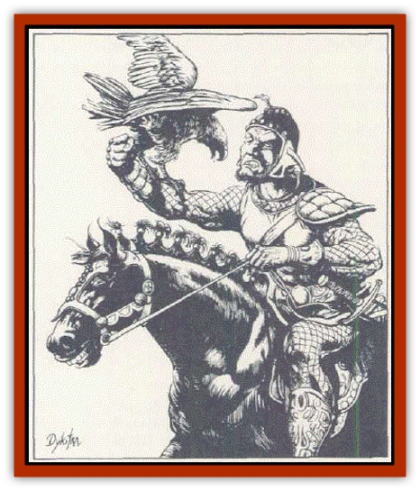

# Vagabond

| Statistic | **Vagabond** |
| --- | --- |
| **Activity Cycle:** | As host |
| **Alignment:** | Neutral (any) |
| **Armor Class:** | As host |
| **Climate/Terrain:** | As host |
| **Damage/Attack:** | As host |
| **Diet:** | As host |
| **Frequency:** | Very rare |
| **Hit Dice:** | As host |
| **Intelligence:** | Genius to Supra-genius (17-20) |
| **Magic Resistance:** | As host immune to mental spells |
| **Morale:** | Steady (11-12) |
| **Movement:** | As host |
| **No. Appearing:** | 1 |
| **No. of Attacks:** | As hosl |
| **Organization:** | Solitary |
| **Size:** | As host |
| **Special Attacks:** | As bost. psionics |
| **Special Defenses:** | As host psiorucs |
| **THAC0:** | As host |
| **Treasure:** | As host + special |
| **XP Value:** | As host + 4 Hit Dice |

It is difficult to say what a vagabond really looks like, because thev can mimic countless other creatures in form. They are an alien life force of unknown origin. They are always encountered in the form of an intelligent, corporeal creature indigenous to the area (a creature with at least animal intelligence).

Vagabonds can assume such forms in one of three ways. First they can simply form the body with their unusual powers. When this occurs, the vagabond looks like a small blob of ink which appears on the ground, then quickly enlarges into three dimensions, filling out, then forming the finer details. Such a change can be tremendously terrifying if the chosen form is something like a [[Wolfwere|wolfwere]]. Secondly, vagabonds can take over a freshly dead body, curing it of all ailments. Lastly. they can inhabit a living body. In this last form, they are like back-seat drivers who make strong suggestions; they cannot do anything which the host life force does not want them to do. Thus, a possessed horse wouldn t jump off a cliff unless it felt safe or confident about the jump. As noted above, vagabonds take the form of any creature with at least animal intelligence. They rarely inhabit forms of higher intelligence, however, such as player character races.

Once they have assumed a form, vagabonds are locked into it and cannot leave, except with lhe typical psionic powers such as switch personality (which is one of their favorites).

lf they are communicated with, it will soon become apparent that something is amiss, for they have none of their form's knowledge as to speech, behavior, customs, or expectations. However, they are able to use all of its attack and defense forms as well as movement and essential functions. Of course, many of these will be performed in strange and unique ways.

**Combat:** Vagabonds fight with lhe same skills as their form has They are also completely immune to all forms of mental attacks and control which are not strictly psionic. Besides these adjustments, all vagabonds are psionically endowed. If their host body is slain, they will depart, never to retum.

**Habitat/Society:** Habitat matches the form they assume. Society either matches the form or the creature is a solitary wanderer. Vagabonds are never encountered together, and no one has ever heard of this occurring. All vagabonds can detect each other's presence up to a mile. At this point they will separate if feasible.

**Ecology:** Vagabonds seem to have come to the prime material plane to gain information. They are extremely curious and inquisitive, often about mundane or personal details. If given the chance to adventure with the party, they are 90% likely to join. In exchange, they will use their considerable power to the party's benefit.

It can be great unto have a vagabond secretly posses a PC's [[Dog|war dog]] or [[Horse|war horse]] (most of these will be true neutral) . Evil and good vagabonds tend to side with forces of similar alignment, both aiding them and learning of their ways.

---
## Discovery & Documentation

**Source Publication:** PHBR5 The Complete Psionics Handbook (1990)
**Campaign Setting:** Advanced Dungeons & Dragons 2nd Edition
**Author(s):** Blake Mobley, Andria Hayday, Steve Winter

### Other Creatures Found in This Source Book
   * [[Baku|Baku]]
   * [[Brain_Mole|Brain Mole]]
   * [[Cerebral_Parasite|Cerebral Parasite]]
   * [[Intellect_Devourer_Larva_Ustilagor|Intellect Devourer, Larva (Ustilagor)]]
   * [[Intellect_Devourer|Intellect Devourer]]
   * [[Shedu|Shedu]]
   * [[Su-Monster|Su-Monster]]
   * [[Thought_Eater|Thought Eater]]
