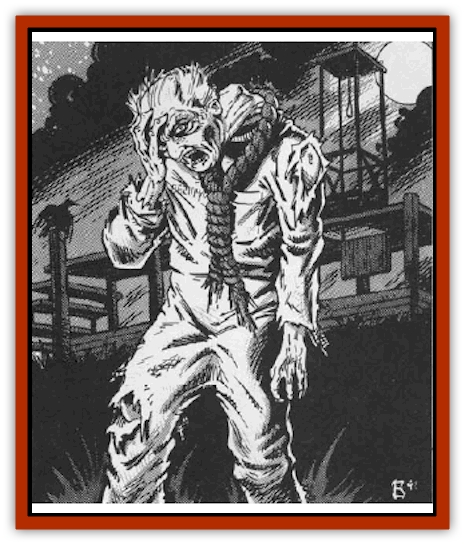

# Valpurgeist

| Statistic | **Valpurgeist** |
| --- | --- |
| **Activity Cycle:** | Any |
| **Alignment:** | Chaotic evil |
| **Armor Class:** | 4 |
| **Climate/Terrain:** | Any land |
| **Damage/Attack:** | 1d6/1d6 |
| **Diet:** | None |
| **Frequency:** | Very rare |
| **Hit Dice:** | 5 |
| **Intelligence:** | Average (8-10) |
| **Magic Resistance:** | Nil |
| **Morale:** | Average (8-10) |
| **Movement:** | 9 |
| **No. Appearing:** | 1 |
| **No. of Attacks:** | 2 |
| **Organization:** | Solitary |
| **Size:** | M (6' tall) |
| **Special Attacks:** | Strangulation |
| **Special Defenses:** | See below |
| **THAC0:** | 15 |
| **Treasure:** | Nil |
| **XP Value:** | 650 |

The valpurgeist, or *hanged man*, is an undead creature that is sometimes manifested when an innocent man or woman is wrongly hanged for a crime. Unable to prove its innocence in life, it returns after death to claim the lives of those who sent it to the gallows.

Valpurgeists are clearly human in appearance, although they are far from able to pass as normal men. Their necks have clearly been broken, causing the head to hang at an awkward angle and flop about loosely as the creature moves. Further, the skin of the creature has taken on the pallor of the dead and an odor of decay hangs heavy in the air around the thing.

The valpurgeist cannot speak and seems unwilling or unable to listen to the words of others. Attempts at communication that do not involve magic (a *speak with dead* spell, for example) are doomed to failure. Those who do manage to speak with the creature will find that it is wholly obsessed with exacting revenge and destroying those who have wronged it.

**Combat:** The valpurgeist attacks with its two powerful fists. The essence of darkness that has animated it has given it incredible strength, so that each blow it lands inflicts 1d6 points of damage.

If both of its fists strike the target, it is assumed to have gotten a solid grip on the throat of its victim and will begin to strangle him or her. Escaping from the creature's grip requires a successful roll to bend bars.

Beginning on the round after its vice-like grip has locked onto its victim, the creature automatically inflicts 1d8 points of damage without making another attack roll. Further, the victim must make a saving throw, vs. paralysis or fall unconscious from lack of oxygen. Those who do fall unconscious will die on the next round, suffering a crushed windpipe and broken neck, if they are not freed by a third party. The only ways to free a character who is being strangled from the deadly grip of the valpurgeist are to pry the choking hands from their throat (a roll to bend bars is required) or distract the monster from its current victim. The latter method is very difficult, for there is but a 1% chance per point of damage inflicted that the monster will release someone in its grip and attack another character. If it does release its hold, it will always attack the person who distracted it.

Cutting the arms off of the monster will not cause them to release their victim, for their mucsles will remain locked and the hands will continue to strangle the character.

Valpurgeists can be turned as if they were ghasts and suffer 1d4 points of damage per vial of holy water splashed on them. They are immune to *sleep*, *charm*, *hold*, and similar spells, but can be affected normally by all spells that are intended for use against undead.

A valpurgeist can be freed of its burden of guilt (and thus allowed to rest in peace) if evidence can be found that will prove the being's innocence in the case for which it was hanged. If the monster's spirit is not appeased in this way, it will return to plague its accusers time and time again, no matter what steps are taken to destroy it or its physical form. Thus, even if the entire body of the valpurgeist is destroyed with acid, it will reassemble itself and begin its quest for vengeance anew. Returning to life after being destroyed requires 2d4 days if the body is intact or twice that if the body is destroyed in some way.

**Habitat/Society:** Valpurgeists are lonely souls who have felt the cold injustice of a world that would not believe their pleas of innocence. Because of this, they will have no kinship with any living thing in their afterlife.

While the valpurgeist is no more or less intelligent than he was in life, all of his mental faculties are now centered on revenge. Thus, he will work methodically, and often quite shrewdly, to arrange for the demise of those he considers his enemies.

Even the death of all those involved with the creature's trial and execution cannot free the spirit from its agony. Once it has slain all those who wronged it, the creature simply begins to widen the scope of its evil. The only way to free the world of a valpurgeist's cursed presence is to prove its innocence, thus removing the anger that taints its spirit.

**Ecology:** Like all undead, valpurgeists have no place in the natural world. They are simply products of evil and darkness.

---
## Discovery & Documentation

**Source Publication:** MC10 Ravenloft Appendix I (1989)
**Campaign Setting:** Planescape
**Author(s):** William W. Connors

### Other Creatures Found in This Source Book
   * [[Bastellus|Bastellus]]
   * [[Bat_Ravenloft|Bat (Ravenloft)]]
   * [[Bowlyn|Bowlyn]]
   * [[Broken_One|Broken One]]
   * [[Bussengeist|Bussengeist]]
   * [[Darkling|Darkling]]
   * [[Doom_Guard|Doom Guard]]
   * [[Doppelganger_Plant|Doppelganger Plant]]
   * [[Elemental_Ravenloft|Elemental (Ravenloft)]]
   * [[Ermordenung|Ermordenung]]
   * [[Ghoul_Lord|Ghoul Lord]]
   * [[Goblyn|Goblyn]]
   * [[Golem_III|Golem III]]
   * [[Golem_IV|Golem IV]]
   * [[Golem_Ravenloft|Golem (Ravenloft)]]
   * [[Grim_Reaper|Grim Reaper]]
   * [[Human_Abber_Nomad|Human, Abber Nomad]]
   * [[Human_Ravenloft|Human (Ravenloft)]]
   * [[Imp_Assassin|Imp, Assassin]]
   * [[Impersonator|Impersonator]]
   * [[Lycanthrope_Werebat|Lycanthrope, Werebat]]
   * [[Lycanthrope_Wereraven|Lycanthrope, Wereraven]]
   * [[Mist_Horror|Mist Horror]]
   * [[Mummy_Greater|Mummy, Greater]]
   * [[Quevari|Quevari]]
   * [[Quickwood|Quickwood]]
   * [[Ravenkin|Ravenkin]]
   * [[Reaver|Reaver]]
   * [[Scarecrow_Ravenloft|Scarecrow (Ravenloft)]]
   * [[Shadow_Fiend|Shadow Fiend]]
   * [[Skeleton_Giant|Skeleton, Giant]]
   * [[Strahd's_Skeletal_Steed|Strahd's Skeletal Steed]]
   * [[Treant_Evil|Treant, Evil]]
   * [[Treant_Undead|Treant, Undead]]
   * [[Vampire_Dwarf|Vampire, Dwarf]]
   * [[Vampire_Elf|Vampire, Elf]]
   * [[Vampire_Gnome|Vampire, Gnome]]
   * [[Vampire_Halfling|Vampire, Halfling]]
   * [[Vampire_General_Information|Vampire, General Information]]
   * [[Vampire_Kender|Vampire, Kender]]
   * [[Vampyre|Vampyre]]
   * [[Widow_Red|Widow, Red]]
   * [[Wolfwere_Greater|Wolfwere, Greater]]
   * [[Zombie_Lord|Zombie Lord]]
