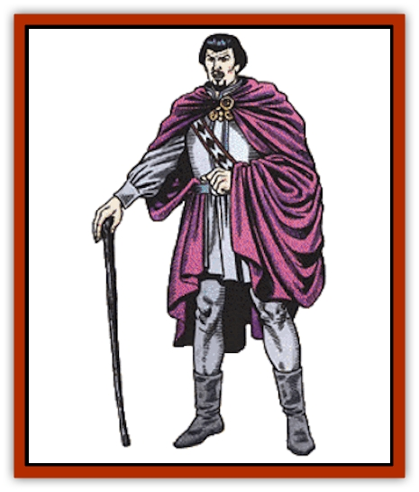
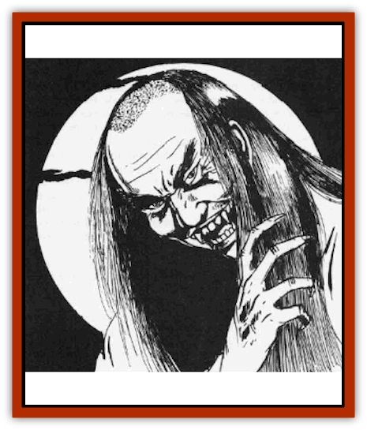

# Vampire

| Statistic | **Vampire** |
| --- | --- |
| **Activity Cycle:** | Night |
| **Alignment:** | Chaotic evil |
| **Armor Class:** | 1 |
| **Climate/Terrain:** | Any land |
| **Damage/Attack:** | 5-10 |
| **Diet:** | Special |
| **Frequency:** | Rare |
| **Hit Dice:** | 8+3 |
| **Intelligence:** | Exceptional (15-16) |
| **Magic Resistance:** | See below |
| **Morale:** | Champion (16) |
| **Movement:** | 12, Fl 18 (C) |
| **No. Appearing:** | 1-4 |
| **No. of Attacks:** | 1 |
| **Organization:** | Solitary |
| **Size:** | M (5½-6½') |
| **Special Attacks:** | Energy drain |
| **Special Defenses:** | +1 or better magical weapon to hit |
| **THAC0:** | 11 |
| **Treasure:** | F |
| **XP Value:** | Western: 8,000 / Eastern: 9,000 |

Of all the chaotic evil undead creatures that stalk the world, none is more dreadful than the [[Vampire_General_Information|vampire]]. Moving silently through the night, vampires prey upon the living without mercy or compassion. Unless deep underground, they must return to the coffins in which they pass the daylight hours, and even in the former case they must occasionally return to such to rest, for their power is renewed by contact with soil from their graves.

One aspect that makes the vampire far more fearful than many of its undead kindred is its appearance. Unlike other undead creatures, the vampire can easily pass among normal men without drawing attention to itself for, although its facial features are sharp and feral, they do not seem inhuman. In many cases, a vampire's true nature is revealed only when it attacks.

There are ways in which a vampire may be detected by the careful observer, however. Vampires cast no reflection in a glass, cast no shadows, and move in complete silence.

**Combat:** When engaging in combat, vampires are savage and fearsome opponents. They are physically very powerful, with a Strength score of 18/76, receiving a bonus of +2 to hit and +4 to damage. The crushing blows of a vampire's attack are so fierce that they inflict 5-10 points of damage.

The gaze of a vampire is one of its most powerful and dangerous weapons. Any person who allows the vampire to look into his eyes will be affected as if by a *charm person* spell. Due to the power of this enchantment, a -2 is applied to the victim's saving throw vs. spell. In this manner, vampires are often able to pass posted sentries and surprise their chosen victims.

Like all undead creatures, vampires exist in both the Positive Material and Negative Material planes at the same time. Their powerful negative essence allows them to drain two life energy levels from anyone they strike. If the vampire is making use of some form of weapon in the attack, it cannot employ this power.

Weapons of less than +1 enchantment pass through vampires without harming them in any way. Even if attacked with and harmed by magical weapons, vampires regenerate 3 hit points per round. If reduced to zero hit points, a vampire is not destroyed, but is forced to assume gaseous form. Once in this state, it will attempt to flee and return to its coffin where, after eight hours of rest, it regains its corporeal form. If the defeated vampire is unable to reach its coffin within 12 turns, however, its essence breaks up and the creature is truly destroyed.

*Sleep*, *charm*, and *hold* spells do not affect vampires. Similarly, they are unharmed by poisons and immune to paralysis. Spells that are based on cold or electricity cause only half damage.

At will, vampires are able to disperse their bodies into clouds of elemental vapor and assume *gaseous form*. In this state, they are all but immune to attack and can escape from almost any confinement. In addition, vampires can *shape change* so as to take on the form of a large [[Bat|bat]] (hence the flying movement rate given above).

Vampires can summon lesser creatures for aid. In a subterranean environment, they will typically call forth a swarm of 10-100 [[Rat|rats]] or bats. In the case of the latter, these do not physically attack but serve to confuse and obscure the vision of the vampire's foes. In the wilderness, a vampire will normally call upon 3-18 [[Wolf|wolves]] for assistance. In all cases, the summoned animals arrive in 2-12 rounds.

At will, a vampire can use a *spider climb* ability and scale sheer surfaces. Often, they will employ this power to gain access to rooms on upper floors without alerting those on watch downstairs. This power also permits the vampire to seek refuge in places which are all but beyond the reach of mortal men.

Despite the great powers which vampires obviously possess, they are not without weaknesses of their own. The odor of strong garlic repels them and they will not approach it. Further, they will recoil from the face of a mirror or lawful good holy symbol if either of these is presented to them with courage and conviction. It is important to understand, however, that this will not actually harm the vampire in any way nor drive it off. Garlic will prevent the creature from attacking or entering the area, while mirrors and holy symbols force the vampire to find some means of removing the offending object before it can be bypassed. In most cases, the vampire will seek to overcome these hazards with the aid of its minions. For example, a charmed person might be called upon to attack someone who is holding the vampire at bay with a holy symbol. Another important point to keep in mind is that a lawful good holy symbol will affect the vampire regardless of the vampire's original religious background. Vampires which are splashed with a vial of holy water or struck with lawful good holy symbols are burned by them, suffering 2-7 points of damage.

Just as vampires can be kept at bay, so too can they be slain by those who have the knowledge to do so. Any vampire which is exposed to direct sunlight is instantly rendered powerless and, after one round, utterly annihilated. If the vampire can be immersed in running water, it loses one-third of its hit points each round, until destroyed on the third round. Last, a vampire can be killed by having a wooden stake driven through its heart. In this case, however, the creature can be restored simply by removing the stake if further measures are not taken to ensure the fate of the vampire. In order for it to be completely destroyed, the vampire's head must be cut off and its mouth stuffed with holy wafers (or their equivalent).

In addition to its aversion to items like garlic and holy symbols, the vampire acts under many other limitations. One of the most powerful of these is the creature's inability to enter a home without being first invited to do so by a resident of the dwelling. This does not apply to public buildings and places of business which, by their very nature, extend an "invitation" to all. Once a vampire has been invited to enter a residence, it may come and go freely afterward. A common manner for obtaining permission to enter a home is the use of the vampire's gaze to *charm* a servant or other inhabitant.

Any human or humanoid creature slain by the life energy drain of a vampire is doomed to become a vampire himself. Thus, those who would hunt these lords of the undead must be very careful lest they find themselves condemned to a fate far worse than death. The transformation takes place one day after the burial of the creature. Those who are not actually buried, however, do not become undead and it is thus traditional that the bodies of a vampire's victims be burned or similarly destroyed. Once they become undead, the new vampire is under the complete control of its killer. If that vampire is destroyed, the controlled undead are freed from its power and become self-willed creatures.

In most cases, vampires do not lose the abilities and knowledge which they had in life when they become undead. Thus, it is possible for a vampire to have the powers of, for example, a wizard, thief, or even priest. In all cases, of course, the new vampire becomes chaotic evil.

**Habitat/Society:** Vampires live in areas of death and desolation where they will not be reminded of the lives they have left behind. Ruined castles or chapels and large cemeteries are popular lairs for them, as are sites of great tragedies or battles. Vampires often feel a strong attachment to specific areas with some morbid significance, like the grave of a suicide or the site of a murder.

When deciding on a course of action or planning a campaign, vampires move very slowly and meticulously. It is not uncommon for a vampire to undertake some scheme which may take decades or even centuries to reach its conclusion. Because of the curse of immortality that has fallen upon them, they feel that time is always on their side and will often defeat foes who might otherwise overcome them; the vampire can simply go into hiding for a few decades until the passing of the years brings down its enemies.

Vampires are normally solitary creatures. When they are found in the company of others of their kind, the group will certainly consist of a single vampire lord and a small group of vampires which it has created to do its bidding. In this way, the vampire can exert its power over a greater range without running the risk of exposing itself to attack by would-be heroes.

In general, vampires feel only contempt for the world and its inhabitants. Denied the pleasures of a true life, they have become dark and twisted creatures bent on revenge and terror. When a vampire creates another of its kind, it considers the new creature a mere tool. The minion will be sent on missions which the vampire feels may be too dangerous or unimportant for its personal attention. If the need arises, these pawns will gladly be sacrificed to protect or further the ends of their master.

**Ecology:** The vampire has no place in the world of living creatures. It is a thing of darkness that exists only to bring about evil and chaos. Almost without exception, the vampire is feared and hated by those who dwell in the regions in which it chooses to make its home. The vampire's unnatural presence is all-pervasive and will cause [[Dog|dogs]] and similar animals to raise a cry of alarm at the presence of the creature.

Vampires sustain themselves by draining the life force from living creatures. Unless they have a specific need to create additional minions, however, they are careful to avoid killing those they attack. In cases where the death of a victim is desired, the vampire will take care to see that the body is destroyed and thus will not rise as an undead.

Vampires are divided into age categories. Essentially, a vampire's power grows as it ages - the creature gains new abilities that it did not previously have and becomes less susceptible. In short, the older a vampire becomes, the more formidable a foe it becomes. Each age category has a title associated with it (ages refer to the number of years the creature has been a vampire).

These titles are more of an academic interest than any practical value, as one would not normally refer to vampires by any of the above titles. For example, Strahd von Zarovich falls into the "ancient" category, but one who calls him "Ancient Strahd", rather than "Lord Strahd", will not live long to rue to the error.

| Age Category | Fledgling | Mature | Old | Very Old | Ancient | Eminent | Patriarch |
| --- | --- | --- | --- | --- | --- | --- | --- |
| Age (in Years) | 0-99 | 100-199 | 200-299 | 300-399 | 400-499 | 500-999 | 1,000 or more |
| Hit Dice* | 8+3 | 9+3 | 10+2 | 11+1 | 12 | 13 | 14 |
| Str** | 18/76 | 18/91 | 18/00 | 18/00 | 19 | 20 | 21 |
| Int** | 16 | 16 | 17 | 18 | 18 | 19 | 20 |
| Dex** | 16 | 17 | 17 | 18 | 18 | 19 | 20 |
| Cha** | 14 | 15 | 16 | 17 | 18 | 18 | 19 |
| Movement&dagger; | 12 | 15 | 15 | 18 | 18 | 21 | 24 |
| Save vs. charm&dagger;&dagger; | -2 | -2 | -3 | -3 | -4 (voice) | -4 (voice) | -5 (will) |
| Weapon needed to hit | +1 | +1 | +2 | +2 | +3 | +3 | +4 |
| Regenerated hp/round | 3 | 3 | 3 | 4 | 4 | 4 | 5 |
| Magic resistance | nil | 5% | 10% | 15% | 20% | 25% | 30% |
| Rnds of sunlight withstood&ddagger; | 0 | 1 | 5 | 10 | 3 turns | 1 hour | immune |
| Immunity&ddagger;&ddagger; | - | garlic | mirrors | - | holy symbols | running water | sunlight |

* Vampires with 10 HD are turned as ghosts, those with 11+ HD are turned as liches.
** These values are minima. If the vampire had greater ability scores prior to becoming undead, the higher scores are retained. Vampires, regardless of age, have a Constitution score of at least 18.
&dagger; Vampires fly (in bat form) at a rate of 18 (C).
&dagger;&dagger; When vampires charm with their voices, the listener does not suffer the negative penalty to his or her saving throw.
&ddagger; Despite any resistance or immunity to sunlight, the vampire still loathes it and will seek shade or take cover if possible.
&ddagger;&ddagger; These are cumulative with age; vampires immune to holy symbols are *not* immune to being turned.

**Eastern Vampire**

  [[Vampire_Oriental|This breed of vampire]] is, if anything, even more frightful than its western cousin. Although they share many of the western vampire's strengths and weaknesses, they have the ability to fade from sight at will. Once they have become *invisible*, they receive all of the normal bonuses which such a state normally bestows, including being attacked at -4. These monsters are unable to *charm* their victims, however, and cannot assume *gaseous form* at will as western vampires can.

---
## Discovery & Documentation

**Source Publication:** MC1 Volume I (w/binder #1) (1991)
**Campaign Setting:** Advanced Dungeons & Dragons 2nd Edition
**Author(s):** Jay Batista, Scott Bennie, Grant Boucher, William W. Connors, Steve Gilbert, Heike Kubasch, James Lowder, David Edward Martin, Bruce Nesmith, Jean Rabe, Rick Swan, John J. Terra, Gary L. Thomas

### Other Creatures Found in This Source Book
   * [[Bat|Bat]]
   * [[Bear|Bear]]
   * [[Behir|Behir]]
   * [[Boar|Boar]]
   * [[Bookworm|Bookworm]]
   * [[Brownie|Brownie]]
   * [[Bugbear|Bugbear]]
   * [[Carrion_Crawler|Carrion Crawler]]
   * [[Cat_Great|Cat, Great]]
   * [[Catoblepas|Catoblepas]]
   * [[Dragon_General_Information|Dragon, General Information]]
   * [[Dragonfish|Dragonfish]]
   * [[Elemental_Air_Kin_Aerial_Servant|Elemental, Air Kin, Aerial Servant]]
   * [[Elemental_Earth_Kin_Sandling|Elemental, Earth Kin, Sandling]]
   * [[Elephant|Elephant]]
   * [[Gnoll|Gnoll]]
   * [[Hobgoblin|Hobgoblin]]
   * [[Homunculus|Homunculus]]
   * [[Hornet_Giant|Hornet, Giant]]
   * [[Horse|Horse]]
   * [[Hyena|Hyena]]
   * [[Jackal|Jackal]]
   * [[Jackalwere|Jackalwere]]
   * [[Korred|Korred]]
   * [[Lich|Lich]]
   * [[Lizard|Lizard]]
   * [[Lizard_Man|Lizard Man]]
   * [[Lycanthrope_General_Information|Lycanthrope, General Information]]
   * [[Lycanthrope_Seawolf|Lycanthrope, Seawolf]]
   * [[Lycanthrope_Werebear|Lycanthrope, Werebear]]
   * [[Lycanthrope_Weretiger|Lycanthrope, Weretiger]]
   * [[Lycanthrope_Werewolf|Lycanthrope, Werewolf]]
   * [[Manticore|Manticore]]
   * [[Medusa|Medusa]]
   * [[Mind_Flayer|Mind Flayer]]
   * [[Minotaur|Minotaur]]
   * [[Mudman|Mudman]]
   * [[Mummy|Mummy]]
   * [[Nixie|Nixie]]
   * [[Nymph|Nymph]]
   * [[Ogre|Ogre]]
   * [[Ooze_Slime_Jelly_I|Ooze/Slime/Jelly I]]
   * [[Ooze_Slime_Jelly_II|Ooze/Slime/Jelly II]]
   * [[Orc|Orc]]
   * [[Owl|Owl]]
   * [[Owlbear_I|Owlbear I]]
   * [[Pegasus|Pegasus]]
   * [[Piercer|Piercer]]
   * [[Pudding_Deadly|Pudding, Deadly]]
   * [[Rakshasa|Rakshasa]]
   * [[Rat|Rat]]
   * [[Ray|Ray]]
   * [[Remorhaz|Remorhaz]]
   * [[Satyr|Satyr]]
   * [[Scorpion|Scorpion]]
   * [[Selkie|Selkie]]
   * [[Shadow|Shadow]]
   * [[Skeleton|Skeleton]]
   * [[Skunk|Skunk]]
   * [[Snake|Snake]]
   * [[Spectre|Spectre]]
   * [[Spider|Spider]]
   * [[Sprite|Sprite]]
   * [[Toad_Giant|Toad, Giant]]
   * [[Treant|Treant]]
   * [[Troll|Troll]]
   * [[Umber_Hulk|Umber Hulk]]
   * [[Unicorn|Unicorn]]
   * [[Wight|Wight]]
   * [[Will_O'Wisp|Will O'Wisp]]
   * [[Wolf|Wolf]]
   * [[Wolfwere|Wolfwere]]
   * [[Wraith|Wraith]]
   * [[Wyvern|Wyvern]]
   * [[Yeti|Yeti]]
   * [[Yuan-ti|Yuan-ti]]
   * [[Zombie|Zombie]]
