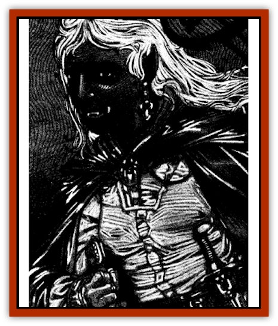

# Vampire - Drow

| Statistic | **Vampire, Drow** |
| --- | --- |
| **Activity Cycle:** | Night |
| **Alignment:** | Chaotic evil |
| **Armor Class:** | 0 |
| **Climate/Terrain:** | Subterranean |
| **Damage/Attack:** | 1d4+4/1d4+4 |
| **Diet:** | Special |
| **Frequency:** | Very rare |
| **Hit Dice:** | 8+3 |
| **Intelligence:** | Exceptional (15-16) |
| **Magic Resistance:** | 25% |
| **Morale:** | Elite (13-14) |
| **Movement:** | 12 |
| **No. Appearing:** | 1 |
| **No. of Attacks:** | 1 or 2 |
| **Organization:** | Solitary |
| **Size:** | M (5' tall) |
| **Special Attacks:** | Spells, cause awe, drain fluids, poison, and see below |
| **Special Defenses:** | Spells, +1 or better weapon to hit, immune to poison, regeneration, and see below |
| **THAC0:** | 13 |
| **Treasure:** | I&times;2 |
| **XP Value:** | 7,000 (+1,000 per 100 years of age) |

Unlike most races, the [[Elf_Drow|drow]] consider it an honor to be granted the *Kiss of Lolth*, as they refer to vampirism. The [[Elf_Drow|dark elves]] view [[Vampire_General_Information|vampires]] with both awe and trepidation, believing undeath to be a state of being that brings an elf closer to a true understanding of the powers that surge through the universe. Such knowledge brings immense power, which the dark elves both crave and respect.

The vast majority of drew vampires are female, although a such a creature occasionally honors a male with the transformation. Drow vampires are almost identical in appearance to the living members of their race. They are of slight build, approximately 5' in height with long, pale hair and dusky skin. The features of such vampires are almost radiantly beautiful in their refinement. Even the vampires' skin emanates a faint, pearlescent glow. This radiance can only be seen out of the corner of the viewer's eye and its near-visibility is often distracting. Drow vampires normally dress in luxurious, but somber, garments and carry both an adamantine dagger and short sword.

Drow vampires retain their knowledge of the languages of intelligent underworld creatures as well as their own language of gestures and body movements. In addition, these vampires can communicate with all animal species who make their home in the underworld.

**Combat:** Drow vampires, like their living counterparts, are skilled in battle. These vampires are extraordinarily fond of causing pain and consider battle an art form in which the object is to cause their victims to suffer as much as possible before granting them the release of death. The vampires view each slice of anguish as an offering to Lolth.

The transformation to vampiric form grants the undead drow an 18/76 Strength. This gives the creatures a natural bonus of +2 on all melee attack rolls and +4 to the damage caused by any physical attacks. This bonus is separate from the +2 a drow receives when using its adamantine short sword and dagger. When using these weapons, drow vampires can attack with both weapons in a single round.

As in life, drow vampires can see the heat emitted by living bodies up to 120 feet distant. Similarly, they can detect sliding or shifting walls, stonework traps, or their distance underground five times in six.

Drow vampires retain a measure of their race's innate ability to cast spells. They can cast the following spells once per day: *darkness*, *continual darkness*, *levitate*, *know alignment*, *detect magic*, *dispel magic*, and *suggestion*. They cast these at the 8th level of ability.

Additionally, drow vampires retain a portion of their race's powerful magic resistance. Drow vampires have a 25% resistance to magic. Sages theorize that the magic resistance of drow vampires must lower somewhat in order for the creature to manifest its unlife. However, as the creatures age and their connection to the negative material plane strengthens, their magic resistance begins to increase (see "Habitat/Society" below).

A drow vampire can *cause awe* with its merest gaze. Anyone looking into the vampire's pale eyes must make a saving throw vs. spell. Failure means the character stands awestruck before the vampire for 2d4 melee rounds. Awestruck characters automatically drop anything they are holding. Affected victims will not attack or even approach the drow vampire unless the creature attacks them. As the drow ages it becomes more difficult for victims not to become awestruck by the monster's imperious gaze (see "Habitat/Society").

The dread touch of the vampire drow drains the very fluids from its victim's body. Each successful unarmed melee attack enables the undead drow to drain 1d6+1 hit points from its victim. Each time the vampire uses this hideous attack, the victim permanently loses 1 hit point. Such draining is excruciatingly painful and leaves a small welt where the drow touched its victim's flesh. Only the *heal* spell will remove these angry welts that the drow refer to as *Lolth's caress*. The vampire can absorb any hit points it drains from its victims in this manner, although the creature will never have more than its maximum number of hit points. Any drow brought to 0 hit points by this attack becomes a vampire. Victims of other races merely die in unendurable agony, sacrifices to Lolth and her vampire minion.

A vampire drow can only be hit by weapons of +1 or greater enchantment. Unenchanted weapons pass through the monster as if it were vapor. The monster regenerates 3 hit points per round when in absolute darkness.

If reduced to 0 hit points a vampire drow is not slain. Instead, the monster is forced to take its poisonous vapor form (see below). If the drow cannot reach the safety of its stony tomb within 12 turns the vapors dissipate and the vampire is destroyed. If it does reach its tomb the vampire must rest for eight hours, after which the foul creature is fully restored.

Although a vampire drow is unaffected by holy water, water drawn directly from a waterfall does 2d4 points of damage to the monster. If the creature is held completely within the downpour of a waterfall itself, the vampire will be destroyed when it reaches 0 hit points. Holy symbols have no effect on a vampire drow.

Like all vampires, these monsters are immune to all manner of mind-affecting spells. These include, but are not limited to, *sleep*, *charm*, and *hold*. They are also immune to poisons and cannot be suffocated or drowned. Spells that depend upon cold or electricity do only half damage to drow vampires.

Of all vampires, the drow are the most adversely affected by light. A vampire drow will almost never emerge onto the surface of Ravenloft as even one ray of sunlight will instantaneously destroy it. Even moonlight does damage to the monster, doing 2d4 points of damage per round. The 5th level priest spell *moonbeam* does similar damage to the vampire. Starlight does not damage the vampire, but the creature is incapable of regeneration while touched by starshine. Magical illumination, such as *light* or *continual light*, does 1d4 points of damage per round that the vampire is exposed to such illumination. The vampire cannot regenerate under these conditions and will do everything in its power to destroy the light source.

Drow vampires can take the form of [[Spider|giant spiders]]. While in this form, such vampires can control 10d10 Hit Dice of [[Spider|spiders]]. The creatures will arrive within 2d10 rounds of summoning. The exact type of spiders summoned depends on the nature of the spiders in the immediate area. In normal form, drow vampires can control up to four [[Elf_Drow|driders]]. Driders worship vampire drow, seeing the monsters as Lolth's chosen ones.

A drow vampire can change into *poisonous vapors* at will. This ability is similar to a normal vampire's *gaseous form*, save that any creature that breathes in any portion of these vapors must make a saving throw vs. poison with a -2 penalty. Failure means the victim takes 2d6 points of damage. Those who make this saving throw take only half damage from the fumes. While in this form, the vampire can only be hit by weapons of +3 or greater enchantment.

A vampire drow cannot cross a line of salt (even when in vaporous form). The vampire finds pure salt repugnant and can only act indirectly to break such a barrier. For instance, the vampire might summon spiders to scatter the salt or use a *suggestion* spell to get someone else to break the line. If there is even the slightest break in the line the vampire drow can cross with impunity.

Because of their strong connection with the spider goddess, Lolth, vampire drow are more difficult for priests to turn than most undead, being turned as ghosts.

A vampire drow can be immobilized by impaling the monster through the heart with a stake made of rock salt, although this in itself will not permanently destroy the monster. Once the stake is removed, the monster will immediately begin to regenerate. Only exposing the creature to the rays of the sun, immersing it in the pounding torrent of a waterfall, or binding the corpse with cords woven of silver thread, smearing it with oil, and burning the body for at least twelve hours will ensure the vampire's destruction.

**Habitat/Society:** Vampire drow rarely ever leave the deepest levels of their caverns, and it is almost unheard of for such creatures to appear on the surface itself. Instead, these vampires spend years within elaborate underground tombs constructed by drider slaves. Such tombs are exquisite yet disturbing works of art with carvings ranging from twisted masses of limbs to horrifying faces fighting to swallow themselves. These tombs often serve as temples to Lolth as well as homes for the vampires.

Aloof and convinced of its superiority, the vampire drow is perhaps the most reluctant of all undead to create progeny. Only rarely does the drow vampire feel the loneliness of its existence. and it enjoys keeping its place in Lolth's heart as exclusive as possible.

**Ecology:** The vampire drow revels in its great power and ability to cause pain. Such a monster is perhaps one of the cruelest creatures found on the Demiplane of Dread. The monsters are said to particularly enjoy torturing [[Dwarf|dwarves]] and drow of different noble factions than the vampire's own.

The surface of the dark and twisted tomb-homes of drow vampire are often coated with a contact poison that burns fiercely, causing much pain but doing only 1 point of damage per dose. Drider are known to purposely poison themselves with this substance to show their loyalty to Lolth and her vampire servant.

Vampire drow truly believe themselves the favored of Lolth. They occasionally speak with Lolth's priestesses, but otherwise remain aloof from drow society save when they wish a new victim to torture for their own perverse amusement.

As the centuries pass, the vampire grows more and more powerful. The following chart details this advancement:

| Age | HD | Drain | Attack | Awe | MR |
| --- | --- | --- | --- | --- | --- |
| 0-99 | 8+3 | +1 | +1 | 0 | 25% |
| 100-199 | 9+3 | +1 | +1 | -1 | 30% |
| 200-299 | 10 | +2 | +1 | -1 | 35% |
| 300-399 | 11 | +2 | +2 | -2 | 40% |
| 400-499 | 12 | +3 | +2 | -2 | 45% |
| 500+ | 13 | +4 | +2 | -3 | 50% |

*HD* indicates the number of Hit Dice a vampire has at a given age.
*Drain* indicates the amount of hit points worth of fluid the vampire can drain. At 200, the vampire drains 3-8 (1d6+2).
*Attack* indicates the level of enchantment necessary for a weapon to hit the vampire.
*Awe* shows the modifier to the victim's saving throw vs. the vampire's awe.
*MR* indicates the vampire's level of magic resistance.

---
## Discovery & Documentation

**Source Publication:** Ravenloft Appendix III (1991)
**Campaign Setting:** Ravenloft
**Author(s):** Kirk Botulla

### Other Creatures Found in This Source Book
   * [[Akikage|Akikage]]
   * [[Animator_Common|Animator, Common]]
   * [[Animator_Greater|Animator, Greater]]
   * [[Animator_Minor|Animator, Minor]]
   * [[Animator_General_Information|Animator, General Information]]
   * [[Bakhna_Rakhna|Bakhna Rakhna]]
   * [[Baobhan_Sith|Baobhan Sith]]
   * [[Beetle_Scarab|Beetle, Scarab]]
   * [[Boneless|Boneless]]
   * [[Boowray|Boowray]]
   * [[Bruja|Bruja]]
   * [[Carrionette|Carrionette]]
   * [[Carrion_Stalker|Carrion Stalker]]
   * [[Cat_Midnight|Cat, Midnight]]
   * [[Cat_Skeletal|Cat, Skeletal]]
   * [[Cloaker_Resplendent|Cloaker, Resplendent]]
   * [[Cloaker_Shadow|Cloaker, Shadow]]
   * [[Cloaker_Undead|Cloaker, Undead]]
   * [[Corpse_Candle|Corpse Candle]]
   * [[Death's_Head_Tree|Death's Head Tree]]
   * [[Doppelganger_Ravenloft|Doppelganger (Ravenloft)]]
   * [[Familiar_Pseudo-|Familiar, Pseudo-]]
   * [[Familiar_Undead|Familiar, Undead]]
   * [[Feathered_Serpent|Feathered Serpent]]
   * [[Fenhound|Fenhound]]
   * [[Figurine_Ceramic|Figurine, Ceramic]]
   * [[Figurine_Crystal|Figurine, Crystal]]
   * [[Figurine_Ivory|Figurine, Ivory]]
   * [[Figurine_Obsidian|Figurine, Obsidian]]
   * [[Figurine_Porcelain|Figurine, Porcelain]]
   * [[Figurine_General_Information|Figurine, General Information]]
   * [[Fleas_of_Madness|Fleas of Madness]]
   * [[Furies|Furies]]
   * [[Geist|Geist]]
   * [[Ghost_Animal|Ghost, Animal]]
   * [[Golem_Flesh_Ravenloft|Golem, Flesh (Ravenloft)]]
   * [[Golem_Mist_Ravenloft|Golem, Mist (Ravenloft)]]
   * [[Golem_Wax_Ravenloft|Golem, Wax (Ravenloft)]]
   * [[Gremishka|Gremishka]]
   * [[Hag_Spectral|Hag, Spectral]]
   * [[Head_Hunter|Head Hunter]]
   * [[Hearth_Fiend|Hearth Fiend]]
   * [[Hebi-No-Onna|Hebi-No-Onna]]
   * [[Hound_Phantom|Hound, Phantom]]
   * [[Hound_Skeletal|Hound, Skeletal]]
   * [[Imp_Wishing|Imp, Wishing]]
   * [[Ivy_Crawling|Ivy, Crawling]]
   * [[Jack_Frost|Jack Frost]]
   * [[Jolly_Roger|Jolly Roger]]
   * [[Kizoku|Kizoku]]
   * [[Lashweed|Lashweed]]
   * [[Leech_Magical|Leech, Magical]]
   * [[Leech_Psionic|Leech, Psionic]]
   * [[Lich_Defiler|Lich, Defiler]]
   * [[Lich_Drow|Lich, Drow]]
   * [[Lich_Elemental|Lich, Elemental]]
   * [[Lich_Psionic|Lich, Psionic]]
   * [[Living_Tattoo|Living Tattoo]]
   * [[Lycanthrope_Loup-garou|Lycanthrope, Loup-garou]]
   * [[Lycanthrope_Werejackal|Lycanthrope, Werejackal]]
   * [[Lycanthrope_Werejaguar_Ravenloft|Lycanthrope, Werejaguar (Ravenloft)]]
   * [[Lycanthrope_Wereleopard|Lycanthrope, Wereleopard]]
   * [[Lycanthrope_Wereray|Lycanthrope, Wereray]]
   * [[Mist_Ferryman|Mist Ferryman]]
   * [[Moor_Man|Moor Man]]
   * [[Obedient|Obedient]]
   * [[Odem|Odem]]
   * [[Paka|Paka]]
   * [[Plant_Blood_Rose|Plant, Blood Rose]]
   * [[Plant_Fearweed|Plant, Fearweed]]
   * [[Radiant_Spirit|Radiant Spirit]]
   * [[Recluse|Recluse]]
   * [[Remnant_Aquatic|Remnant, Aquatic]]
   * [[Rushlight|Rushlight]]
   * [[Sea_Spawn_Master|Sea Spawn, Master]]
   * [[Sea_Spawn_Minion|Sea Spawn, Minion]]
   * [[Shadow_Asp|Shadow Asp]]
   * [[Shattered_Brethren|Shattered Brethren]]
   * [[Skeleton_Archer|Skeleton, Archer]]
   * [[Skeleton_Insectoid|Skeleton, Insectoid]]
   * [[Skin_Thief|Skin Thief]]
   * [[Spirit_Psionic|Spirit, Psionic]]
   * [[Strahd_Skeleton|Strahd Skeleton]]
   * [[Strahd_Zombie|Strahd Zombie]]
   * [[Unicorn_Shadow|Unicorn, Shadow]]
   * [[Vampire_Nosferatu|Vampire, Nosferatu]]
   * [[Vampire_Oriental|Vampire, Oriental]]
   * [[Virus_General_Information|Virus, General Information]]
   * [[Virus_I|Virus I]]
   * [[Virus_II|Virus II]]
   * [[Virus_III|Virus III]]
   * [[Vorlog|Vorlog]]
   * [[Will_O'Dawn|Will O'Dawn]]
   * [[Will_O'Deep|Will O'Deep]]
   * [[Will_O'Mist|Will O'Mist]]
   * [[Will_O'Sea|Will O'Sea]]
   * [[Zombie_Cannibal|Zombie, Cannibal]]
   * [[Zombie_Desert|Zombie, Desert]]
   * [[Zombie_Wolf|Zombie Wolf]]
   * [[Zombie_Fog|Zombie Fog]]
