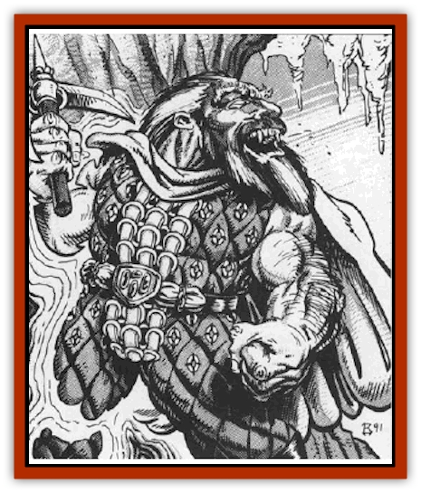

# Vampire - Dwarf

| Statistic | **Vampire, Dwarf** |
| --- | --- |
| **Activity Cycle:** | Any |
| **Alignment:** | Neutral evil |
| **Armor Class:** | 0 |
| **Climate/Terrain:** | Any subterranean |
| **Damage/Attack:** | 1d4 or by weapon (+Str bonus) |
| **Diet:** | Special |
| **Frequency:** | Very rare |
| **Hit Dice:** | 9+3 |
| **Intelligence:** | Very (11-12) |
| **Magic Resistance:** | Nil |
| **Morale:** | Elite (13-14) |
| **Movement:** | 9 |
| **No. Appearing:** | 1 |
| **No. of Attacks:** | 1 |
| **Organization:** | Solitary |
| **Size:** | S (4' tall) |
| **Special Attacks:** | See below |
| **Special Defenses:** | See below |
| **THAC0:** | 11 |
| **Treasure:** | F |
| **XP Value:** | 3,000 (+1,000 per 100 years of age) |

[[Dwarf|Dwarves]] are a long lived race with an intense cultural hatred of the undead and their evil work. They regard death as the just rewards of a warrior and the undead would cheat a hero of his glorious end. For this reason, a dwarven [[Vampire_General_Information|vampire]] is perhaps the most awful of things, for its natural hatred of what it has become leads it to do great acts of evil.

Dwarven vampires, like all vampires, look much as they did in life. They are short and stocky, with long, white or silver beards, and heavy, rounded features. In most cases, they retain the trappings of the profession they held in life; a dwarven vampire who was a warrior would often be found in full armor with a heavy battle axe or war hammer close at hand.

Dwarven vampires retain the knowledge of languages that they had in life. There is no language specific to these creatures save the dwarves tongue that served them before their deaths.

**Combat:** Dwarven vampires retain the courage and vigor that marked them in life. As such, they are deadly warriors who will often battle opponents for the sheer love of combat. Often, they will wield the weapons they loved in life, doing damage based on the type of weapon employed. Further, their status as undead has greatly magnified their physical power in most cases, so that all dwarven vampires are assumed to have a Strength score of 18/76. This gives them a natural bonus of +2 on all melee attack rolls and +4 on all melee damage. Vampire dwarves retain their natural combat advantage (+1 on all attack rolls) when battling [[Orc|orcs]], [[Goblin|goblins]], [[Hobgoblin|hobgoblins]], and so forth. Similarly, large creatures (like [[Ogre|ogres]] and [[Troll|trolls]]) suffer a -4 on their attack rolls against these smaller creatures. This ability exactly matches that presented in the *Player's Handbook*.

The most feared attack mode of these dark creatures, however, is their vitality drain. Each successful unarmed melee attack allows the vampire to drain 2 points of Constitution from its victim. This loss is permanent and will instantly modify the character's hit points and other related scores. Any character reduced to a Constitution score of 0 is instantly slain and will rise again as a vampire (of the appropriate type) in 3 days (see "Ecology").

Dwarven vampires have the natural racial abilities of dwarves: detecting grades, slopes, or newly constructed stonework 5 times in 6, detecting sliding or shifting walls or rooms 4 times in 6, and detecting stonework traps (including pits and deadfalls) or determining their approximate depth underground 3 times in 6.

Like their strength, the natural Constitution and inherent magic resistance of these creatures has also been increased by their contact with the negative material plane. While this gives the vampire a +5 bonus on all saving throws vs. wands, rods, staffs, and spells, it also makes it impossible for them to employ magical items. Being undead, of course, poison has no affect on them at all.

Dwarven vampires do not have the natural *charm* ability of [[Vampire|human vampires]], but are able to strike fear into the hearts of their enemies with but a gaze. In any combat round, the creature may employ this attack on any single foe, requiring them to make a fear check. Failure indicates that they have met the monster's gaze and been filled with supernatural fear and revulsion. Due to the power of this enchantment, the victim suffers a -2 penalty on this check.

While the vampire dwarf had a natural infravision in life, death has rewarded him with a far greater sense of sight. In addition to his normal 60 foot infravision, the vampire dwarf can see in all but absolute darkness as if it were full daylight.

Vampire dwarves are even more resistant to physical and magical attacks than normal vampire. They can be hit only by +2 or better magical weapons, with all others passing harmlessly through them as if they were no more than vapor. Even if struck and harmed by weapons or spells, a vampire dwarf regenerates 4 hit points per round when in any subterranean area. Above ground, they regenerate only 1 point per round. If reduced to zero hit points, a vampire dwarf is not slain, Rather, it is forced to employ its *stone walking* and flee the combat. If it is unable to reach its coffin within 12 turns the vampire merges with the stone around it and is destroyed. If it does reach its coffin, the foul vampire enters it and, after resting for eight hours, is restored to full health and power.

Holy water has no effect on these creatures, but water of a natural spring burns them for 2d4 points of damage per round. Immersion in a pool of water fed wholly by natural springs will utterly destroy the vampire when it reaches zero hit points. Holy symbols will keep the creature at bay, although they will do no damage to it (even if pressed against the vampire's flesh).

Like all other vampires, these creatures are immune to all manner of mind-affecting spells. These include, but are not limited to, *sleep*, *charm*, and *hold*. As undead things, they are immune to any type of poisons or toxins ans cannot be suffocated or drowned. Spells that do damage with cold or electricity do only half damage to the monster, but those employing fire have their normal effect. Unlike most other vampires, dwarven vampires are not harmed by sunlight. They are unable to regenerate when in full sunlight, however, and will go to great lengths to avoid entering it, for they find it painfully bright.

Dwarven vampires cannot assume the forms of [[Wolf|wolves]] or [[Bat|bats]] as some other vampires can, but are able to summon any form of burrowing or subterranean creature to their aid. When they opt to do this, 10-100 (10d10) hit dice worth of such animals will arrive within 2-12 rounds. The exact type of animals called depends on the area in which the vampire is encountered, but each vampire has its favorite type of animal.

Vampire dwarves have the ability to *stonewalk* at will. With this power, they are able to enter and walk through any thickness of stone or earth as if it were nothing more than air. It is not unknown for a vampire dwarf to lurk just beneath the surface of the earth and then spring up to attack those walking above it. The vampire can extend the magical aura of this power to allow it to bring any object it can carry with it when it *stonewalks*. Thus, a dwarves vampire could grab a victim and then employ its *stonewalking* power to sink straight into the earth and escape anyone in pursuit. A dwarven vampire hit with a *dispel magic* spell is unable to *stonewalk* for 2d4 rounds or until they are reduced to zero hit points and forced into a *stonewalking* state. If a character manages to attack the dwarven vampire while it is employing this power, there is no change to the creature's natural defenses or vulnerabilities.

Dwarven vampires cannot cross a line of powdered metal (even if they are *stonewalking*). They can take action to indirectly break the line, summoning [[Rat|rats]] to scamper through it, for example, but the dwarves vampire may never directly affect it. If there is even the slightest break in the line, however, the vampire can move past it with ease.

Dwarven vampires are unable to enter a structure that is not made in some part of stone or earth. Thus, a yeoman's home in the woods built wholly of logs would offer complete protection from the intrusions of a dwarven vampire while a mighty stone castle could be entered with ease.

Dwarven vampires can be turned as if they were normal vampires. As the years pass, however, and their contact with the negative material plane strengthens and, when combined with their own natural resistance to all manner of magics, they become harder and harder to turn away. The most powerful and ancient of these creatures are reported to be almost impossible to drive away, no matter how strong the faith of the turning priest may be.

Killing a vampire dwarf is a difficult proposition at best. The most sure way of ending the creature's dark unlife is to impale it through the heart on a natural stalactite or stalagmite. The body of the vampire can either be forced onto the stone or the stone driven through the body of the creature. Once the vampire has been killed in this way, however, it can be revived simply by removing the impaling object. In order to assure that the creature remains dead, its heart must be cut out, soaked in oil for 3 days, and then set alight. When the last flames of the fire have faded away, so too has the essence of the vampire.

**Habitat/Society:** Dwarven vampires seek out the deepest and darkest of subterranean lairs. They shun all contact with their kind, perhaps out of disgust or embarrassment over what has become of them. The only time they will seek out other dwarves is when they wish to create a vampire companion or are in need of slaves for some evil deed.

Dwarven vampires are the most introverted of all the racial vampire types. They tend to keep to themselves and do not seek to amass power as do human vampires. This does not, however, mean that they will become utterly isolated, however, for they are drawn to feed on the essences of the living.

| Age | HD | Save | To Hit | Fear | Turn |
| --- | --- | --- | --- | --- | --- |
| 0-99 | 10+3 | +5 | +2 | -2 | Vampire |
| 100-199 | 11+3 | +5 | +2 | -2 | Vampire |
| 200-299 | 12+3 | +5 | +3 | -3 | Ghost |
| 300-399 | 13+2 | +6 | +3 | -4 | Ghost |
| 400-499 | 14+1 | +6 | +3 | -5 | Lich |
| 500+ | 15 | +7 | +4 | -5 | Special |

*HD* indicates the number of Hit Dice that the vampire has at a given age.
*Save* shows the bonus to the vampires saving throws versus wands, rods, staffs, and spells.
*To Hit* indicates the magical plus that must be associated with a weapon before it can harm the vampire.
*Fear* indicates the penalty that is applied to the fear check of those targets being attacked by the vampire's gaze attack.
*Turn* indicates the row on the Turning Undead table that is consulted for attempts to drive away these monsters.

**Ecology:** The dwarven vampire is a thing of darkness and evil that has no place in the natural world. It moves about, spreading death and suffering, in an attempt to ease the misery it feels over having been doomed to an eternal life that it detests.

Those dwarves that fall prey to the undead will often become themselves undead. Three days after any character dies from the vampire's vitality draining, they will rise again if certain conditions are met. First, and most importantly, the victim must have been a dwarf. Vampire dwarves who kill [[Elf|elves]] or humans will not create new vampires, for only their own kind can be brought back to unlife by them. Further, the body must be intact. Second, the body must be placed in a stone coffin or sarcophagus and then entombed in some subterranean place. A typical burial service will meet this requirement, while placement in a crypt on the surface will not. Finally, the dwarven vampire must visit the body of its victim on the third night after burial and sprinkle the body with powdered metals. As soon as this is done, the new vampire is born. As with all vampires, it is now a slave to its creator.

Because they realize the torment that transformation into a vampire causes to dwarves, the vampire dwarf is reluctant to create others of its kind. Thus, it does this only when it feels that it need minions to help it carry out its acts of evil.

In many cases, the vampire will kill its minions after they have served it for a few months, freeing them from the suffering that it must endure. Such kindness and compassion seems out of place for these creatures, but many scholars believe that they still retain the last vestiges of their love for other dwarves and cannot bear to spread their suffering to others of their proud race. In most cases, the free-willed dwarven vampires of Ravenloft were created by masters who were slain before they could destroy their minions, leaving their creations to suffer in their place.

---
## Discovery & Documentation

**Source Publication:** MC10 Ravenloft Appendix I (1989)
**Campaign Setting:** Planescape
**Author(s):** William W. Connors

### Other Creatures Found in This Source Book
   * [[Bastellus|Bastellus]]
   * [[Bat_Ravenloft|Bat (Ravenloft)]]
   * [[Bowlyn|Bowlyn]]
   * [[Broken_One|Broken One]]
   * [[Bussengeist|Bussengeist]]
   * [[Darkling|Darkling]]
   * [[Doom_Guard|Doom Guard]]
   * [[Doppelganger_Plant|Doppelganger Plant]]
   * [[Elemental_Ravenloft|Elemental (Ravenloft)]]
   * [[Ermordenung|Ermordenung]]
   * [[Ghoul_Lord|Ghoul Lord]]
   * [[Goblyn|Goblyn]]
   * [[Golem_III|Golem III]]
   * [[Golem_IV|Golem IV]]
   * [[Golem_Ravenloft|Golem (Ravenloft)]]
   * [[Grim_Reaper|Grim Reaper]]
   * [[Human_Abber_Nomad|Human, Abber Nomad]]
   * [[Human_Ravenloft|Human (Ravenloft)]]
   * [[Imp_Assassin|Imp, Assassin]]
   * [[Impersonator|Impersonator]]
   * [[Lycanthrope_Werebat|Lycanthrope, Werebat]]
   * [[Lycanthrope_Wereraven|Lycanthrope, Wereraven]]
   * [[Mist_Horror|Mist Horror]]
   * [[Mummy_Greater|Mummy, Greater]]
   * [[Quevari|Quevari]]
   * [[Quickwood|Quickwood]]
   * [[Ravenkin|Ravenkin]]
   * [[Reaver|Reaver]]
   * [[Scarecrow_Ravenloft|Scarecrow (Ravenloft)]]
   * [[Shadow_Fiend|Shadow Fiend]]
   * [[Skeleton_Giant|Skeleton, Giant]]
   * [[Strahd's_Skeletal_Steed|Strahd's Skeletal Steed]]
   * [[Treant_Evil|Treant, Evil]]
   * [[Treant_Undead|Treant, Undead]]
   * [[Valpurgeist|Valpurgeist]]
   * [[Vampire_Elf|Vampire, Elf]]
   * [[Vampire_Gnome|Vampire, Gnome]]
   * [[Vampire_Halfling|Vampire, Halfling]]
   * [[Vampire_General_Information|Vampire, General Information]]
   * [[Vampire_Kender|Vampire, Kender]]
   * [[Vampyre|Vampyre]]
   * [[Widow_Red|Widow, Red]]
   * [[Wolfwere_Greater|Wolfwere, Greater]]
   * [[Zombie_Lord|Zombie Lord]]
