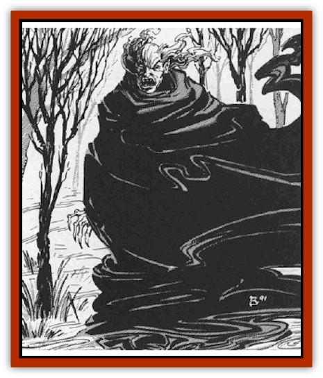

# Vampire - Elf

| Statistic | **Vampire, Elf** |
| --- | --- |
| **Activity Cycle:** | Day |
| **Alignment:** | Lawful evil |
| **Armor Class:** | 2 |
| **Climate/Terrain:** | Non-arctic forest |
| **Damage/Attack:** | 1d4 or by weapon (+Str bonus) |
| **Diet:** | Special |
| **Frequency:** | Very rare |
| **Hit Dice:** | 7+3 |
| **Intelligence:** | Genius (17-18) |
| **Magic Resistance:** | Nil |
| **Morale:** | Champion (15-16) |
| **Movement:** | 15 |
| **No. Appearing:** | 1 |
| **No. of Attacks:** | 1 |
| **Organization:** | Solitary |
| **Size:** | M (5-6' tall) |
| **Special Attacks:** | See below |
| **Special Defenses:** | See below |
| **THAC0:** | 13 |
| **Treasure:** | F |
| **XP Value:** | 3,000 (+1,000 per 100 years of age) |

The [[Elf|elvish]] [[Vampire_General_Information|vampire]] is a tragic creature indeed, for when someone from a race that so loves life and goodness turns to evil and death, the world has lost much. The evil that lurks within the elven vampire is so overwhelming that it forces the creature to transform the vital, living forests around him into places of death and decay.

Unlike all other types of vampire, the elvish variety cannot move among others of its kind freely. The evil that has twisted the creature's spirit has also wrought havoc on its fair features. Thus, elvish vampires appear as twisted and scarred mockeries of this beautiful and graceful race. Because of this, they often dress in dark robes and wear garments designed to hide their appearance from the world.

Elven vampires tend to speak their own language and a handful of others - whatever they had learned in life. It is rumored (and there is much evidence to support this) that they can converse with the animals of the forest and learn from them all that is occurring in their realms.

**Combat:** When they engage in melee combat, elvish vampires are very dangerous opponents. While they do not have the same physical power that vampires of other types might possess, their Strength score of 18/01 is still enough to merit a +1 on all attack rolls and a +3 on all damage rolls. They will often employ weapons in combat, favoring swords and daggers above all other weapons.

Elvish vampires retain the knowledge they had in life, including their racial, class, and magical abilities. Thus, all elvish vampires have an extra +1 bonus on attack rolls made with long swords or bows, can move silently when not in metal armor, and see fully 60 feet with keen infravision. Further, they remain able to detect secret and concealed doors with great skill and often employ this power to gain entrance into places where their prey might be hiding.

Elvish vampires are also master archers, and will employ all manner of bows in combat. Their undead status removes from them the disrupting effects of breathing, muscle fatigue, and heart beats and allows the vampire a +4 bonus on all missile fire attack rolls. The arrows these foul creatures employ are almost always carved from the bones of living, intelligent creatures and may (20% chance) be magical in some way.

Elvish vampires feed by drawing the vital, creative energies out of their prey. Any successful unarmed melee attack allows the vampire to drain 2 Charisma points from its victim. The resulting lack of vibrancy and personal leadership ability is also accompanied by a wicked-looking scar that will never leave the body of the victim. A victim of several blows from such a creature may well become so horribly scarred as to be unrecognizable to all but his closest friends. Any elf or half-elf who dies from the vampire's essence draining attack will become a vampire as described in "Ecology".

Those who see the scarred and twisted face of an elvish vampire must save vs. paralysis or be unable to move until 1d4 rounds after they have lost sight of the vampire. If the saving throw attempt results in a natural die roll of "1", the character is instantly stricken dead. Those who die in this way will not become vampires and may be resurrected normally.

Elven vampires can be struck only by +1 or better magical weapons. All lesser arms will not bite into the creature, but will pass through it as though the monster were not there. Even those weapons that harm the vampire may not be strong enough to destroy it, for the creature regenerates 2 hit points per combat round.

All manner of *sleep*, *charm*, *hold*, or similar magical spells will not affect the vampire. Likewise, the creature cannot be harmed by poisons, toxins, or diseases for it is no longer a living thing. Magical spells that inflict damage with fire or cold will do only half damage to the vampire, but those employing lightning or electricity will do full damage.

A vampire driven to zero hit points is not destroyed, but is forced to flee the combat at once by using its *transport via plants* ability (see below) to enter a nearby plant and escape its enemies. If the vampire cannot do this within 2 combat rounds, its body will crumble into dust and will be forever destroyed.

At will, the elvish vampire can make use of a power almost identical to the *transport via plants* spell. With this power, the vampire may simply walk into any man-sized or larger plant and walk out of another plant (of the same type) anywhere else in the world. In Ravenloft, it cannot use this power to cross domain borders or leave the demiplane itself. As soon as the vampire has used this power, both of the plants involved are killed. Within a week, they will lose all of their leaves and begin to dry out. Within a month, they will be fragile and unsafe to climb, finally collapsing or crumbling under their own weight. Unlike the *transport via plants* spell, the vampire's ability has no chance of error. Otherwise, the spell works just as described in the *Player's Handbook*.

An elvish vampire may, at will, assume the form of a [[Eagle|wild eagle]]. In this guise, it retains all of its natural vampiric powers, immunities, and vulnerabilities, but has the characteristics listed for such creatures in [[Eagle|this entry]]. Once per week it may take on the form of a [[Eagle|giant eagle]], again conforming to the statistics presented in [[Eagle|this entry]].

Elven vampires can command the creatures of the forest to come to their aid when they are in peril. As a rule, they will call upon [[Wolf|wolves]] (3d6), [[Bird|birds]] of prey (5d6), or small mammals like [[Badger|badgers]], [[Porcupine|porcupines]], or the like (6d6). In all cases, these animals arrive within 1d6 turns and will remain with the vampire until dismissed.

Elvish vampires have a number of natural abilities that make them very dangerous in their natural environment. At will, they can *pass without trace* or become *invisible to animals*. They se1dom use the latter power, however, for they can command any creature of the forest to obey them, as described above. Thrice per day they may employ the following spell-like abilities: *entangle*, *warp wood*, *snare*, *spike growth*, and *anti-animal shell*. Once per day they may create a *wall of thorns*, change *sticks to snakes*, or manifest a *giant insect*.

Sunlight does not harm the elvish vampire. In fact, they live their unlives by day and shun the night. As soon as the sun falls behind the horizon, the elvish vampire must be in his coffin. Each round that the monster lingers outside after sunset inflicts 1d4 points of damage, ultimately killing the creature. An elven vampire that dies in this manner is forever dead.

The cruelest card that fate has dealt the elvish vampire is that of its *black thumb*. Any plant that the creature touches withers and dies. In small plants, like flowers, this effect is instantaneous. In larger plants, like shrubs or hedges, it takes about a day for the plant's death to become obvious. The largest of plants, trees and such, will take over a week to die, during which time the elf feels the agony they are experiencing. This curse does not travel through clothing, so elvish vampires wearing boots do not leave a trail of dead footprints in the grass they walk through. They can also handle flowers if they wear gloves. The intimate relationship that the elf had with living things when he was alive, however, has been shattered and this is a psychological blow that drives many elvish vampires over the brink of madness when they are first created.

Although the powers of the elvish vampire are many and varied, they are not without weaknesses. Like all vampires, they can be turned by priests or paladins with the courage to do so. In fact, the elven vampire's link to the negative material plane is not as strong as those of other vampires, causing it to be turned as if it were a spectre instead of a vampire.

Elvish vampires can travel beneath the earth's surface only at great physical risk to themselves. For each round spent in such a setting, the creature must suffer 1d4 points of damage (as if it were moving about after nightfall). Further, the creature cannot regenerate or employ any of its magical abilities when underground. If the vampire dies or is reduced to zero hit points while underground, it is destroyed.

An elven vampire is unaffected by holy water, but can be burned by contact with sap from any deciduous tree. If the sap is fresh (drawn within the last 6 hours) it may be smeared on the vampire with a successful attack roll. As soon as it hits the creature's skin, it causes the vampire extreme pain and inflicts 2d4 points of damage.

Elven vampires cannot be held at bay by mirrors, holy symbols, or garlic, but cannot cross an a line of flower petals. The petals must be fairly fresh-plucked from their plants within the last 24 hours - and the line must be unbroken in order for this defense to be effective. The vampire cannot take direct action to break the line of petals, but can command some animal or other servant to break the line for him.

Destroying an elvish vampire is as difficult as destroying any other vampire, for they are crafty and deadly foes. The surest way to accomplish this feat, however, is to impale the creature with a charcoal stake. In order to be effective, the stake must be driven through the creature's heart with a single blow from a wooden mallet. If the vampire is incapacitated in some way, this does not normally present a problem, but in combat it is almost impossible to accomplish.

While a charcoal stake through the heart will kill the creature, it will rise again as soon as the stake is removed unless the vampire's head is cut off and burned in a fire made of flowers and flowering shrubs. In order to completely destroy the skull and brain, which is vital to the destruction of the vampire, the fire must burn for no less than 24 hours.

**Habitat/Society:** Elvish vampires despise the living world that they have left behind. The sight of thriving woody and blooming flowers that once thrilled them has now been replaced by a hate of all that is vital and fair. The areas they inhabit reflect this, for they will always be groves or forests with diseased trees, dying plants, and infertile soil. No attempt to raise crops or cultivate the land near an elven vampire's lair will be tolerated by the creature.

As time goes by, elvish vampires can become even more powerful than they are initially. The following table lists the modifications associated with the aging of the monster.

| Age | HD | To Hit | Bows | Resistance |
| --- | --- | --- | --- | --- |
| 0-99 | 7+3 | +1 | +4 | Nil |
| 100-199 | 8+2 | +1 | +4 | 5% |
| 200-299 | 9+1 | +1 | +5 | 5% |
| 300-399 | 10 | +2 | +5 | 10% |
| 400-499 | 11 | +2 | +6 | 15% |
| 500+ | 12 | +3 | +6 | 25% |

*HD* is the number of Hit Dice that a vampire has at any given age.
*To Hit* indicates the magical plus that must be associated with a weapon in order for it to harm the vampire.
*Bows* lists the attack roll bonus that the creature gains when it is employing any form of non-crossbow.
*Resistance* lists the magic resistance that the vampire acquires as time goes by.

**Ecology:** Like all undead, the elven vampire is not a part of the living world. It has no place in the land of the living and, knowing this, seeks to corrupt or destroy all that it encounters. Because of this, even the dreaded [[Elf_Drow|Drow]] fear these creatures greatly.

Any elf or half-elf who falls to the essence draining attack of an elven vampire will rise again as an elven vampire so long as the body is intact after three days. If the body has been destroyed or mutilated, the transformation is averted, and the dead character may rest in peace. However, any attempt to revive the slain character (with a *resurrection* spell, for example) has a flat 50% chance of transforming the character into a vampire once the spell is cast.

---
## Discovery & Documentation

**Source Publication:** MC10 Ravenloft Appendix I (1989)
**Campaign Setting:** Planescape
**Author(s):** William W. Connors

### Other Creatures Found in This Source Book
   * [[Bastellus|Bastellus]]
   * [[Bat_Ravenloft|Bat (Ravenloft)]]
   * [[Bowlyn|Bowlyn]]
   * [[Broken_One|Broken One]]
   * [[Bussengeist|Bussengeist]]
   * [[Darkling|Darkling]]
   * [[Doom_Guard|Doom Guard]]
   * [[Doppelganger_Plant|Doppelganger Plant]]
   * [[Elemental_Ravenloft|Elemental (Ravenloft)]]
   * [[Ermordenung|Ermordenung]]
   * [[Ghoul_Lord|Ghoul Lord]]
   * [[Goblyn|Goblyn]]
   * [[Golem_III|Golem III]]
   * [[Golem_IV|Golem IV]]
   * [[Golem_Ravenloft|Golem (Ravenloft)]]
   * [[Grim_Reaper|Grim Reaper]]
   * [[Human_Abber_Nomad|Human, Abber Nomad]]
   * [[Human_Ravenloft|Human (Ravenloft)]]
   * [[Imp_Assassin|Imp, Assassin]]
   * [[Impersonator|Impersonator]]
   * [[Lycanthrope_Werebat|Lycanthrope, Werebat]]
   * [[Lycanthrope_Wereraven|Lycanthrope, Wereraven]]
   * [[Mist_Horror|Mist Horror]]
   * [[Mummy_Greater|Mummy, Greater]]
   * [[Quevari|Quevari]]
   * [[Quickwood|Quickwood]]
   * [[Ravenkin|Ravenkin]]
   * [[Reaver|Reaver]]
   * [[Scarecrow_Ravenloft|Scarecrow (Ravenloft)]]
   * [[Shadow_Fiend|Shadow Fiend]]
   * [[Skeleton_Giant|Skeleton, Giant]]
   * [[Strahd's_Skeletal_Steed|Strahd's Skeletal Steed]]
   * [[Treant_Evil|Treant, Evil]]
   * [[Treant_Undead|Treant, Undead]]
   * [[Valpurgeist|Valpurgeist]]
   * [[Vampire_Dwarf|Vampire, Dwarf]]
   * [[Vampire_Gnome|Vampire, Gnome]]
   * [[Vampire_Halfling|Vampire, Halfling]]
   * [[Vampire_General_Information|Vampire, General Information]]
   * [[Vampire_Kender|Vampire, Kender]]
   * [[Vampyre|Vampyre]]
   * [[Widow_Red|Widow, Red]]
   * [[Wolfwere_Greater|Wolfwere, Greater]]
   * [[Zombie_Lord|Zombie Lord]]
