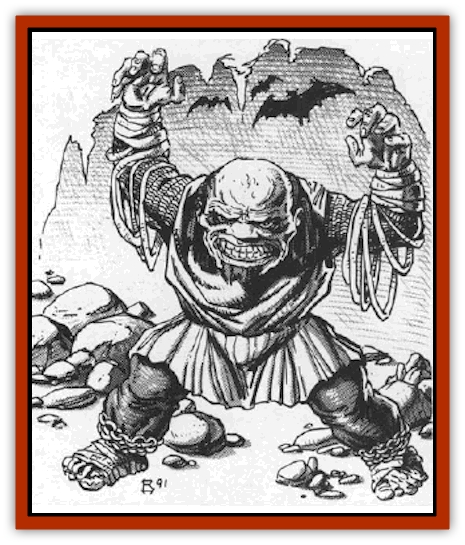

# Vampire - Gnome

| Statistic | **Vampire, Gnome** |
| --- | --- |
| **Activity Cycle:** | Any |
| **Alignment:** | Chaotic evil |
| **Armor Class:** | 0 |
| **Climate/Terrain:** | Any subterranean |
| **Damage/Attack:** | 1d4 |
| **Diet:** | Special |
| **Frequency:** | Very rare |
| **Hit Dice:** | 6+3 |
| **Intelligence:** | Genius (17-18) |
| **Magic Resistance:** | Nil |
| **Morale:** | Elite (13-14) |
| **Movement:** | 9 |
| **No. Appearing:** | 1 |
| **No. of Attacks:** | 1 |
| **Organization:** | Solitary |
| **Size:** | S (3-4' tall) |
| **Special Attacks:** | See below |
| **Special Defenses:** | See below |
| **THAC0:** | 13 |
| **Treasure:** | F |
| **XP Value:** | 3,000 (+1,000 per 100 years of age) |

While the race of [[Gnome|gnomes]] is little understood by many surface dwellers, the deadly breed of [[Vampire_General_Information|vampire]] tat these creatures spawn are even more alien. Moving about far beneath the world's surface, they are seldom encountered by humans or other demi-humans. When they are found, however, they are terrible foes indeed.

Gnomish vampires are shorter and slighter of build than [[Vampire_Dwarf|dwarvish vampires]]. Unlike other undead, however, the passage of time is visible in the features of a gnomish vampire. Thus, their features are grooved and worn, showing the full burden of the years that have passed them by.

Gnomish vampires are still able to understand the languages they spoke in life, but are unable to speak themselves. There is no known reason for this curse of silence, save that it robs them of the ability to joke and sing that they so loved in life. Because of this, most communications with gnomish vampires require written messages.

**Combat:** Physical combat with any form of vampire is dangerous indeed. When the opponent is a gnomish vampire, however, the penalty for defeat may be a horrible life as a helpless cripple.

The gnomish vampire gains no bonus for strength in combat, for its ties to the negative material plane have not infused it with great physical power. Thus, an unarmed blow from the creature will inflict but 1d4 points of damage. Because their hand-to-hand attack is so ineffective, they will often employ flails or other weapons in combat.

While the hand-to-hand blows of gnomish vampires are weak, however, they are not without a powerful debilitating affect. Those struck by such attacks will begin to feel the painful arthritic attack of the creature instantly, for each successful attack drains 2 points of Dexterity from the victim. The result is a painful stiffness in the joints and muscles that can, if the victim suffers several attacks, be crippling or even fatal. Those reduced to a Dexterity score of 0 will be slain as the creeping paralysis spreads through their lungs and heart, making it impossible for them to survive. Gnomes who die in this fashion may themselves become undead (see "Ecology") if steps are not taken to prevent this foul transformation.

The gnomish vampire is able to add a +1 bonus to its attack rolls against creatures such as [[Kobold|kobolds]] or [[Goblin|goblins]]. Similarly, creatures like [[Ogre|ogres]], [[Troll|trolls]], and [[Bugbear|bugbears]] are unable to effectively battle such an agile creature, suffering a -4 on their attack rolls.

The natural 60' infravision of living gnomes still exists in their vampiric form, but is augmented by their dark nature, Like dwarven vampires, they are able to see in even the dimmest of lighting as if it were full daylight.

Once per turn, the gnomish vampire may twist its features into a horrible smile. Those who look upon the gnome at this time must save versus spells or begin to laugh. The effects of this grin are the same as those of a *Tasha's incontrollable hideous laughter* spell, save that the duration is doubled and the character suffers 1d4 points of damage per round that they are laughing. As the vampire ages, this power becomes even more horrible, inflicting greater damage and becoming harder to save against.

Gnomish vampires can be hit only by metal weapons, and then only by those that are magical and have a +1 or better enchantment. Non-metal magical weapons are utterly useless against the creature. Gnomes also have the traditional vampiric immunity to such spells as *charm*, *sleep*, or *hold*, and cannot be harmed by poisons or disease. They are immune to the effects of all spells from the illusion/phantasm school and take only half damage from magical attacks that depend on lightning, cold, or fire.

Gnomish vampires that are driven to zero hit points by spells or weapons are not destroyed. Rather, they are driven into their *spectral form* (see below) and forced to flee from combat. While in this form they must fly as quickly as possible to the cavern that holds their sarcophagus. If they are unable to reach their final resting place within 12 rounds, they will break up and be utterly destroyed.

Gnomish vampires have the ability to assume a *spectral form*. In this guise, they appear to be nothing more than sphere of light - much like a [[Will_O'Wisp|will o'wisp]]. While in this glowing shape, the creature can pass through solid stone wails or similar barricades. They cannot, however, pass through any living or once living material in this shape, so a wooden wall is impassable to them.

Gnomish vampires are unable to change their shapes as some other undead creatures can. Still, they are not unable to disguise themselves when the need arises, for they can cast a *change self* spell at will and may maintain the deception provided by this spell for an unlimited period of time.

When they wish to, gnomish vampires are able to command any animal they encounter. They cannot, however, summon such creatures to them and must rely on those that chance brings to them. Once they have commanded a specific creature to do their bidding, it will remain with them for 2d4 days before moving on.

Gnomish vampires can employ an ability similar to that of the *spider climb* spell. This power, however, only permits them to scale surfaces built of stone or earth and they are unable to cling to those surfaces made of wood or other substances. This power can be invoked at will.

The creature retains the special abilities that it had in life, just as all other types of vampires do. Thus, they are able to employ all of their class and magical abilities long after they have become undead.

Like dwarven vampires, these creatures are unusually resistant to magic. Any saving throw they are required to make versus spells, rods, wands, or staves is made at a +5 bonus. As the creature ages, it will become even more resistant to magic as described in "Habitat/Society" below. Because of this, gnomish vampires are greatly hindered when they attempt to employ magical devices. Whenever they seek to use such items, there is a 35% chance that the device will malfunction. This does not apply to weapons, armors, shields, or those items that duplicate the effects of illusionist spells. If the creature was a thief in life, it can also employ those devices used by such characters without penalty.

The natural familiarity of these creatures with the underground environment gives them many special abilities in life, and all of these are manifested in the creature after death. Thus, the gnome can determine approximate directions when underground 3 times in 6, and their approximate depth underground 4 times in 6, detect slopes or grades 5 times in 6, and detect unsafe walls or floors 7 times in 10.

Gnomish vampires can be held at bay in several ways. They cannot turn away from any *jewel* (see *Gems* in the *Dungeon Master's Guide*) that is presented to them for 2d4 rounds. If they are attacked during that time, they are freed of this enchantment and can act normally. Similarly, they can be turned aside by priests or paladins who present a holy symbol strongly to them. As they grow older, though, it becomes harder and harder to turn them in this fashion.

Gnomish vampires can be burned by holy water splashed upon them or contact with holy symbols, but suffer only 1d4 points of damage per vial or successful attack roll. They cannot approach someone who displays a holy symbol and has strong convictions about the validity of their beliefs, but neither are they driven away from such persons.

The surest way to destroy a gnomish vampire is to impale it on a spike made of purest silver and enchanted with a *bless* spell. As soon as the spike is driven into the body of the creature, its material form is destroyed and it will collapse dead. While the creature is truly lifeless at this point, it can be revived simply by removing the spike. In order to assure that they creature remains dead a number of things must be done. First, the hands must be cut from the corpse and boiled in a natural volcanic hot spring for 24 hours. Second, the body must be placed in a wooden casket that will be sealed at the end of the destruction process. Lastly, when the body lies in the coffin, its eyes must be removed and replaced with precious gems. Stones of higher quality may be used, but those of lesser value will allow the creature to be revived. Finally, the lid of the casket is hammered into place and the nightmare is ended.

Daylight is devastating to these creatures, destroying them utterly and instantly when it falls upon them. Magical spells that duplicate sunlight, even those that normally harm undead, do not affect these creatures however, for their natural magical resistance protects them from such things.

**Habitat/Society:** The gnomish vampire lives in the deepest of caverns, hiding like a hermit from all surface dwellers. Where they were charismatic and mischievous in life, now they are dour and reclusive. They only seek out others when they need to feed and will gladly prey on the energies of any human, demihuman, or humanoid they encounter.

As gnomish vampires age, they become more dangerous and more powerful. Very old vampires are, of course, among the most deadly beings found in Ravenloft or any other realm.

| Age | HD | Laughter | To Hit | Saves | Turn |
| --- | --- | --- | --- | --- | --- |
| 0-99 | 6+3 | 0/1d4 | +1 | +5 | Vampire |
| 100-199 | 7+3 | -1/1d6 | +1 | +5 | Vampire |
| 200-299 | 8+3 | -2/1d8 | +1 | +6 | Ghost |
| 300-399 | 9+3 | -3/1d8 | +2 | +6 | Ghost |
| 400-499 | 10+2 | -4/1d10 | +2 | +7 | Lich |
| 500+ | 11+2 | -5/1d10 | +3 | +8 | Special |

*HD* indicates the number of Hit Dice that the creature has at any given age.
*Laughter* lists the saving throw modifiers and the damage inflicted by its deadly grin.
*To Hit* is the minimum magical plus that must be associated with a metal weapon. Non-metal weapons cannot harm the vampire regardless of its age.
*Saves* indicates the modifier to the creature's saving throws versus spells, rods, staffs, or wands.
*Turn* shows the row on the Turning Undead table that is consulted when a priest or paladin attempts to drive away the creature with a holy symbol.

**Ecology:** The gnomish vampire sustains itself by drawing the youthful vigor from the bodies of those it touches. While this resembles the aging attack of a [[Ghost|ghost]], it is not truly the same, for the person is not actually aged, their body is just robbed of its youthful vitality. While the difference is fine, it is important; many believe that the vampire's attack is far worse than that of the ghost.

Gnomish vampires seldom create others of their kind. When they opt to do so, however, the process is not without risk. The vampire must first slay a victim with its debilitating touch and then move the body to the sarcophagus in which the vampire itself sleeps. For the next three days, the body must lie in the coffin while the vampire rests atop it, allowing its essences to seep slowly into the evolving vampire. At the end of this time, the slain gnome rises as a fully functioning vampire, completely under the control of its creator. While the gnome vampire rests atop its coffin, it is unable to regenerate any lost hit points or employ any of its spell-like abilities. Thus, the creature is far more vulnerable to attack at this time than it normally might be. In addition, it cannot interrupt the creation process once it has begun or both the would-be vampire and its creator will die.

---
## Discovery & Documentation

**Source Publication:** MC10 Ravenloft Appendix I (1989)
**Campaign Setting:** Planescape
**Author(s):** William W. Connors

### Other Creatures Found in This Source Book
   * [[Bastellus|Bastellus]]
   * [[Bat_Ravenloft|Bat (Ravenloft)]]
   * [[Bowlyn|Bowlyn]]
   * [[Broken_One|Broken One]]
   * [[Bussengeist|Bussengeist]]
   * [[Darkling|Darkling]]
   * [[Doom_Guard|Doom Guard]]
   * [[Doppelganger_Plant|Doppelganger Plant]]
   * [[Elemental_Ravenloft|Elemental (Ravenloft)]]
   * [[Ermordenung|Ermordenung]]
   * [[Ghoul_Lord|Ghoul Lord]]
   * [[Goblyn|Goblyn]]
   * [[Golem_III|Golem III]]
   * [[Golem_IV|Golem IV]]
   * [[Golem_Ravenloft|Golem (Ravenloft)]]
   * [[Grim_Reaper|Grim Reaper]]
   * [[Human_Abber_Nomad|Human, Abber Nomad]]
   * [[Human_Ravenloft|Human (Ravenloft)]]
   * [[Imp_Assassin|Imp, Assassin]]
   * [[Impersonator|Impersonator]]
   * [[Lycanthrope_Werebat|Lycanthrope, Werebat]]
   * [[Lycanthrope_Wereraven|Lycanthrope, Wereraven]]
   * [[Mist_Horror|Mist Horror]]
   * [[Mummy_Greater|Mummy, Greater]]
   * [[Quevari|Quevari]]
   * [[Quickwood|Quickwood]]
   * [[Ravenkin|Ravenkin]]
   * [[Reaver|Reaver]]
   * [[Scarecrow_Ravenloft|Scarecrow (Ravenloft)]]
   * [[Shadow_Fiend|Shadow Fiend]]
   * [[Skeleton_Giant|Skeleton, Giant]]
   * [[Strahd's_Skeletal_Steed|Strahd's Skeletal Steed]]
   * [[Treant_Evil|Treant, Evil]]
   * [[Treant_Undead|Treant, Undead]]
   * [[Valpurgeist|Valpurgeist]]
   * [[Vampire_Dwarf|Vampire, Dwarf]]
   * [[Vampire_Elf|Vampire, Elf]]
   * [[Vampire_Halfling|Vampire, Halfling]]
   * [[Vampire_General_Information|Vampire, General Information]]
   * [[Vampire_Kender|Vampire, Kender]]
   * [[Vampyre|Vampyre]]
   * [[Widow_Red|Widow, Red]]
   * [[Wolfwere_Greater|Wolfwere, Greater]]
   * [[Zombie_Lord|Zombie Lord]]
