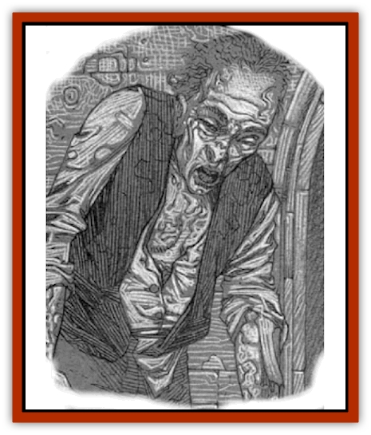
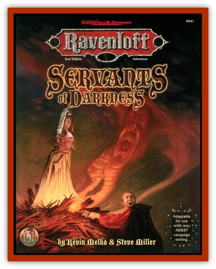

# Vampire - Goblin

| Statistic | **Vampire, Goblin** |
| --- | --- |
| **Activity Cycle:** | Day |
| **Alignment:** | Chaotic evil |
| **Armor Class:** | 3 |
| **Climate/Terrain:** | Ravenloft |
| **Damage/Attack:** | 1d6+3/1d6+3 |
| **Diet:** | Fear, blood |
| **Frequency:** | Rare |
| **Hit Dice:** | 3 base, 10 max |
| **Intelligence:** | Low (5) |
| **Magic Resistance:** | 25% |
| **Morale:** | Fanatic (17) |
| **Movement:** | 12 |
| **No. Appearing:** | 1 |
| **No. of Attacks:** | 2 (claw/claw) |
| **Organization:** | Solitary |
| **Size:** | M (6' tall) |
| **Special Attacks:** | Fear aura, gore |
| **Special Defenses:** | Spell and poison immunities |
| **THAC0:** | 16 base, 10 max (Hit Dice + Strength bonus) |
| **Treasure:** | N |
| **XP Value:** | 3,000 |

The [[Goblin|goblin]] [[Vampire_General_Information|vampire]] is a rare form of undead creature. The creature is twice the size of a normal goblin. Its fangs reach roughly halfway down its chest, rather like those of a [[Cat_Great|smilodon]]. Its hands appear blackened and shriveled, with long, curved talons. The most horrifying thing about a goblin vampire is its eyes, which pulsate with a strange orange glow.

These creatures care nothing for language or talk, only for the death and destruction they can cause. It is unknown whether they even understand languages they knew in life.

**Combat:** Anyone who meets the vampire's burning gaze must make an immediate fear check, even if previously exposed to the creature. For each check an opponent fails, the goblin vampire gains one Hit Die (to a maximum of 10). The duration of this temporary increase in Hit Dice is equal to the Hit Dice of the victim. Thus, a 5th-level warrior failing a fear check would add one Hit Die to the goblin vampire for five turns.

If both of the goblin vampire's claws hit, the creature has grasped its victim and can automatically gore him with its curved fangs, inflicting an additional 2d6+3 points of damage.

Goblin vampires have the equivalent of 18(50) Strength. This gives them a bonus of +1 on their attack rolls and +3 on their damage rolls.

The goblin vampire is immune to mind- and life-affecting spells such as *hold* and *charm* spells. Poisons, diseases, and the like also pose no threat to the creature.

Moonlight is extremely dangerous to the goblin vampire, inflicting 1d4 points of damage each round that it falls upon the creature. Holy water inflicts 1d6+1 points of damage, and an obsidian stake through the heart destroys it instantly. Goblin vampires cannot assume gaseous form or regenerate; they are turned as spectres.

**Habitat/Society:** Goblin vampires are solitary creatures that stalk the land in search of fear and blood. To date, they have been encountered only in Tepest. They have a great hatred of their former race, and typically hunt down goblins during daytime when they are most vulnerable.

**Ecology:** Goblin vampires are created only by the unique curse placed on items stolen from the Three Sisters of Tepest. Anyone who carries the item gradually becomes a goblin vampire. The transformation takes twenty hours to complete. If the item is discarded before the change is concluded, the character stops changing. He does not, however, revert to normal.

Goblin vampires live on both the blood and fear of their opponents. The creature must feed on either of the above once per day else it temporarily loses one Hit Die, perishing upon reaching zero. In addition, it must feed on both fear and blood at least once every three days or it again loses one Hit Die on the fourth day and each day thereafter until it does feast on both.

---
## Discovery & Documentation

**Source Publication:** Servants of Darkness (1998)
**Campaign Setting:** Ravenloft
**Author(s):** Kevin Melka and Steve Miller

### Other Creatures Found in This Source Book
   * [[Umbra|Umbra]]
