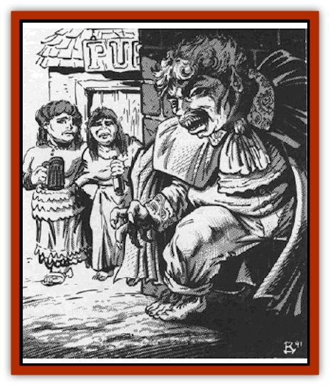

# Vampire - Halfling

| Statistic | **Vampire, Halfling** |
| --- | --- |
| **Activity Cycle:** | Night |
| **Alignment:** | Chaotic evil |
| **Armor Class:** | 3 |
| **Climate/Terrain:** | Temperate woodlands |
| **Damage/Attack:** | 1d4 |
| **Diet:** | Special |
| **Frequency:** | Very rare |
| **Hit Dice:** | 6+3 |
| **Intelligence:** | High (13-14) |
| **Magic Resistance:** | Nil |
| **Morale:** | Steady (11-12) |
| **Movement:** | 9 |
| **No. Appearing:** | 1 |
| **No. of Attacks:** | 1 |
| **Organization:** | Solitary |
| **Size:** | S (4-5' tall) |
| **Special Attacks:** | See below |
| **Special Defenses:** | See below |
| **THAC0:** | 13 |
| **Treasure:** | F |
| **XP Value:** | 3,000 |

Few races enjoy life and the basic comforts of a quiet, peaceful existence more than the [[Halfling|halflings]]. Thus, when one of these fine creatures is driven into a life of evil by the preying of some sinister [[Vampire_General_Information|vampire]], the world suffers a great loss.

The halfling vampire has the same physical characteristics that living halflings do; being slightly plump, standing only about four feet high, and being marked by a florid complexion and tufts of hair on the backs of their hands and tops of their feet. They tend to dress in dark clothes, however, shunning the happy and colorful garb of their living kin.

The halfling vampire is most often familiar with half a dozen or so languages (including their native tongue). Nearly all of them spoke common in life (and thus retain that knowledge in death) as well as the elvish, dwarvish, and gnomish languages.

**Combat:** The strength of a halfling vampire is not exceptional as it is for most other vampire races. Thus, they gain no additional bonus to their melee attack or damage rolls. They do employ melee weapons frequently, favoring the short sword, dagger, and similar small weapons. Should the halfling vampire elect to strike without benefit of physical arms, it inflicts but 1d4 points of damage. While this is not greatly threatening in itself, the vampire's strong connection with the negative material plane allows him to drain a portion of the victim's life energy with each successful attack. Thus, any character hit by the vampire suffers the required damage and instantly loses 1 point of Strength and 1 point of Constitution. The resulting loss in hit points, combat ability, and so forth is calculated immediately. Those halflings who die from this life draining attack will become vampires themselves, as described in the "Habitat/Society" below.

The halfling vampire is able to radiate an aura that affects all persons within 20 yards. Any creature that comes within this distance while the vampire is radiating its aura must save vs. spells or become *fatigued*. Those who make their save are unaffected and will remain so for the duration of the encounter. If they meet the vampire again, however, a new save will be required to resist this enchantment. Those who fail their saving throw will be overcome with a feeling of lassitude and torpor. This state lasts for 1d6 rounds, during which time they attack with a -4 penalty, inflict half damage with all weapons, and are unable to summon the mental stamina required to cast spells or make proficiency checks. As the vampire ages, the duration of its terrible lethargy aura becomes greater, although its effects remain largely the same.

The natural resistance to magic of all halflings, coupled with the increased immunity to spells of the undead, makes attacking the halfling vampire very difficult. Any weapon of less than +2 enchantment cannot harm the creature, passing harmlessly through the vampire. As the vampire ages, it becomes harder and harder to strike.

Halfling vampires retain all natural abilities of halflings in their undead state. Thus, they have an improved saving throw against all magical spells, rods, staffs, or wands employed against them. This begins at +5, but improves with the passing of time until the vampire is almost impossible to destroy with such attacks. Similarly, they retain their natural affinity for thrown weapons, gaining a +1 on all attack rolls made with them. Halfling vampires are still able to move silently (as an [[Elf|elf]]) in their afterlife, allowing them to sneak up on opponents with ease. These undead can always employ the backstabbing ability of a 1st level thief; vampires who were thieves in life may have better backstabbing abilities.

All halfling vampires have infravision out to 60 feet, regardless of their racial stock or infravision ability in life. Further, they all have the ability (75% chance) to tell whether a passage has any natural grade or slope to it, no matter how minor the slope might be. They also have a 50% chance of determining directions (north, south, etc.) when underground.

The vampire is immune to all manner of *sleep*, *charm*, *hold*, or other mind-affecting spells. Further, it is immune to all manner of poisons, toxins, or diseases and has no need to breathe. Spells based on lightning or fire inflict only half damage to the halfling vampire, while those based on cold have their full effect.

If the vampire is reduced to zero hit points, either by magical spells or physical attack, but is not properly destroyed (as dictated below), it is not slain. Rather, it is forced to assume its *smoking form* and flee from the combat. If it is unable to return to its coffin within 12 rounds of this forced transformation, its smoking form breaks up and it is forever destroyed.

At will, the halfling vampire can transform itself into any manner of small woodland mammal. While in this form, the vampire takes on all of that creature's abilities and senses, but retains its own immunity to spells or non-magical weapons, intelligence, and similar powers. The most commonly employed forms are those of [[Badger|badgers]], [[Mammal_Small|beavers]], [[Skunk|skunks]], and similar animals.

Just as halfling vampires can assume the shape of woodland mammals, so too can they command them. Within 2d6 rounds after the vampire issues its mental summons, 10-60 Hit Dice worth of such creatures will arrive to do its bidding. These animals will remain throughout the night on which they were summoned, returning to their homes with the coming of the dawn.

In addition to its natural animal guises, the vampire can transform itself into a *smoking form* at will. In this state, it appears as a drifting cloud of smoke such as might be made by a small campfire or burning pipe. It radiates a familiar and pleasing odor, one that will remind those within 10 yards of pipweed and a comfortable inn. In this state, the vampire is immune to all damage from melee attacks and suffers no injury from magical spells. Even the smallest opening, a key hole or cracked pane of glass, for example, will allow a halfling vampire in this shape to pass through.

Halfling vampires have the ability to *create food and drink* up to 3 times per day. When they invoke this power, the food they create is always of the highest quality and certain to please even the most discriminating palate. In addition, they can cast a *purify food and drink* or *putrefy food and drink* at will, often using the former powers to lure others into a sense of security and safety that makes the victims more vulnerable to attack.

Despite its great power, the halfling vampire is not without weaknesses of its own. It cannot, for example, stand the odor of a smoking pipe, for such things remind it of the physical pleasures that it has left behind. While the aroma of burning pipeweed will not drive the vampire away, it does prevent the creature from coming within 20 yards of the smoker until the offending device is removed. Similarly, the vampire cannot enter any room where a fire is burning in the hearth. Again, the association with the halfling's past life is too strong for the creature to bear, and it will turn away from such memories. In both cases, the vampire can take no action to directly counter the offending items. The vampire may, however, instruct one of its minions to enter the room and extinguish the pipe or smother the fire, allowing the undead creature to come freely into the chamber,

Halfling vampires can be held at bay by anyone who presents a lawful good holy symbol to them strongly and with conviction. As with the pipe, this does not drive them away, but does keep them from approaching a character so equipped. Holy water or lawful good holy symbols that touch the vampire's flesh will inflict the same damage that they do to [[Vampire|human vampires]] (1d6+1 points), burning the creature's flesh. Halfling vampires can be turned normally.

Halfling vampires regenerate damage very quickly. Each combat round they regain 2 hit points of damage. If they are standing in the light of the moon, this is increased to 3 points of damage. If the moon is a full moon, this is further improved to 4 points of damage.

Falling rain is deadly to the halfling vampire, for it is nature's way of driving away taints from the atmosphere and revitalizing all living creatures. Damage is based on the severity of the weather and the time of exposure. A vampire destroyed by rainfall is forever dead.

| Severity of Rain | Damage per Round |
| --- | --- |
| Light | 1d6 |
| Heavy | 1d8 |
| Torrential | 1d10 |

Snow does not harm the vampire as rain does, but they are loathe to move into a cold climate and, thus, seldom encounter it.

Just as halfling vampires can be held off by the presence of a burning hearth, so too can they be destroyed by it. The surest way to destroy a vampire of this type is to impale him with a piece of wood that burns with a hearth's fire. The wood must be ignited directly from the hearth itself and not from a fire transferred to it via some third item. This "weapon" must be employed within 12 rounds to be effective. Not all of the wood need be ablaze, but the part driven into the vampire must be burning for the attack to have its desired effect.

Although the vampire is instantly slain by this attack, the creature can be revived simply by removing the wooden stake from its body. In order to complete the destruction of the being, the creature's hands and feet must be cut off and cast into a hearth fire. If the fire is maintained for three hours, the rest of the vampire's body will smolder away into smoke and dissipate, never to rise again.

Sunlight is very dangerous to halfling vampires, as it is to most such creatures, and can destroy them. Each round that a halfling vampire is exposed to the direct rays of the sun, it suffers 3d6 points of damage and is filled with such pain that it can neither attack nor defend itself. Further, it cannot transform into any of its other shapes until it removes itself from the direct light of the sun. Magical spells that imitate the light of the sun, such as *continual light*, will not harm the creature, but sources like a *sunblade* will have the sunlight affect.

**Habitat/Society:** Halfling vampires shun the comforts of physical life that were so dear to them before their transformation. They live in dark and dreary places that do not serve to remind them of the happiness they have left behind. Their loss of happiness and contentment has led them to despise all those who are able to curl up before a crackling fire with a good story and a mug of ale, driving them to do what they can to shatter the complacent lives of other halflings whenever they can.

As with other demihuman vampires, halfling vampires become more powerful with age, as represented by the table below.

| Age | HD | Save | To Hit | Aura |
| --- | --- | --- | --- | --- |
| 0-99 | 6+3 | +5 | +2 | 0 |
| 100-199 | 7+3 | +5 | +2 | -1 |
| 200-299 | 8+2 | +6 | +2 | -2 |
| 300-399 | 9+2 | +6 | +3 | -3 |
| 400-499 | 10+1 | +7 | +3 | -4 |
| 500+ | 11+1 | +8 | +3 | -5 |

*HD* indicates the creature's Hit Dice as it ages.
*Save* shows the bonus to the creature's saves when attacked with spells, rods, staves, or wands.
*To Hit* indicates the magical bonus that must be associated with the weapon to enable it to affect the vampire.
*Aura* is the penalty to be applied to the saving throws of those caught in the vampire's fatigue aura.

**Ecology:** The halfling vampire has no place in the natural world, a fact demonstrated by its aversion to rain and the earthly purity it represents.

The vampire can make more of its kind only by slaying other halflings with its energy-sapping attack. In order to create a new vampire, the halfling need do nothing more than keep the body of its victim intact for 7 days after death and a new vampire will be created.

---
## Discovery & Documentation

**Source Publication:** MC10 Ravenloft Appendix I (1989)
**Campaign Setting:** Planescape
**Author(s):** William W. Connors

### Other Creatures Found in This Source Book
   * [[Bastellus|Bastellus]]
   * [[Bat_Ravenloft|Bat (Ravenloft)]]
   * [[Bowlyn|Bowlyn]]
   * [[Broken_One|Broken One]]
   * [[Bussengeist|Bussengeist]]
   * [[Darkling|Darkling]]
   * [[Doom_Guard|Doom Guard]]
   * [[Doppelganger_Plant|Doppelganger Plant]]
   * [[Elemental_Ravenloft|Elemental (Ravenloft)]]
   * [[Ermordenung|Ermordenung]]
   * [[Ghoul_Lord|Ghoul Lord]]
   * [[Goblyn|Goblyn]]
   * [[Golem_III|Golem III]]
   * [[Golem_IV|Golem IV]]
   * [[Golem_Ravenloft|Golem (Ravenloft)]]
   * [[Grim_Reaper|Grim Reaper]]
   * [[Human_Abber_Nomad|Human, Abber Nomad]]
   * [[Human_Ravenloft|Human (Ravenloft)]]
   * [[Imp_Assassin|Imp, Assassin]]
   * [[Impersonator|Impersonator]]
   * [[Lycanthrope_Werebat|Lycanthrope, Werebat]]
   * [[Lycanthrope_Wereraven|Lycanthrope, Wereraven]]
   * [[Mist_Horror|Mist Horror]]
   * [[Mummy_Greater|Mummy, Greater]]
   * [[Quevari|Quevari]]
   * [[Quickwood|Quickwood]]
   * [[Ravenkin|Ravenkin]]
   * [[Reaver|Reaver]]
   * [[Scarecrow_Ravenloft|Scarecrow (Ravenloft)]]
   * [[Shadow_Fiend|Shadow Fiend]]
   * [[Skeleton_Giant|Skeleton, Giant]]
   * [[Strahd's_Skeletal_Steed|Strahd's Skeletal Steed]]
   * [[Treant_Evil|Treant, Evil]]
   * [[Treant_Undead|Treant, Undead]]
   * [[Valpurgeist|Valpurgeist]]
   * [[Vampire_Dwarf|Vampire, Dwarf]]
   * [[Vampire_Elf|Vampire, Elf]]
   * [[Vampire_Gnome|Vampire, Gnome]]
   * [[Vampire_General_Information|Vampire, General Information]]
   * [[Vampire_Kender|Vampire, Kender]]
   * [[Vampyre|Vampyre]]
   * [[Widow_Red|Widow, Red]]
   * [[Wolfwere_Greater|Wolfwere, Greater]]
   * [[Zombie_Lord|Zombie Lord]]
