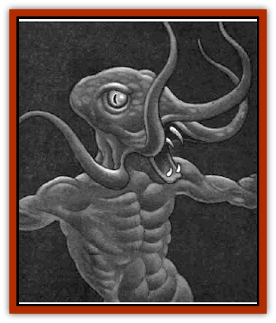
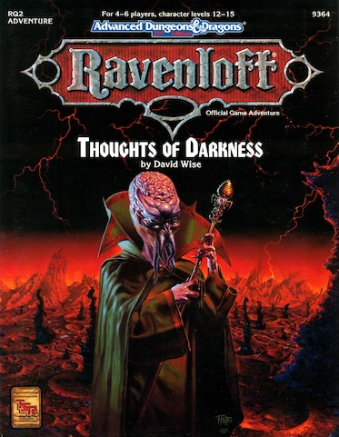

# Vampire - Illithid

| Statistic | **Vampire, Illithid** |
| --- | --- |
| **Activity Cycle:** | Night |
| **Alignment:** | Chaotic evil |
| **Armor Class:** | 1 |
| **Climate/Terrain:** | Any |
| **Damage/Attack:** | Special |
| **Diet:** | Blood/life energy |
| **Frequency:** | Very rare |
| **Hit Dice:** | 8+3 |
| **Intelligence:** | Insane (1) |
| **Magic Resistance:** | 90% |
| **Morale:** | Fearless (20) |
| **Movement:** | 12 |
| **No. Appearing:** | 1-4 |
| **No. of Attacks:** | Special |
| **Organization:** | Solitary |
| **Size:** | M (6' tall) |
| **Special Attacks:** | Energy drain, mind blast |
| **Special Defenses:** | +1 or better magical weapon needed to hit |
| **THAC0:** | 10 (unadjusted) |
| **Treasure:** | Nil |
| **XP Value:** | 10,000 |

[[Vampire_General_Information|Vampire]] [[Mind_Flayer|illithids]] are the result of evil experiments that were meant to be terminated. They were first created by Lyssa Von Zarovich and the High Master IIlithid of Bluetspur in an attempt to create a creature that could successfully convert the High Master into a vampire (conventional methods were not viable). When the hatchlings proved insane and completely uncontrollable, they were destroyed and thrown into the common water dump, where all victims of [[Mind_Flayer|mind flayers]] are thrown after they expire. The vampire illithids regenerated, however, and were washed out of the mind flayer complex. Now they run free across the surface of the realm.

**Combat:** Vampire illithids combine the battle tactics of both vampires and conventional mind flayers. They have vampiric strength (18/76) and receive a bonus of +2 to hit and +4 to damage, which improves as they grow older (see *Van Richten's Guide to Vampires* for information on [[Vampire|vampire age categories]]).

Like their undead cousins, vampire illithids exist on both the Positive and Negative Material planes at the same time. Their powerful negative energy essence allows them to drain two life energy levels from anyone they strike. If they successfully do so, they also gain two Hit Dice worth of hit points back from previously assessed damage (but they cannot gain more hit points then they started with). Furthermore, they regenerate 3 hit points of damage per round.

While their lack of sanity prevents them from using mind control techniques such as the vampiric charm-gaze, their illithid heritage allows them to use a special psionic mental blast that spreads in a cone 60 feet long, 5 feet wide at its base, and 20 feet wide at its end. Anyone caught within a mind blast's area of effect must successfully save vs. wand at -4 or be stunned for 1d6 rounds. Affected victims must also make a madness check (see the *Forbidden Lore* boxed set), also with a -4 penalty.

In combat, a vampire illithid employs its mind blast once per round until it is engaged by an opponent in physical melee. Thereafter, it attempts to hit an adversary with each of its four tentacles each round, inflicting 1d6+4 points of crushing damage per hit, in addition to its life energy drain. Both insane and immortal, vampire illithids always fight to the "death" and then find the nearest shelter within 250 feet in which to regenerate.

**Habitat/Society:** Vampire illithids are a recent development and are not known to the general populace of Bluetspur yet, but they are sure to find their way back into the complex as their deepening hunger drives them to sniff out life wherever it hides. Also, they are quite likely to penetrate the misty borders and invade other realms of Ravenloft - such a monstrosity is sure to thrill and delight the Dark Powers.

In the meantime, they run wild across the expanses of Bluetspur, seeking out and attacking any living thing. Since there technically is no "day" in Bluetspur, they are not constrained by the clock and sleep whenever the urge to rest overcomes their ravenous appetites.

**Ecology:** Vampire illithids mature in a matter of weeks, rather than years, thanks to their undead status. They enjoy dining on both blood and brain matter, and they receive sustenance from both as well. They are not the least bit picky about their quarry, so long as it is alive.

---
## Discovery & Documentation

**Source Publication:** RQ2: Thoughts of Darkness (1992)
**Campaign Setting:** Ravenloft
**Author(s):** David Wise

### Other Creatures Found in This Source Book
   * [[Remnant_Aquatic|Remnant, Aquatic]]
   * [[Shattered_Brethren|Shattered Brethren]]
