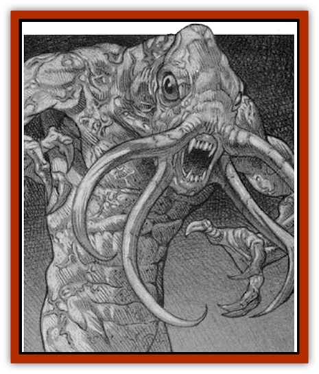

# Vampire - Illithid - Athaekeetha

| Statistic | **Vampire, Illithid (Athaekeetha)** |
| --- | --- |
| **Activity Cycle:** | Night |
| **Alignment:** | Chaotic evil |
| **Armor Class:** | 1 |
| **Climate/Terrain:** | Bluetspur area |
| **Damage/Attack:** | 5-10 (1d6+4) |
| **Diet:** | Brains; life energy |
| **Frequency:** | Unique |
| **Hit Dice:** | 8+3 (55 hp) |
| **Intelligence:** | Insane (1) |
| **Magic Resistance:** | 90% |
| **Morale:** | Fearless (20) |
| **Movement:** | 12 |
| **No. Appearing:** | 1 |
| **No. of Attacks:** | 4 |
| **Organization:** | Solitary or pack |
| **Size:** | M (6'4&rdquo; tall) |
| **Special Attacks:** | Mind blast; energy drain |
| **Special Defenses:** | +1 or better weapon to hit; regeneration |
| **THAC0:** | 11 (9) |
| **Treasure:** | Nil |
| **XP Value:** | 14,000 |

One of the most terrible domains in Ravenloft is the dread Bluetspur. Located in the far south of the core lands, it is a land of madness and insanity. The vile [[Mind_Flayer|illithids]] (or mind flayers) who dwell there keep great herds of intelligent creatures as cattle, feeding on their brains. For these wretched creatures, life is only a period of waiting before an agonizing death. But there are creatures here that even the illithids fear, things made all the more terrible by the fact that the mind flayers themselves created them.

Athaekeetha, like all of the [[Vampire_Illithid|vampire illithids]], was created in a foul experiment conducted by the [[Vampire|vampire]] Lyssa Von Zarovich and the High Master of the mind flayers. The experiment was part of an ultimately successful attempt to transform the latter into a vampire. The "prototype" vampire illithids created by these experiments were believed to have been destroyed, but their regenerative powers enabled them to survive and escape into the wild, where they have flourished.

While they look much like normal illithids, this undead species wears no clothing and moves about like wild beasts. Their craniums are smaller than these of their living kin, perhaps a sign of their lower intelligence.

[[Vampire_General_Information|Vampire]] illithids have feeding tendrils that are much longer and thicker than those of normal mind flayers; in addition to their primary purpose of boring through the skull to extract the brains within, these tentacles make excellent bludgeoning weapons, striking with great strength.

Like all vampire illithids, Athaekeetha is unable to speak or communicate with other races. It does seem to be able to convey information to its fellow vampire illithids, however; possibly by some manner of rudimentary telepathy. Attempts to communicate with Athaekeetha by magical or psionic means have always failed and always require a madness check (as described in the *Forbidden Lore* boxed set).

**Combat:** Vampire illithids are able to employ the combat tactics of both vampires and illithids. Their undead nature makes them physically powerful (Strength 18/76), granting them a bonus of +2 to hit (for an adjusted THAC0 of 9) and +4 to damage in any melee attack.

As a rule, Athaekeetha begins any attack by unleashing a powerful *mind blast*. This attack takes the shape of a cone some 60 feet long with a 5-foot-wide base and a 20-foot-wide mouth. Anyone caught in this area must make a Saving Throw vs. Wands or be stunned for 1-6 rounds. Further, any creature which is at least semi-intelligent must make a madness check (see the *Forbidden Lore* boxed set or module RQ2, *Thoughts of Darkness* for details). Dungeon Masters not using these additional rules should substitute horror checks instead.

Once its victims have been stunned, Athaekeetha charges into melee, attacking with its four feeding tentacles. Each tentacle strikes for 5-10 (1d6+4) points of damage and drains two levels of life energy from the victim. A stunned or helpless victim's brain can then be consumed in 4 rounds.

As a vampire, Athaekeetha regenerates 3 points of damage each round. In addition, every time it drains life energy from a victim, it instantly heals 2d8 hit points of damage it has suffered.

Many types of attacks have little or no effect upon Athaekeetha. Like most undead, the vampire illithid is immune to any form of *charm*, *hold*, or *sleep* spell. It cannot be harmed by poisons or disease, and its mind flayer heritage gives it a staggering 90% magic resistance. Further, non-magical weapons will not bite upon its rubbery skin.

In spite of its many powers, Athaekeetha is burdened with the weaknesses of the undead as well. It can be turned by clerics or paladins of sufficient level, but only at a -6 penalty. It is not held at bay by holy symbols but can be burned by holy water, which does 1d6 points of damage per vial.

The degenerated state of Athaekeetha's mind keeps it from using many of the special powers that mark both vampires and illithids. For instance, it cannot charm enemies or use any of the illithid spell-like or psionic abilities besides mind blast. It cannot change shape, as most vampires do, and is unable to summon lesser creatures for aid. Because Athaekeetha is a product of magical experimentation and not true undead, it cannot create more of its kind.

Destroying Athaekeetha is no simple task. Most vampire illithids are forced into gaseous form if reduced to zero hit points and must spend the next 24 hours reforming their corporeal bodies, during which time they are extremely vulnerable and can be slain by any attack. However, while Athaekeetha's physical form can be temporarily destroyed by massive damage, its body continues to regenerate, even if reduced to below zero hit points. Eventually, it will recover from even the most complete destruction; even such foolproof methods as cremation have proved ineffectual. Therefore, the best way to defeat Athaekeetha is to reduce its body to ashes and then imprison the remains in some sort of permanent magical trap.

Sunlight does not harm illithid vampires, although they hate it and will avoid it whenever possible. Other bright lights (including contextual *light* spells and the like) offend them, and they will attempt to destroy the source of such illumination whenever they can.

**Habitat/Society:** Athaekeetha was the last vampire illithid created by Lyssa Von Zarovich and the High Master before they gave up on the experiment; its higher intelligence is proof that at least some progress was being made in the project. Like the rest, Athaekeetha survived the High Master's attempt to destroy these flawed creations and fled into the catacombs that run beneath the entire domain of Bluetspur. With insane cunning, it has since evaded all attempts to recapture or destroy it, remaining free to wreak havoc on any unfortunate enough to fall into its clutches.

While the majority of this debased breed have remained near the mind flayer city, Athaekeetha prefers to haunt the surface, especially along the borders of neighboring domains. Rumors have begun to surface in Haz1an of strange and terrible creatures moving in packs and attacking travellers on the road between Toyalis and Sly-Var. Similar stories have been told in Barovia's village of Immol. These accounts, though unconfirmed, might indicate that Athaekeetha has gathered others of its kind about it and is beginning to look beyond the borders of Bluetspur for prey. If this is the case, it is dark news indeed. Few would deny that these foul creatures are among the most horrible beasts in Ravenloft.

**Ecology:** Athaekeetha and the rest of its evil breed have no place in the natural order of things. However, since the domain of Bluetspur has only the shattered remnants of an ecology, this is of little consequence. They do not breed and cannot reproduce themselves by preying upon others, as most undead do. They seek to slake their bestial hungers for the blood, brains, and life energy of their victims but can survive for long periods without feeding.

---
## Discovery & Documentation

**Source Publication:** Ravenloft Appendix II: Children of the Night (1991)
**Campaign Setting:** Ravenloft
**Author(s):** William W. Connors

### Other Creatures Found in This Source Book
   * [[Brain_Living|Brain, Living]]
   * [[Ermordenung_Nostalia_Romaine|Ermordenung, Nostalia Romaine]]
   * [[Ghoul_Ghast_Jugo_Hesketh|Ghoul, Ghast, Jugo Hesketh]]
   * [[Golem_Half-|Golem, Half-]]
   * [[Golem_Mechanical_Ahmi_Vanjuko|Golem, Mechanical, Ahmi Vanjuko]]
   * [[Human_Cursed_Jacqueline_Montarri|Human, Cursed (Jacqueline Montarri)]]
   * [[Human_Madman_The_Midnight_Slasher|Human, Madman (The Midnight Slasher)]]
   * [[Human_Voodan|Human, Voodan]]
   * [[Lich_Bardic|Lich, Bardic]]
   * [[Lycanthrope_Weretiger_Jahed|Lycanthrope, Weretiger (Jahed)]]
   * [[Meazel_Salizarr|Meazel (Salizarr)]]
   * [[Medusa_Ravenloft|Medusa (Ravenloft)]]
   * [[Mummy_Greater_Senmet|Mummy, Greater, Senmet]]
   * [[Night_Hag_Styrix|Night Hag, Styrix]]
   * [[Spectre_Jezra_Wagner|Spectre, Jezra Wagner]]
   * [[Thrax_Pelik|Thrax (Pelik)]]
   * [[Treant_Evil_Blackroot|Treant, Evil (Blackroot)]]
   * [[Vampire_Eastern_Mayónaka|Vampire, Eastern (Mayónaka)]]
   * [[Vampyre_Vladimir_Ludzig|Vampyre (Vladimir Ludzig)]]
