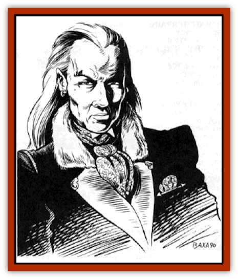

# Vampire - Nosferatu

| Statistic | **Vampire, Nosferatu** |
| --- | --- |
| **Activity Cycle:** | Night |
| **Alignment:** | Any evil |
| **Armor Class:** | 1 |
| **Climate/Terrain:** | Ravenloft |
| **Damage/Attack:** | 1d6+4 |
| **Diet:** | Blood |
| **Frequency:** | Very rare |
| **Hit Dice:** | 8+3 |
| **Intelligence:** | High to genius (13-18) |
| **Magic Resistance:** | Nil |
| **Morale:** | Champion (15-16) |
| **Movement:** | 12, Fl 18 (C) |
| **No. Appearing:** | 1 |
| **No. of Attacks:** | 1 |
| **Organization:** | Solitary |
| **Size:** | M (6' tall) |
| **Special Attacks:** | See below |
| **Special Defenses:** | +1 or better weapon to hit |
| **THAC0:** | 11 |
| **Treasure:** | F |
| **XP Value:** | 2,000 |

[[Nosferatu|Nosferatu]] are variants of the common [[Vampire_General_Information|vampire]]. Like other [[Vampire|vampires]], they can be of any humanoid stock - although the powers of demihuman nosferatu have been known to vary from those of their human cousins (see the entries on [[Vampire_Drow|Vampire, Drow]]; [[Vampire_Dwarf|Vampire, Dwarf]]; [[Vampire_Elf|Vampire, Elf]]; [[Vampire_Gnome|Vampire, Gnome]]; and [[Vampire_Halfling|Vampire, Halfling]]).

During the night hours, a nosferatu looks like a normal member of its race, though its skin is unusually pale. At sunrise, however, the nosferatu falls into a deathlike coma. If it has fed within the last 2 hours, its complexion appears slightly flushed. If cut or stabbed at this time, the creature bleeds. As the day wears on, the body begins to lose its fresh appearance. By nightfall, the face becomes gaunt and the flesh turns gray.

Nosferatu remember all the languages they learned in life and may even have mastered a few other tongues in their long unlife.

**Combat:** While the common vampire drains life energy levels, the nosferatu drains Constitution points instead. Except as noted below, Nosferatu have all of the other strengths and weaknesses of a common vampire,

The nosferatu has no obvious melee attack. It can use the punching and wrestling system, or throw dangerous and heavy objects. Otherwise, it must use weapons or spells just like normal humans. Its great strength does give it a +2 attack bonus and a +4 on damage inflicted. Smart or powerful nosferatu always have some sort of magical weapon available.

The nosferatu only attacks weak or *charmed* prey. To drain Constitution, it must bite its victim - usually on the neck - and drink his blood. If the victim is resisting, this action requires an attack roll. Armor protects a victim normally, but shields offer no defense.

Once a bite is successful, the draining is automatic on subsequent rounds. Usually the victim loses 1 point of Constitution per round, allowing the nosferatu to savor the slow death of its prey. If necessary, however, a nosferatu can drain blood at a rate of 3 points per round.

While draining its victim, this vampire's only attack or defense is its charm gaze. It can, of course, elect to stop the drain. The nosferatu's victim regains lost Constitution points at a rate of 1 point every 2 days. Those who die from the nosferatu's bloody kiss rise again as half-strength creatures subject to the will of their creator.

Using a form of *telepathy*, a nosferatu can *charm* from afar any person it has bitten. Once *charmed*, the victim is subject to the vampire's will for the rest of his life, or until a *remove curse* is cast upon him by a priest of 14th level or higher. This telepathic communication is one way. The nosferatu gives instructions to its victim, but the victim cannot relay anything to the vampire. The nosferatu must be within 360 feet to command his unwilling subject.

**Habitat/Society:** Most nosferatu live in cemeteries or other abandoned places. They hunt at night and return to their coffins during the day. Usually, a nosferatu maintains a minimum of 3 or 4 coffins, each in a different location.

**Ecology:** Unlike the common vampire, a nosferatu needs blood to survive. Unless it can drain at least 3 Constitution points from a victim each night, it loses 1 Hit Die. The loss is cumulative and continues every night until enough blood is consumed or the nosferatu is reduced to 4 Hit Dice. At 4 Hit Dice, the creature ceases to decline further, but it goes berserk if it is within 40 feet of a viable victim.

If attacking a humanoid victim is impractical, a nosferatu can restore nearly all of its Hit Dice by drinking the blood of animals. Animal feedings, no matter how frequent, always leave the creature 1 hit die below normal.

Nosferatu also need sleep. They lose l hit die for each day without proper rest. "Proper rest" requires lying in its coffin with a handful of soil from its original grave for at least 8 hours. A tired nosferatu can regain 1 hit die after a day of proper rest, provided it has drained at least 6 Constitution points during the previous night. To regain all lost Hit Dice, it may need to gorge itself several nights in a row.

---
## Discovery & Documentation

**Source Publication:** Ravenloft Campaign Setting, 1st Ed. ("Realm of Terror") (1994)
**Campaign Setting:** Ravenloft
**Author(s):** Bruce Nesmith and Andria Hayday

### Other Creatures Found in This Source Book
   * [[Geist|Geist]]
   * [[Gremishka|Gremishka]]
   * [[Lycanthrope_Loup-garou|Lycanthrope, Loup-garou]]
   * [[Odem|Odem]]
   * [[Strahd_Skeleton|Strahd Skeleton]]
   * [[Strahd_Zombie|Strahd Zombie]]
