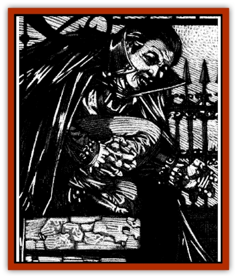

# Vampire - Oriental

| Statistic | **Vampire, Oriental** |
| --- | --- |
| **Activity Cycle:** | Night |
| **Alignment:** | Chaotic evil |
| **Armor Class:** | 1 |
| **Climate/Terrain:** | Any |
| **Damage/Attack:** | 1d4+4/1d4+4 |
| **Diet:** | Special |
| **Frequency:** | Very rare |
| **Hit Dice:** | 9+3 |
| **Intelligence:** | High (13-14) |
| **Magic Resistance:** | Nil |
| **Morale:** | Elite (13-14) |
| **Movement:** | 12, Fl 6 (C) |
| **No. Appearing:** | 1 |
| **No. of Attacks:** | 2 |
| **Organization:** | Solitary |
| **Size:** | M (6' tall) |
| **Special Attacks:** | Energy drain, <i>hold</i> victim |
| **Special Defenses:** | Invisibility; +1 weapon to hit; immune to <i>hold</i>, <i>sleep</i>, <i>charm</i>; see below |
| **THAC0:** | 11 |
| **Treasure:** | F |
| **XP Value:** | 9,000 |

The oriental [[Vampire_General_Information|vampire]] is very similar to its [[Vampire|common, western cousin]]. There are. however, differences in culture, abilities and appearance that distinguish the two strains of undead.

While the oriental vampire appears human at first glance, slightly feral features and faintly luminous skin make it appear slightly inhuman. What is most remarkable about the creature's appearance is its fingernails, which are always from 5 to 12 inches in length; any of them that are cut or broken regenerate as the vampire sleeps. Although most oriental vampires have dark hair and eyes, rare examples of this race have lighter hair and western features. It is the *strain* of vampirism that is eastern. not necessarily the individual vampire.

Oriental vampires speak all of the languages that they knew in life. Further, these creatures often acquire several other tongues in the centuries following their deaths.

**Combat:** The oriental vampire is a fearsome opponent in combat, possessing a Strength of 18/76, which affords a bonus of +2 on all attack rolls and +4 on all melee damage rolls.

It is almost unheard of for an oriental vampire to use a weapon other than its wickedly sharp fingernails. The nails function as +1 magical weapons, and they can hit even foes normally hit only by enchanted weapons. Hence, the creature attacks twice per round with its nails, inflicting 1d4+5 points of damage per attack (including Strength and "magical" nail bonuses).

Three times per day the vampire can gaze at an individual and thus attempt to *hold* him. The victim must make a successful saving throw vs. spell with a -4 penalty (due to the strength of the vampire's gaze). This ability is extremely useful when the vampire wishes to feed quietly or render a guard immobile.

The oriental vampire is a creature of both the Positive and Negative Energy Planes. The eastern vampire can drain energy levels, but only by biting its opponent. If this happens, the monster drains two life energy (experience) levels from its victim and inflicts 1d4 points of damage. The bonuses for the vampire's exceptional strength do not apply when it bites an enemy.

Oriental vampires can only be struck by weapons of +1 or better enchantment. Normal weapons pass through the vampire's body, actually corroding and becoming useless in the process unless they successfully save vs. disintegration. Even when struck by a magical weapon, the oriental vampire regenerates at the rate of 3 hit points per round.

If reduced to 0 hit points, the vampire is forced to fade into *invisibility*. Once invisible, the vampire attempts to flee to its coffin to rest for eight hours, after which it regains its normal form and all hit points. If necessary, the invisible vampire can also use its innate ability to *passwall* to aid in its escape. If the vampire cannot reach its coffin within 12 turns, it breaks up and is truly destroyed. The monster does regenerate 3 hit points per round once it has been reduced to this state.

*Sleep*, *charm*, and *hold* spells do not affect oriental vampires. They are neither harmed by poisons nor susceptible to paralysis. Spells that are based on cold or electricity inflict only half damage upon them.

Oriental vampires cannot assume *gaseous form*, but they can use *passwall* at will. When the vampire uses this ability, it leaves no mark on the wall to betray its passing.

An eastern vampire is also capable of fading into *invisibility* at will, requiring one full round to disappear completely. While invisible, opponents attack the vampire with a -4 penalty. Thereafter the vampire remains invisible until it attacks another creature, at which time the *invisibility* is dispelled, just like the spell of the same name. Anyone who witnesses the oriental vampire's gradual fade into invisibility must immediately make a fear check if the true nature of the monster was not previously known.

An oriental vampire can summon an *insect swarm* at will, which appears in 1d4+1 rounds and aids the vampire in any way possible within the limits of the spell of the same name. If in the wilderness, the vampire can also summon 1d4+1 [[Cat_Great|great cats]] for assistance. The type of cats called depends upon the area. The summoned animals will appear in 2d6 rounds.

An eastern vampire may transform into a [[Cat_Great|tiger]] at will. When in this guise, the monster has all of the natural abilities of such beasts, including their keen senses. In addition, the vampire retains all of its own natural defenses and its gaze attack while in this state.

Although the oriental vampire is incapable of climbing walls, as its western cousin can do, it can *levitate* at will, drifting at a steady movement rate of 6 even in the stiffest of winds.

The oriental vampire has its share of weaknesses as well. Like the western vampire, the eastern variant can be held at bay by a mirror or a lawful good holy symbol, presented with courage and conviction, This does not drive the vampire away, but merely keeps the creature from attacking. On the other hand, garlic does not bother the eastern vampire, but a garland made of rosemary and ivy will prevent it from attacking an individual or entering an area warded by the garland. (The vampire attempts to overcome such hazards indirectly, ordering a summoned cat to attack the person bearing the holy symbol, or tricking an intended victim into removing a garland, for example.)

The oriental vampire can be slain by those brave and knowledgeable enough to face the inherent dangers in such an effort. If the oriental vampire is exposed to direct sunlight, it is instantly rendered powerless, and two rounds later the creature perishes, turning to dust. If a hunter can find all the resting places of the vampire and scatter rosemary and myrrh on the earth within, the soil becomes anathema to the vampire. Since the vampire must rest on at least a cubic foot of the soil in which it was buried, such a tactic can kill it - if the vampire goes without sleeping upon such soil for nine days in a row, it is forever destroyed. Unfortunately for hunters, the oriental vampire is amazingly crafty in hiding caches of such soil, and it is almost impossible to find every one of those hiding places.

An oriental vampire can also be neutralized by driving a bamboo shaft through its heart, yet if the stake is removed the vampire will soon recover. In order to truly be rid of the creature, the hunter must place a piece of blessed rosemary in the vampire's mouth and then sew the creature's eyes and mouth shut with a silver needle, threaded with gold.

Unlike the western vampire, the oriental version of the monster can enter a home without invitation. However, burning incense of rosemary and myrrh keeps the creature from entering a dwelling.

As with western vampires, the oriental vampire casts no reflection in glass, casts no shadow, and moves in complete silence. As Doctor Rudolph van Richten remarked in his treatise on vampires, such observations are often the simplest way for a vigilant observer to spot a vampire.

Any human slain by the life draining attack of an oriental vampire is doomed to become such a creature himself. The victim rises the night after burial, a powerful pawn to its evil creator. If the victim is never buried, he will not become a vampire. This is the reason it is traditional to cremate the bodies of those suspected to have lost their lives to a vampire.

Vampires lose almost none of the abilities and knowledge they possessed during life. There are vampire wizards capable of wielding their powerful magic as well as the innate powers of a vampire. Such creatures are incredibly dangerous to even the most powerful of hunters.

**Habitat/Society:** Oriental vampires prefer to live in austere and lonely abodes. They are particularly fond of living near sweeping moors, jagged mountain peaks, desert wastes, and other powerful but bleak natural formations. Unlike their western counterparts, oriental vampires are not particularly attached to graveyards, churches, or the like, so long as they have enough of their burial soil available to sleep upon. Although their homes are austere in nature, these vampires never live to far from trading roads or an area of human habitation, as they prefer not to have to travel too far in their pursuit of sustenance. Eastern vampires are most commonly encountered in Rokushima T�iyoo and Sri Raji. However, such creatures have been found in several of the core domains as well.

Several oriental vampires have claimed to be mortal sages, thus inspiring frequent pilgrimages to their lairs. Many such wisdom seekers find only their deaths at the end of these journeys.

Although oriental vampires are solitary creatures, preferring to spend the vast majority of their time in meditation or pursuing intellectual studies, such creatures do have a rigid social hierarchy. Exactly how a vampire comes to have status among its fellow vampires is unclear to all save the vampires themselves. The monsters display their ranks by painting and affixing jewels to their long fingernails. The more austere and minimal the decoration, the higher the vampire stands in its society - apparently those of lower status feel the need to display their wealth and artistic abilities in a more blatant manner.

In general, oriental vampires care little for the world of mortals, viewing such creatures as cattle. Pleas for mercy inevitably fall on deaf ears, for why should the vampire show mercy to what it perceives to be an animal?

**Ecology:** Regardless of the vampire's alignment in life, within weeks of its transformation the newly created undead becomes chaotic evil. This change is simply in the nature of the essence that gives a vampire unlife.

The nails of oriental vampires may be cut and taken from an immobilized vampire. Such nails can be used to create +1 arrowheads, dagger tips, and other small weapons.

An oriental vampire's ties to the Negative Energy Plane grow stronger with the passing of the years. As such, its powers increase as well. The following table shows the changes in a vampire's abilities with the passage of time.

| Age | HD | Drain | Attack | Gaze | Str |
| --- | --- | --- | --- | --- | --- |
| 0-99 | 9+3 | 2 | +1 | 0 | 18/76 |
| 100-199 | 10+3 | 2 | +1 | -1 | 18/90 |
| 200-299 | 11+3 | 2 | +2 | -1 | 18/00 |
| 300-399 | 12+3 | 2 | +2 | -2 | 19 |
| 400-499 | 13+3 | 3 | +3 | -3 | 20 |
| 500+ | 14+3 | 3 | +3 | -4 | 20 |

*HD* indicates the number of Hit Dice a vampire has at a given age.
*Drain* is the number of life energy levels that a bite victim loses.
*Attack* dictates the level of enchantment necessary for a weapon to hit the vampire.
*Gaze* provides the modifier to the victim's saving throw vs. the vampire's hold gaze.
*Str* indicates the vampire's Strength score at any given age.

---
## Discovery & Documentation

**Source Publication:** Ravenloft Appendix III (1991)
**Campaign Setting:** Ravenloft
**Author(s):** Kirk Botulla

### Other Creatures Found in This Source Book
   * [[Akikage|Akikage]]
   * [[Animator_Common|Animator, Common]]
   * [[Animator_Greater|Animator, Greater]]
   * [[Animator_Minor|Animator, Minor]]
   * [[Animator_General_Information|Animator, General Information]]
   * [[Bakhna_Rakhna|Bakhna Rakhna]]
   * [[Baobhan_Sith|Baobhan Sith]]
   * [[Beetle_Scarab|Beetle, Scarab]]
   * [[Boneless|Boneless]]
   * [[Boowray|Boowray]]
   * [[Bruja|Bruja]]
   * [[Carrionette|Carrionette]]
   * [[Carrion_Stalker|Carrion Stalker]]
   * [[Cat_Midnight|Cat, Midnight]]
   * [[Cat_Skeletal|Cat, Skeletal]]
   * [[Cloaker_Resplendent|Cloaker, Resplendent]]
   * [[Cloaker_Shadow|Cloaker, Shadow]]
   * [[Cloaker_Undead|Cloaker, Undead]]
   * [[Corpse_Candle|Corpse Candle]]
   * [[Death's_Head_Tree|Death's Head Tree]]
   * [[Doppelganger_Ravenloft|Doppelganger (Ravenloft)]]
   * [[Familiar_Pseudo-|Familiar, Pseudo-]]
   * [[Familiar_Undead|Familiar, Undead]]
   * [[Feathered_Serpent|Feathered Serpent]]
   * [[Fenhound|Fenhound]]
   * [[Figurine_Ceramic|Figurine, Ceramic]]
   * [[Figurine_Crystal|Figurine, Crystal]]
   * [[Figurine_Ivory|Figurine, Ivory]]
   * [[Figurine_Obsidian|Figurine, Obsidian]]
   * [[Figurine_Porcelain|Figurine, Porcelain]]
   * [[Figurine_General_Information|Figurine, General Information]]
   * [[Fleas_of_Madness|Fleas of Madness]]
   * [[Furies|Furies]]
   * [[Geist|Geist]]
   * [[Ghost_Animal|Ghost, Animal]]
   * [[Golem_Flesh_Ravenloft|Golem, Flesh (Ravenloft)]]
   * [[Golem_Mist_Ravenloft|Golem, Mist (Ravenloft)]]
   * [[Golem_Wax_Ravenloft|Golem, Wax (Ravenloft)]]
   * [[Gremishka|Gremishka]]
   * [[Hag_Spectral|Hag, Spectral]]
   * [[Head_Hunter|Head Hunter]]
   * [[Hearth_Fiend|Hearth Fiend]]
   * [[Hebi-No-Onna|Hebi-No-Onna]]
   * [[Hound_Phantom|Hound, Phantom]]
   * [[Hound_Skeletal|Hound, Skeletal]]
   * [[Imp_Wishing|Imp, Wishing]]
   * [[Ivy_Crawling|Ivy, Crawling]]
   * [[Jack_Frost|Jack Frost]]
   * [[Jolly_Roger|Jolly Roger]]
   * [[Kizoku|Kizoku]]
   * [[Lashweed|Lashweed]]
   * [[Leech_Magical|Leech, Magical]]
   * [[Leech_Psionic|Leech, Psionic]]
   * [[Lich_Defiler|Lich, Defiler]]
   * [[Lich_Drow|Lich, Drow]]
   * [[Lich_Elemental|Lich, Elemental]]
   * [[Lich_Psionic|Lich, Psionic]]
   * [[Living_Tattoo|Living Tattoo]]
   * [[Lycanthrope_Loup-garou|Lycanthrope, Loup-garou]]
   * [[Lycanthrope_Werejackal|Lycanthrope, Werejackal]]
   * [[Lycanthrope_Werejaguar_Ravenloft|Lycanthrope, Werejaguar (Ravenloft)]]
   * [[Lycanthrope_Wereleopard|Lycanthrope, Wereleopard]]
   * [[Lycanthrope_Wereray|Lycanthrope, Wereray]]
   * [[Mist_Ferryman|Mist Ferryman]]
   * [[Moor_Man|Moor Man]]
   * [[Obedient|Obedient]]
   * [[Odem|Odem]]
   * [[Paka|Paka]]
   * [[Plant_Blood_Rose|Plant, Blood Rose]]
   * [[Plant_Fearweed|Plant, Fearweed]]
   * [[Radiant_Spirit|Radiant Spirit]]
   * [[Recluse|Recluse]]
   * [[Remnant_Aquatic|Remnant, Aquatic]]
   * [[Rushlight|Rushlight]]
   * [[Sea_Spawn_Master|Sea Spawn, Master]]
   * [[Sea_Spawn_Minion|Sea Spawn, Minion]]
   * [[Shadow_Asp|Shadow Asp]]
   * [[Shattered_Brethren|Shattered Brethren]]
   * [[Skeleton_Archer|Skeleton, Archer]]
   * [[Skeleton_Insectoid|Skeleton, Insectoid]]
   * [[Skin_Thief|Skin Thief]]
   * [[Spirit_Psionic|Spirit, Psionic]]
   * [[Strahd_Skeleton|Strahd Skeleton]]
   * [[Strahd_Zombie|Strahd Zombie]]
   * [[Unicorn_Shadow|Unicorn, Shadow]]
   * [[Vampire_Drow|Vampire, Drow]]
   * [[Vampire_Nosferatu|Vampire, Nosferatu]]
   * [[Virus_General_Information|Virus, General Information]]
   * [[Virus_I|Virus I]]
   * [[Virus_II|Virus II]]
   * [[Virus_III|Virus III]]
   * [[Vorlog|Vorlog]]
   * [[Will_O'Dawn|Will O'Dawn]]
   * [[Will_O'Deep|Will O'Deep]]
   * [[Will_O'Mist|Will O'Mist]]
   * [[Will_O'Sea|Will O'Sea]]
   * [[Zombie_Cannibal|Zombie, Cannibal]]
   * [[Zombie_Desert|Zombie, Desert]]
   * [[Zombie_Wolf|Zombie Wolf]]
   * [[Zombie_Fog|Zombie Fog]]
