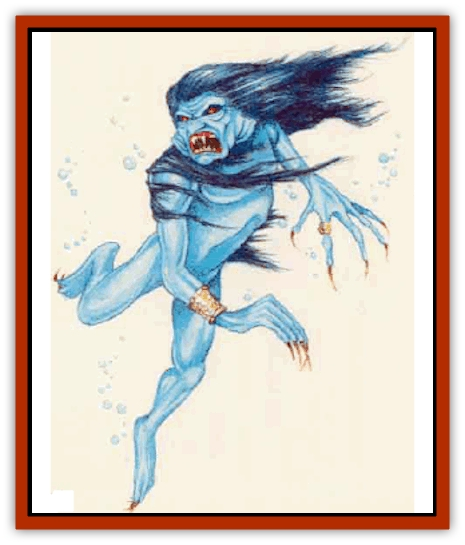

# Vampire - Velya

| Statistic | **Vampire, Velya** |
| --- | --- |
| **Activity Cycle:** | Night |
| **Alignment:** | Chaotic evil |
| **Armor Class:** | 3 |
| **Climate/Terrain:** | Ocean or swamp |
| **Damage/Attack:** | 1d8 (touch) or as animal |
| **Diet:** | Blood |
| **Frequency:** | Very rare |
| **Hit Dice:** | 7 |
| **Intelligence:** | Average to Very (10-12) |
| **Magic Resistance:** | Nil |
| **Morale:** | Fanatic (18) |
| **Movement:** | Sw 12 or as animal |
| **No. Appearing:** | 1 |
| **No. of Attacks:** | 1 or as animal |
| **Organization:** | Solitary |
| **Size:** | M (6' tall) |
| **Special Attacks:** | Energy drain, charm, shapechange |
| **Special Defenses:** | Regeneration, immune to normal weapons and some spells |
| **THAC0:** | 13 |
| **Treasure:** | F |
| **XP Value:** | 5,000 |

Velya are a form of underwater [[Vampire_General_Information|vampire]]. They were once surface dwellers who became undead through an ancient curse. In its natural form, a velya looks like a blue-skinned human with gills and clawed hands and feet. Velya in human form are comely but have a feral appearance, with wild eyes, tangled hair, and tattered, shroudlike dothing.

**Combat:** At will, velya can assume the form of a great white [[Shark|shark]], a [[Ray|manta ray]], or a current of water. Each change takes one round. The velya's Armor Class, hit points, THAC0, saving throws, and morale remain unchanged. In shark or manta ray form, the velya moves and attacks like the animal (with a swimming rate of 24 as a shark, or 18 as a manta ray). In watery form, a velya has a swimming rate of 18 but cannot attack or suffer damage; while some spells might affect the velya's watery form, none can inflict damage.

Velya in human form swim at a rate of 12 and can deliver a touch attack that inflicts 1d8 points of damage and drains one energy level. A velya is usually accompanied by 1d6 marine [[Wight|wights]] (with a land movement rate of 12 and a swimming rate of 9). A velya can surnmon 3d6 common sharks (with 3 to 6 HD each), which amve in 1d4 rounds.

Velya in human form can sing. A velya's song can be heard up to a mile away and can *charm* any living creature witkin 200 feet who fails a saving throw vs. spell. If the saving throw succeeds, the target is immune to that particular velya's song for 24 hours. The charm can be dispelled (as if it were a spell cast at 12th level), but such a victim remains susceptible to the song and can easily be charmed again until he or she makes a successful saving throw.

Characters slain by a velya return from death after three days and become wights under the velya's control. Only a transfusion of the velya's blood or the original curse, now forgotten, can make a velya.

Velya are immune to *sleep*, *charm*, and *hold* spells. Cold or electricity inflicts only half damage on them, and they are immune to nonmagical weapons. If damaged, a velya regenerates 2 hit points a round. Duing the day, a velya must rest in a submerged, lightless crypt. Velya crypts usually are ancient burial chambers hidden within sunken cities, but any enclosed, utterly dark space will serve. If a *bless* spell is cast on the crypt and a holy symbol is left in it, a velya can never rest there again, even if the holy symbol is later removed.

If a velya is reduced to 0 hit points or fewer, it automatically assumes its watery form and returns to its crypt, where it must rest a full day. Most velya maintain several locations, usually witbin cave complexes or wrecked ships, that they can use as crypts if the need arises. If a velya falls to rest in its crypt, it suffers 2d8 points of damage each day. These points cannot be regenerated until the velya rests in its crypt for a full day. A velya can be destroyed by exposing its whole body to open air, by driving a wooden stake through its heart while it lies in its crypt, or by *disintegration*.

A velya cannot approach within 10 feet of a strongly presented holy symbol, although it can attack from another direction. Velya cannot leave the water; those who do completely disintegrate after 1d4 rounds. The velya suffers no ill effects, however, so long as the least part of its body stays submerged. If the velya returns to the water before it disintegrates, it still loses half of its original hit points.

**Habitat/Society:** Velya are solitary creatures who prey mercilessly on the living. They are usually found in ancient cities wbicb have sunk beneath the waves.

**Ecology:** Like [[Vampire|vampires]], velya sustain themselves with blood drawn from living victims.

**Swamp Velya**

  Tbis form of velya is found in marshes, fens, and bogs. Its nonhuman forms include an [[Crocodile_Albino|albino crocodile]] (movement rate 6, swimming rate 12), a giant white eel (swimming rate 9), or a water current (swimming rate 18). Swamp velya can summon 3d6 normal crocodiles, which arrive in 1d4 rounds. Swamp velya are otherwise identical to ocean velya.

---
## Discovery & Documentation

**Source Publication:** Mystara Appendix (1994)
**Campaign Setting:** Mystara
**Author(s):** John Nephew, Teeuwynn Woodruff, John Terra, Skip Williams

### Other Creatures Found in This Source Book
   * [[Actaeon|Actaeon]]
   * [[Agarat|Agarat]]
   * [[Ash_Crawler|Ash Crawler]]
   * [[Baldandar|Baldandar]]
   * [[Bargda|Bargda]]
   * [[Bhut|Bhut]]
   * [[Bird_Mystara|Bird (Mystara)]]
   * [[Blackball|Blackball]]
   * [[Choker|Choker]]
   * [[Coltpixie|Coltpixie]]
   * [[Crone_of_Chaos|Crone of Chaos]]
   * [[Darkhood|Darkhood]]
   * [[Darkwing|Darkwing]]
   * [[Decapus|Decapus]]
   * [[Deep_Glaurant|Deep Glaurant]]
   * [[Diabolus|Diabolus]]
   * [[Dimensional_Warper|Dimensional Warper]]
   * [[Dragon_Mystara_Crystalline|Dragon (Mystara), Crystalline]]
   * [[Dragon_Mystara_Jade|Dragon (Mystara), Jade]]
   * [[Dragon_Mystara_Onyx|Dragon (Mystara), Onyx]]
   * [[Dragon_Mystara_Ruby|Dragon (Mystara), Ruby]]
   * [[Drake_Mystara|Drake (Mystara)]]
   * [[Dragonfly|Dragonfly]]
   * [[Dusanu|Dusanu]]
   * [[Elemental_of_Chaos_Air_Earth|Elemental of Chaos, Air/Earth]]
   * [[Elemental_of_Chaos_Fire_Water|Elemental of Chaos, Fire/Water]]
   * [[Elemental_of_Law_Air_Earth|Elemental of Law, Air/Earth]]
   * [[Elemental_of_Law_Fire_Water|Elemental of Law, Fire/Water]]
   * [[Familiar_Mystara|Familiar (Mystara)]]
   * [[Frost_Salamander|Frost Salamander]]
   * [[Fundamental_Air_Earth|Fundamental, Air/Earth]]
   * [[Fundamental_Fire_Water|Fundamental, Fire/Water]]
   * [[Gargantua_Mystara|Gargantua (Mystara)]]
   * [[Geonid|Geonid]]
   * [[Ghostly_Horde|Ghostly Horde]]
   * [[Giant_Athach|Giant, Athach]]
   * [[Giant_Hephaeston|Giant, Hephaeston]]
   * [[Golem_Drolem|Golem, Drolem]]
   * [[Golem_Mystara_I|Golem (Mystara) I]]
   * [[Golem_Mystara_II|Golem (Mystara) II]]
   * [[Golem_Mystara_III|Golem (Mystara) III]]
   * [[Gray_Philosopher|Gray Philosopher]]
   * [[Guardian_Warrior|Guardian Warrior]]
   * [[Gyerian|Gyerian]]
   * [[Herex|Herex]]
   * [[Hivebrood|Hivebrood]]
   * [[Horde|Horde]]
   * [[Hsiao|Hsiao]]
   * [[Huptzeen|Huptzeen]]
   * [[Hutaakan|Hutaakan]]
   * [[Imp_Mystara|Imp (Mystara)]]
   * [[Jellyfish_Giant_Mystara|Jellyfish, Giant (Mystara)]]
   * [[Kna|Kna]]
   * [[Kopru|Kopru]]
   * [[Lizard_Mystara|Lizard (Mystara)]]
   * [[Lizard-kin_Mystara|Lizard-kin (Mystara)]]
   * [[Lupin|Lupin]]
   * [[Lycanthrope_Werejaguar_Mystara|Lycanthrope, Werejaguar (Mystara)]]
   * [[Lycanthrope_Wereswine|Lycanthrope, Wereswine]]
   * [[Magen|Magen]]
   * [[Manikin|Manikin]]
   * [[Mek|Mek]]
   * [[Mujina|Mujina]]
   * [[Nagpa|Nagpa]]
   * [[Neh-thalggu|Neh-thalggu]]
   * [[Nightshade_Mystara|Nightshade (Mystara)]]
   * [[Nuckalavee|Nuckalavee]]
   * [[Pegataur|Pegataur]]
   * [[Phanaton|Phanaton]]
   * [[Plant_Dangerous_Mystara|Plant, Dangerous (Mystara)]]
   * [[Plasm|Plasm]]
   * [[Rakasta|Rakasta]]
   * [[Rock_Man|Rock Man]]
   * [[Sabreclaw|Sabreclaw]]
   * [[Sacrol|Sacrol]]
   * [[Scamille|Scamille]]
   * [[Shapeshifter|Shapeshifter]]
   * [[Shargugh|Shargugh]]
   * [[Shark-kin|Shark-kin]]
   * [[Sollux|Sollux]]
   * [[Spectral_Death|Spectral Death]]
   * [[Spectral_Hound|Spectral Hound]]
   * [[Spider-kin|Spider-kin]]
   * [[Spirit_Mystara|Spirit (Mystara)]]
   * [[Statue_Living|Statue, Living]]
   * [[Surtaki|Surtaki]]
   * [[Tabi|Tabi]]
   * [[Thoul|Thoul]]
   * [[Thunderhead|Thunderhead]]
   * [[Tiger_Ebon|Tiger, Ebon]]
   * [[Topi|Topi]]
   * [[Tortle|Tortle]]
   * [[White_Fang|White Fang]]
   * [[Worm_Mystara|Worm (Mystara)]]
   * [[Wyrd|Wyrd]]
   * [[Yowler|Yowler]]
   * [[Zombie_Lightning|Zombie, Lightning]]
