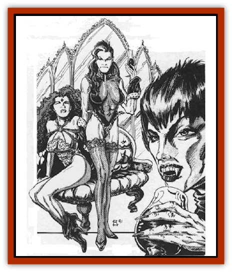

# Vampyre

| Statistic | **Vampyre** |
| --- | --- |
| **Activity Cycle:** | Night |
| **Alignment:** | Chaotic evil |
| **Armor Class:** | 4 |
| **Climate/Terrain:** | Any urban |
| **Damage/Attack:** | 1d4/1d4/1d6 |
| **Diet:** | Blood |
| **Frequency:** | Very rare |
| **Hit Dice:** | 8+3 |
| **Intelligence:** | Exceptional (15-16) |
| **Magic Resistance:** | See below |
| **Morale:** | Steady (11-12) |
| **Movement:** | 12 |
| **No. Appearing:** | 3d4 |
| **No. of Attacks:** | 3 |
| **Organization:** | Pack |
| **Size:** | M (6' tall) |
| **Special Attacks:** | See below |
| **Special Defenses:** | See below |
| **THAC0:** | 11 |
| **Treasure:** | F |
| **XP Value:** | 2,000 |

The vampyre is a foul creature that, like the much feared [[Vampire_Nosferatu|nosferatu]], exists on the blood of its victims. Unlike the nosferatu or its [[Vampire_General_Information|vampiric]] cousins, however, the vampyre is not undead. Thus, while they gain none of the powers of the undead, they have none of the undead weaknesses either.

Vampyres look much like normal humans or half elves. They stand just under six feet tall and are, as a rule, of exceptional physical beauty. Some rare examples are less handsome, and a few are actually repulsive to look upon, but these are by far the minority. Vampyres favor the dark and somber dress of the dead or their mourning kin, although they often employ the wanton garb of a harlot to lure victims into their clutches. Vampyres are generally slender of build, though their appearance hides exceptional physical strength, and have burning, dark eyes. Their skin is very pale, almost white, and their features are slightly feline, giving them a wild and exotic look. Their fingers end in deadly, curving claws; their teeth are long and sharp, with the canines showing clearly as fangs to any who are close enough to see them plainly.

Vampyres have no native language, but communicate in the tongue of those humans they live among. As a rule, any given vampire will know from 1-4 human or demihuman languages.

**Combat:** The vampyre will typically attack only helpless or surprised prey. Often, a single vampyre will move out into a crowd of humans at a tavern or similar gathering place to seek out a victim of the opposite sex. Once a suitable person is found, the vampyre lures them back to its lair with teasing promises of romance and companionship. No sooner will the door close behind the couple, however, than the vampyre's companions will spring to the attack. The foul and evil nature of these creatures may mean that the victim will linger on the edge of death for days, satisfying the hunger of these monsters as they drink only enough blood to keep their captive too weak to escape.

In combat, the vampyre can strike with its two ripping claws, inflicting 1d4 points of damage with each strike; it will also bite with its jagged, tearing teeth for an additional 1d6 points of damage. The saliva of a vampire carries in it a foul toxin that requires those bitten by the monster to make a saving throw vs. poison or become *charmed*. This saving throw is modified by a -1 penalty for every 2 points of damage done in the biting attack. Thus, a vampire who strikes for 3 points of damage with its bite causes its victim to save at -2. Charmed victims will not resist the attack of the vampyre that bit them, but they will fight on against other vampyres.

**Habitat/Society:** Vampyres live in packs, usually consisting of no more than a dozen individuals (evenly mixed between males and females) and a half dozen young. They seldom encounter other packs, but when they do the two bands will join together in a few days of murderous feasting and horrific slaughter of victims.

At these times, the vampyres will mate with members from the other group and, in 6 months, new vampyres will be born. The young are virtually helpless until they reach the age of 5, at which time they are able to fight as half-strength adults. When they reach the age of 10, they are fully grown and must undergo a ritual to prove that they are no longer children. Usually, this means making an unassisted kill.

The lair of a pack of vampyres may seem to be a completely normal human home - until they spring their trap and lash out at those in their presence. On rare occasions, a pack of vampires will actually work to pass themselves off as members of a community, holding down jobs and making their bloody feeding habits a dark secret.

**Ecology:** Vampyres are fierce hunters who fill the same ecological niche as [[Cat_Great|tigers]] or [[Wolf|wolves]] - save that their prey is human. Long ago, before man was an intelligent and social animate they had their place. Now, they are nightmarish creatures that stalk the weak and innocent, fulfilling a task no longer needed.

---
## Discovery & Documentation

**Source Publication:** MC10 Ravenloft Appendix I (1989)
**Campaign Setting:** Planescape
**Author(s):** William W. Connors

### Other Creatures Found in This Source Book
   * [[Bastellus|Bastellus]]
   * [[Bat_Ravenloft|Bat (Ravenloft)]]
   * [[Bowlyn|Bowlyn]]
   * [[Broken_One|Broken One]]
   * [[Bussengeist|Bussengeist]]
   * [[Darkling|Darkling]]
   * [[Doom_Guard|Doom Guard]]
   * [[Doppelganger_Plant|Doppelganger Plant]]
   * [[Elemental_Ravenloft|Elemental (Ravenloft)]]
   * [[Ermordenung|Ermordenung]]
   * [[Ghoul_Lord|Ghoul Lord]]
   * [[Goblyn|Goblyn]]
   * [[Golem_III|Golem III]]
   * [[Golem_IV|Golem IV]]
   * [[Golem_Ravenloft|Golem (Ravenloft)]]
   * [[Grim_Reaper|Grim Reaper]]
   * [[Human_Abber_Nomad|Human, Abber Nomad]]
   * [[Human_Ravenloft|Human (Ravenloft)]]
   * [[Imp_Assassin|Imp, Assassin]]
   * [[Impersonator|Impersonator]]
   * [[Lycanthrope_Werebat|Lycanthrope, Werebat]]
   * [[Lycanthrope_Wereraven|Lycanthrope, Wereraven]]
   * [[Mist_Horror|Mist Horror]]
   * [[Mummy_Greater|Mummy, Greater]]
   * [[Quevari|Quevari]]
   * [[Quickwood|Quickwood]]
   * [[Ravenkin|Ravenkin]]
   * [[Reaver|Reaver]]
   * [[Scarecrow_Ravenloft|Scarecrow (Ravenloft)]]
   * [[Shadow_Fiend|Shadow Fiend]]
   * [[Skeleton_Giant|Skeleton, Giant]]
   * [[Strahd's_Skeletal_Steed|Strahd's Skeletal Steed]]
   * [[Treant_Evil|Treant, Evil]]
   * [[Treant_Undead|Treant, Undead]]
   * [[Valpurgeist|Valpurgeist]]
   * [[Vampire_Dwarf|Vampire, Dwarf]]
   * [[Vampire_Elf|Vampire, Elf]]
   * [[Vampire_Gnome|Vampire, Gnome]]
   * [[Vampire_Halfling|Vampire, Halfling]]
   * [[Vampire_General_Information|Vampire, General Information]]
   * [[Vampire_Kender|Vampire, Kender]]
   * [[Widow_Red|Widow, Red]]
   * [[Wolfwere_Greater|Wolfwere, Greater]]
   * [[Zombie_Lord|Zombie Lord]]
