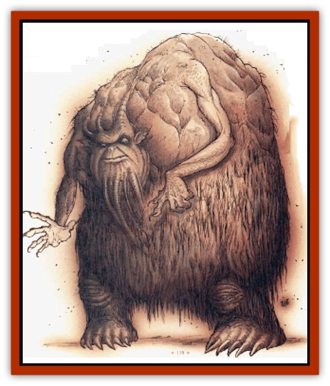
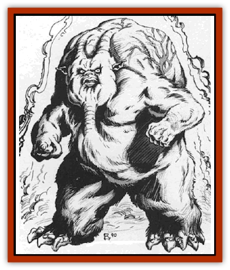

# Vaporighu

| Statistic | **Vaporighu** |
| --- | --- |
| **Activity Cycle:** | Any |
| **Alignment:** | Neutral evil |
| **Armor Class:** | 0 |
| **Climate/Terrain:** | Gehenna |
| **Damage/Attack:** | 1d6+2/1d6+2 |
| **Diet:** | Carnivore |
| **Frequency:** | Rare |
| **Hit Dice:** | 10 |
| **Intelligence:** | High (13-14) |
| **Magic&nbsp;Resistance:** | 40% |
| **Morale:** | Elite (13-14) |
| **Movement:** | 9 |
| **No. Appearing:** | 1 |
| **No. of Attacks:** | 2 |
| **Organization:** | Solitary |
| **Size:** | L (8' tall) |
| **Special Attacks:** | Poison gas, corrosion, fear |
| **Special Defenses:** | Hit only by cold iron weapons |
| **THAC0:** | 11 |
| **Treasure:** | C,M |
| **XP Value:** | 14,000 |

Vaporighu are evil creatures of the underworld that lurk in the foul furnaces of Gehenna. They prey on unwary travelers, lesser fiends, and the occasional petitioner or <a href="larva">larva.php</a>. Unlike many fiends of similar strength, vaporighu don't seem to have any causes or motives; they exist only to cause pain and suffering to any sod unfortunate enough to cross their path.

A vaporighu's a disgusting, horrifying thing to behold. Its body is vaguely humanoid, but bloated and grotesque. Their mottled skin varies from sickly pink to purple and glistens with a foul, corrosive slime. Pulsating arteries writhe just below the surface of the vaporighu's skin in a hideous dance of living gore. Dense, matted fur clings to their forearms, lower legs, and torso, stinking of death and decay. The creature wheezes loudly with a wet, bellowslike sound, and its stench'll linger for days in a place it's passed through.

Vaporighu like to lurk in spots where other creatures're bound to come by sooner or later, like commonly-used paths, Gehenna's few foul springs, or near places where portals appear. They savagely attack anything short of a greater <a href="yugoloth.php">yugoloth</a>, and sometimes even those. Vaporighu don't speak any language known to humans or their kind, and probably wouldn't have much to say to a planar or prime traveler in any event.

**Combat:** Vaporighu radiate a powerful area of fear and horror that can overwhelm most bashers. The mere sight of a vaporighu forces creatures of 3 HD or less to survive a saving throw versus spell with or be paralyzed with terror for 1d6 rounds, unable to move, attack, or take any action except cower in fright. Creatures of 7 HD or less must successfully save versus spell with a -4 penalty or flee for 1d6 rounds in fear. Creatures of more than 7 HD save with no penalty and flee for only 1d4 rounds if they fail. The vaporighu'll rarely attempt to run down a fleeing character and prefers to concentrate its attacks on anything too frightened to move.

Should a cutter resist the urge to escape from the vaporighu's presence, he'll find that he probably should've run when he had the chance. In melee, the creature strikes twice per round with its thick-fingered hands, inflicting 1d6+2 points of damage with each hit. Each time the vaporighu strikes an opponent, it leaves corrosive slime on its victim that slowly destroys clothing and armor.

If the slime isn't cleaned off within an hour, any clothing affected rots completely away, and armor begins to lose 1 AC value for every three hours it's allowed to continue disintegrating. For example, if the vaporighu's slime wasn't cleaned off of chainmail (base AC 5) in the first hour, the armor degrades to AC 6 three hours after that, AC 7 six hours later, and so on. If the armor's cleaned off after it loses an AC value, the corrosion stops but the armor remains at its reduced value. Magical clothing or armor gains a single item saving throw versus acid to resist the degradation.

The vaporighu's favorite and most dangerous attack is its foul breath. Once per turn, the creature bloats up to almost twice its normal size, and then expels a poisonous cloud of bright green gas 10 feet in diameter directly in front of it. Any creature in the area of effect must survive a saving throw versus poison or be slain. Creatures who survive the attack must leave the cloud immediately or suffer 1d10 points of damage each round they remain inside. The vaporighu's poisonous gas lingers for 2d4 rounds. It works equally well by inhalation or contact, so a basher shouldn't think that holding his breath'll help him any.

Like many creatures of the Lower Planes, vaporighu command several spell-like powers, usable at the 10th level of ability. These include *animate object*, *continual light*, *enlarge*, *fly*, *misdirection*, *produce flame*, *sleep*, and *trip*. Vaporighu can use these powers one at a time, once per round, at will. In addition, they can *gate* 1 to 4 <a href="nighthag.php">night hags</a> once per day with a 25% chance of success. Vaporighu hate to do this since they'll have to reward the hags somehow for their service.

One last thing a cutter ought to know before he thinks about starting a scrap with a vaporighu: Only weapons forged of cold-wrought iron can harm them. Enchanted weapons can't injure the creatures no matter how powerful the weapon is, unless it's made of cold-wrought iron (and then, only the base damage applies; the additional enchanted damage is negated). More than a few bloods've tumbled to this fact the hard way.

Vaporighu can't be surprised in Gehenna, but on the other hand they're incapable of surprising anything with ears or a sense of smell.

**Habitat/Society:** Vaporighu are loners that have little nr no contact with others of their kind. In fact, there's no way to say whether they just dislike each other, respect each other's territory, or can't stand to see another of their kind – no one's ever seen two vaporighu together, so there's no basis for a hypothesis.

Very few creatures've got the means or temperament to communicate with vaporighu. By all accounts, they're petty and cruel creatures who delight in causing injury to anything they meet. Their appetites're said to be insatiable, a gnawing pain that tortures vaporighu throughout eternity: this might explain the creature's violence and savagery.

Vaporighu like to find a good hunting ground and stay there, marking several ambush sites and lairs in a fairly localized area. They're not particularly fond of treasure, but tend to accumulate the remains of countless victims in their main lair.

**Ecology:** Vaporighu are creatures of supernatural vileness and evil, and have no place in any kind of sane ecology. On the other hand, the burning mountains of Gehenna don't have a sane ecology by any stretch of the imagination.

Vaporighu feed on anything weaker than themselves without regard for the consequences. Some sages've speculated that vaporighu are materializations or embodiments of the foulness of Gehenna, while others say that the creatures were once a variety of yugoloth that forgot how to leave the plane.

---
## Discovery & Documentation

**Source Publication:** MC8 Outer Planes Appendix (1990)
**Campaign Setting:** Planescape
**Author(s):** Timothy B. Brown, Jamie LaFountain

### Other Creatures Found in This Source Book
   * [[Aasimon_Agathinon|Aasimon, Agathinon]]
   * [[Aasimon_Deva|Aasimon, Deva]]
   * [[Aasimon_Light|Aasimon, Light]]
   * [[Aasimon_General_Information|Aasimon, General Information]]
   * [[Aasimon_Planetar|Aasimon, Planetar]]
   * [[Aasimon_Solar|Aasimon, Solar]]
   * [[Air_Sentinel|Air Sentinel]]
   * [[Animal_Lord|Animal Lord]]
   * [[Archon|Archon]]
   * [[Baatezu_Lesser_Abishai|Baatezu, Lesser, Abishai]]
   * [[Baatezu_Greater_Amnizu|Baatezu, Greater, Amnizu]]
   * [[Baatezu_Lesser_Barbazu|Baatezu, Lesser, Barbazu]]
   * [[Baatezu_Greater_Cornugon|Baatezu, Greater, Cornugon]]
   * [[Baatezu_Lesser_Erinyes|Baatezu, Lesser, Erinyes]]
   * [[Baatezu_General_Information|Baatezu, General Information]]
   * [[Baatezu_Greater_Gelugon|Baatezu, Greater, Gelugon]]
   * [[Baatezu_Lesser_Hamatula|Baatezu, Lesser, Hamatula]]
   * [[Baatezu_Lemure|Baatezu, Lemure]]
   * [[Baatezu_Least_Nupperibo|Baatezu, Least, Nupperibo]]
   * [[Baatezu_Lesser_Osyluth|Baatezu, Lesser, Osyluth]]
   * [[Baatezu_Greater_Pit_Fiend|Baatezu, Greater, Pit Fiend]]
   * [[Baatezu_Least_Spinagon|Baatezu, Least, Spinagon]]
   * [[Balaena|Balaena]]
   * [[Bariaur|Bariaur]]
   * [[Bebilith|Bebilith]]
   * [[Bodak|Bodak]]
   * [[Dog_Moon|Dog, Moon]]
   * [[Dragon_Adamantite|Dragon, Adamantite]]
   * [[Einheriar|Einheriar]]
   * [[Gehreleth|Gehreleth]]
   * [[Githyanki|Githyanki]]
   * [[Githzerai|Githzerai]]
   * [[Hordling|Hordling]]
   * [[Lammasu_Celestial|Lammasu, Celestial]]
   * [[Larva|Larva]]
   * [[Maelephant|Maelephant]]
   * [[Marut|Marut]]
   * [[Mediator|Mediator]]
   * [[Mortai|Mortai]]
   * [[Night_Hag|Night Hag]]
   * [[Nightmare|Nightmare]]
   * [[Noctral|Noctral]]
   * [[Per|Per]]
   * [[Phoenix|Phoenix]]
   * [[Slaad|Slaad]]
   * [[Tanar'ri_Greater_Babau|Tanar'ri, Greater, Babau]]
   * [[Tanar'ri_Greater_Chasme|Tanar'ri, Greater, Chasme]]
   * [[Tanar'ri_Greater_Nabassu|Tanar'ri, Greater, Nabassu]]
   * [[Tanar'ri_Least_Dretch|Tanar'ri, Least, Dretch]]
   * [[Tanar'ri_Least_Manes|Tanar'ri, Least, Manes]]
   * [[Tanar'ri_Least_Rutterkin|Tanar'ri, Least, Rutterkin]]
   * [[Tanar'ri_Lesser_Alu-Fiend|Tanar'ri, Lesser, Alu-Fiend]]
   * [[Tanar'ri_Lesser_Bar-Lgura|Tanar'ri, Lesser, Bar-Lgura]]
   * [[Tanar'ri_Lesser_Cambion|Tanar'ri, Lesser, Cambion]]
   * [[Tanar'ri_Lesser_Succubus|Tanar'ri, Lesser, Succubus]]
   * [[Tanar'ri_Guardian_Molydeus|Tanar'ri, Guardian, Molydeus]]
   * [[Tanar'ri_General_Information|Tanar'ri, General Information]]
   * [[Tanar'ri_True_Balor|Tanar'ri, True, Balor]]
   * [[Tanar'ri_True_Glabrezu|Tanar'ri, True, Glabrezu]]
   * [[Tanar'ri_True_Hezrou|Tanar'ri, True, Hezrou]]
   * [[Tanar'ri_True_Marilith|Tanar'ri, True, Marilith]]
   * [[Tanar'ri_True_Nalfeshnee|Tanar'ri, True, Nalfeshnee]]
   * [[Tanar'ri_True_Vrock|Tanar'ri, True, Vrock]]
   * [[Titan|Titan]]
   * [[Translator|Translator]]
   * [[T'uen-rin|T'uen-rin]]
   * [[Warden_Beast|Warden Beast]]
   * [[Yugoloth_Greater_Arcanaloth|Yugoloth, Greater, Arcanaloth]]
   * [[Yugoloth_Lesser_Dergoloth|Yugoloth, Lesser, Dergoloth]]
   * [[Yugoloth_Lesser_Hydroloth|Yugoloth, Lesser, Hydroloth]]
   * [[Yugoloth_General_Information|Yugoloth, General Information]]
   * [[Yugoloth_Lesser_Mezzoloth|Yugoloth, Lesser, Mezzoloth]]
   * [[Yugoloth_Greater_Nycaloth|Yugoloth, Greater, Nycaloth]]
   * [[Yugoloth_Lesser_Piscoloth|Yugoloth, Lesser, Piscoloth]]
   * [[Yugoloth_Greater_Ultroloth|Yugoloth, Greater, Ultroloth]]
   * [[Yugoloth_Lesser_Yagnoloth|Yugoloth, Lesser, Yagnoloth]]
   * [[Zoveri|Zoveri]]
