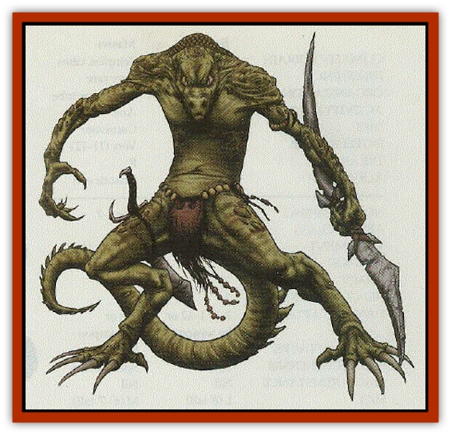

# Varanid

| Statistic | **Varanid** |
| --- | --- |
| **Activity Cycle:** | Any |
| **Alignment:** | Neutral |
| **Armor Class:** | 7 |
| **Climate/Terrain:** | Tropical |
| **Damage/Attack:** | 1-3/1-3/1-4/2-5 or by weapon |
| **Diet:** | Carnivore |
| **Frequency:** | Very rare |
| **Hit Dice:** | 2 |
| **Intelligence:** | Average (8-10) |
| **Magic Resistance:** | Nil |
| **Morale:** | Champion (15) |
| **Movement:** | 15 |
| **No. Appearing:** | 1-6 or 8-15 (1d8+7) |
| **No. of Attacks:** | 4 or 3 |
| **Organization:** | Tribal |
| **Size:** | M (6-7' tall) |
| **Special Attacks:** | Nil |
| **Special Defenses:** | Nil |
| **THAC0:** | 19 |
| **Treasure:** | D |
| **XP Value:** | 65 / Lasher/war leader: 120 / Commander: 270 / Sshistak: 650 / Shaman, 3rd: 175 / Shaman, 5th: 420 |

The natives of certain tropical islands live in fear of the reptilian warriors who strike in the darkness to take their children and plunder their villages. Fast, lithe, agile, and vicious, varanids are a warrior race of bipedal komodo dragons. When not on the hunt, they are a quiet, harsh, emotionless people. In combat, though,they are bereft of fear or mercy.

**Combat:** Vavanids have a full array of natural weaponry: talons, teeth, and a 6'-long whiplike tail ridged with razor-sharp scales. They also enjoy using weapons, and they often enter combat with a strange array of curved axes, swords with blades at both ends of the pommel, double-headed spears, barbed nets, and star-shaped punch daggers, all of their own bizarre design. They have a natural affinity for weapons and quickly learn to use whatever weapons they find. Almost every member of the race is ambidextrous, and warriors usually fight with two weapons and strike with their tails in the same round. They never use shields, which they consider to be for the weak, and they wear only small pieces of armor.

For every ten warriors present, there is a 3-HD "lasher" whose task is to whip the warriors into battle fury and kill any who dare to flee. In small parties, one of the lashers acts as the war leader. For every three lashers there is an additional 5-HD commander. Every tribe has a 7-HD warrior-king (or sshistak) and a shaman (5th-level priest). The priest has 1-4 3rd-level acolytes. Varanids worship a minor pantheon of reptilian gods.

As ferocious as they are, varanid warriors are wily, cunning fighters. They use every dirty trick and guerilla tactic wihtout reservation. Because varanid minds are so alien, human opponents can never be sure what to expect. Hit-and-run attacks, sudden ambushes, night fighting, decoys, snares, spoiler runs, and even terror tactics are all part of their strategy.

**Habitat/Society:** Varanids live in dense jungles, on tropical islands, or amid wide savannas. They typically gather in tribes of about 100-150 individuals, including their young. They tend to build hut villages around natural formations.

Varanids live to prove themselves in war. The best warrior, in their minds, makes the best leader. Ironically, when not fighting they are a reserved, peaceful species. They rarely fight among themselves and spend their days spear fishing, swimming, repairing huts, and sunning themselves on rocks. If carefully approached, they are not averse to talking or trading. Varanids speak a highly developed dialect of the common [[Lizard_Man|Lizard Man]] tongue that warm-bloods can learn with practice.

Varanids live by a stoic philosophy of strength and ability. To them, there is no excuse for failure. Unavoidable accident is one thing; allowing yourself to fall for a trick is another. They feel that their defeated enemies wanted to be beaten. If not, why did they not make themselves stronger than the varanids?

From time to time, varanid warriors wander off to prove themselves on other battlegrounds. Singly or in small groups, they drift into civilized territories where they offer themselves as mercenaries or assassins. They do not like to work as bodyguards, though, as standing around waiting for a fight to happen is against their nature. They are predators, not protectors.

**Ecology:** Varanids live by a strict meat diet. They generally prefer fish, birds, and eggs but will eat anything that bleeds. Varanids actively search for new settlements to raid and new fights to pick.

---
## Discovery & Documentation

**Source Publication:** Dragon268 (2000)
**Campaign Setting:** Dragon Magazine
**Author(s):** Michael Kuciak, Pete Venters

### Other Creatures Found in This Source Book
   * [[Agrutha|Agrutha]]
   * [[Crocodilian|Crocodilian]]
   * [[Geckonid|Geckonid]]
