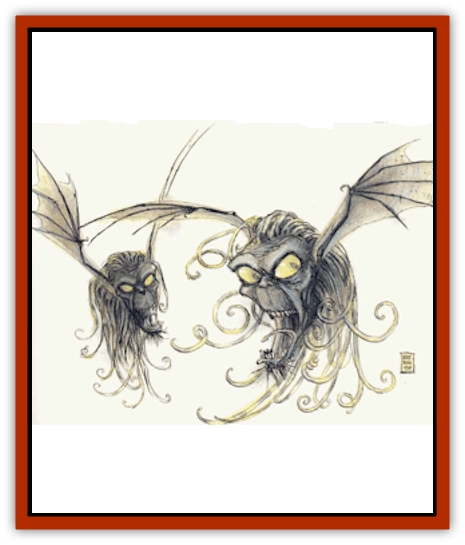

# Vargouille

| Statistic | **Vargouille** |
| --- | --- |
| **Activity Cycle:** | Darkness |
| **Alignment:** | Neutral evil |
| **Armor Class:** | 8 |
| **Climate/Terrain:** | Any ruins, burial place, or subterranean |
| **Damage/Attack:** | 1d4 |
| **Diet:** | Carnivore |
| **Frequency:** | Very rare |
| **Hit Dice:** | 1+1 |
| **Intelligence:** | Low (5-7) |
| **Magic Resistance:** | Nil |
| **Morale:** | Average (8-10) |
| **Movement:** | Fl 12 (B) |
| **No. Appearing:** | 1-20 |
| **No. of Attacks:** | 1 |
| **Organization:** | Pack |
| **Size:** | S (head-sized with 3' wingspan) |
| **Special Attacks:** | Poison, fear; see below |
| **Special Defenses:** | Nil |
| **THAC0:** | 19 |
| **Treasure:** | Nil |
| **XP Value:** | 650 |

These horrid creatures are products of the Lower Planes. Though found mainly in the haunted reaches of the Lower Planes, they are sometimes encountered in underground places on the Prime or in the Outlands, such as caverns or the sewers or catacombs of large cities.

The vargouille has a hideous, humanlike head with [[Bat|bat]]like wings, fangs, and a crown and fringe of writhing tentacles. Its eyes glow with an eerie green light, and it wears a horrible sneer. Vargouilles do not speak, but they shriek when they attack.

**Combat:** The sight of a vargouille, combined with its terrifying shriek, causes fear. All who view the monster and hear its shriek must save vs. spell; those who fail are paralyzed with fear until attacked by the monster. The initial attack on a paralyzed victim always hits. A victim who has been attacked or who has saved against the effect is immune to the paralysis for the rest of the encounter.

Vargouilles have 120' infravision. They hate light and seek to extinguish light sources, such as torches and lamps. *Continual light* and daylight blind the monster, so it avoids these.

The bite of a vargouille contains a dreadful poison that prevents normal healing; if a creature's bitten fails to save vs. poison, the bite damage is permanent, unless powerful magic is used. A *heal* spell restores 1d8 hp; *regenerate* restores 3d8 hp at 1 hp per round; and a carefully worded *wish* restores all lost hit points or the ability to heal through other means.

The vargouille can also kiss a paralyzed victim, who then begins a bizarre transformation. In 1d6 hours, the first signs appear, as the victim loses all hair on his or her head. In another 1d6 hours, ears grow long and pointed, teeth become fangs, tentacles sprout from head and chin, and the victim loses 1d6 points each from Intelligence and Charisma. In another 1d6 hours the transformation finishes, and the character's head resembles a vargouille, complete with batlike wings in place of ears. At this point, the head breaks away from the body (which dies), becomes a fully-functional vargouille, and flies off.

The transformation never ends during daylight hours. A *continual light* spell can halt the transformation's progress, but not cure it. *Cure disease* cast by a priest of 7th level or higher reverses the transformation.

**Habitat/Society:** Vargouilles usually remain below ground or inside buildings, but they sometimes fly at night in search of prey. In ruins, they appear at dusk and disappear by dawn.

The vargouille have spread from the Lower Planes by infecting travelers and adventurers with their race-perpetuating disease, and they are now found even in thriving cities. There they usually stay underground, waiting for explorers, rather than risk discovery by flying in view of so many people.

Vargouilles have no culture beyond their pack mentality; only the strong survive, and the strongest rules. Like some other beasts, they fall upon weak or wounded members of their own pack to finish them off.

**Ecology:** Though a vargouille collects no treasure, it also does not remove the bodies or possessions of victims, so there may be a few items of incidental treasure lying about its lair.

Vargouilles are vicious predators with few natural enemies, though good creatures would like to see them become extinct. They are also sometimes hunted by the friends of victims who transformed into the thing. Vargouilles prefer living prey, but they also eat carrion and weak pack members as well.

Vargouilles are rumored to be the creations of a powerful wizard named Rozvankee the Strategist. Her particular genius lay in the creation of terror weapons of the worst sort. During a prolonged siege against a neighboring duchy, she created the first nine of the creatures and had them released behind enemy lines. The resulting panic led to morale problems, and her shock troops overwhelmed the enemy. In the fullness of time, Rozvankee grew tired of terrestrial affairs, and upon achieving [[Lich|lich]]dom she retired to one of the watery layers of the Abyss. There she practices piracy in a three-masted ship made from the bones of her enemies.

Rozvankee took several hundred vargouilles with her, and she has been known to give small flocks to powerful tanar'ri in exchange for favors and protection. The creatures' one drive is procreation, and so they tend to overrun any area that does not put up organized resistance.

Some tales report that an upstart sorcerer (with nothing like Rozvankee's talent) found a few shields and banners bearing her family coat of arms. The story goes that he then commanded a flock of vargouilles simply by presenting them the signs to them. He established an effective power base until the lich showed up and dissuaded him from the practice. This legend may or may not be true, but over the years sales of the shields and banners have started many a con man's fortune.

---
## Discovery & Documentation

**Source Publication:** MC Planescape I (1991)
**Campaign Setting:** Planescape
**Author(s):** various

### Other Creatures Found in This Source Book
   * [[Aasimon_Agathinon|Aasimon, Agathinon]]
   * [[Aasimon_Deva|Aasimon, Deva]]
   * [[Aasimon_Light|Aasimon, Light]]
   * [[Aasimon_General_Information|Aasimon, General Information]]
   * [[Aasimon_Planetar|Aasimon, Planetar]]
   * [[Aasimon_Solar|Aasimon, Solar]]
   * [[Animal_Lord|Animal Lord]]
   * [[Baatezu_Lesser_Abishai|Baatezu, Lesser, Abishai]]
   * [[Baatezu_Greater_Amnizu|Baatezu, Greater, Amnizu]]
   * [[Baatezu_Lesser_Barbazu|Baatezu, Lesser, Barbazu]]
   * [[Baatezu_Greater_Cornugon|Baatezu, Greater, Cornugon]]
   * [[Baatezu_Lesser_Erinyes|Baatezu, Lesser, Erinyes]]
   * [[Baatezu_General_Information|Baatezu, General Information]]
   * [[Baatezu_Greater_Gelugon|Baatezu, Greater, Gelugon]]
   * [[Baatezu_Lesser_Hamatula|Baatezu, Lesser, Hamatula]]
   * [[Baatezu_Lemure|Baatezu, Lemure]]
   * [[Baatezu_Least_Nupperibo|Baatezu, Least, Nupperibo]]
   * [[Baatezu_Lesser_Osyluth|Baatezu, Lesser, Osyluth]]
   * [[Baatezu_Greater_Pit_Fiend|Baatezu, Greater, Pit Fiend]]
   * [[Baatezu_Least_Spinagon|Baatezu, Least, Spinagon]]
   * [[Baku|Baku]]
   * [[Bariaur|Bariaur]]
   * [[Bebilith|Bebilith]]
   * [[Bodak|Bodak]]
   * [[Einheriar|Einheriar]]
   * [[Elemental_Grue_Chaggrin|Elemental Grue, Chaggrin]]
   * [[Elemental_Grue_Harginn|Elemental Grue, Harginn]]
   * [[Elemental_Grue_Ildriss|Elemental Grue, Ildriss]]
   * [[Elemental_Grue_Varrdig|Elemental Grue, Varrdig]]
   * [[Foo_Creature|Foo Creature]]
   * [[Gehreleth|Gehreleth]]
   * [[Githyanki|Githyanki]]
   * [[Githzerai|Githzerai]]
   * [[Hordling|Hordling]]
   * [[Hound_Yeth|Hound, Yeth]]
   * [[Imp|Imp]]
   * [[Incarnate|Incarnate]]
   * [[Larva|Larva]]
   * [[Maelephant|Maelephant]]
   * [[Marut|Marut]]
   * [[Mediator|Mediator]]
   * [[Mephit_General_Information|Mephit, General Information]]
   * [[Mephit_I_Air_Smoke|Mephit I (Air/Smoke)]]
   * [[Mephit_II_Earth_Ooze|Mephit II (Earth/Ooze)]]
   * [[Mephit_III_Fire_Radiant|Mephit III (Fire/Radiant)]]
   * [[Mephit_IV_Water_Ice|Mephit IV (Water/Ice)]]
   * [[Mephit_V_Dust_Salt|Mephit V (Dust/Salt)]]
   * [[Mephit_VI_Lightning_Mineral|Mephit VI (Lightning/Mineral)]]
   * [[Mephit_VII_Magma_Ash|Mephit VII (Magma/Ash)]]
   * [[Mephit_VIII_Mist_Steam|Mephit VIII (Mist/Steam)]]
   * [[Night_Hag|Night Hag]]
   * [[Nightmare|Nightmare]]
   * [[Per|Per]]
   * [[Shadow_Fiend|Shadow Fiend]]
   * [[Slaad|Slaad]]
   * [[Tanar'ri_Greater_Babau|Tanar'ri, Greater, Babau]]
   * [[Tanar'ri_Greater_Chasme|Tanar'ri, Greater, Chasme]]
   * [[Tanar'ri_Greater_Nabassu|Tanar'ri, Greater, Nabassu]]
   * [[Tanar'ri_Greater_Wastrilith|Tanar'ri, Greater, Wastrilith]]
   * [[Tanar'ri_Least_Dretch|Tanar'ri, Least, Dretch]]
   * [[Tanar'ri_Least_Manes|Tanar'ri, Least, Manes]]
   * [[Tanar'ri_Least_Rutterkin|Tanar'ri, Least, Rutterkin]]
   * [[Tanar'ri_Lesser_Alu-Fiend|Tanar'ri, Lesser, Alu-Fiend]]
   * [[Tanar'ri_Lesser_Bar-Lgura|Tanar'ri, Lesser, Bar-Lgura]]
   * [[Tanar'ri_Lesser_Cambion|Tanar'ri, Lesser, Cambion]]
   * [[Tanar'ri_Lesser_Succubus|Tanar'ri, Lesser, Succubus]]
   * [[Tanar'ri_Guardian_Molydeus|Tanar'ri, Guardian, Molydeus]]
   * [[Tanar'ri_True_Balor|Tanar'ri, True, Balor]]
   * [[Tanar'ri_True_Glabrezu|Tanar'ri, True, Glabrezu]]
   * [[Tanar'ri_True_Hezrou|Tanar'ri, True, Hezrou]]
   * [[Tanar'ri_True_Marilith|Tanar'ri, True, Marilith]]
   * [[Tanar'ri_True_Nalfeshnee|Tanar'ri, True, Nalfeshnee]]
   * [[Tanar'ri_True_Vrock|Tanar'ri, True, Vrock]]
   * [[Tiefling|Tiefling]]
   * [[Yugoloth_Greater_Arcanaloth|Yugoloth, Greater, Arcanaloth]]
   * [[Yugoloth_Lesser_Dergoloth|Yugoloth, Lesser, Dergoloth]]
   * [[Yugoloth_Lesser_Hydroloth|Yugoloth, Lesser, Hydroloth]]
   * [[Yugoloth_General_Information|Yugoloth, General Information]]
   * [[Yugoloth_Lesser_Mezzoloth|Yugoloth, Lesser, Mezzoloth]]
   * [[Yugoloth_Lesser_Piscoloth|Yugoloth, Lesser, Piscoloth]]
   * [[Yugoloth_Greater_Ultroloth|Yugoloth, Greater, Ultroloth]]
   * [[Yugoloth_Lesser_Yagnoloth|Yugoloth, Lesser, Yagnoloth]]
