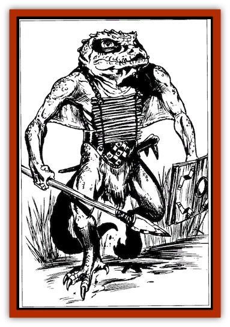

# Varkha

| Statistic | **Varkha** |
| --- | --- |
| **Activity Cycle:** | Any |
| **Alignment:** | Lawful evil |
| **Armor Class:** | 6 |
| **Climate/Terrain:** | Subterranean (Underdark) |
| **Damage/Attack:** | 1d6/1d6 or by weapon |
| **Diet:** | Carnivore |
| **Frequency:** | Uncommon |
| **Hit Dice:** | 1 |
| **Intelligence:** | Average (8-10) |
| **Magic Resistance:** | Nil |
| **Morale:** | Average (8-10) |
| **Movement:** | 12, Sw 9 |
| **No. Appearing:** | 5-50 (75-150) |
| **No. of Attacks:** | 2 (or 1 weapon) |
| **Organization:** | Tribal |
| **Size:** | M (4-5' tall) |
| **Special Attacks:** | Nil |
| **Special Defenses:** | Nil |
| **THAC0:** | 19 |
| **Treasure:** | J,M (D) |
| **XP Value:** | 35 |

Varkhas are a race of short, brutale aquatic [[Lizard_Man|lizard men]] that hunt in the caverns and waters of the Underdark. These creatures are smaller than their surface-dwelling cousins (standing only four to five feet tall) but possess many similar characteristics. Varkha scale color ranges from dark gray to deep green, and their average tail length is two to two three.

Unlike lizard men, the varkha have large, photosensitive eyes, set toward the sides of their head, much like those of a [[Frog|frog]]. In addition, they have a layer of webbing underneath their arms that connects with their torsos. When fully extended, this webbing facilitates their movement in the underground lakes and rivers that as their primary hunting grounds. They keep their sparse belongings in leather harnesses.

Varkhas have their own language, similar to that of surface lizard men, but more gurgling.

**Combat:** Like many subterranean creatures, varkhas fight at -1 in illumination as bright as sunlight. Though not particularly powerful, they have adapted their hunting strategies to make maximum use of their numbers. Hunting varkhaa often attempt to herd prey into a watery cavern. Once there, they use their superior numbers and swimming skills to kill their victims.

In combat, varkhas use their vicious claws to inflict 1d6 points of damage. In addition, some varkhas fashion crude weapons from bones and sharpened rocks. These are usually primitive spears or other missile weapons.

For every 15 varkhas encountered, there is also one *sllith* (hunt leader) with 2 Hit Dice, as well as a 35% chance for a shaman with 2 HD and the abilities of a 2nd-level priest. If 40 varkhas are encountered, there will be two *slliths*, a 2 Hit Die shaman, and a 3 Hit Die *gsssrat* (master of the hunt). Hunzing parties of 50 varkhas are always led by a 4 Hit Die *gaakth* (sub-chief) and a 3rd-level shaman.

**Habitat/Society:** The varkhas have a close-knit tribal society. Tribal lairs are found deep in the moist caverns of the Underdark, and usually are home to 75-150 varkhas. Responsibility for the varkha tribe falls squarely on the *tssri* (chief), a 5 Hit Die creature with high intelligence.

In tribal lairs, 25% of all varkhas are female. These females usually reside in breeding caverns adjacent to the hunters' caverns. Though often brooding over eggs, varkha females share the responsibilities of the hunt with their male counterparts; eggless females often accompany a hunting party. Brooding varkhas defend the breeding caverns from invaders and other predators with incredible ferocity, adding +1 to their attack and damage rolls until they neutralize the danger.

Varkha lairs of 70 or more also keep 1-3 subterranean lizards as guardians. These large creatures are controlled by the chief and sub-chiefs of the lair. They often position the giant lizards outside the breeding caves (if space permits) in times of war.

**Giant Subterranean Lizard:** AC 5; MV 12; HD 6; THAC0 15; #AT 1; Dmg 2d6; SA Seize (attack roll 20 inflicts 2x damage, plus 2d6/round thereafter); AL N; Int Non-; SZ L; ML Ave (8-10); XP 650. Some tribes have albino lizards, which attack at a -1 penalty in sunlight brightness. Some tribes have lizards with tongues that shoot to 20 feet; man-sized or smaller prey are drawn into the mouth and bitten next round unless a bend bars roll is made. A tribe usually has lizards of the same type.

**Ecology:** Varkhas have many natural enemies - they are prey as well as predator in the depths of the Underdark. [[Troglodyte|Troglodytes]] prey on them whenever they get the chance, unless deterred by greater numbers. Varkhas have a deep (and mutual) hatred for [[Gibberling|gibberlings]], attacking them to the exclusion of all else when the opportunity presents itself. [[Elf_Drow|Drow]] despise the crude varkhas but occasionally use them as slaves in their large cities.

---
## Discovery & Documentation

**Source Publication:** Monstrous Compendium, 1997 Annual, Volume 4 (1995)
**Campaign Setting:** Advanced Dungeons & Dragons 2nd Edition
**Author(s):** Jon Pickens

### Other Creatures Found in This Source Book
   * [[Anemone_Giant_Sea|Anemone, Giant Sea]]
   * [[Asperii|Asperii]]
   * [[Bainligor|Bainligor]]
   * [[Beast_of_Chaos|Beast of Chaos]]
   * [[Blindheim|Blindheim]]
   * [[Bloodsipper_Far_Realm|Bloodsipper (Far Realm)]]
   * [[Bulette_Gohlbrorn|Bulette, Gohlbrorn]]
   * [[Child_of_the_Sea|Child of the Sea]]
   * [[Clockwork_Horror|Clockwork Horror]]
   * [[Clockwork_Swordsman|Clockwork Swordsman]]
   * [[Coral|Coral]]
   * [[Darklore|Darklore]]
   * [[Dharculus|Dharculus]]
   * [[Dolphin_Athas|Dolphin (Athas)]]
   * [[Dragon_Neutral_Moonstone|Dragon, Neutral, Moonstone]]
   * [[Dragon_Prismatic|Dragon, Prismatic]]
   * [[Dream_Stalker|Dream Stalker]]
   * [[Dragon-kin_Albino_Wyrm|Dragon-kin, Albino Wyrm]]
   * [[Echyan|Echyan]]
   * [[Firestar|Firestar]]
   * [[Firetail|Firetail]]
   * [[Fish_Ascallion|Fish, Ascallion]]
   * [[Fish_Deep_Ocean|Fish, Deep Ocean]]
   * [[Fish_Tropical|Fish, Tropical]]
   * [[Fish_Vurgens|Fish, Vurgens]]
   * [[Fogwarden|Fogwarden]]
   * [[Fraal|Fraal]]
   * [[Giant_Crag|Giant, Crag]]
   * [[Gibberling_Brood|Gibberling, Brood]]
   * [[Glutton_Sea|Glutton, Sea]]
   * [[Golden_Ammonite|Golden Ammonite]]
   * [[Golem_Brass_Minotaur|Golem, Brass Minotaur]]
   * [[Golem_Gemstone|Golem, Gemstone]]
   * [[Golem_Maggot|Golem, Maggot]]
   * [[Groundling|Groundling]]
   * [[Hermit_Sea|Hermit, Sea]]
   * [[Hound_of_Law|Hound of Law]]
   * [[Human_Amazon|Human, Amazon]]
   * [[Human_Pygmy|Human, Pygmy]]
   * [[Inquisitor|Inquisitor]]
   * [[Kercpa|Kercpa]]
   * [[Kreel|Kreel]]
   * [[Lycanthrope_Lythari|Lycanthrope, Lythari]]
   * [[Mercurial|Mercurial]]
   * [[Mold_Chromatic|Mold, Chromatic]]
   * [[Mummy_Bog|Mummy, Bog]]
   * [[Neh-thalggu|Neh-thalggu]]
   * [[Nymph_Grain|Nymph, Grain]]
   * [[Nymph_Unseelie|Nymph, Unseelie]]
   * [[Octopus_Octo-Jelly|Octopus, Octo-Jelly]]
   * [[Puddingfish|Puddingfish]]
   * [[Sea_Demon|Sea Demon]]
   * [[Shade|Shade]]
   * [[Shadowrath|Shadowrath]]
   * [[Shark_Athas|Shark (Athas)]]
   * [[Siren_Ravenloft|Siren (Ravenloft)]]
   * [[Skeleton_Variant|Skeleton, Variant]]
   * [[Skyfish|Skyfish]]
   * [[Spectral_Scion|Spectral Scion]]
   * [[Spyder_Fiend|Spyder Fiend]]
   * [[Squid_Squark|Squid, Squark]]
   * [[Tanar'ri_Lesser_Uridezu|Tanar'ri, Lesser, Uridezu]]
   * [[Troll_Mutate|Troll Mutate]]
   * [[Vaati|Vaati]]
   * [[Vampire_Cerebral|Vampire, Cerebral]]
   * [[Wizshade|Wizshade]]
   * [[Worm_Lukhorn|Worm, Lukhorn]]
   * [[Wyste|Wyste]]
   * [[Yugoloth_Lesser_Gacholoth|Yugoloth, Lesser, Gacholoth]]
   * [[Zombie_Mud|Zombie, Mud]]
