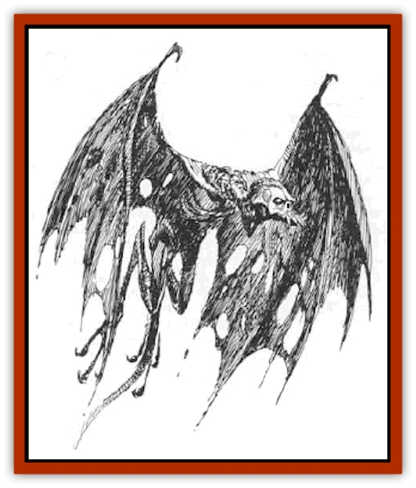

# Varrangoin

| Statistic | **Greater Types V-VI** | **Lesser Types I-IV** |
| --- | --- | --- |
| **Activity Cycle:** | Any | Any |
| **Alignment:** | Chaotic evil | Chaotic evil |
| **Armor Class:** | -3 | 0 |
| **Climate/Terrain:** | The Abyss | The Abyss |
| **Damage/Attack:** | 1d6/1d6/1d10/1d8 | 1d4/1d4/1d6 |
| **Diet:** | Carnivore | Carnivore |
| **Frequency:** | Very rare | Very rare |
| **Hit Dice:** | 8+16 | 5+5 |
| **Intelligence:** | High (13-14) | Very (11-12) |
| **Magic Resistance:** | 35% | 25% |
| **Morale:** | Fanatic (17-18) | Fanatic (17-18) |
| **Movement:** | 3, Fl 18 (C) | 3, Fl 18 (C) |
| **No. Appearing:** | 1 | 1-4 |
| **No. of Attacks:** | 4 | 3 |
| **Organization:** | Solitary | Small groups |
| **Size:** | M (4-5') | M (4-5') |
| **Special Attacks:** | See below | See below |
| **Special Defenses:** | See below | See below |
| **THAC0:** | 11 | 15 |
| **Treasure:** | See below | See below |
| **XP Value:** | 6,000 | 2,000 |

Varrangoin, or abyss [[Bat|bats]], are creatures native to the Abyss (as their name suggests). They appear as giant bats with the leather of their wings (wingspan is typically twice the body length) rotted and hanging away from their skeletal frames. They possess long, forked tails. The head of each varrangoin is a skull-like horror with red glowing eyes and sharp talons and teeth. The V-VI types have barbed tails that can be used for effective melee attacks.

The six identified types of abyss bat are physically indistinguishable, which makes countering their special attacks and defenses especially difficult. It is not certain that there are only six types of these horrors, although Oerth sages have only documented this number to date.

## Lesser Varrangoin (Types I-IV)

**Combat:** All lesser varrangoin use two claw attacks and one bite. Each type of varrangoin also possesses its own unique special attacks and defenses.

*Type I* varrangoin can breathe a *cone of cold* (size as per an 1 lthlevel wizard) for 5d8 points of damage three times per day. They are immune to cold-based spells and suffer half damage from electrical attacks.

*Type II* varrangoin can breathe a cloud of fire (10 yard diameter, range 30 yards) three times per day. Damage inflicted is 5d6 hit points. Type II creatures are immune to fire-based spells and suffer half damage from acid attacks.

*Type III* varrangoin can spit a bolt of lightning (5 feet wide by 60 feet long, three times per day, with damage 5d6 hit points). They are immune to electrical attacks and suffer half normal damage from cold-based attacks.

*Type IV* varrangoin can spit a glob of acid (5-foot radius, three times per day, maximum range of 30 yards, damage 5d6). They are immune to acid attacks and suffer half normal damage from fire attacks.

In addition, all Lesser Varrangoin are harmed only by silver or magical weapons. They are vulnerable to *light* and *continual light* spells, which inflict 2 hp damage on them per level of the spellcaster. They suffer -2 penalties to their hit rolls and saving throws if within the radius of either spell. A *sunray* spell (or a *sunburst* from a *wand of illumination*) inflicts 6d6 hp of damage on a lesser varrangoin. Lesser varrangoin are allowed a magic resistance roll to negate such effects, but if this roll fails, they do not receive any saving throw against the effects of these spells. Note finally that they are allowed a saving throw against all breath weapons for half damage.

**Habitat/Society:** Lesser varrangoin flock in caves and caverns of the Abyss (and also Tarterus/Carceri). They fear [[Tanar'ri_General_Information|tanar'ri]] and more powerful denizens of the Outer Planes, avoiding them whenever possible. They are intelligent enough to recognize weaker denizens, such as [[Tanar'ri_Least_Manes|manes]] and [[Tanar'ri_Least_Rutterkin|rutterkin]], and will attack them in flocks. Within each small flock, there is no acknowledged leader, and social organization is very anarchic.

**Ecology:** Lesser varrangoin are primarily scavengers and opportunists, picking off the weak and enfeebled wherever they can. They are sometimes forced into service by one tanar'ri when it seeks to oppose another.

**Treasure Note:** Lesser varrangoin collect treasure that is "pretty"; a nest will contain 3d6 gems of random denomination and 1d4 items of jewelry. There is a 10% chance per varrangoin in the lair for a magical item, excluding any weapons, armor, or anything else too heavy for a varrangoin to carry in its beaked mouth (DM determination).

## Greater Varrangoin

These creatures are far more formidable and dangerous than their lesser brethren (who they will kill and eat when it suits them). Greater varrangoin are solitary, baleful creatures.

**Combat:** The greater varrangoin have the claw/claw/bite routine of their lesser brethren, but they can also use their forked, barbed tails in combat. The two identified types have a variety of powerful special attacks and defenses.

*Type V* varrangoin are able to employ a controlled form of berserk attack once per day for one turn. They suffer a penalty of +2 to armor class during this time, but hit and damage rolls are improved by +2. When berserk, a Type V varrangoin is immune to all fear attacks and ignores all illusions automatically. The Type V can *dispel magic* at 14th level of magic use twice per day, and once per day it can cast a *symbol of pain* in midair. Type V varrangoin suffer half damage from all fire, cold, and electrical attacks, and are immune to any spells that directly and adversely affect their strength and physical abilities (*ray of enfeeblement*, *fumble*, etc.; a *prayer* spell or equivalent will not affect a varrangoin's hit and damage rolls). Type V varrangoin also have natural free action, and so cannot be affected by *web*, *slow*, *hold* spells and the like. Type V varrangoin cannot be *charmed*.

*Type VI* varrangoin are consummate masters of wizardry. They have the spell abilities of a 9th-level wizard in addition to their other spell-like abilities as documented below, and they save versus rods/staves/wands and spell as an 18th-level wizard. Once per day, one per round, they can cast each of the following: *dispel magic*, *flesh to stone*, *mirror image*, *polymorph other*, *polymorph self*, *project image*, *wizard eye*. Type VI varrangoin are immune to all spells of first through third levels. They have the ability to use magical items normally usable only by wizards (if this is physically possible - they can hold wands in their claws, but they cannot wear robes or cloaks, for example).

**Habitat/Society:** Greater varrangoin are solitary creatures lairing in isolated caves and pits in the Abyss. They are disdainful of other creatures, avoiding powerful tanar'ri and dealing with them as equals if they must. They regard other creatures simply as food sources.

**Ecology:** Greater varrangoin are dangerous predators, and least and lesser tanar'ri fear them greatly.

**Treasure Note:** Greater varrangoin have the following treasure within their lairs: 20% chance for 1d6x1,000gp, 1d2x1,000pp, 1d6 gems, 50% chance each for 1d6 magical items, minimum of one item.

## Varranioin on the Prime Material Plane

It is certain that Iuz has the ability to bring varrangoin, both lesser and greater, to his domain in some way. The existence of gates to the Abyss, in Dorakaa if not elsewhere also, is proven by the appearance of these infernal creatures in the central Flanaess. The nature of the bargain that Iuz strikes with these creatures is unknown; that some form of bargain must he involved with at least the greater varrangoin is certain.

Both types of varrangoin are used as guards in major cities and citadels, including castles, within luz's realm. Occasionally, one or more varrangoin will he used as a "fly-by" sight to cow and intimidate inhabitants. The use of a breath weapon from a lesser varrangoin is a typical element of such displays. Varrangoin are also used as remorseless trackers and hunters of those fleeing the wrath of Iuz.

---
## Discovery & Documentation

**Source Publication:** From the Ashes (1992)
**Campaign Setting:** Greyhawk
**Author(s):** Carl Sargent

### Other Creatures Found in This Source Book
   * [[Animus|Animus]]
   * [[Dwarf_Derro|Dwarf, Derro]]
   * [[Losel|Losel]]
   * [[Lyrannikin|Lyrannikin]]
   * [[Thassaloss|Thassaloss]]
