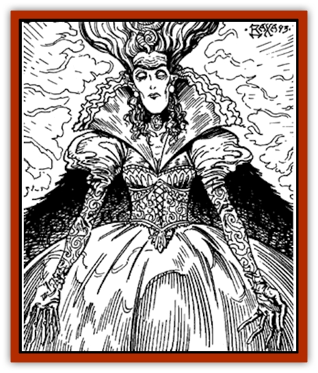

# Vartha

| Statistic | **Vartha** |
| --- | --- |
| **Activity Cycle:** | Any |
| **Alignment:** | Any |
| **Armor Class:** | 0 |
| **Climate/Terrain:** | Any |
| **Damage/Attack:** | 2d4+5 |
| **Diet:** | None |
| **Frequency:** | Very rare |
| **Hit Dice:** | 9+18 (63 hp) |
| **Intelligence:** | High (13) |
| **Magic Resistance:** | Nil |
| **Morale:** | Fearless (20) |
| **Movement:** | 12 |
| **No. Appearing:** | 1 or 2-12 |
| **No. of Attacks:** | 3/2, by weapon type |
| **Organization:** | Solitary |
| **Size:** | M (5-7') |
| **Special Attacks:** | Spellcasting, magical items |
| **Special Defenses:** | Immunity to some spells |
| **THAC0:** | 7 |
| **Treasure:** | Varies |
| **XP Value:** | 18,000 |

Vartha means "guardian spirit" It is one of the few undead that are not necessarily malign. A vartha is a guardian spirit in many senses. It can be a spirit conjured or cursed to protect a specific area or treasure. It can also be a spirit that appears to aid a character in times of need. Lastly, it can be a spirit sent to hunt down wrongdoers. A vartha does not share the generally gruesome appearance of the undead. It looks like a newly dead corpse, after the body has been treated by a mortician.

**Combat:** A vartha has high attribute scores (S 18/75, D 16, C 16, I 13, W 17, Ch 15). It wears partial plate armor +2 (AC 2) and wields a morning star +2. The magical items and attribute scores have been calculated into the vartha's statistics.

While it is undead, a vartha should otherwise be treated as a fighter-cleric with the following clerical spells, each of which can be cast at the rate of one spell per round, once each per day: *bless*, *command*, *detect evil*, *light*, *remove fear*; *sanctuary*; *augury*, *detect charm*, *hold person*, *know alignment*, *silence 15' radius*; *animate dead*, *dispel magic*, *locate object*, *remove curse*; *detect lie*, *tongues*; *commune*.

A vartha can be of any alignment. One of evil alignment may have the reverse of appropriate spells (e.g., *curse* instead of *bless*).

A vartha is not affected by *sleep*, *charm*, *hold*, cold, electricity, poison, or death magic. A *raise dead* spell returns it to life as a 9th-level fighter/9th-level cleric. If the vartha serves anyone involuntarily, it need not make a save vs. spells against the *raise dead* spell, and the spell automatically works. The chance for a cleric to turn a vartha is the same as the chance to turn a spectre.

**Habitat/Society:** Vartha vary in motivation. A vartha guarding its own treasure may have voluntarily become undead through greed. A vartha forced to guard a treasure not its own may be under a curse or commanded by a more powerful being. A vartha sent by the DM to help a character may be that character's guardian spirit, perhaps an ancestor. A vartha hunting down a wrongdoer may have been a marshall in life, continuing its mission after death. Vartha do share one personality trait: They are all highly motivated, even driven, whatever their purpose.

---
## Discovery & Documentation

**Source Publication:** Dragon198 (1993)
**Campaign Setting:** Dragon Magazine
**Author(s):** 

### Other Creatures Found in This Source Book
   * [[Angreden|Angreden]]
   * [[Ghoul_Goop|Ghoul, Goop]]
   * [[Ka|Ka]]
   * [[Wight_King-|Wight, King-]]
   * [[Wraith-King|Wraith-King]]
