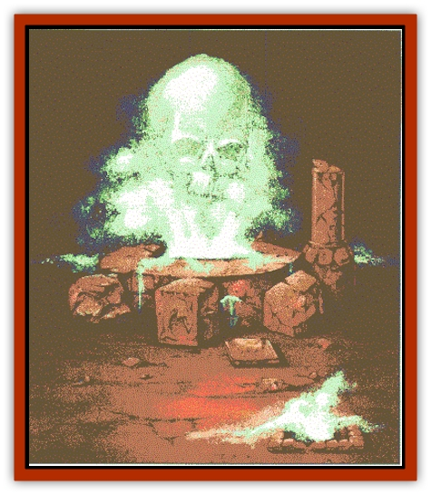

# Vestige

| Statistic | **Vestige** |
| --- | --- |
| **Activity Cycle:** | Any |
| **Alignment:** | Neutral evil |
| **Armor Class:** | 10 |
| **Climate/Terrain:** | City of Moil |
| **Damage/Attack:** | 2d6 (touch) |
| **Diet:** | None |
| **Frequency:** | Unique |
| **Hit Dice:** | 20, hp 100 |
| **Intelligence:** | Non- (0) |
| **Magic Resistance:** | 90% |
| **Morale:** | Fearless (20) |
| **Movement:** | Fl 6 (A) |
| **No. Appearing:** | 1 |
| **No. of Attacks:** | 1-12 |
| **Organization:** | Solitary |
| **Size:** | H (10' high, 40' diameter) |
| **Special Attacks:** | Fear, mind drain |
| **Special Defenses:** | +4 or better weapon to hit, immunities |
| **THAC0:** | 3 |
| **Treasure:** | Nil |
| **XP Value:** | 21,000 |

The Vestige is a creature born from the nightmares of every citizen of the city of Moil as they died in cursed sleep. It appears as a bank of creeping mist. A flickering, dim luminescence lights the creature from within.

**Combat:** The Vestige constantly travels the heights and depths of its city; it can flow equally well along floors and bridges, tower walls, and the empty spaces between. It can detect sentient minds within 1,000 feet and unerringly flows toward anyone it detects.

Creatures entering the city of Moil have a 20% chance of encountering the Vestige every four hours, regardless of whether the visitor stays on the move or holes up. The Vestige can seep through even the smallest of cracks; only a truly airtight seal could keep it out.

The Vestige is immune to *charm*, *hold*, *sleep*, cold, poison, and death magic. Attacks using fire or electricity deliver only half damage to it. *Protection from evil* and similar spells keep the creature at bay (no magic resistance roll allowed, but the creature can breach any such barrier in 2d6 rounds). Weapons of +4 or more enchantment can cut through its diaphanous form, inflicting damage equal only to the weapon's magical bonus.

When possible, the Vestige stalks prey out of sight along a rooftop or along the underside of a bridge. A slow buildup of dread, which any sentient being can feel, heralds the creature's arrival. When the Vestige comes within 100 feet, whispers, moans, and murmurs as of many lamenting people become apparent (even through *silence* spells). All in range must make successful saving throws vs. spells with a -4 penalty. Those who miss the save by 1-4 suffer a -4 penalty to all actions, including attacks, ability checks, and saving throws for as long as the Vestige remains within 100 feet. Those who miss the saving throw by more than 4 lose all reason and flee in terror for a full turn.

If the Vestige comes within 20 feet of its prey, it attacks with 1d12 streamers of mist each round. Each streamer can attack a different creature; a hit causes 2d6 points of damage and dissolves a portion of the victim's flesh.

The Vestige siphons away the consciousness of any creature it can engulf in its misty body. For each round a sentient creature remains in the mist, it must attempt an Intelligence check. Those failing temporarily lose 1d4 points of Intelligence. If completely drained, the victim's mind remains a part of the Vestige forevermore. The victim's associates will be able to hear the voice of their friend amongst the eerie cacophony accompanying the creature. Only a well-worded *wish* can recover devoured consciousness from the Vestige.

The mindless husk of a body left behind will soon perish, as the body automatically loses 2d6 hit points a round until completely dissolved. Mindless creatures (such as undead) engulfed in the fog immediately begin losing hit points. The dissolution of mindless bodies occurs in addition to any attacks the creature makes with its streamers. Creatures that survive encounters with the Vestige recover 1 point of lost Intelligence every 12 hours.

The Vestige cannot be turned.

**Habitat/Society:** The Vestige is a singular creature and has no motives to speak of other than to wander the demiplane that was once Moil and make plain its anguish, fear, and misery. The creature is bounded by the City, and it would dissolve to nothingness if it left.

**Ecology:** The Vestige constantly seeks more minds and consciousness to add to its own collective. In a sense, it feeds off sentient minds, but these minds then become a part of the Vestige, sharing its pain and demented existence for eternity.

---
## Discovery & Documentation

**Source Publication:** Return to the Tomb of Horrors (1998)
**Campaign Setting:** Greyhawk
**Author(s):** Bruce R. Cordell, Gary Gygax

### Other Creatures Found in This Source Book
   * [[Bone_Weird|Bone Weird]]
   * [[Elemental_Negative_Energy|Elemental, Negative Energy]]
   * [[Fundamental_Negative|Fundamental, Negative]]
   * [[Moilian_Heart|Moilian Heart]]
   * [[Moilian_Zombie|Moilian Zombie]]
   * [[Winter-Wight|Winter-Wight]]
