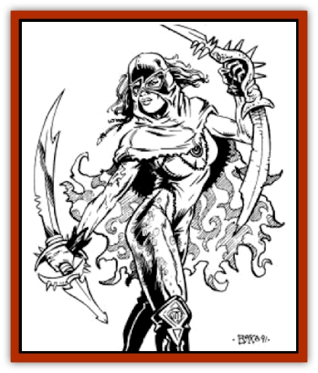

# Villichi

| Statistic | **Villichi** |
| --- | --- |
| **Activity Cycle:** | Any |
| **Alignment:** | Lawful neutral |
| **Armor Class:** | Varies |
| **Climate/Terrain:** | Any |
| **Damage/Attack:** | By weapon |
| **Diet:** | Omnivore |
| **Frequency:** | Very rare |
| **Hit Dice:** | Varies |
| **Intelligence:** | High (13-14) |
| **Magic Resistance:** | 10% |
| **Morale:** | Varies |
| **Movement:** | 24 |
| **No. Appearing:** | 1-4 |
| **No. of Attacks:** | 1 |
| **Organization:** | Community |
| **Size:** | M (7' tall) |
| **Special Attacks:** | Nil |
| **Special Defenses:** | Nil |
| **THAC0:** | Varies |
| **Treasure:** | K,R |
| **XP Value:** | Varies |

**Psionics Summary**

| Level | Dis/Sci/Dev | Attacks/Defenses | Score | PSPs |
| --- | --- | --- | --- | --- |
| 3 | 2/2/7 | II/M-,TS | 15 | 52 |
| 4 | 2/2/9 |  | 15 | 65 |
| 5 | 2/3/10 | PB/TW | 15 | 78 |
| 6 | 3/3/11 |  | 15 | 91 |
| 7 | 3/4/12 | PC/IF | 15 | 104 |
| 8 | 3/4/13 |  | 15 | 117 |
| 9 | 3/5/14 | -/MB | 15 | 130 |
| 10 | 4/5/15 |  | 15 | 143 |
| 11 | 4/6/16 |  | 15 | 156 |
| 12 | 4/6/17 |  | 15 | 169 |

**Psychokinesis -** *Science:* telekinesis;* Devotions:* ballistic attack, inertial barrier.

**Telepathy -** *Science:* mindlink; *Devotions:* contact, id insinuation, invincible foes, mind blank, thought shield.

At 4 HD, add:
**Psychokinesis -** *Sciences:* nil; *Devotions:* control body, control sound.

At 5 HD, add:
**Telepathy -** *Science:* tower of iron will; *Devotion:* psychic crush.

At 6 HD, add:
**Clairsentience -** *Sciences:* nil; *Devotion:* know location.

At 7 HD, add:
**Telepathy -** *Science:* psionic blast; *Devotion:* intellect fortress.

At 8 HD, add:
**Clairsentience -** *Sciences:* nil; *Devotion:* danger sense.

At 9 HD, add:
**Psychokinesis -** *Science:* project force; *Devotions:* nil.
**Telepathy -** *Sciences:* nil; *Devotion:* mental barrier.

At 10 HD, add:
**Psychometabolism -** *Sciences:* nil; *Devotion:* cell adjustment.

At 11 HD, add:
**Psychometabolism** *Sciences:* nil; *Devotion:* graft weapon
**Telepathy -** *Science:* superior invisibility; *Devotions:* nil.

At 12 HD, add:
**Psychometabolism -** *Science:* animal affinity; *Devotions:* nil.

Villichi are females born to normal humans. No one can predict when or where a villichi child will be born. They are shunned by normal humans, although it is considered a bad omen to turn out a villichi child. When they come of age they usually move to a convent of their kind, located somewhere in the Ringing Mountains. Villichi are very strong psionicists, and consequently, are a powerful group. Encounters with villichi are usually with an envoy, one sent to deal with a trading company or village.

Villichi resemble normal human females, albeit longer of limb and face. While they appear thin (mostly due to their height), they actually have normal proportions for human women. Villichi are usually cloaked as they are especially susceptible to the burning sun.

Villichi all speak 1d4 languages spoken by humans or demihumans.

**Combat:** Villichi are not aggressive, usually fighting only in defense of their lives or their community. They are all psionicists, of levels 3-12. Encounters outside their convent are with an envoy of at least 7th level (1d6+6). If more than one is encountered, the rest are guards/companions of levels 3-11. To determine the levels of the companions, roll 1d6 for each and subtract it from the level of the envoy.

When away from the convent, villichi usually wear leather armor. Villichi have a good Dexterity (15+1d6) giving them an Armor Class of at least 7, and possibly as high as 3. There is a 7% chance per level that an envoy will possess a magical ring or cloak; companions have a 5% chance per level of the same. This may further improve their Armor Class or allow them to dispense with the leather armor. They use hand axes, daggers, or short swords (33% chance for each), but there is only a 3% chance per level that anyone in the group possesses a magical weapon. Villichi never use metal weapons or armor, feeling that it makes them somehow unclean.

The villichi preferred method of attack is psionics, and their powers make them formidable. They are extremely well-versed in psionic combat - if someone uses a particular defense, they immediately switch to the most effective attack that they possess to counter that defense. Only if attacked by a creature unaffected by psionics will they use their weapons. (The exception to this is if they successfully use their invincible foes power against a susceptible opponent. They will then attempt to hit that particular opponent at least once, forcing him to fall to the ground in horrible pain.)

Villichi are willing to use magic items, but they are not really comfortable with them. They are slightly resistant to magic, and there is no record of a villichi ever using mage or priest spells.

The Villichi's long thin frame gives them good leverage, and they receive excellent training in the use of weapons. All villichi have a +1 attack roll bonus with any non-metal weapon usable by psionicists.

If the villichi are losing a battle, the companions readily sacrifice their lives to allow the envoy to escape. If the envoy is killed, the highest level companion immediately becomes the envoy and seeks to escape while any remaining companions attempt to hold off the opponents. Of course, if possible, they all try to flee or hide, rather than sacrificing themselves. Villichi never fight blindly to the death, trying to find the best option to let the envoy and her companions all survive.

Villichi are somewhat sensitive to the sun and always try to wear cloaks (or some other covering) to protect them. If a villichi is directly exposed to sunlight (for instance, if her cloak is torn off), she receives a -1 attack roll penalty and a -1 penalty to all psionic power scores.

Villichi of 12th level develop animal affinity, and 90% of these develop affinity with [[Eagle|eagles]] or [[Hawk|hawks]]. Envoys with this power can fly away if a battle is going badly.

**Habitat/Society:** Villichi have formed an extremely close knit community. They never attack one another and only rarely argue with each other. The location of the convent is a closely guarded secret; anyone who inadvertently finds it is usually mindwiped. [[Giant_Half-giant|Half-giants]] and [[Elf_Athas|half elves]] are looked upon with compassion, since they too are members of a group that meets with prejudice. This treatment may seem cruel, but it is a cruel world, and the villichi are only concerned with surviving.

All villichi are born to human parents, and since it is considered a bad omen to exile a villichi child, they are left alone. Villichi not only mature rapidly, but they are fairly long-lived. The average lifespan of a villichi female is 150 years, although some live even longer. The current "high mistress" is over 200 years old, and is a psionicist of great power.

The high mistress is always chosen from among villichi who have developed the special power of "locate psionic". This special power is only developed by villichi of 13th level or higher, and only 10% of them develop this power. There is no range limit to this power, which allows them to locate villichi children at an early age. By the time a villichi child comes of age, an envoy will have been dispatched to fetch the child, or at least inform her of the location of the convent. This also allows them to determine if a villichi child is slain. Such an action usually results in revenge upon the perpetrator. If the perpetrator cannot be located, the revenge is carried out on the entire town, if possible. This is certainly part of the reason why killing a villichi child is considered such a bad omen. Past reprisals have made the killing of a villichi child a very rare thing indeed. Should such a killing occur, the townspeople will most likely imprison the guilty party and turn him over to an envoy for punishment. The perpetrator is examined by the envoy, and executed if guilty. Rumors abound that the guilty party dies horribly, causing such criminals to go to desperate lengths to avoid capture and conviction. Contrary to the rumors, however, the execution is quick and painless, usually by a dagger in the back of the neck.

There are currently about 500 villichi at the convent. At any one time, 10-20% of these are travelling as envoys, and another 20% are young villichi, level 2 or below.

The villichi are adept at weaving and make some of the best cloth on Athas. They also grow most of their own food, but they are not skilled at manufacturing and must trade for weapons and other supplies they need to survive. Higher level villichi are skilled at empowering items with psionic powers, and a magic (actually psionic) item may be traded for enough supplies to last the convent for as much as six months. Such items are necessarily rare and are highly sought after. Of the items empowered, the majority (75%) are usually gems with two or three psionic powers. The convent has 3-6 (1d4+2) of these items on hand at all times. They are usually saved for defense of the convent, but may also be used for trading if necessary for the community's survival. The few trading houses that deal regularly with the villichi have regular meeting places and know better than to look for the convent. The villichi prefer to trade their fine quality cloth, although they cannot usually produce enough to support their convent. At least one psionically empowered item is traded each year, but never more than three, even in bad years.

**Ecology:** The villichi roam widely throughout the world, for anywhere that humans live, a villichi child may be born. This is quite rare; perhaps one in 30,000 girls born is a villichi child. They are not quite albinos, although they do not like the sun. Their habit of protecting themselves from the sun makes them quite fair skinned, and on Athas, this makes them stand out.

Envoys eat whatever is available to them when travelling; but in their convent, the villichi are strict vegetarians. They also use no metal, even in building or trade. If presented with gold, the villichi try to trade it, either for gems or for ceramic pieces. The villichi are fascinated with gems and sometimes pay up to double price for a particularly nice one. Traders with rare and valuable gems may seek to find the villichi convent, thinking to make a killing on a trade. Those who find it are usually sorry, if they even remember what happened.

The villichi community is quite powerful for the small number of females it represents. Even the sorcerer-kings hesitate to interfere with a villichi envoy. The villichi are intelligent enough to realize that this could change if they interfere with these powerful defilers, since any one of the sorcerer-kings possesses sufficient power and resources to wipe out the convent (if they tried hard enough to do so). But, such a mission might weaken the king's defenses enough that he would fall prey to a rival king. Thus the villichi lead a comfortable life, aided mainly by the fact that they stay out of the sorcerer-kings' business and also by the fact that their convent is in an extremely remote location.

Villichi women are all quite attractive, but they are also sterile. Should a group of raiders harm or slay an envoy, a large group of envoys is sent to find and exact revenge on the perpetrators of this unspeakable crime. A group of envoys out for revenge in this manner always numbers at least 20, and the least powerful of these is 8th level, while they are led by a elder of 11th or 12th level. Such criminals are put to death in the most painful manner possible to these intelligent, vengeful females. Fortunately, the villichi reputation makes such incidents extremely rare.

---
## Discovery & Documentation

**Source Publication:** MC12 Dark Sun Appendix I - Terrors of the Desert (1991)
**Campaign Setting:** Dark Sun
**Author(s):** Tom Prusa, Louis J. Prosperi, Walter M. Baas

### Other Creatures Found in This Source Book
   * [[Animal_Herd_Athas|Animal, Herd (Athas)]]
   * [[Animal_Household_Athas|Animal, Household (Athas)]]
   * [[Antloid_Desert|Antloid, Desert]]
   * [[Banshee_Dwarf|Banshee, Dwarf]]
   * [[Beetle_Agony|Beetle, Agony]]
   * [[Bog_Wader|Bog Wader]]
   * [[Brambleweed|Brambleweed]]
   * [[B'rohg|B'rohg]]
   * [[Burnflower|Burnflower]]
   * [[Cat_Psionic|Cat, Psionic]]
   * [[Cha'thrang|Cha'thrang]]
   * [[Cistern_Fiend|Cistern Fiend]]
   * [[Clam_Giant|Clam, Giant]]
   * [[Cloud_Ray|Cloud Ray]]
   * [[Drake_Athas_Air|Drake (Athas), Air]]
   * [[Drake_Athas_Earth|Drake (Athas), Earth]]
   * [[Drake_Athas_Fire|Drake (Athas), Fire]]
   * [[Drake_Athas_Water|Drake (Athas), Water]]
   * [[Dune_Runner|Dune Runner]]
   * [[Dune_Trapper|Dune Trapper]]
   * [[Elemental_Athas_Greater_Air|Elemental (Athas), Greater, Air]]
   * [[Elemental_Athas_Greater_Earth|Elemental (Athas), Greater, Earth]]
   * [[Elemental_Athas_Greater_Fire|Elemental (Athas), Greater, Fire]]
   * [[Elemental_Athas_Greater_Water|Elemental (Athas), Greater, Water]]
   * [[Elemental_Athas_Lesser_Air_Earth|Elemental (Athas), Lesser, Air/Earth]]
   * [[Elemental_Athas_Lesser_Fire_Water|Elemental (Athas), Lesser, Fire/Water]]
   * [[Elemental_Athas_General_Information|Elemental (Athas), General Information]]
   * [[Erdland|Erdland]]
   * [[Esperweed|Esperweed]]
   * [[Flailer|Flailer]]
   * [[Floater|Floater]]
   * [[Giant_Athas|Giant (Athas)]]
   * [[Golem_Athas_I|Golem (Athas) I]]
   * [[Golem_Athas_II|Golem (Athas) II]]
   * [[Golem_Athas_III|Golem (Athas) III]]
   * [[Golem_Athas_General_Information|Golem (Athas), General Information]]
   * [[Halfling_Renegade|Halfling, Renegade]]
   * [[Hej-kin|Hej-kin]]
   * [[Id_Fiend|Id Fiend]]
   * [[Insect_Swarm_Athas|Insect Swarm (Athas)]]
   * [[Kank_Wild|Kank, Wild]]
   * [[Kirre|Kirre]]
   * [[Megapede|Megapede]]
   * [[Mul_Wild|Mul, Wild]]
   * [[Nightmare_Beast|Nightmare Beast]]
   * [[Plant_Carnivorous_Athas|Plant, Carnivorous (Athas)]]
   * [[Pterran|Pterran]]
   * [[Pterrax|Pterrax]]
   * [[Pulp_Bee|Pulp Bee]]
   * [[Pyreen|Pyreen]]
   * [[Rasclinn|Rasclinn]]
   * [[Razorwing|Razorwing]]
   * [[Roc_Athas|Roc (Athas)]]
   * [[Sand_Bride|Sand Bride]]
   * [[Sand_Cactus|Sand Cactus]]
   * [[Sand_Vortex|Sand Vortex]]
   * [[Scrab|Scrab]]
   * [[Silt_Horror|Silt Horror]]
   * [[Silt_Runner|Silt Runner]]
   * [[Sink_Worm|Sink Worm]]
   * [[Sloth_Athas|Sloth (Athas)]]
   * [[So-ut|So-ut]]
   * [[Spider_Cactus|Spider Cactus]]
   * [[Spider_Crystal|Spider, Crystal]]
   * [[Spirit_of_the_Land|Spirit of the Land]]
   * [[T'Chowb|T'Chowb]]
   * [[Thrax|Thrax]]
   * [[Tohr-kreen_I|Tohr-kreen I]]
   * [[Zhackal|Zhackal]]
   * [[Zombie_Plant|Zombie Plant]]
