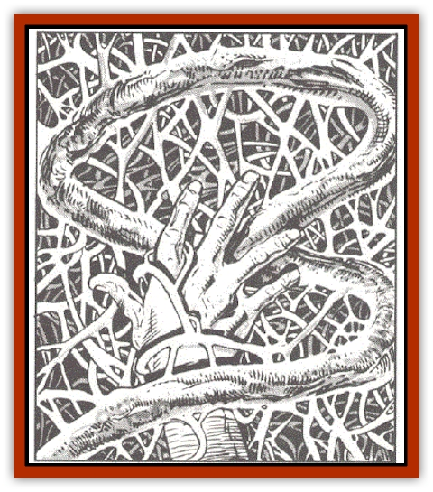
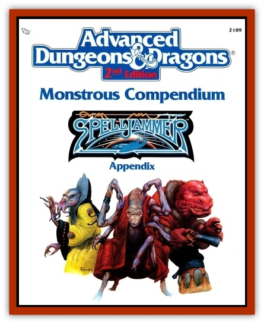

# Vine - Infinity

| Statistic | **Vine, Infinity** |
| --- | --- |
| **Activity Cycle:** | Any |
| **Alignment:** | Neutral |
| **Armor Class:** | 10 |
| **Climate/Terrain:** | Wildspace |
| **Damage/Attack:** | Nil |
| **Diet:** | Air (gases and moisture) |
| **Frequency:** | Very rare |
| **Hit Dice:** | See below |
| **Intelligence:** | Non- (0) |
| **Magic Resistance:** | 25% |
| **Morale:** | Nil |
| **Movement:** | See below |
| **No. Appearing:** | 1 |
| **No. of Attacks:** | 0 |
| **Organization:** | Single plant |
| **Size:** | Any |
| **Special Attacks:** | Engulfs |
| **Special Defenses:** | Regrowth |
| **THAC0:** | 0 |
| **Treasure:** | See below |
| **XP Value:** | 50 |

An infinity vine is a leafless, bright green plant with an extremely rapid rate of growth. It consists of an enormous number of thin, interwoven stems, all part of the same plant. Numerous bright blue flowers appear throughout the plant, each only ½" across. These flowers draw nutrients and moisture for the plant directly from the air itself. The plant thrives so long as it is kept within a crystal sphere's wildspace and exposed to both breathable air and to light of any kind. An infinity vine grows very rapidly, seeming to create plant material out of thin air.

**Combat:** The infinity vine poses a special hazard in the wildspace of many crystal spheres. Bits of this plant are often broken off and discarded from infested ships, and these dormant bits sometimes drift into the atmosphere and gravity field of a spelljamming ship. If a bit of vine falls against an air-bearing ship or other space object (including an asteroidal body of less than 100 miles diameter), the vine begins to grow outward at the rate of ten cubic feet per round. If unchecked, it eventually grows to a depth of ten feet over every surface until it completely covers the exterior of the ship or asteroid (but it does not reach into dark spaces).

The gravest danger that an infinity vine poses is that it adds to the overall tonnage of any spelljamming ship it covers, and it does so very quickly. When this plant has covered an entire shape it will have increased the ship's tonnage to four times its original value. This has obvious and immediate effects on spelljamming procedures.

An infinity vine consumes the waste gases given off by airbreathing creatures, and it gives off large quantities of oxygen (see "Ecology"). It is harmless to living beings, though it grows around and buries slow-moving or immobile beings. Victims can tear through an infinity vine (which regrows behind them as they pass) at their movement rate in feet per turn, if using bare hands or sheer force. A being with claws or a short-bladed weapon (dagger or smaller) can move at double this rate, and a being with a bladed weapon at least as large as a short sword can hack through the vine at triple this rate.

An infinity vine is destroyed by any amount of direct contact with flame, and it stops growing (but stays green) if placed underwater or in total darkness. As burning is not a practical solution for clearing an infested ship, the spelljamming crew must either head for the phlogiston to scrape off every bit of dried vine, stop in a planet's shadow out of the sunlight, or land on a large planet, where after a one-hour delay the infinity vine disappears just as quickly as it grew (ten cubic feet per round) until it has vanished.

Fire-, acid-, and electricity-based spells destroy all of the infinity vine within their areas of effect, though the vine regrows from unaffected areas. Cold-based spells cause it to stop growing for one round per hit point of damage inflicted (but only within the areas of effect). A *darkness* spell causes it to stop growing. *Haste*, *slow*, *entangle*, *spike growth*, *anti-plant shell*, *plant door*, *transport via plants*, and *enlarge/reduce* spells have their normal effects, though a size-altered plant immediately either grows or shrinks at a proportionately altered rate to fill its original volume. *Magic missile* spell damage is regrown almost instantly. *Plant growth* spells cause it to grow at a rate of 100 cubic feet per round (though still limited to ten feet deep over the surface it is on). *Charm plant* and *hold plant* spells can cause the vine to stop growing within the areas of effect.

The infinity vine is immune to all known plant diseases and to poisons of any form (including the *cloudkill* spell). It cannot be polymorphed, energy drained, or slain by death magic.

**Habitat/Society:** An infinity vine will not grow at all on planetary bodies over 100 miles in diameter, regardless of how much light or air the plant receives. When exposed to phlogiston, the plant immediately shrivels, becoming dark brown and extremely brittle. It is not dead, however, but merely dormant; if exposed to air and light in wildspace, the plane revives again, regrowing all damaged areas after a one-turn delay.

**Ecology:** Infinity vine can radically transform small asteroids into havens for bizarre ecological systems. The vine expands the air envelope around any object it engulfs so that the envelope is twice as thick as it formerly was. Castaways and exiles are sometimes found on such worlds, as a steady air and food supply is provided by the vine. Infinity vine is edible, though unapetizing.

---
## Discovery & Documentation

**Source Publication:** MC7 Spelljammer Appendix I (1990)
**Campaign Setting:** Advanced Dungeons & Dragons 2nd Edition
**Author(s):** various

### Other Creatures Found in This Source Book
   * [[Aartuk|Aartuk]]
   * [[Albari|Albari]]
   * [[Ancient_Mariner|Ancient Mariner]]
   * [[Argos|Argos]]
   * [[Beholder_Abomination_Astereater|Beholder (Abomination), Astereater]]
   * [[Blazozoid|Blazozoid]]
   * [[Chattur|Chattur]]
   * [[Chevall|Chevall]]
   * [[Clockwork_Horror|Clockwork Horror]]
   * [[Colossus|Colossus]]
   * [[Delphinid|Delphinid]]
   * [[Dizantar|Dizantar]]
   * [[Dog|Dog]]
   * [[Dog_Bog_Hound|Dog, Bog Hound]]
   * [[Esthetic|Esthetic]]
   * [[Focoid|Focoid]]
   * [[Fractine|Fractine]]
   * [[Giant_Spacesea|Giant, Spacesea]]
   * [[Golem_Furnace|Golem, Furnace]]
   * [[Golem_Radiant|Golem, Radiant]]
   * [[Gravislayer|Gravislayer]]
   * [[Grommam|Grommam]]
   * [[Hadozee|Hadozee]]
   * [[Hamster_Giant_Space|Hamster, Giant Space]]
   * [[Jammer_Leech|Jammer Leech]]
   * [[Lakshu|Lakshu]]
   * [[Lumineaux|Lumineaux]]
   * [[Lutum|Lutum]]
   * [[Mimic_Space|Mimic, Space]]
   * [[Misi|Misi]]
   * [[Moon_Rogue|Moon, Rogue]]
   * [[Mortiss|Mortiss]]
   * [[Murderoid|Murderoid]]
   * [[Nay-Churr|Nay-Churr]]
   * [[Phlog-Crawler|Phlog-Crawler]]
   * [[Plasman|Plasman]]
   * [[Plasmoid_DeGleash|Plasmoid, DeGleash]]
   * [[Plasmoid_DelNoric|Plasmoid, DelNoric]]
   * [[Plasmoid_General_Information|Plasmoid, General Information]]
   * [[Plasmoid_Ontalak|Plasmoid, Ontalak]]
   * [[Puffer|Puffer]]
   * [[Q'nidar|Q'nidar]]
   * [[Rastipede|Rastipede]]
   * [[Reigar|Reigar]]
   * [[Rock_Hopper|Rock Hopper]]
   * [[Slinker|Slinker]]
   * [[Spider_Asteroid|Spider, Asteroid]]
   * [[Spiritjam|Spiritjam]]
   * [[Survivor|Survivor]]
   * [[Syllix|Syllix]]
   * [[Symbiont_Power|Symbiont, Power]]
   * [[Wiggle|Wiggle]]
   * [[Wizshade|Wizshade]]
   * [[Wryback|Wryback]]
   * [[Zard|Zard]]
   * [[Zodar|Zodar]]
