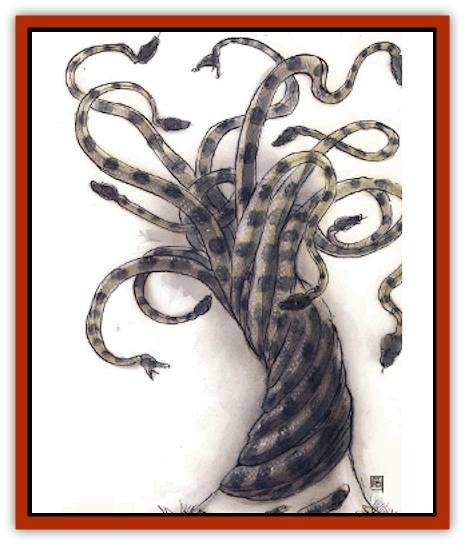

# Viper Tree

| Statistic | **Viper Tree** |
| --- | --- |
| **Activity Cycle:** | Any |
| **Alignment:** | Chaotic evil or neutral evil |
| **Armor Class:** | 7 |
| **Climate/Terrain:** | Abyss, Carceri, Gray Wastes |
| **Damage/Attack:** | 2d6 |
| **Diet:** | Omnivore |
| **Frequency:** | Rare |
| **Hit Dice:** | 2-9 |
| **Intelligence:** | Semi to low (2-7) |
| **Magic Resistance:** | 15% |
| **Morale:** | Steady (11-12) |
| **Movement:** | 0, 15 in larval form |
| **No. Appearing:** | 1d20 |
| **No. of Attacks:** | 1 per HD |
| **Organization:** | Solitary |
| **Size:** | L-H (5-50' tall) |
| **Special Attacks:** | Venom |
| **Special Defenses:** | Spells, immunities |
| **THAC0:** | 2 HD: 19 / 3-4 HD: 17 / 5-6 HD: 15 / 7-8 HD: 13 / 9 HD: 11 |
| **Treasure:** | L,M,O (R,W) |
| **XP Value:** | 2 HD: 420 / 3 HD: 975 / 4 HD: 2,000 / 5 HD: 3,000 / 6 HD: 4,000 / 7 HD: 5,000 / 8 HD: 6,000 / 9 HD: 7,000 |

Said to be the bastard young of Nidhogg, the [[Snake|serpent]] at the root of Yggdrasil, viper trees are white, scaly trees with living snakes' heads as their branches. From a distance they appear as white beeches or similar trees, but viewed up close they have clearly reptilian skin and features. Though they can writhe and reach as snakes do, usually viper trees simply sway in the breeze as other trees - but they also move even in the absence of any breeze.

Viper trees speak the language of [[Tanar'ri_General_Information|tanar'ri]] and no other. Groves of viper trees hiss and whisper to each other unnervingly during the night, speaking or their kills, their hungers, and their treasures. They are common in Azzagrat, the 45th to 47th layers of the Abyss; elsewhere in the Abyss they are used as guards in gardens, around moats, and at gates.

**Combat:** Single viper trees rarely attack creatures larger than size S. Viper tree groves (such as the Viper Forest of Zrintor) are notably more aggressive, willing to attack small groups or size M creatures if the group is perceived as sufficiently weak. They can swallow even size L creatures, if given enough time.

A viper tree has dozens of serpentlike heads and branches, but the tree can only command a few of them at a time. When a branch is slain, one of the tree's "sleeping" branches wakes, for the brain of a viper tree is actually deep in the tree's heartwood. As a result viper trees get their full complement or attacks until they are near death. The bite of a viper tree inflicts 2d6 points of damage.

Viper tree venom is insidious and potent; anyone bitten by a viper tree must make a saving throw against poison at -3. Victims that fail lose 4 points of Dexterity permanently and are immobilized by the venom for 48 hours, long enough for the tree to swallow even the largest prey. The venom has an onset time of 2d4 rounds. Even if the saving throw succeeds, the victim temporarily loses 4 points of Dexterity as a result of the shakes and trembling the venom induces for the next 48 hours. *Neutralize poison* removes the dexterity loss immediately, but does nothing for the paralysis. It even prevents the permanent Dexterity loss if applied within an hour. *Remove paralysis* cures the twitching and immobility, but does nothing for the Dexterity loss. Viper trees are immune to their own venom.

Because of their multiple heads, viper trees are unaffected by most spells that target a single or a few creatures, such as *charm monster*, *hold person*, or *sleep*. To affect a viper tree, such a spell must affect a number or creatures equal to the viper tree's Hit Dice.

Viper trees are immune to cold, venom, and acid attacks, and they take half damage from blunt weapons and normal damage from electrical attacks. Their woody stumps bleed a brownish-amber sap when cut, and the wood burns quickly. Viper trees suffer double damage from fire.

If attacked with missile weapons, viper trees can break off their own branches to crawl toward their attackers. These branches ooze sap from their broken end and die within an hour, so the trees are reluctant to lose them, but the broken branches have the same hit points, THAC0, and damage as the parent tree.

**Habitat/Society:** Viper trees are a strange hybrid of tanar'ri, reptile, and plant, a sort of fiendish, egg-laying plant. Theyy lay eggs once a month, and each egg lies protected at the base of its parent. Once it hatches on its own, the newly hatched viper tree is abandoned by its parent. The young go through a mobile stage before rooting in the body of their first large prey.

Great groves of viper trees grow on the sites of some Blood War battlefields, where the trees defend themselves against attacks from [[Baatezu_General_Information|baatezu]] by growing in large clusters. The viper trees allow tanar'ri armies to pass through freely and even take cover under their branches, but baatezu are always attacked, even if all the viper trees are slain as a result. [[Yugoloth_General_Information|Yugoloth]] armies are usually ignored.

A legend exists among the tanar'ri that the lords of Baator once amused themselves by forming viper trees from manes and other creatures that they captured in the Blood War. Others say that the Abyssal lords made examples of a thousand least tanar'ri who refused to march against a position that a million of their fellows had already failed to lake. In either case, they were once tanar'ri, and this is why they usually side with the tanar'ri against the baatezu. The tanar'ri still tell the tale to prevent desertions, but it may hold a kernel of truth to it: Some baatezu lords are believed to still know the secret to the transformation.

**Ecology:** According to a Harmonium poll designed to discover ideal carnivorous plant preferences (involving 47 viper trees in three separate groves), the tastiest forms of prey are "small, easy to swallow, like squirrels - they tickle bark," followed by anything else seeking shelter ("they're so funny when they're scared), [[Eyewing|eyewings]] ("gooey"), and last by small flying creatures that mistakenly nest in their branches ("too many feathers, except [[Bat|bats]]"). Large viper trees also eat "walkers" - [[Tanar'ri_Least_Dretch|dretch]], [[Baatezu_Lemure|lemures]], [[Tanar'ri_Least_Manes|manes]], [[Baatezu_Least_Nupperibo|nupperibo]], [[Tanar'ri_Least_Rutterkin|rutterkin]], and other weak, marginally moronic deserters who haunt the battlefields of the Blood War in droves - but they claim that "walkers sting, and taste like fear." In lean times, 4 out of 5 viper trees claim that they can survive on a form of magical sustenance ("eat spells"), the waters of the Styx ("forgot what it tastes like, but so sleepy"), and the nutrients in the blood-soaked battlefields of the Blood War ("red dirt is good"). Only 1 in 10 viper trees was able to overwhelm a Harmonium questioner.

**Larval Form**

  In their larval form, viper trees resemble fully mobile, three-headed snakes. Larval trees have only 2 Hit Dice, and only two of the heads of the newly hatched creature are fully active - the third is a sort of runt. The tiny, inactive head is always the central one, which is carried along by the other two until it awakens after a period of about one month. Thereafter the third head is the directing intelligence of the entire creature, and it begins searching for a suitable place to put down roots. When the larval tree kills suitably large prey, it lodges its tail through the kill and into the earth and begins the growth or its plant phase.

The larval viper tree is insatiably hungry, constantly devouring manes, [[Cranium_Rat|cranium rats]], and other small prey. It can strike a single target with two heads, while the third protects it against attacks from any other direction. Its venom immobilizes prey by inducing twitching spasms that last for 1d10 hours (a saving throw versus poison at +2 reduces this to a 2-point Dexterity loss, which fades within a day).

---
## Discovery & Documentation

**Source Publication:** Planes of Chaos (1994)
**Campaign Setting:** Planescape
**Author(s):** Wolfgang Baur, L. W. Smith

### Other Creatures Found in This Source Book
   * [[Asrai|Asrai]]
   * [[Astral_Dreadnought|Astral Dreadnought]]
   * [[Bacchae|Bacchae]]
   * [[Chaos_Beast|Chaos Beast]]
   * [[Fensir|Fensir]]
   * [[Abyssal_Lord|Abyssal Lord]]
   * [[Howler|Howler]]
   * [[Imp_Chaos|Imp, Chaos]]
   * [[Lillend|Lillend]]
   * [[Murska|Murska]]
   * [[Oread|Oread]]
   * [[Ratatosk|Ratatosk]]
   * [[Tanar'ri_Greater_Goristro|Tanar'ri, Greater, Goristro]]
   * [[Tanar'ri_Lesser_Armanite|Tanar'ri, Lesser, Armanite]]
   * [[Varrangoin|Varrangoin]]
