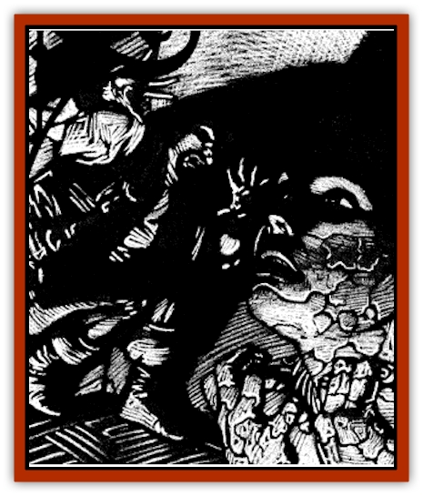

# Virus II

| Statistic | **Petrification** | **Phobia** |
| --- | --- | --- |
| **Activity Cycle:** | Any | Any |
| **Alignment:** | Neutral | Neutral |
| **Armor Class:** | n/a | n/a |
| **Climate/Terrain:** | Ravenloft | Ravenloft |
| **Damage/Attack:** | Nil | Nil |
| **Diet:** | None | None |
| **Frequency:** | Very rare | Rare |
| **Hit Dice:** | n/a | n/a |
| **Intelligence:** | Non- (0) | Non- (0) |
| **Magic Resistance:** | Nil | Nil |
| **Morale:** | n/a | n/a |
| **Movement:** | 0 | 0 |
| **No. Appearing:** | n/a | n/a |
| **No. of Attacks:** | 0 | 0 |
| **Organization:** | n/a | n/a |
| **Size:** | T (microscopic) | T (microscopic) |
| **Special Attacks:** | Petrification | Cause phobia |
| **Special Defenses:** | See below | See below |
| **THAC0:** | 0 | 0 |
| **Treasure:** | Nil | Nil |
| **XP Value:** | 650 | 270 |

## Petrification Virus

The petrification [[Virus_General_Information|virus]] causes its victim's body to gradually harden and eventually turn to stone. What is truly horrifying is that victims who have survived this terrible transformation claim to have been conscious even when their bodies were completely petrified.

The petrification virus attacks its victim at the exact spot where physical contact was made, so a large percentage of infections begin on the hands. Unlike other viruses, the initial symptoms of petrification virus infection do not include fever. Instead, the victim notices a hard, marbleized patch of skin at the point of infection.

So quickly does this microscopic invader do its work that skin at the point of contact is noticeably harder within just a few minutes. Within half an hour, this area becomes completely inflexible and begins to change to a color resembling pearly-gray marble. The marbleized patch of skin continues to spread, covering an additional 10% of the victim's body with each passing day. As the transformation progresses, several changes occur in the victim's body - most noticeable is a daily 10% increase in weight. In addition, the victim loses 2 points of Dexterity per day, but gains a 1 point improvement in his base AC.

If the infection is not stopped, the victim completely petrifies when his base Armor Class becomes 0. A marbleized victim remains alive long after the transformation, although no sign of life can be detected without magical or psionic help. Several months (2d6) after the conversion to stone, the victim finally dies and the virus falls dormant.

A *stone to flesh* spell cast on the victim removes all traces of marbleization from the body, but the virus remains active in the character's system and immediately begins to spread anew. Fortunately, a *cure disease* spell can be fully effective if used quickly.

The statue created of a dead victim's body contains thousands of dormant petrification viruses. As such, it is extremely virulent, so the slightest contact can be deadly. At least one twisted individual is known to have created hideous sculpture gardens out of his enemies by contriving to infect them with the virus.

## Phobia Virus

The phobia virus is the only magical virus that does not necessarily cause its victim's death. Once in the body, it attacks the host's mind, causing the character to develop a severe phobia. Although such a neurosis may weaken a character at a critical moment and lead to death, the virus itself is not fatal.

Within 12 hours of infection, the victim of a phobia virus begins to feel generally nervous. The character begins to sweat profusely and runs a fever for several days. He also begins to have vague, recurring nightmares. Although the fever fades, the victim's fearfulness increases. By the seventh night of infection, the victim is exhausted. The virus-driven nightmares become clear, and the victim's fear crystallizes into a phobia. The fear is always of something that never troubled the victim before, and may even be something with which he was quite comfortable. Nevertheless, when the infected victim is confronted with the object of his newly formed phobia, he suffers the results of a failed fear check.

*Remove fear* and similar magic temporarily aid the sufferer, but he succumbs to his irrational fear as soon as the magic wears off. The spell *true seeing* combined with a *cure disease* spell can permanently rid the victim of his phobia.

Psionic powers also can be helpful in the treatment of a phobia virus victim. The most notable of these is psychic surgery, which can repair the damage done by the virus. Unless this treatment is followed with a *cure disease* spell or the like, however, the still-active virus attacks the brain again and restores the phobia.

Victims of a phobia virus are extremely vulnerable to psionic attacks such as id insinuation or magical spells like *cloak of fear*. Anyone who suffers from a phobia virus and is confronted with a magical or psionic fear-inducing attack must make an immediate Madness Check. (See Chapter III of the *Realm of Terror* book in the *Ravenloft Campaign Setting* boxed set for rules on madness.)

---
## Discovery & Documentation

**Source Publication:** Ravenloft Appendix III (1991)
**Campaign Setting:** Ravenloft
**Author(s):** Kirk Botulla

### Other Creatures Found in This Source Book
   * [[Akikage|Akikage]]
   * [[Animator_Common|Animator, Common]]
   * [[Animator_Greater|Animator, Greater]]
   * [[Animator_Minor|Animator, Minor]]
   * [[Animator_General_Information|Animator, General Information]]
   * [[Bakhna_Rakhna|Bakhna Rakhna]]
   * [[Baobhan_Sith|Baobhan Sith]]
   * [[Beetle_Scarab|Beetle, Scarab]]
   * [[Boneless|Boneless]]
   * [[Boowray|Boowray]]
   * [[Bruja|Bruja]]
   * [[Carrionette|Carrionette]]
   * [[Carrion_Stalker|Carrion Stalker]]
   * [[Cat_Midnight|Cat, Midnight]]
   * [[Cat_Skeletal|Cat, Skeletal]]
   * [[Cloaker_Resplendent|Cloaker, Resplendent]]
   * [[Cloaker_Shadow|Cloaker, Shadow]]
   * [[Cloaker_Undead|Cloaker, Undead]]
   * [[Corpse_Candle|Corpse Candle]]
   * [[Death's_Head_Tree|Death's Head Tree]]
   * [[Doppelganger_Ravenloft|Doppelganger (Ravenloft)]]
   * [[Familiar_Pseudo-|Familiar, Pseudo-]]
   * [[Familiar_Undead|Familiar, Undead]]
   * [[Feathered_Serpent|Feathered Serpent]]
   * [[Fenhound|Fenhound]]
   * [[Figurine_Ceramic|Figurine, Ceramic]]
   * [[Figurine_Crystal|Figurine, Crystal]]
   * [[Figurine_Ivory|Figurine, Ivory]]
   * [[Figurine_Obsidian|Figurine, Obsidian]]
   * [[Figurine_Porcelain|Figurine, Porcelain]]
   * [[Figurine_General_Information|Figurine, General Information]]
   * [[Fleas_of_Madness|Fleas of Madness]]
   * [[Furies|Furies]]
   * [[Geist|Geist]]
   * [[Ghost_Animal|Ghost, Animal]]
   * [[Golem_Flesh_Ravenloft|Golem, Flesh (Ravenloft)]]
   * [[Golem_Mist_Ravenloft|Golem, Mist (Ravenloft)]]
   * [[Golem_Wax_Ravenloft|Golem, Wax (Ravenloft)]]
   * [[Gremishka|Gremishka]]
   * [[Hag_Spectral|Hag, Spectral]]
   * [[Head_Hunter|Head Hunter]]
   * [[Hearth_Fiend|Hearth Fiend]]
   * [[Hebi-No-Onna|Hebi-No-Onna]]
   * [[Hound_Phantom|Hound, Phantom]]
   * [[Hound_Skeletal|Hound, Skeletal]]
   * [[Imp_Wishing|Imp, Wishing]]
   * [[Ivy_Crawling|Ivy, Crawling]]
   * [[Jack_Frost|Jack Frost]]
   * [[Jolly_Roger|Jolly Roger]]
   * [[Kizoku|Kizoku]]
   * [[Lashweed|Lashweed]]
   * [[Leech_Magical|Leech, Magical]]
   * [[Leech_Psionic|Leech, Psionic]]
   * [[Lich_Defiler|Lich, Defiler]]
   * [[Lich_Drow|Lich, Drow]]
   * [[Lich_Elemental|Lich, Elemental]]
   * [[Lich_Psionic|Lich, Psionic]]
   * [[Living_Tattoo|Living Tattoo]]
   * [[Lycanthrope_Loup-garou|Lycanthrope, Loup-garou]]
   * [[Lycanthrope_Werejackal|Lycanthrope, Werejackal]]
   * [[Lycanthrope_Werejaguar_Ravenloft|Lycanthrope, Werejaguar (Ravenloft)]]
   * [[Lycanthrope_Wereleopard|Lycanthrope, Wereleopard]]
   * [[Lycanthrope_Wereray|Lycanthrope, Wereray]]
   * [[Mist_Ferryman|Mist Ferryman]]
   * [[Moor_Man|Moor Man]]
   * [[Obedient|Obedient]]
   * [[Odem|Odem]]
   * [[Paka|Paka]]
   * [[Plant_Blood_Rose|Plant, Blood Rose]]
   * [[Plant_Fearweed|Plant, Fearweed]]
   * [[Radiant_Spirit|Radiant Spirit]]
   * [[Recluse|Recluse]]
   * [[Remnant_Aquatic|Remnant, Aquatic]]
   * [[Rushlight|Rushlight]]
   * [[Sea_Spawn_Master|Sea Spawn, Master]]
   * [[Sea_Spawn_Minion|Sea Spawn, Minion]]
   * [[Shadow_Asp|Shadow Asp]]
   * [[Shattered_Brethren|Shattered Brethren]]
   * [[Skeleton_Archer|Skeleton, Archer]]
   * [[Skeleton_Insectoid|Skeleton, Insectoid]]
   * [[Skin_Thief|Skin Thief]]
   * [[Spirit_Psionic|Spirit, Psionic]]
   * [[Strahd_Skeleton|Strahd Skeleton]]
   * [[Strahd_Zombie|Strahd Zombie]]
   * [[Unicorn_Shadow|Unicorn, Shadow]]
   * [[Vampire_Drow|Vampire, Drow]]
   * [[Vampire_Nosferatu|Vampire, Nosferatu]]
   * [[Vampire_Oriental|Vampire, Oriental]]
   * [[Virus_General_Information|Virus, General Information]]
   * [[Virus_I|Virus I]]
   * [[Virus_III|Virus III]]
   * [[Vorlog|Vorlog]]
   * [[Will_O'Dawn|Will O'Dawn]]
   * [[Will_O'Deep|Will O'Deep]]
   * [[Will_O'Mist|Will O'Mist]]
   * [[Will_O'Sea|Will O'Sea]]
   * [[Zombie_Cannibal|Zombie, Cannibal]]
   * [[Zombie_Desert|Zombie, Desert]]
   * [[Zombie_Wolf|Zombie Wolf]]
   * [[Zombie_Fog|Zombie Fog]]
