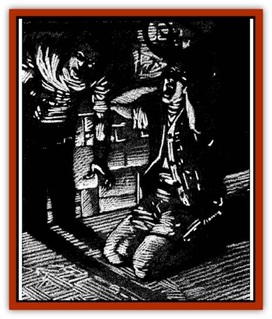

# Virus III

| Statistic | **Psionic** | **Shadow** |
| --- | --- | --- |
| **Activity Cycle:** | Any | Any |
| **Alignment:** | Neutral | Neutral |
| **Armor Class:** | n/a | n/a |
| **Climate/Terrain:** | Any | Any dark |
| **Damage/Attack:** | Nil | Nil |
| **Diet:** | None | None |
| **Frequency:** | Very rare | Very rare |
| **Hit Dice:** | n/a | n/a |
| **Intelligence:** | Non- (0) | Non- (0) |
| **Magic Resistance:** | Nil | Nil |
| **Morale:** | n/a | n/a |
| **Movement:** | 0 | 0 |
| **No. Appearing:** | n/a | n/a |
| **No. of Attacks:** | 0 | 0 |
| **Organization:** | n/a | n/a |
| **Size:** | T (microscopic) | T (microscopic) |
| **Special Attacks:** | Psionic overload | Shadow rot |
| **Special Defenses:** | Nil | Nil |
| **THAC0:** | 0 | 0 |
| **Treasure:** | Nil | Nil |
| **XP Value:** | 650 | 975 |

## Psionic Virus

The psionic [[Virus_General_Information|virus]] opens pathways in a victim's mind, granting the character tremendous psionic abilities whether or not he had them before the infection. Unfortunately, such abilities continue to grow stronger and stronger, until the character's overstimulated brain literally explodes under the unaccustomed psionic pressures.

For the first 24 hours following infection, the only noticeable symptom is a strange feeling of disorientation. This is generally perceived as a buzzing in the ears and a sense of light-headedness. On the second day of infection, the victim gains the abilities of a 1st level psionicist (or gains one level of ability if he already possesses such powers). The DM can either roll randomly for the victims newfound abilities or simply choose what powers the character gains.

Every 24 hours thereafter, the victim gains another level of psionic ability. The victim will also begin to experience profound headaches, lasting approximately one hour per level of psionic skill gained. While suffering from these excruciating migraines, the character suffers a -4 penalty to all attack and damage rolls, saving throws, and proficiency checks.

Once the headaches have reached eight hours in duration, the victim must make a Madness Check each day. When they reach 10 hours, the victim must make a daily saving throw vs. death magic. Success means the character's brain continues to handle the psionic energies, while failure indicates his brain explodes from the massive psionic pressures. A cumulative -2 penalty is applied to both of these rolls for each day after the first.

In addition to normal treatment options, the psionic virus can be excised with a successful working of psychic surgery in combination with min dwipe. The affected character cannot actively participate in this cure.

The flesh of a deceased victim's body hosts the dormant form of the psionic virus, so any unprotected person who touches the victim's body risks infection. In addition, anyone who makes direct mental contact with an infected mind must make a successful saving throw vs. death magic or contract the virus as well.

## Shadow Virus

A character contracts this infection through physical contact with the dormant virus, just as with other strains. However, it is the victim's shadow which the virus first attacks, causing it to rot away. A victim whose shadow is destroyed by the virus becomes a [[Shadow|shadow]] himself.

The initial symptoms of this horrifying virus are deceptively mild: simply a slight tingling of the scalp and a low fever. At the end of the first day of infection, however, the victim's shadow shows distinct signs of fraying around the edges. As the days pass, the victim's shadow continues to unravel and, if the virus is not halted, disappears entirely on the seventh day. Once the host's shadow has been consumed by the virus, the infection begins to take its toll on the flesh of the body. Within a day, one of the victim's limbs grows insubstantial. and on each successive night another portion of the victim's body becomes shadowy. On the fourteenth night of infection. the victim fades away utterly and dies. Within minutes of his demise, the character rises as a shadow himself.

A psionicist with the shadow form science cannot use this ability while infected with the virus. If a *continual light* spell is placed upon a small blessed diamond and the victim swallows this stone within the first seven days of the infection. he is cured. The reaction of the virus to the gem destroys them both, so the diamond is lost.

Shadows created by this virus carry the disease with them, so anyone touched by a virulent shadow risks contamination. Unlike the other viruses, this one is not spread by living carriers.

---
## Discovery & Documentation

**Source Publication:** Ravenloft Appendix III (1991)
**Campaign Setting:** Ravenloft
**Author(s):** Kirk Botulla

### Other Creatures Found in This Source Book
   * [[Akikage|Akikage]]
   * [[Animator_Common|Animator, Common]]
   * [[Animator_Greater|Animator, Greater]]
   * [[Animator_Minor|Animator, Minor]]
   * [[Animator_General_Information|Animator, General Information]]
   * [[Bakhna_Rakhna|Bakhna Rakhna]]
   * [[Baobhan_Sith|Baobhan Sith]]
   * [[Beetle_Scarab|Beetle, Scarab]]
   * [[Boneless|Boneless]]
   * [[Boowray|Boowray]]
   * [[Bruja|Bruja]]
   * [[Carrionette|Carrionette]]
   * [[Carrion_Stalker|Carrion Stalker]]
   * [[Cat_Midnight|Cat, Midnight]]
   * [[Cat_Skeletal|Cat, Skeletal]]
   * [[Cloaker_Resplendent|Cloaker, Resplendent]]
   * [[Cloaker_Shadow|Cloaker, Shadow]]
   * [[Cloaker_Undead|Cloaker, Undead]]
   * [[Corpse_Candle|Corpse Candle]]
   * [[Death's_Head_Tree|Death's Head Tree]]
   * [[Doppelganger_Ravenloft|Doppelganger (Ravenloft)]]
   * [[Familiar_Pseudo-|Familiar, Pseudo-]]
   * [[Familiar_Undead|Familiar, Undead]]
   * [[Feathered_Serpent|Feathered Serpent]]
   * [[Fenhound|Fenhound]]
   * [[Figurine_Ceramic|Figurine, Ceramic]]
   * [[Figurine_Crystal|Figurine, Crystal]]
   * [[Figurine_Ivory|Figurine, Ivory]]
   * [[Figurine_Obsidian|Figurine, Obsidian]]
   * [[Figurine_Porcelain|Figurine, Porcelain]]
   * [[Figurine_General_Information|Figurine, General Information]]
   * [[Fleas_of_Madness|Fleas of Madness]]
   * [[Furies|Furies]]
   * [[Geist|Geist]]
   * [[Ghost_Animal|Ghost, Animal]]
   * [[Golem_Flesh_Ravenloft|Golem, Flesh (Ravenloft)]]
   * [[Golem_Mist_Ravenloft|Golem, Mist (Ravenloft)]]
   * [[Golem_Wax_Ravenloft|Golem, Wax (Ravenloft)]]
   * [[Gremishka|Gremishka]]
   * [[Hag_Spectral|Hag, Spectral]]
   * [[Head_Hunter|Head Hunter]]
   * [[Hearth_Fiend|Hearth Fiend]]
   * [[Hebi-No-Onna|Hebi-No-Onna]]
   * [[Hound_Phantom|Hound, Phantom]]
   * [[Hound_Skeletal|Hound, Skeletal]]
   * [[Imp_Wishing|Imp, Wishing]]
   * [[Ivy_Crawling|Ivy, Crawling]]
   * [[Jack_Frost|Jack Frost]]
   * [[Jolly_Roger|Jolly Roger]]
   * [[Kizoku|Kizoku]]
   * [[Lashweed|Lashweed]]
   * [[Leech_Magical|Leech, Magical]]
   * [[Leech_Psionic|Leech, Psionic]]
   * [[Lich_Defiler|Lich, Defiler]]
   * [[Lich_Drow|Lich, Drow]]
   * [[Lich_Elemental|Lich, Elemental]]
   * [[Lich_Psionic|Lich, Psionic]]
   * [[Living_Tattoo|Living Tattoo]]
   * [[Lycanthrope_Loup-garou|Lycanthrope, Loup-garou]]
   * [[Lycanthrope_Werejackal|Lycanthrope, Werejackal]]
   * [[Lycanthrope_Werejaguar_Ravenloft|Lycanthrope, Werejaguar (Ravenloft)]]
   * [[Lycanthrope_Wereleopard|Lycanthrope, Wereleopard]]
   * [[Lycanthrope_Wereray|Lycanthrope, Wereray]]
   * [[Mist_Ferryman|Mist Ferryman]]
   * [[Moor_Man|Moor Man]]
   * [[Obedient|Obedient]]
   * [[Odem|Odem]]
   * [[Paka|Paka]]
   * [[Plant_Blood_Rose|Plant, Blood Rose]]
   * [[Plant_Fearweed|Plant, Fearweed]]
   * [[Radiant_Spirit|Radiant Spirit]]
   * [[Recluse|Recluse]]
   * [[Remnant_Aquatic|Remnant, Aquatic]]
   * [[Rushlight|Rushlight]]
   * [[Sea_Spawn_Master|Sea Spawn, Master]]
   * [[Sea_Spawn_Minion|Sea Spawn, Minion]]
   * [[Shadow_Asp|Shadow Asp]]
   * [[Shattered_Brethren|Shattered Brethren]]
   * [[Skeleton_Archer|Skeleton, Archer]]
   * [[Skeleton_Insectoid|Skeleton, Insectoid]]
   * [[Skin_Thief|Skin Thief]]
   * [[Spirit_Psionic|Spirit, Psionic]]
   * [[Strahd_Skeleton|Strahd Skeleton]]
   * [[Strahd_Zombie|Strahd Zombie]]
   * [[Unicorn_Shadow|Unicorn, Shadow]]
   * [[Vampire_Drow|Vampire, Drow]]
   * [[Vampire_Nosferatu|Vampire, Nosferatu]]
   * [[Vampire_Oriental|Vampire, Oriental]]
   * [[Virus_General_Information|Virus, General Information]]
   * [[Virus_I|Virus I]]
   * [[Virus_II|Virus II]]
   * [[Vorlog|Vorlog]]
   * [[Will_O'Dawn|Will O'Dawn]]
   * [[Will_O'Deep|Will O'Deep]]
   * [[Will_O'Mist|Will O'Mist]]
   * [[Will_O'Sea|Will O'Sea]]
   * [[Zombie_Cannibal|Zombie, Cannibal]]
   * [[Zombie_Desert|Zombie, Desert]]
   * [[Zombie_Wolf|Zombie Wolf]]
   * [[Zombie_Fog|Zombie Fog]]
