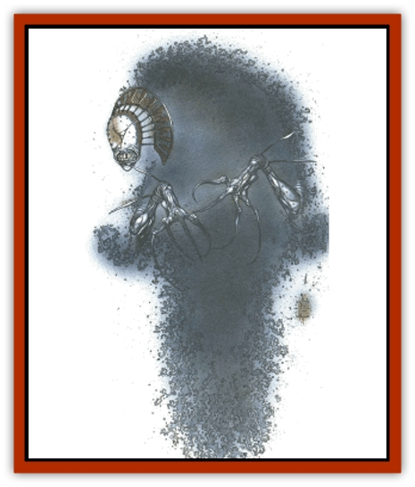
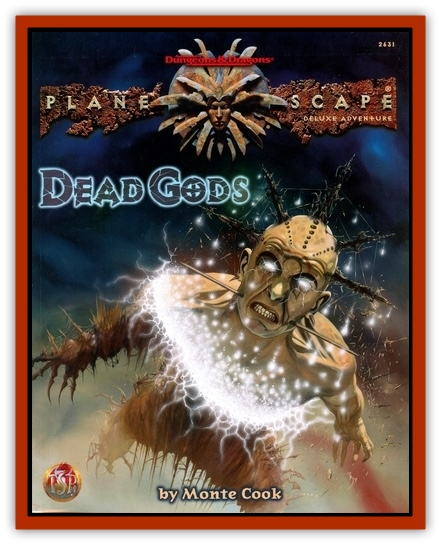

# Visage

| Statistic | **Visage** |
| --- | --- |
| **Activity Cycle:** | Any |
| **Alignment:** | Chaotic evil |
| **Armor Class:** | 0 |
| **Climate/Terrain:** | Any |
| **Damage/Attack:** | 1d8/1d8 (claw/claw) |
| **Diet:** | None |
| **Frequency:** | Very rare |
| **Hit Dice:** | 6 |
| **Intelligence:** | High (13-14) |
| **Magic Resistance:** | 25% |
| **Morale:** | Elite (13-14) |
| **Movement:** | Fl 15 (A) |
| **No. Appearing:** | 1d4 |
| **No. of Attacks:** | 2 |
| **Organization:** | Solitary |
| **Size:** | M (6' tall) |
| **Special Attacks:** | Lucidity control, domination |
| **Special Defenses:** | Hit only by +1 or better weapons, immune to holy water |
| **THAC0:** | 15 |
| **Treasure:** | Nil |
| **XP Value:** | 4,000 |

What is real? Ask any two berks, especially those from different factions, and a body's likely to get two completely different answers. Find a cutter that's faced a visage, though, and the answer might be a little strange.

See, a visage is a creature of deception. It assaults perceptions, steals identities, and crushes wills. Nightmarish fiends of insidious power, visages are - thankfully - extremely rare. Fact is, they're found only in the service of the deity now known as Tenebrous. Visages are undead [[Tanar'ri_General_Information|tanar'ri]], former servants of Tenebrous brought back by the evil god's influence over all things undead.

Visages can assume other shapes (as explained below), but in their natural form, they appear as wispy, translucent spirits with frightening white masks where their heads should be. They have no legs, but instead float or fly through the air at will. Despite their noncorporeal appearance, visages are solid. They can't pass through walls or objects, though they can fit through tiny spaces too small for a human of equal size.

Visages communicate through speech. Most know the common tongue, as it helps them move surreptitiously through society, and they pick up any languages spoken by those whose essences they steal (as explained below).

**Combat:** A body could say that in battle, a visage strikes with its razor-sharp claws. That's a true statement, but it's also dangerously misleading - the claws are the least of a sod's worries. Visages warp minds in ways that no other creatures really can. Sure, plenty of barks create illusions (the [[Baatezu_General_Information|baatezu]]'re experts at it), but a visage can twist a body's mind, making him think what it wants him to think and experience what it wants him to experience. The undead fiend uses a number of tricks to force a false perception of reality on its victim.

First and foremost, a visage wields a strange power that graybeards call *lucidity control*. The fiend can reach into the mind of anyone it sees and change how he perceives the world around him. The visage totally controls the victim's senses, but it usually does so in subtle ways so the sod won't realize that he's being manipulated. As long as the victim is unaware of the visage's assault, he receives no saving throw against the effect. However, if he tumbles to the fact that something's playing with his mind, he can attempt a saving throw versus spell. Success indicates that the victim perceives things as they truly are, but he must continue to make successful saving throws each round or fall back into the false reality created by the visage.

To make it less likely that a sod'll realize his perceptions are being orchestrated, the undead fiends often mix real experiences with false ones. For example, a visage might artificially exaggerate perceived distances, make real objects appear to fall or move at inopportune times, change the way a building seems to be laid out, and so on.

The thing to remember is that a visage loves to cause confusion and fear. Sure, it could shut of a bark's senses entirely, but it'd much rather do something disorienting and strange. Then, when a victim can no longer trust his own eyes and ears, the fiend rakes with its claws or simply manipulates the sod toward a horrible end (maneuvering him into a pit, stirring up another creature to attack him, and so on).

Unfortunately, a visage has other ways of assaulting minds, as well. Once per day, it can dominate a single target (as per the 5th-level wizard spell *domination*), making him do and say whatever it likes. This requires a fair bit of concentration on the fiends part, though, so it can't use its domination and lucidity-control powers at the same time. But if two or more visages attack the same party, one often alters their perceptions while the other dominates a victim to make the false reality seem more valid.

Finally. a visage can assume a victim's very identity. See, when a visage kills someone, it can take on not only the cutter's form but also part of his essence. It almost perfectly imitates his voice, affectations, skills, and the like. Sure, the visage misses subtle mannerisms and quirks that a very close friend might notice, but the imitation can lend more weight to whatever false perceptions it tries to force on others. A visage in someone else's form can still use its lucidity-control and domination powers.

Truth is, by taking a body's form and essence, the fiend can also cheat him out of another chance at life - and even his final reward. See, with his spirit gone, the victim can't be raised or resurrected, and he can't become a petitioner. That can be undone, but only if the visage is killed within one day of stealing the essence. If the fiend's still on the same plane as the victim, even better - the sod's chance for a successful resurrection is doubled. But if the fiend voluntarily casts off the spirit (say, to take on another person's form), or if it holds onto the essence for longer than one day, the spirit withers away. The victim can't return to life, and he won't become a petitioner. He's just gone.

Like many types of undead, visages are immune to *sleep*, *charm*, *hold*, magical *fear*, poison, paralyzation, and cold-based attacks. They can be struck only by magical weapons of +1 or better enchantment, and holy water does them no harm. They can be turned by clerics and paladins, but only on the "special" row. Visages have no connection to the Ethereal Plane.

**Habitat/Society:** The only society these creatures have is dedicated to serving the will of Tenebrous. Without him, they have no existence. Visages seem far too chaotic to have ranks; they treat each other as equals, taking orders only from their deity. Fact is, a visage has never been known to attack another of its kind, or display any feelings of rivalry or contempt for its brethren. That's not to say, however, that the undead fiends show loyalty to their own kind. On the contrary: Visages care nothing for one another's welfare. If it's time to flee a battle, a visage won't hesitate to turn stag on its fellows and give the situation the laugh.

Visages can lurk anywhere in the multiverse, though the only habitat not alien to these twisted fiends is the Negative Energy Plane. However, chant says the only place they're found there is in a fortress called Teian Sumere, now rumored to be lost and adrift somewhere in the black void. But unlike other undead, visages have no special link to the Negative Energy Plane. Fact is, they have no real link to anything in the cosmos except Tenebrous.

**Ecology:** Despite having been created by a former Abyssal lord, the visages have no place among the tanar'ri. They're recognized immediately by other fiends and attacked on sight. Lower-planar inhabitants fear and loathe the creatures more than they do most other things - and thant's saying a lot. See, most tanar'ri return to life when slain, albeit usually in a lesser form. But a visage is denied both rebirth into another shape and the eternal oblivion of a fiend's true death. The berks're slaves of the magic that spawned them, and that strikes fear in the dark hearts of the tanar'ri.

How many visages did Tenebrous create? No one knows. But if the tanar'ri are so familiar with them, perhaps there are other means of spawning the undead fiends. And perhaps they've been around longer than folks think. Could it be that certain aspects of the multiverse are nothing but huge deceptions put forth by visages? Maybe entire Abyssal layers are hidden from discovery or camouflaged beyond recognition. Perhaps the fiends' influence is even more widespread. And perhaps it's all just barmy talk.

Then again, if everyone believes in a false reality, doesn't it become true? In the end, isn't a body left with the question: What is real?

---
## Discovery & Documentation

**Source Publication:** Dead Gods (1997)
**Campaign Setting:** Planescape
**Author(s):** Monte Cook
